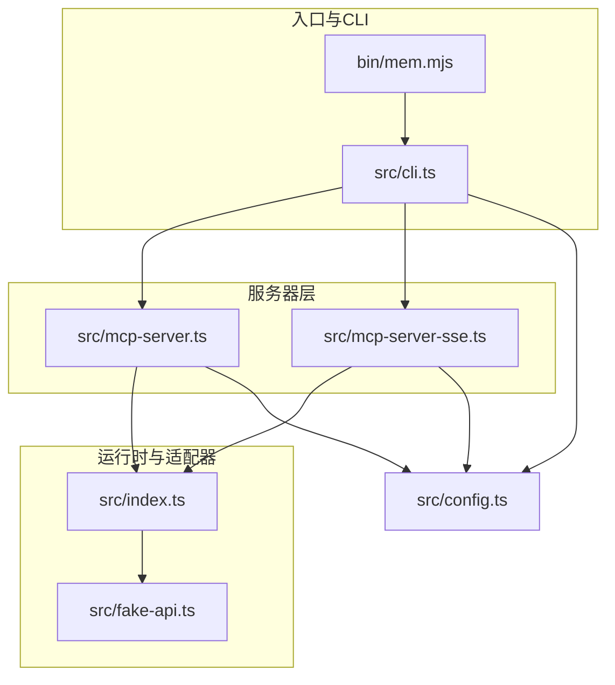
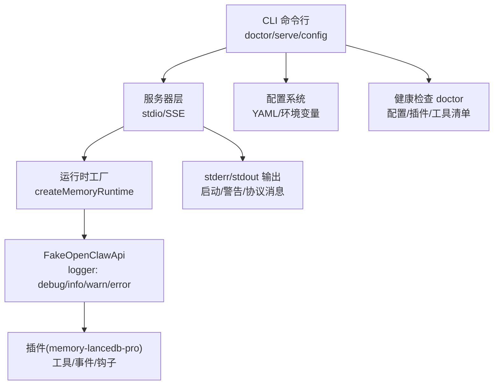
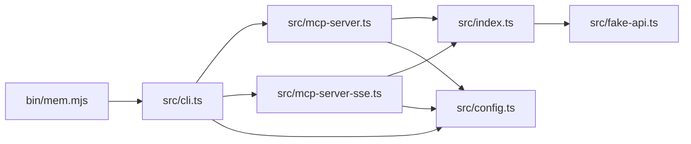

# 监控日志

<cite>
**本文引用的文件**
- [README.md](file://README.md)
- [package.json](file://package.json)
- [src/index.ts](file://src/index.ts)
- [src/config.ts](file://src/config.ts)
- [src/fake-api.ts](file://src/fake-api.ts)
- [src/mcp-server.ts](file://src/mcp-server.ts)
- [src/mcp-server-sse.ts](file://src/mcp-server-sse.ts)
- [src/cli.ts](file://src/cli.ts)
- [bin/mem.mjs](file://bin/mem.mjs)
</cite>

## 目录
1. [简介](#简介)
2. [项目结构](#项目结构)
3. [核心组件](#核心组件)
4. [架构总览](#架构总览)
5. [详细组件分析](#详细组件分析)
6. [依赖分析](#依赖分析)
7. [性能考虑](#性能考虑)
8. [故障排查指南](#故障排查指南)
9. [结论](#结论)
10. [附录](#附录)

## 简介
本实施方案围绕“监控日志”主题，结合代码库现有日志与健康检查能力，给出一套可落地的监控日志体系：明确日志级别与输出格式、分类调试/访问/错误日志；制定日志收集与聚合方案（文件轮转、集中式日志管理、日志分析工具集成）；提供性能监控指标（内存、CPU、数据库查询性能、MCP 服务器响应时间）；建立健康检查与告警机制（服务可用性、存储空间、API 调用统计）；并总结日志分析方法与故障诊断技巧。

## 项目结构
该项目采用“入口脚本 -> CLI -> 服务器层 -> 运行时适配器 -> 插件”的分层结构。日志与监控主要分布在以下位置：
- CLI 层：负责参数解析、健康检查、日志开关（quiet）、错误输出
- 服务器层：stdio 与 SSE 两种传输模式，stderr 输出启动与警告信息
- 运行时适配器：FakeOpenClawApi 提供统一 logger 接口，支持 debug/info/warn/error
- 配置层：环境变量展开、配置校验、默认配置模板

图表来源
- [bin/mem.mjs](file://bin/mem.mjs)
- [src/cli.ts](file://src/cli.ts)
- [src/mcp-server.ts](file://src/mcp-server.ts)
- [src/mcp-server-sse.ts](file://src/mcp-server-sse.ts)
- [src/index.ts](file://src/index.ts)
- [src/fake-api.ts](file://src/fake-api.ts)
- [src/config.ts](file://src/config.ts)

章节来源
- [README.md](file://README.md)
- [package.json](file://package.json)
- [bin/mem.mjs](file://bin/mem.mjs)
- [src/cli.ts](file://src/cli.ts)
- [src/mcp-server.ts](file://src/mcp-server.ts)
- [src/mcp-server-sse.ts](file://src/mcp-server-sse.ts)
- [src/index.ts](file://src/index.ts)
- [src/fake-api.ts](file://src/fake-api.ts)
- [src/config.ts](file://src/config.ts)

## 核心组件
- 日志系统
  - FakeOpenClawApi 提供统一 logger：debug/info/warn/error，并支持 quiet 模式抑制 debug 输出
  - stdio 模式默认 quiet=true，SSE 模式默认 quiet=false，CLI 的 serve 命令支持 -q/--quiet 控制
- 健康检查
  - CLI doctor 命令执行配置文件存在性、解析、API Key、插件加载与工具清单等检查
- 服务器启动日志
  - stdio 模式在 stderr 输出启动与跨 scope 警告
  - SSE 模式在控制台输出启动信息与 endpoints
- 配置与环境变量
  - 配置文件路径解析顺序：MEM_CONFIG_PATH > ~/.config/memory-mcp/config.yaml > ./config.yaml > 默认最小配置
  - 环境变量展开，缺失时发出警告

章节来源
- [src/fake-api.ts](file://src/fake-api.ts)
- [src/mcp-server.ts](file://src/mcp-server.ts)
- [src/mcp-server-sse.ts](file://src/mcp-server-sse.ts)
- [src/cli.ts](file://src/cli.ts)
- [src/config.ts](file://src/config.ts)

## 架构总览
下图展示日志与监控在整体架构中的位置与交互：

图表来源
- [src/cli.ts](file://src/cli.ts)
- [src/mcp-server.ts](file://src/mcp-server.ts)
- [src/mcp-server-sse.ts](file://src/mcp-server-sse.ts)
- [src/index.ts](file://src/index.ts)
- [src/fake-api.ts](file://src/fake-api.ts)
- [src/config.ts](file://src/config.ts)

## 详细组件分析

### 日志级别与输出格式
- 日志级别
  - debug：开发调试信息，可通过 quiet 抑制
  - info：常规信息
  - warn：警告
  - error：错误
- 输出位置
  - stdio 模式：stderr 输出启动与警告；stdout 用于 MCP 协议消息
  - SSE 模式：控制台输出启动信息与 endpoints；JSON-RPC 响应通过 SSE 流发送
- 日志前缀
  - FakeOpenClawApi 的 logger 在各级别消息前添加带颜色的标签，便于区分
- quiet 模式
  - CLI 的 serve 命令支持 -q/--quiet；stdio 默认 quiet=true，SSE 默认 quiet=false

章节来源
- [src/fake-api.ts](file://src/fake-api.ts)
- [src/mcp-server.ts](file://src/mcp-server.ts)
- [src/mcp-server-sse.ts](file://src/mcp-server-sse.ts)
- [src/cli.ts](file://src/cli.ts)

### 日志分类与用途
- 调试日志（debug）
  - 用途：定位工具注册、事件处理、钩子触发等内部流程
  - 触发：FakeOpenClawApi 在注册工具、事件、钩子时输出
  - 控制：quiet=true 抑制
- 访问日志（建议）
  - 用途：记录 MCP 请求/响应、SSE 消息往返、工具调用统计
  - 建议：在服务器层对 JSON-RPC 方法调用与响应进行结构化记录
- 错误日志（error/warn）
  - 用途：工具未知、事件处理异常、配置解析失败、API Key 缺失等
  - 触发：配置加载失败、工具调用异常、健康检查失败

章节来源
- [src/fake-api.ts](file://src/fake-api.ts)
- [src/mcp-server.ts](file://src/mcp-server.ts)
- [src/mcp-server-sse.ts](file://src/mcp-server-sse.ts)
- [src/cli.ts](file://src/cli.ts)

### 日志收集与聚合方案
- 文件轮转
  - 建议：使用 systemd/journald 或 logrotate 将 stderr 输出重定向到文件并开启轮转
- 集中式日志管理
  - 建议：将 stderr/stdout 交由 journald/Fluent Bit/Filebeat 收集，统一写入 ELK/OpenSearch/Cloud Logging
- 日志分析工具集成
  - 建议：在日志中加入服务名、版本、scope、agentId、工具名、请求ID等上下文字段，便于检索与聚合
- 结构化输出
  - 建议：在服务器层对 JSON-RPC 请求/响应与工具调用结果进行结构化记录，便于后续分析

章节来源
- [src/mcp-server.ts](file://src/mcp-server.ts)
- [src/mcp-server-sse.ts](file://src/mcp-server-sse.ts)

### 性能监控指标
- 内存使用
  - 指标：RSS、HeapUsed、HeapTotal、External、ArrayBuffers
  - 建议：通过 Node.js 原生指标或第三方库定期采样并上报
- CPU 占用
  - 指标：系统 CPU、进程 CPU、负载
  - 建议：使用操作系统采样器或 Node.js perf_hooks
- 数据库查询性能
  - 指标：LanceDB 查询耗时、向量检索耗时、BM25 命中耗时
  - 建议：在工具执行前后打点，记录 query、limit、tags、scope 等上下文
- MCP 服务器响应时间
  - 指标：tools/list、tools/call 的端到端延迟
  - 建议：在服务器层对 JSON-RPC 方法调用前后打点，记录方法名、参数摘要、响应大小

章节来源
- [src/mcp-server.ts](file://src/mcp-server.ts)
- [src/mcp-server-sse.ts](file://src/mcp-server-sse.ts)
- [src/index.ts](file://src/index.ts)

### 健康检查机制与告警
- 健康检查
  - CLI doctor：检查配置文件存在性、解析、API Key、插件加载、工具清单
  - SSE 健康端点：/health 返回状态、版本、工具数量
- 告警配置
  - 服务可用性：/health 4xx/5xx、超时
  - 存储空间：磁盘使用率阈值
  - API 调用统计：tools/call 错误率、P95/P99 延迟、QPS

章节来源
- [src/cli.ts](file://src/cli.ts)
- [src/mcp-server-sse.ts](file://src/mcp-server-sse.ts)

### 日志分析方法与故障诊断技巧
- 日志分析
  - 使用正则/结构化解析日志，提取服务名、版本、scope、agentId、工具名、错误码
  - 基于标签系统（tags）与 scope 进行过滤与聚合
- 故障诊断
  - 配置类问题：doctor 命令快速定位配置文件、API Key、解析错误
  - 工具类问题：通过 debug 日志定位工具注册与执行链路
  - 传输类问题：stdio/SSE 模式切换，观察 stderr 输出与 SSE 流

章节来源
- [src/cli.ts](file://src/cli.ts)
- [src/fake-api.ts](file://src/fake-api.ts)
- [src/mcp-server.ts](file://src/mcp-server.ts)
- [src/mcp-server-sse.ts](file://src/mcp-server-sse.ts)

## 依赖分析
- 外部依赖
  - @modelcontextprotocol/sdk：MCP 协议实现（stdio/SSE）
  - yaml：配置解析
  - commander：CLI 参数解析
  - jiti：动态加载 memory-lancedb-pro 源码
- 内部依赖
  - CLI 依赖服务器层；服务器层依赖运行时工厂；运行时工厂依赖 FakeOpenClawApi；FakeOpenClawApi 依赖配置系统

图表来源
- [bin/mem.mjs](file://bin/mem.mjs)
- [src/cli.ts](file://src/cli.ts)
- [src/mcp-server.ts](file://src/mcp-server.ts)
- [src/mcp-server-sse.ts](file://src/mcp-server-sse.ts)
- [src/index.ts](file://src/index.ts)
- [src/fake-api.ts](file://src/fake-api.ts)
- [src/config.ts](file://src/config.ts)

章节来源
- [package.json](file://package.json)
- [src/cli.ts](file://src/cli.ts)
- [src/mcp-server.ts](file://src/mcp-server.ts)
- [src/mcp-server-sse.ts](file://src/mcp-server-sse.ts)
- [src/index.ts](file://src/index.ts)
- [src/fake-api.ts](file://src/fake-api.ts)
- [src/config.ts](file://src/config.ts)

## 性能考虑
- 日志开销
  - debug 日志在生产环境建议关闭（quiet=true），避免影响 I/O
- 传输开销
  - stdio 模式更适合本地客户端；SSE 模式适合远程/多客户端，注意网络与并发
- 数据库性能
  - 合理设置 retrieval 参数（向量权重、BM25 权重、候选池大小、最小分数等）
  - 使用 tags 与 scope 降低检索范围，提高命中效率

章节来源
- [src/mcp-server.ts](file://src/mcp-server.ts)
- [src/mcp-server-sse.ts](file://src/mcp-server-sse.ts)
- [src/config.ts](file://src/config.ts)

## 故障排查指南
- 启动失败
  - 检查配置文件是否存在与可解析；确认 API Key 设置正确
  - stdio 模式可能因 quiet 抑制 debug，SSE 模式默认输出启动信息
- 工具调用异常
  - 使用 doctor 命令验证配置与插件加载
  - 在 SSE 模式下检查 /health 与 /message 端点是否可达
- 日志定位
  - 通过 stderr 输出与结构化日志定位工具注册、事件处理、钩子触发问题

章节来源
- [src/cli.ts](file://src/cli.ts)
- [src/mcp-server.ts](file://src/mcp-server.ts)
- [src/mcp-server-sse.ts](file://src/mcp-server-sse.ts)
- [src/fake-api.ts](file://src/fake-api.ts)

## 结论
本实施方案基于现有代码库的日志与健康检查能力，给出了覆盖日志级别与输出、收集与聚合、性能监控、健康检查与告警、分析与诊断的完整方案。建议在生产环境中启用 SSE 模式并配合集中式日志与监控平台，结合 doctor 健康检查与结构化日志，持续保障服务稳定性与可观测性。

## 附录
- 命令参考（节选）
  - mem serve：启动 MCP 服务器（stdio/SSE），支持 --scope、--quiet、--sse、--port、--host
  - mem doctor：运行健康检查，验证配置、API Key、插件加载与工具清单
  - mem config：初始化/显示/校验配置文件
- 配置参考（节选）
  - 配置文件路径解析顺序：MEM_CONFIG_PATH > ~/.config/memory-mcp/config.yaml > ./config.yaml > 默认最小配置
  - 支持环境变量展开，缺失时发出警告

章节来源
- [README.md](file://README.md)
- [src/cli.ts](file://src/cli.ts)
- [src/config.ts](file://src/config.ts)