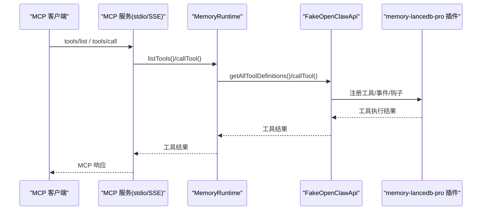
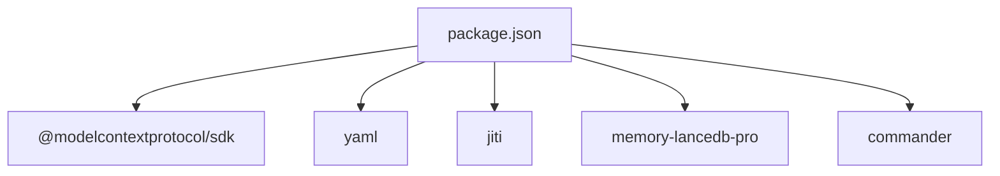

# 部署运维

<cite>
**本文引用的文件**
- [README.md](file://README.md)
- [package.json](file://package.json)
- [src/index.ts](file://src/index.ts)
- [src/config.ts](file://src/config.ts)
- [src/cli.ts](file://src/cli.ts)
- [src/fake-api.ts](file://src/fake-api.ts)
- [src/mcp-server.ts](file://src/mcp-server.ts)
- [src/mcp-server-sse.ts](file://src/mcp-server-sse.ts)
- [src/lifecycle.ts](file://src/lifecycle.ts)
- [src/schema.ts](file://src/schema.ts)
- [bin/mem.mjs](file://bin/mem.mjs)
- [docs/USAGE_GUIDE.md](file://docs/USAGE_GUIDE.md)
- [docs/knowledge-index-skill_DESIGN.md](file://docs/knowledge-index-skill_DESIGN.md)
</cite>

## 目录
1. [简介](#简介)
2. [项目结构](#项目结构)
3. [核心组件](#核心组件)
4. [架构总览](#架构总览)
5. [详细组件分析](#详细组件分析)
6. [依赖分析](#依赖分析)
7. [性能考量](#性能考量)
8. [故障排除指南](#故障排除指南)
9. [结论](#结论)
10. [附录](#附录)

## 简介
本指南面向生产环境部署与运维，围绕 memory-lancedb-mcp 的 MCP 服务与 CLI 工具，提供从安装、配置、平台差异、性能优化、监控日志、备份恢复、容器化与 Kubernetes 部署，到故障排除与最佳实践的完整方案。项目基于 Node.js 与 TypeScript，通过 stdio 或 SSE 两种传输模式提供 MCP 服务，并通过 CLI 提供配置、健康检查、Scope 管理与工具验证等运维能力。

## 项目结构
- 核心入口与运行时
  - 入口：bin/mem.mjs（CLI 入口）
  - 运行时工厂：src/index.ts（创建 MemoryRuntime，封装 FakeOpenClawApi，加载 memory-lancedb-pro 插件）
  - 配置系统：src/config.ts（YAML 配置加载、环境变量展开、默认路径）
  - MCP 服务（stdio）：src/mcp-server.ts
  - MCP 服务（SSE）：src/mcp-server-sse.ts
  - CLI：src/cli.ts（命令解析、工具执行、doctor、scope 管理）
  - 生命周期桥接：src/lifecycle.ts（before_prompt_build、agent_end 等事件桥接）
  - Schema 转换：src/schema.ts（TypeBox → JSON Schema）
  - 假 OpenClaw API 适配器：src/fake-api.ts（注册工具、事件、钩子，桥接插件）

- 文档与使用
  - 使用手册：docs/USAGE_GUIDE.md
  - 知识索引 SKILL 设计：docs/knowledge-index-skill_DESIGN.md（扩展能力，非生产必需）

```mermaid
graph TB
subgraph "CLI"
BIN["bin/mem.mjs"]
CLI["src/cli.ts"]
end
subgraph "运行时"
IDX["src/index.ts"]
CFG["src/config.ts"]
FAKE["src/fake-api.ts"]
LIFE["src/lifecycle.ts"]
SCH["src/schema.ts"]
end
subgraph "MCP 服务"
STDIO["src/mcp-server.ts"]
SSE["src/mcp-server-sse.ts"]
end
BIN --> CLI
CLI --> IDX
IDX --> FAKE
IDX --> LIFE
IDX --> SCH
CLI --> CFG
STDIO --> IDX
SSE --> IDX
```

图表来源
- [bin/mem.mjs:1-8](file://bin/mem.mjs#L1-L8)
- [src/cli.ts:1-617](file://src/cli.ts#L1-L617)
- [src/index.ts:1-515](file://src/index.ts#L1-L515)
- [src/config.ts:1-312](file://src/config.ts#L1-L312)
- [src/fake-api.ts:1-318](file://src/fake-api.ts#L1-L318)
- [src/lifecycle.ts:1-178](file://src/lifecycle.ts#L1-L178)
- [src/schema.ts:1-151](file://src/schema.ts#L1-L151)
- [src/mcp-server.ts:1-306](file://src/mcp-server.ts#L1-L306)
- [src/mcp-server-sse.ts:1-405](file://src/mcp-server-sse.ts#L1-L405)

章节来源
- [README.md:1-738](file://README.md#L1-L738)
- [package.json:1-46](file://package.json#L1-L46)

## 核心组件
- MemoryRuntime 工厂：负责加载配置、创建 FakeOpenClawApi、注册插件、注入生命周期工具、暴露工具调用与事件钩子。
- FakeOpenClawApi：模拟 OpenClaw 插件运行时，注册工具、事件与钩子，提供 callTool、emitEvent、triggerHook 等能力。
- MCP 服务（stdio/SSE）：将 MemoryRuntime 暴露为 MCP 服务，支持 tools/list 与 tools/call，以及生命周期工具。
- CLI：mem 命令集，涵盖 serve、list/search/stats/store/delete/config/doctor/scope 等。
- 配置系统：YAML 配置文件，支持环境变量扩展，提供 dbPath、embedding、retrieval、scopes 等关键参数。
- Schema 转换：将 TypeBox schema 转换为 MCP 兼容的 JSON Schema。

章节来源
- [src/index.ts:190-498](file://src/index.ts#L190-L498)
- [src/fake-api.ts:57-317](file://src/fake-api.ts#L57-L317)
- [src/mcp-server.ts:43-140](file://src/mcp-server.ts#L43-L140)
- [src/mcp-server-sse.ts:57-209](file://src/mcp-server-sse.ts#L57-L209)
- [src/cli.ts:105-616](file://src/cli.ts#L105-L616)
- [src/config.ts:167-214](file://src/config.ts#L167-L214)
- [src/schema.ts:45-150](file://src/schema.ts#L45-L150)

## 架构总览
MCP 服务通过 stdio 或 SSE 与客户端交互，内部通过 MemoryRuntime 调用 FakeOpenClawApi，进而调用 memory-lancedb-pro 插件提供的工具与事件系统。CLI 提供配置初始化、健康检查、Scope 管理与工具验证等运维能力。



图表来源
- [src/mcp-server.ts:61-124](file://src/mcp-server.ts#L61-L124)
- [src/mcp-server-sse.ts:247-287](file://src/mcp-server-sse.ts#L247-L287)
- [src/index.ts:455-495](file://src/index.ts#L455-L495)
- [src/fake-api.ts:217-235](file://src/fake-api.ts#L217-L235)

## 详细组件分析

### 配置系统与环境变量
- 配置文件默认路径：~/.config/memory-mcp/config.yaml
- 环境变量：
  - MEM_CONFIG_PATH：覆盖默认配置文件路径
  - OPENAI_API_KEY / SILICONFLOW_API_KEY：嵌入 API 密钥
- 配置加载顺序：MEM_CONFIG_PATH > ~/.config/memory-mcp/config.yaml > ./config.yaml > 默认最小配置
- 环境变量展开：支持 ${VAR_NAME} 语法，未设置时会给出警告
- 关键配置项：embedding（apiKey/model/baseURL/dimensions）、dbPath、scopes、retrieval、smartExtraction 等

章节来源
- [src/config.ts:107-214](file://src/config.ts#L107-L214)
- [README.md:706-714](file://README.md#L706-L714)
- [docs/USAGE_GUIDE.md:140-148](file://docs/USAGE_GUIDE.md#L140-L148)

### CLI 命令与运维工具
- mem serve：启动 MCP 服务（stdio 默认，支持 --sse、--scope、--dry-run、--port/--host、--quiet）
- mem list/search/stats/store/delete：对记忆进行列表、搜索、统计、存储、删除
- mem config：init/show/path/validate
- mem doctor：健康检查（配置、API key、插件加载、工具列表）
- mem scope：list/delete（支持 --dry-run、--yes）

章节来源
- [src/cli.ts:114-169](file://src/cli.ts#L114-L169)
- [src/cli.ts:175-232](file://src/cli.ts#L175-L232)
- [src/cli.ts:238-273](file://src/cli.ts#L238-L273)
- [src/cli.ts:279-303](file://src/cli.ts#L279-L303)
- [src/cli.ts:309-343](file://src/cli.ts#L309-L343)
- [src/cli.ts:350-364](file://src/cli.ts#L350-L364)
- [src/cli.ts:370-443](file://src/cli.ts#L370-L443)
- [src/cli.ts:449-517](file://src/cli.ts#L449-L517)
- [src/cli.ts:523-610](file://src/cli.ts#L523-L610)

### MCP 服务（stdio 与 SSE）
- stdio 模式：通过 StdioServerTransport 连接，适合本地客户端（Claude Desktop、Cursor、Cline 等）
- SSE 模式：提供 /sse（SSE 事件流）与 /message（JSON-RPC）端点，适合远程访问或多客户端场景
- 生命周期工具：_lifecycle_auto_recall/_lifecycle_auto_capture/_lifecycle_session_end
- Scope 隔离：默认 agentId="system"（跨 scope 模式），--scope X 时强制 agentId="system" 且规范化 scope

章节来源
- [src/mcp-server.ts:43-140](file://src/mcp-server.ts#L43-L140)
- [src/mcp-server-sse.ts:57-209](file://src/mcp-server-sse.ts#L57-L209)
- [src/lifecycle.ts:52-153](file://src/lifecycle.ts#L52-L153)

### 运行时工厂与工具注入
- createMemoryRuntime：加载配置、注入 scopes、创建 FakeOpenClawApi、注册插件、触发 gateway_start
- 工具注入：为 tag-aware 工具（memory_store/memory_recall/memory_list）注入 tags 参数；提供 list_scopes 合并配置与实际 scope 统计
- Scope 注入：锁定模式下拒绝不一致 scope；跨 scope 模式下默认写入 global

章节来源
- [src/index.ts:207-498](file://src/index.ts#L207-L498)

### 假 OpenClaw API 适配器
- 注册工具：registerTool，预览工厂以提取工具名
- 事件系统：on/registerHook，emitEvent 按优先级排序执行
- CLI 注册：registerCli，供 CLI 复用
- callTool：按 agentId/sessionKey 组织上下文，调用插件工具

章节来源
- [src/fake-api.ts:113-317](file://src/fake-api.ts#L113-L317)

### Schema 转换
- typeboxToJsonSchema：清理 TypeBox 内部属性，保留标准 JSON Schema 字段
- extractInputSchema：确保 MCP tools/list 的输入 schema 为 object 类型

章节来源
- [src/schema.ts:45-150](file://src/schema.ts#L45-L150)

### 平台特定注意事项
- Linux x64：LanceDB 需要 AVX2 指令集；如报 Illegal instruction，使用 AVX-only 构建或 ARM64 兼容版本；必要时手动安装 @lancedb/lancedb-linux-x64-gnu
- WSL：npm 可能检测为 Windows 平台，缺少 Linux 原生模块；可手动解包并安装 @lancedb/lancedb-linux-x64-gnu
- macOS：无需额外操作，原生模块自动安装
- ARM64/Apple Silicon：确保使用 ARM64 原生模块，如遇问题可执行 npm rebuild @lancedb/lancedb

章节来源
- [README.md:134-168](file://README.md#L134-L168)

## 依赖分析
- 运行时依赖
  - @modelcontextprotocol/sdk：MCP 协议服务端实现（stdio/SSE）
  - yaml：YAML 解析与序列化
  - jiti：TypeScript 源码直载（无需本地 dist）
  - memory-lancedb-pro：核心记忆引擎（通过 npm 包加载）
  - commander：CLI 参数解析
- 开发依赖
  - typescript、@sinclair/typebox



图表来源
- [package.json:26-31](file://package.json#L26-L31)

章节来源
- [package.json:1-46](file://package.json#L1-L46)

## 性能考量
- 内存使用
  - 通过 --scope 锁定模式减少不必要的跨 scope 访问，降低 ACL 检查与上下文切换开销
  - SSE 模式下多客户端共享进程，注意并发连接数与内存占用
- 存储配置
  - dbPath 默认位于用户目录，建议在生产环境配置专用磁盘与合适权限
  - 配置文件中可设置 dbPath，或通过环境变量 MEM_DB_PATH 覆盖
- 并发处理
  - stdio 模式为单进程单通道，适合本地客户端
  - SSE 模式支持多客户端，注意连接数与消息处理吞吐
- 检索性能
  - retrieval.mode 默认 hybrid，vectorWeight/bm25Weight 可调；filterNoise/minScore/hardMinScore 控制召回质量
  - smartExtraction 可开启以减少噪声，提高检索相关性
- 资源消耗与容量规划
  - 嵌入模型维度（dimensions）与向量库规模直接影响内存与磁盘占用
  - 建议根据业务规模与查询峰值评估 CPU/内存/磁盘，预留 20%-50% 缓冲
  - 定期清理无效 scope 与冗余记忆，避免索引膨胀

章节来源
- [src/config.ts:25-98](file://src/config.ts#L25-L98)
- [docs/USAGE_GUIDE.md:268-314](file://docs/USAGE_GUIDE.md#L268-L314)
- [docs/USAGE_GUIDE.md:317-390](file://docs/USAGE_GUIDE.md#L317-L390)

## 故障排除指南
- 服务启动失败
  - 使用 mem doctor 进行全面检查（配置、API key、插件加载、工具列表）
  - 确认配置文件存在且可解析，API key 已设置或通过环境变量提供
- 嵌入模型错误
  - 检查 embedding.model 与 baseURL 是否正确
  - Ollama 本地模型需确认服务已启动
- 召回结果不准确
  - 优先使用“实体名 + 技术术语”格式的 query
  - 提升记忆内容长度与丰富度，合理设置 importance
  - 使用 tags 参数缩小检索范围
- Scope 权限拒绝
  - 锁定模式下请求的 scope 必须与服务端 --scope 一致
  - 跨 scope 模式下 memory_store 不指定 scope 会自动写入 global
- 平台问题
  - Linux 报 Illegal instruction：使用 AVX-only 构建或 ARM64 兼容版本
  - WSL 原生模块缺失：手动安装 @lancedb/lancedb-linux-x64-gnu
- CLI 未生效
  - 修改源码后需重新编译（tsc）并重启服务；CLI 可直接 node bin/mem.mjs 测试

章节来源
- [docs/USAGE_GUIDE.md:618-667](file://docs/USAGE_GUIDE.md#L618-L667)
- [README.md:134-168](file://README.md#L134-L168)
- [src/cli.ts:449-517](file://src/cli.ts#L449-L517)

## 结论
memory-lancedb-mcp 提供了稳定、可扩展的 MCP 服务与 CLI 工具，支持 stdio 与 SSE 两种传输模式，满足本地与远程部署需求。通过合理的配置、Scope 隔离、检索参数调优与平台适配，可在生产环境中实现高性能、可维护的记忆服务。结合本文的部署、监控、备份与故障排除方案，可进一步提升系统的可靠性与可运维性。

## 附录

### 安装与初始化
- 安装依赖与编译
  - npm install
  - npx tsc
- 初始化配置
  - node ./bin/mem.mjs config init
  - 编辑 ~/.config/memory-mcp/config.yaml，填入嵌入 API 密钥与模型信息

章节来源
- [README.md:80-98](file://README.md#L80-L98)

### 平台部署要点
- Linux
  - 确保 AVX2 指令集；必要时安装 @lancedb/lancedb-linux-x64-gnu
- WSL
  - 若原生模块缺失，手动解包并安装 @lancedb/lancedb-linux-x64-gnu
- macOS
  - 原生模块自动安装，无需额外步骤
- ARM64/Apple Silicon
  - 使用 ARM64 原生模块，必要时执行 npm rebuild @lancedb/lancedb

章节来源
- [README.md:134-168](file://README.md#L134-L168)

### 监控与日志
- 健康检查
  - mem doctor：验证配置、API key、插件加载与工具列表
- 运行日志
  - stdio 模式：stderr 输出服务启动与工具列表
  - SSE 模式：控制台输出监听地址与工具数量
- 建议
  - 使用 systemd 或 Docker 日志收集
  - SSE 模式建议通过反向代理（Nginx/Traefik）统一接入与日志采集

章节来源
- [src/mcp-server.ts:130-140](file://src/mcp-server.ts#L130-L140)
- [src/mcp-server-sse.ts:174-190](file://src/mcp-server-sse.ts#L174-L190)
- [src/cli.ts:449-517](file://src/cli.ts#L449-L517)

### 备份与恢复
- 备份
  - 备份 dbPath 目录（默认 ~/.local/share/memory-mcp/lancedb）
  - 备份配置文件 ~/.config/memory-mcp/config.yaml
- 恢复
  - 停止服务后替换 dbPath 目录与配置文件
  - 启动服务并使用 mem doctor 验证
- Scope 管理
  - 使用 mem scope list 查看 scope 统计
  - 使用 mem scope delete <scope> --yes 删除指定 scope（谨慎操作）

章节来源
- [src/config.ts:232-233](file://src/config.ts#L232-L233)
- [src/cli.ts:523-610](file://src/cli.ts#L523-L610)

### 容器化部署（Docker）
- 建议镜像
  - node:18-alpine 或 node:18-bullseye-slim
- 构建步骤
  - 复制 package.json 与 package-lock.json
  - npm ci --only=production
  - npx tsc
- 运行
  - 挂载 dbPath 与配置目录
  - 暴露 SSE 端口（默认 3100），或使用 stdio 模式
  - 通过环境变量设置 MEM_CONFIG_PATH 与 API 密钥
- 健康检查
  - 使用 /health 端点（SSE 模式）

章节来源
- [src/mcp-server-sse.ts:96-106](file://src/mcp-server-sse.ts#L96-L106)
- [src/config.ts:107-121](file://src/config.ts#L107-L121)
- [README.md:706-714](file://README.md#L706-L714)

### Kubernetes 部署
- Deployment
  - 使用无状态 Pod，挂载持久卷（dbPath）与配置卷
  - 通过环境变量注入 MEM_CONFIG_PATH 与 API 密钥
- Service
  - stdio 模式：通过本地 socket 或 sidecar 通信
  - SSE 模式：暴露 NodePort/LoadBalancer，结合 Ingress
- HPA
  - 根据 CPU/内存与 SSE 连接数设置水平自动伸缩
- 日志与监控
  - 集成 Prometheus/Grafana 与 Loki/ELK

章节来源
- [src/mcp-server-sse.ts:174-190](file://src/mcp-server-sse.ts#L174-L190)
- [src/config.ts:107-121](file://src/config.ts#L107-L121)

### 运维最佳实践
- 配置管理
  - 使用环境变量管理敏感信息，避免硬编码
  - 通过 MEM_CONFIG_PATH 统一配置路径
- Scope 隔离
  - 为不同项目设置独立 --scope，避免交叉污染
  - 锁定模式下严格校验请求 scope
- 性能优化
  - 调整 retrieval 参数与 smartExtraction
  - 合理设置 importance 与 tags，提升召回质量
- 安全
  - SSE 模式建议通过反向代理与 TLS
  - 限制 dbPath 权限，避免未授权访问
- 备份策略
  - 定期备份 dbPath 与配置
  - 使用快照或异地复制增强容灾

章节来源
- [src/config.ts:107-214](file://src/config.ts#L107-L214)
- [docs/USAGE_GUIDE.md:423-472](file://docs/USAGE_GUIDE.md#L423-L472)
- [README.md:134-168](file://README.md#L134-L168)