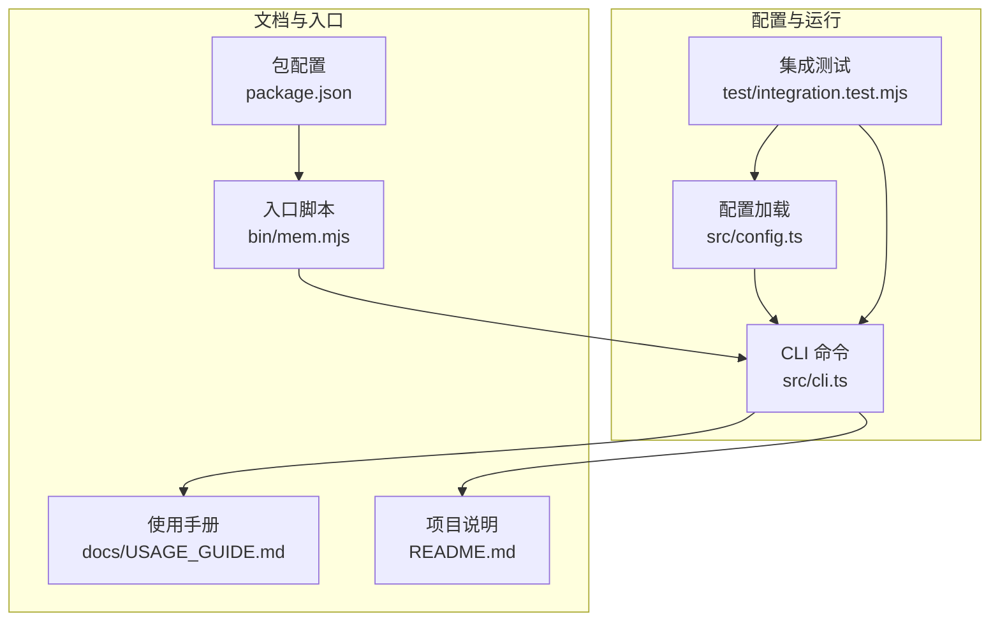
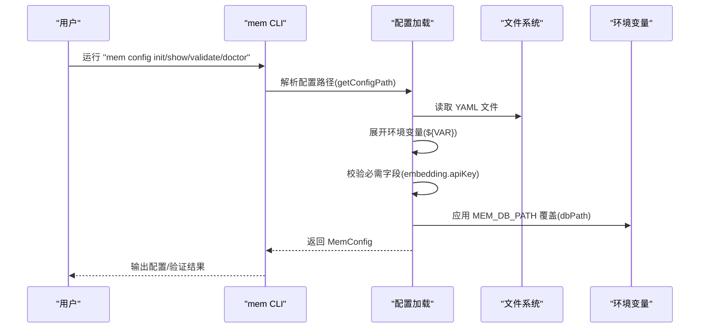
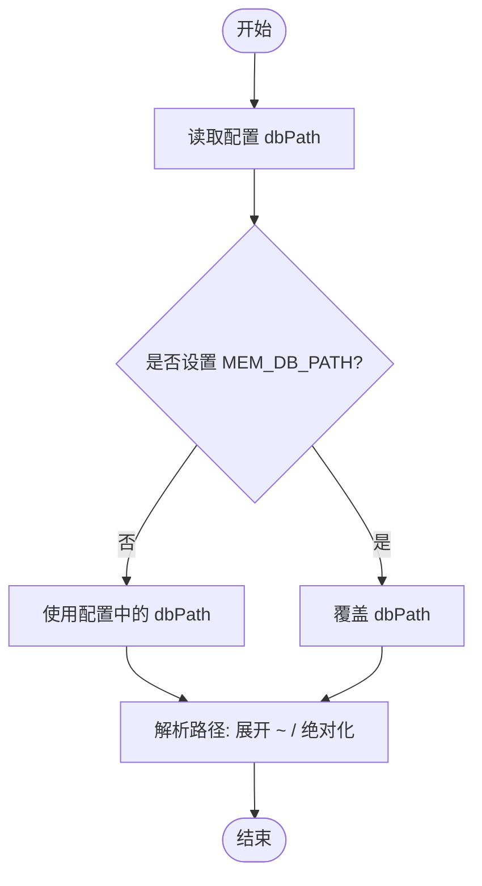
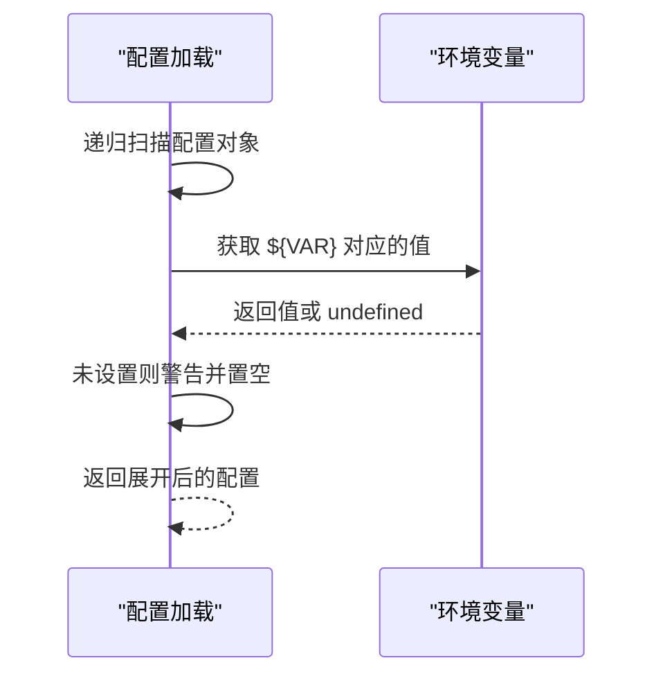
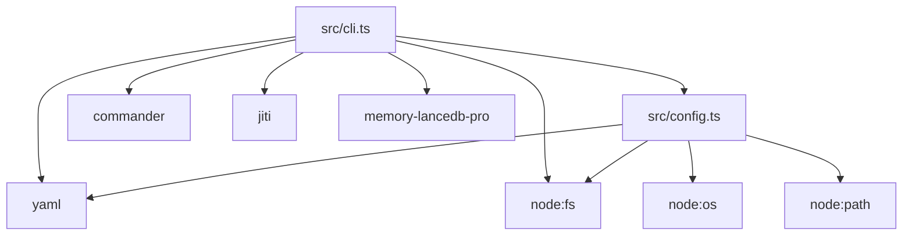

# 基础配置

<cite>
**本文引用的文件**
- [src/config.ts](file://src/config.ts)
- [src/cli.ts](file://src/cli.ts)
- [README.md](file://README.md)
- [docs/USAGE_GUIDE.md](file://docs/USAGE_GUIDE.md)
- [package.json](file://package.json)
- [bin/mem.mjs](file://bin/mem.mjs)
- [test/integration.test.mjs](file://test/integration.test.mjs)
</cite>

## 目录
1. [简介](#简介)
2. [项目结构](#项目结构)
3. [核心组件](#核心组件)
4. [架构总览](#架构总览)
5. [详细组件分析](#详细组件分析)
6. [依赖分析](#依赖分析)
7. [性能考虑](#性能考虑)
8. [故障排除指南](#故障排除指南)
9. [结论](#结论)
10. [附录](#附录)

## 简介
本章节面向首次使用者，概述基础配置的目的与总体思路。memory-lancedb-mcp 通过 YAML 配置文件驱动，支持环境变量扩展与多级配置来源解析。核心目标是：
- 明确配置文件的基本结构与必需字段
- 说明 dbPath 数据库存储路径的设置方法与默认值
- 介绍 embedding.apiKey 的基本配置要求与环境变量引用方式
- 解释 autoCapture 与 autoRecall 的基本功能与推荐设置
- 说明 enableManagementTools 的作用与使用场景
- 提供最小化配置示例与常见配置错误的解决方案

## 项目结构
本项目围绕配置系统展开，关键文件与职责如下：
- 配置加载与类型定义：src/config.ts
- CLI 与配置管理命令：src/cli.ts
- 使用手册与示例：docs/USAGE_GUIDE.md、README.md
- 包与入口脚本：package.json、bin/mem.mjs
- 集成测试：test/integration.test.mjs

图表来源
- [src/config.ts:1-312](file://src/config.ts#L1-L312)
- [src/cli.ts:1-617](file://src/cli.ts#L1-L617)
- [docs/USAGE_GUIDE.md:1-672](file://docs/USAGE_GUIDE.md#L1-L672)
- [README.md:1-738](file://README.md#L1-L738)
- [bin/mem.mjs:1-8](file://bin/mem.mjs#L1-L8)
- [package.json:1-46](file://package.json#L1-L46)
- [test/integration.test.mjs:1-131](file://test/integration.test.mjs#L1-L131)

章节来源
- [src/config.ts:1-312](file://src/config.ts#L1-L312)
- [src/cli.ts:1-617](file://src/cli.ts#L1-L617)
- [docs/USAGE_GUIDE.md:1-672](file://docs/USAGE_GUIDE.md#L1-L672)
- [README.md:1-738](file://README.md#L1-L738)
- [bin/mem.mjs:1-8](file://bin/mem.mjs#L1-L8)
- [package.json:1-46](file://package.json#L1-L46)
- [test/integration.test.mjs:1-131](file://test/integration.test.mjs#L1-L131)

## 核心组件
- 配置类型与加载：MemConfig 接口定义了配置结构，loadConfig 负责解析 YAML、展开环境变量、校验必需字段，并支持环境变量覆盖 dbPath。
- CLI 配置管理：mem config 子命令提供初始化、显示、路径查询、验证等功能；doctor 健康检查会验证配置文件存在性、解析性、API Key 状态与插件加载。
- 默认配置模板：initConfig 会生成包含 dbPath、embedding、autoCapture、autoRecall、enableManagementTools 等字段的默认配置文件。
- dbPath 解析：resolveDbPath 将配置中的 dbPath 展开为绝对路径，支持 ~ 与相对路径。

章节来源
- [src/config.ts:23-98](file://src/config.ts#L23-L98)
- [src/config.ts:167-214](file://src/config.ts#L167-L214)
- [src/config.ts:296-311](file://src/config.ts#L296-L311)
- [src/cli.ts:35-41](file://src/cli.ts#L35-L41)
- [src/cli.ts:370-443](file://src/cli.ts#L370-L443)
- [src/cli.ts:449-517](file://src/cli.ts#L449-L517)

## 架构总览
配置系统的工作流如下：
- 配置文件解析：从多个来源解析配置路径，读取 YAML，展开环境变量，校验必需字段
- 环境变量覆盖：支持通过 MEM_DB_PATH 覆盖 dbPath
- CLI 验证：doctor 与 config validate 会检查配置有效性与 API Key 状态
- 运行时使用：CLI 在启动服务、列出 scope 等场景中解析 dbPath 并传递给底层存储

图表来源
- [src/config.ts:107-121](file://src/config.ts#L107-L121)
- [src/config.ts:177-214](file://src/config.ts#L177-L214)
- [src/config.ts:135-157](file://src/config.ts#L135-L157)
- [src/config.ts:209-211](file://src/config.ts#L209-L211)
- [src/cli.ts:394-443](file://src/cli.ts#L394-L443)
- [src/cli.ts:449-517](file://src/cli.ts#L449-L517)

## 详细组件分析

### 配置文件基本结构与必需字段
- 基本结构
  - dbPath：数据库存储路径，支持 ~ 展开与绝对/相对路径
  - embedding：嵌入配置，包含 provider、apiKey、model、baseURL、dimensions 等
  - llm：可选，用于智能提取等场景
  - autoCapture、autoRecall：生命周期自动捕获与召回开关
  - autoRecall 相关参数：minLength、maxItems、maxChars、timeoutMs
  - smartExtraction、extractMinMessages、extractMaxChars：智能提取相关
  - enableManagementTools：启用管理工具（如 memory_stats、memory_list 等）
  - sessionStrategy：会话策略（MCP 模式下推荐 none）
  - retrieval：检索权重、阈值、重排等
  - scopes：默认 scope 与定义
  - selfImprovement：自我改进治理
  - 其他：mdMirror、admissionControl、memoryCompaction、sessionCompression、extractionThrottle、workspaceBoundary 等

- 必需字段
  - embedding.apiKey：必须存在，支持直接赋值或 ${ENV_VAR} 引用
  - embedding：必须为对象

章节来源
- [src/config.ts:23-98](file://src/config.ts#L23-L98)
- [src/config.ts:192-206](file://src/config.ts#L192-L206)

### dbPath 数据库存储路径
- 设置方法
  - 在配置文件中设置 dbPath 字段
  - 通过环境变量 MEM_DB_PATH 覆盖 dbPath
- 默认值
  - 若未设置 dbPath，CLI 默认使用 "~/.local/share/memory-mcp/lancedb"
- 路径解析
  - resolveDbPath 会将 "~" 展开为主目录，支持相对路径与绝对路径
- 使用场景
  - CLI 在列出 scope、删除 scope 等命令中会解析 dbPath 并传递给底层存储

图表来源
- [src/config.ts:209-211](file://src/config.ts#L209-L211)
- [src/cli.ts:35-41](file://src/cli.ts#L35-L41)
- [src/cli.ts:534-539](file://src/cli.ts#L534-L539)
- [src/cli.ts:578-583](file://src/cli.ts#L578-L583)

章节来源
- [src/config.ts:209-211](file://src/config.ts#L209-L211)
- [src/cli.ts:35-41](file://src/cli.ts#L35-L41)
- [src/cli.ts:534-539](file://src/cli.ts#L534-L539)
- [src/cli.ts:578-583](file://src/cli.ts#L578-L583)

### embedding.apiKey 的配置与环境变量引用
- 基本要求
  - 必须存在且非空
  - 支持直接赋值或使用 ${ENV_VAR} 语法引用环境变量
- 环境变量扩展
  - loadConfig 会递归扫描配置对象，将 ${VAR} 替换为 process.env[VAR]
  - 未设置的环境变量会发出警告并替换为空字符串
- 健康检查
  - doctor 会检测 embedding.apiKey 是否存在、是否为环境变量引用、以及对应的环境变量是否已设置

图表来源
- [src/config.ts:135-157](file://src/config.ts#L135-L157)
- [src/config.ts:192-206](file://src/config.ts#L192-L206)
- [src/cli.ts:476-493](file://src/cli.ts#L476-L493)

章节来源
- [src/config.ts:135-157](file://src/config.ts#L135-L157)
- [src/config.ts:192-206](file://src/config.ts#L192-L206)
- [src/cli.ts:476-493](file://src/cli.ts#L476-L493)

### autoCapture 与 autoRecall 的功能与推荐设置
- autoCapture
  - 作用：在 agent 结束后自动提取关键信息并写入记忆
  - 推荐：开启，便于持续积累
- autoRecall
  - 作用：在构建 prompt 前自动注入相关记忆
  - MCP 模式推荐：关闭，由 Agent 显式调用 memory_recall 控制时机
- 相关参数
  - autoRecallMinLength、autoRecallMaxItems、autoRecallMaxChars、autoRecallTimeoutMs：控制召回行为的阈值与上限

章节来源
- [src/config.ts:44-55](file://src/config.ts#L44-L55)
- [src/config.ts:249-254](file://src/config.ts#L249-L254)
- [src/cli.ts:436-438](file://src/cli.ts#L436-L438)

### enableManagementTools 的作用与使用场景
- 作用：启用管理工具集合（如 memory_stats、memory_list 等），便于日常维护与诊断
- 使用场景：开发调试、批量查看统计、清理与归档等

章节来源
- [src/config.ts:55](file://src/config.ts#L55)
- [src/config.ts:261-262](file://src/config.ts#L261-L262)

### 最小化配置示例
- 生成默认配置
  - 使用 mem config init 创建默认配置文件
  - 默认配置包含 dbPath、embedding、autoCapture、autoRecall、enableManagementTools 等字段
- 示例要点
  - embedding.apiKey 支持 ${ENV_VAR} 引用
  - dbPath 默认值为 "~/.local/share/memory-mcp/lancedb"
  - autoCapture 默认开启，autoRecall 默认关闭（MCP 模式推荐）

章节来源
- [src/config.ts:296-311](file://src/config.ts#L296-L311)
- [src/cli.ts:378-387](file://src/cli.ts#L378-L387)

## 依赖分析
- 配置加载依赖
  - YAML 解析：用于读取与解析配置文件
  - 环境变量：用于展开 ${VAR} 与覆盖 dbPath
  - 文件系统：用于查找配置文件与写入默认配置
- CLI 依赖
  - commander：命令行参数解析
  - jiti：动态加载 memory-lancedb-pro（开发/生产兼容）
- 运行时依赖
  - memory-lancedb-pro：底层记忆存储与检索能力

图表来源
- [src/config.ts:14-17](file://src/config.ts#L14-L17)
- [src/cli.ts:17-27](file://src/cli.ts#L17-L27)
- [package.json:26-31](file://package.json#L26-L31)

章节来源
- [src/config.ts:14-17](file://src/config.ts#L14-L17)
- [src/cli.ts:17-27](file://src/cli.ts#L17-L27)
- [package.json:26-31](file://package.json#L26-L31)

## 性能考虑
- 配置解析成本低：YAML 解析与环境变量展开均为轻量操作
- dbPath 解析：resolveDbPath 仅做路径规范化，开销可忽略
- 建议
  - 将 dbPath 指向高性能磁盘（如 SSD）
  - 合理设置 autoRecall 的阈值参数，避免过度召回影响响应时间

## 故障排除指南
- 配置文件不存在
  - 现象：提示找不到配置文件
  - 处理：运行 mem config init 创建默认配置，或设置 MEM_CONFIG_PATH 指向现有配置
- 配置解析失败
  - 现象：YAML 解析错误
  - 处理：检查配置文件格式，确保为合法 YAML 对象
- 缺少 embedding.apiKey
  - 现象：提示缺失必需字段
  - 处理：在配置文件中设置 embedding.apiKey，或使用 ${ENV_VAR} 引用环境变量
- 环境变量未设置
  - 现象：${VAR} 未被替换或为空
  - 处理：确保对应环境变量已导出，doctor 会检测并提示
- dbPath 权限问题
  - 现象：无法写入数据库目录
  - 处理：检查 dbPath 所在目录权限，确保运行用户具有读写权限
- autoRecall/MCP 模式冲突
  - 现象：MCP 模式下自动注入导致上下文膨胀
  - 处理：将 autoRecall 设为 false，由 Agent 显式调用 memory_recall 控制

章节来源
- [src/config.ts:170-175](file://src/config.ts#L170-L175)
- [src/config.ts:179-183](file://src/config.ts#L179-L183)
- [src/config.ts:192-206](file://src/config.ts#L192-L206)
- [src/cli.ts:449-517](file://src/cli.ts#L449-L517)

## 结论
基础配置是 memory-lancedb-mcp 正常运行的关键。通过理解配置文件结构、必需字段、dbPath 设置、embedding.apiKey 的环境变量引用方式，以及 autoCapture/autoRecall 的推荐设置，可以快速搭建稳定可用的记忆系统。结合 doctor 与 mem config 子命令，能够高效完成配置初始化、验证与排错。

## 附录

### 配置字段速查
- dbPath：数据库存储路径（支持 ~ 展开）
- embedding.apiKey：嵌入 API 密钥（支持 ${ENV_VAR}）
- autoCapture：自动捕获（默认开启）
- autoRecall：自动召回（MCP 模式建议关闭）
- enableManagementTools：启用管理工具（默认开启）
- retrieval：检索权重与阈值
- scopes：默认 scope 与定义
- smartExtraction：智能提取相关参数

章节来源
- [src/config.ts:23-98](file://src/config.ts#L23-L98)
- [src/config.ts:249-254](file://src/config.ts#L249-L254)
- [src/config.ts:261-262](file://src/config.ts#L261-L262)