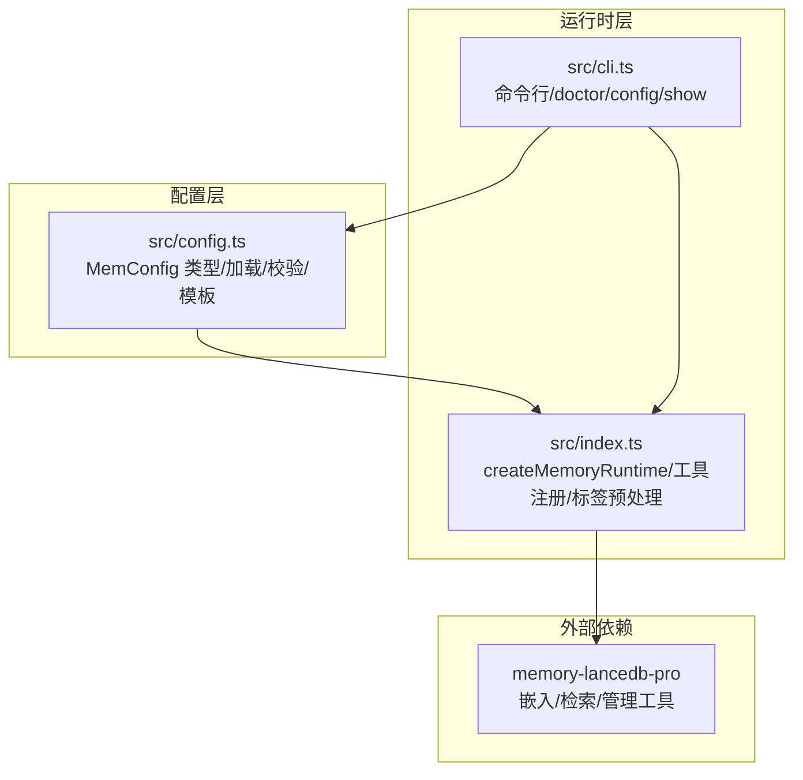
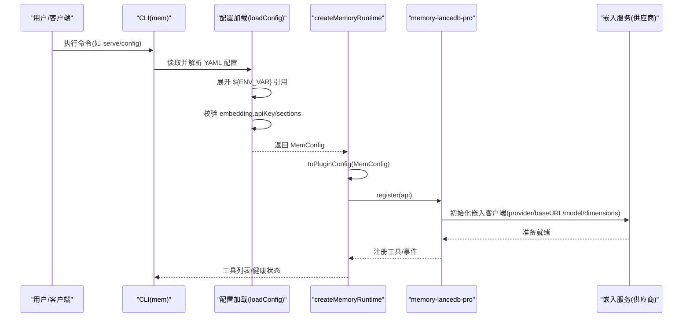
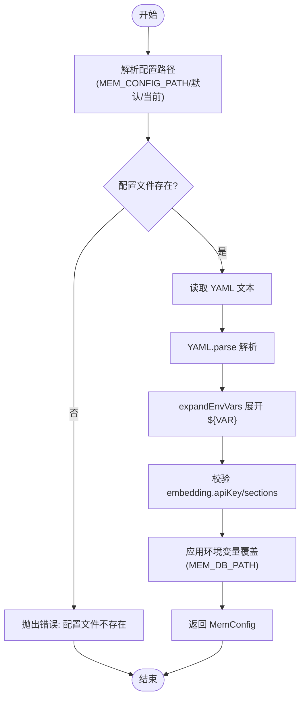
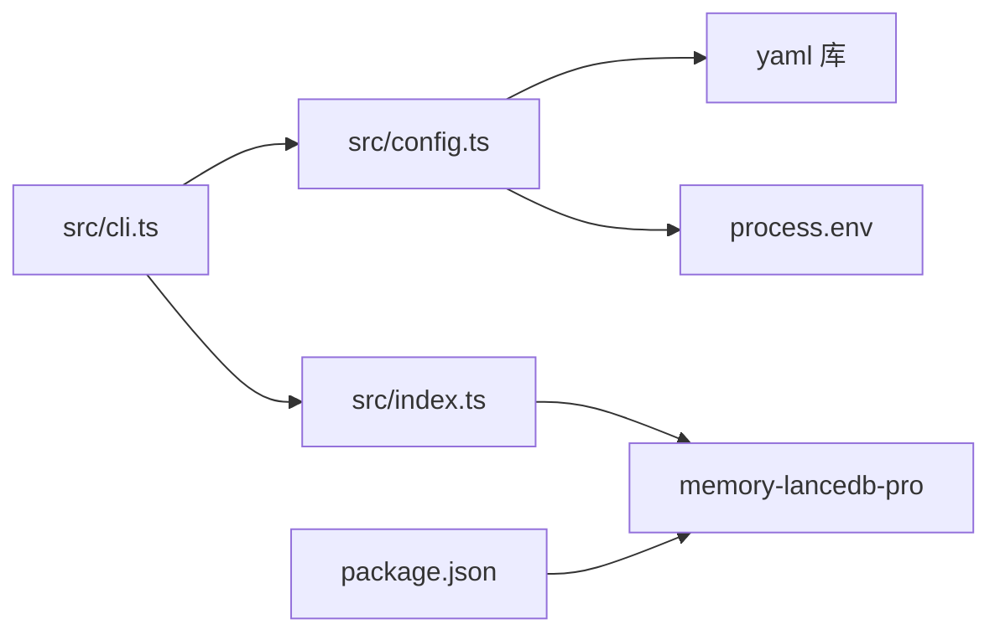

# 嵌入配置

<cite>
**本文引用的文件**
- [src/config.ts](file://src/config.ts)
- [src/index.ts](file://src/index.ts)
- [src/cli.ts](file://src/cli.ts)
- [README.md](file://README.md)
- [docs/USAGE_GUIDE.md](file://docs/USAGE_GUIDE.md)
- [package.json](file://package.json)
</cite>

## 目录
1. [简介](#简介)
2. [项目结构](#项目结构)
3. [核心组件](#核心组件)
4. [架构总览](#架构总览)
5. [详细组件分析](#详细组件分析)
6. [依赖分析](#依赖分析)
7. [性能考虑](#性能考虑)
8. [故障排除指南](#故障排除指南)
9. [结论](#结论)
10. [附录](#附录)

## 简介
本文件聚焦“嵌入配置”的完整说明，围绕 memory-lancedb-mcp 的嵌入子系统，系统阐述以下主题：
- 嵌入供应商与兼容性：支持 OpenAI 兼容接口、SiliconFlow、Ollama 等，通过统一的 provider/baseURL/model/dimensions 等参数适配。
- apiKey 的多种设置方式：单个密钥、数组密钥、环境变量引用（${VAR}）。
- 关键参数配置：model、baseURL、dimensions 等。
- 高级选项：requestDimensions、omitDimensions、normalized、taskQuery、taskPassage、chunking 等。
- 维度自动检测与手动设置：自动检测与手动 dimensions 的区别及适用场景。
- 主流供应商配置示例：OpenAI、Azure（OpenAI 兼容）、Groq（OpenAI 兼容）、SiliconFlow、Ollama 等。

## 项目结构
本项目通过 YAML 配置驱动嵌入子系统，并将配置映射到插件期望的 pluginConfig 结构。核心文件与职责如下：
- src/config.ts：定义 MemConfig 类型、配置加载与校验、环境变量展开、默认模板生成。
- src/index.ts：运行时入口，负责加载配置、创建 FakeOpenClawApi、注册插件、暴露工具与事件。
- src/cli.ts：命令行入口，提供 config/init/show/doctor 等子命令，支持密钥脱敏显示与健康检查。
- README.md 与 docs/USAGE_GUIDE.md：提供默认配置模板、供应商示例、环境变量说明与使用指南。
- package.json：声明依赖 memory-lancedb-pro，作为嵌入与检索能力的承载。

图表来源
- [src/config.ts:1-312](file://src/config.ts#L1-L312)
- [src/index.ts:190-498](file://src/index.ts#L190-L498)
- [src/cli.ts:105-169](file://src/cli.ts#L105-L169)
- [package.json:26-31](file://package.json#L26-L31)

章节来源
- [src/config.ts:107-214](file://src/config.ts#L107-L214)
- [src/index.ts:207-242](file://src/index.ts#L207-L242)
- [src/cli.ts:105-169](file://src/cli.ts#L105-L169)
- [package.json:26-31](file://package.json#L26-L31)

## 核心组件
- MemConfig.embedding：嵌入配置的核心对象，包含 provider、apiKey、model、baseURL、dimensions、requestDimensions、omitDimensions、taskQuery、taskPassage、normalized、chunking 等字段。
- 配置加载与校验：loadConfig() 从 YAML 文件解析，展开 ${ENV_VAR}，校验 embedding.apiKey 是否存在，支持 MEM_DB_PATH 环境变量覆盖 dbPath。
- 环境变量展开：expandEnvVars() 递归替换字符串中的 ${VAR} 引用，数组与对象也递归处理。
- 默认模板：initConfig() 生成包含 embedding 配置的默认模板，便于快速上手。
- 运行时映射：toPluginConfig() 将 MemConfig 直接透传给插件，保持 schema 一致性。

章节来源
- [src/config.ts:23-37](file://src/config.ts#L23-L37)
- [src/config.ts:167-214](file://src/config.ts#L167-L214)
- [src/config.ts:135-157](file://src/config.ts#L135-L157)
- [src/config.ts:296-311](file://src/config.ts#L296-L311)
- [src/config.ts:220-223](file://src/config.ts#L220-L223)

## 架构总览
嵌入配置在整体架构中的位置与交互如下：

图表来源
- [src/cli.ts:124-169](file://src/cli.ts#L124-L169)
- [src/config.ts:167-214](file://src/config.ts#L167-L214)
- [src/index.ts:207-242](file://src/index.ts#L207-L242)
- [package.json:30](file://package.json#L30)

## 详细组件分析

### 嵌入配置类型与字段说明
- provider：可选，用于标识嵌入服务类型（如 openai-compatible）。当前仓库未在核心逻辑中强制校验该字段，但 YAML 模板中提供了注释示例，便于后续扩展。
- apiKey：必填，支持字符串或字符串数组。字符串数组可用于轮询/多活场景；数组中的每个元素可为纯文本或 ${ENV_VAR} 引用。
- model：必填，指定嵌入模型名称。不同供应商的模型名称不同，需与 dimensions 配置相匹配。
- baseURL：可选，自定义供应商 API 地址。OpenAI 兼容接口（如 Azure、Groq、SiliconFlow、Ollama 等）均可通过此字段适配。
- dimensions：可选，向量维度。当模型未内含维度信息时，必须显式设置；否则可省略以启用自动检测。
- requestDimensions：可选，请求时指定维度（与模型维度不一致时使用）。
- omitDimensions：可选，布尔值，指示是否省略维度参数（某些供应商不支持或不需要）。
- taskQuery/taskPassage：可选，任务类型参数，用于区分查询与段落嵌入任务（如检索、重排等）。
- normalized：可选，布尔值，指示是否返回归一化的向量（取决于供应商支持）。
- chunking：可选，布尔值，指示是否启用分块处理（如长文本切分）。

章节来源
- [src/config.ts:23-37](file://src/config.ts#L23-L37)
- [src/config.ts:220-223](file://src/config.ts#L220-L223)

### 配置加载与校验流程
- 配置路径解析：优先 MEM_CONFIG_PATH，其次默认用户目录 ~/.config/memory-mcp/config.yaml，再次当前目录 config.yaml，最后返回默认路径（可能不存在）。
- YAML 解析与环境变量展开：expandEnvVars() 递归处理字符串、数组与对象，将 ${VAR} 替换为 process.env[VAR]。
- 必填字段校验：必须存在 embedding 节点且包含 apiKey；若 apiKey 为 ${VAR}，需确保环境变量已设置。
- 环境变量覆盖：支持 MEM_DB_PATH 覆盖 dbPath。

图表来源
- [src/config.ts:107-121](file://src/config.ts#L107-L121)
- [src/config.ts:177-187](file://src/config.ts#L177-L187)
- [src/config.ts:189-191](file://src/config.ts#L189-L191)
- [src/config.ts:193-206](file://src/config.ts#L193-L206)
- [src/config.ts:209-211](file://src/config.ts#L209-L211)

章节来源
- [src/config.ts:107-214](file://src/config.ts#L107-L214)

### 环境变量与密钥设置
- 单个密钥：直接在 YAML 中设置 apiKey 为字符串。
- 数组密钥：设置为字符串数组，数组元素可为纯文本或 ${ENV_VAR} 引用。
- 环境变量引用：使用 ${ENV_VAR} 语法，加载时自动展开；doctor 命令会检测 ${VAR} 是否被 process.env[VAR] 设置。
- CLI 脱敏显示：config show 会将敏感字段（以 apiKey/secret/password 结尾）脱敏显示，保留 ${VAR} 引用。

章节来源
- [src/config.ts:135-157](file://src/config.ts#L135-L157)
- [src/cli.ts:68-103](file://src/cli.ts#L68-L103)
- [src/cli.ts:476-493](file://src/cli.ts#L476-L493)

### 关键参数配置方法
- model：指定嵌入模型名称，如 OpenAI 的 text-embedding-3-small、SiliconFlow 的 Qwen/Qwen3-Embedding-8B、Ollama 的 nomic-embed-text 等。
- baseURL：设置供应商 API 地址。OpenAI 兼容接口（Azure、Groq、SiliconFlow、Ollama 等）均可通过 baseURL 适配。
- dimensions：当模型未内含维度信息时，必须显式设置；否则可省略以启用自动检测。

章节来源
- [README.md:100-125](file://README.md#L100-L125)
- [src/config.ts:23-37](file://src/config.ts#L23-L37)

### 高级选项说明
- requestDimensions：在请求时指定维度，用于与模型维度不一致的场景。
- omitDimensions：省略维度参数，某些供应商不支持或不需要维度。
- normalized：指示是否返回归一化向量，取决于供应商支持。
- taskQuery/taskPassage：用于区分查询与段落嵌入任务，影响嵌入向量的用途与权重。
- chunking：启用分块处理，适合长文本嵌入。

章节来源
- [src/config.ts:23-37](file://src/config.ts#L23-L37)

### 维度自动检测与手动设置
- 自动检测：当 dimensions 未显式设置时，系统将尝试从模型元数据或供应商响应中推断维度。
- 手动设置：当模型未包含维度信息或供应商不返回维度时，必须显式设置 dimensions，以确保向量维度与数据库索引一致。
- 两者区别：自动检测更便捷，但依赖供应商返回；手动设置更可靠，避免潜在不一致。

章节来源
- [src/config.ts:30](file://src/config.ts#L30)
- [README.md:689](file://README.md#L689)

### 主流供应商配置示例
- OpenAI
  - apiKey: ${OPENAI_API_KEY}
  - model: text-embedding-3-small
  - baseURL: https://api.openai.com/v1
  - dimensions: 1536
- Azure（OpenAI 兼容）
  - apiKey: ${AZURE_OPENAI_API_KEY}
  - model: text-embedding-3-small
  - baseURL: https://YOUR_RESOURCE.openai.azure.com/openai/deployments/YOUR_DEPLOYMENT/embeddings?api-version=2024-06-01
  - dimensions: 1536
- Groq（OpenAI 兼容）
  - apiKey: ${GROQ_API_KEY}
  - model: sentence-transformers/all-MiniLM-L6-v2
  - baseURL: https://api.groq.com/openai/v1
  - dimensions: 384
- SiliconFlow
  - apiKey: ${SILICONFLOW_API_KEY}
  - model: Qwen/Qwen3-Embedding-8B
  - baseURL: https://api.siliconflow.cn/v1
  - dimensions: 4096
- Ollama（本地）
  - apiKey: ""（留空）
  - model: nomic-embed-text
  - baseURL: http://localhost:11434
  - dimensions: 768

章节来源
- [README.md:100-125](file://README.md#L100-L125)
- [README.md:682-690](file://README.md#L682-L690)

## 依赖分析
- 依赖 memory-lancedb-pro：通过 jiti 直接加载其源码，实现零构建依赖。
- YAML 解析：使用 yaml 库解析配置文件。
- 环境变量：通过 process.env 获取密钥与路径覆盖。
- CLI 与 doctor：提供配置初始化、显示、路径查询与健康检查。

图表来源
- [src/config.ts:14-17](file://src/config.ts#L14-L17)
- [src/index.ts:12-12](file://src/index.ts#L12-L12)
- [src/cli.ts:21-27](file://src/cli.ts#L21-L27)
- [package.json:30](file://package.json#L30)

章节来源
- [package.json:26-31](file://package.json#L26-L31)
- [src/config.ts:14-17](file://src/config.ts#L14-L17)
- [src/cli.ts:21-27](file://src/cli.ts#L21-L27)

## 性能考虑
- 维度一致性：确保 dimensions 与模型实际输出一致，避免检索性能下降或错误。
- baseURL 选择：优先使用就近的边缘节点或代理，减少网络延迟。
- 数组密钥轮询：在多密钥场景下，合理分配请求，避免单点过载。
- chunking：对长文本启用分块，平衡精度与性能。

## 故障排除指南
- 配置文件缺失：doctor 会提示找不到配置文件，使用 mem config init 创建默认模板。
- apiKey 缺失或未设置：doctor 会检测到 ${VAR} 未设置，需在环境中提供对应密钥。
- baseURL 不可达：检查供应商 endpoint 与网络连通性。
- 维度不匹配：若 dimensions 与模型不一致，可能导致检索异常，需手动设置或启用自动检测。

章节来源
- [src/cli.ts:459-500](file://src/cli.ts#L459-L500)
- [README.md:638-643](file://README.md#L638-L643)

## 结论
memory-lancedb-mcp 的嵌入配置通过统一的 MemConfig 结构与 YAML 模板，实现了对多供应商（OpenAI 兼容、SiliconFlow、Ollama 等）的无缝适配。通过环境变量展开、数组密钥与高级选项，用户可在不同部署场景下灵活配置嵌入参数。建议在生产环境中显式设置 dimensions，确保向量维度与模型一致，以获得稳定可靠的检索性能。

## 附录
- 默认配置模板与环境变量说明详见 README 的“Configuration Reference”与“Environment variables”部分。
- 使用手册 docs/USAGE_GUIDE.md 提供了更详细的 CLI 与工具参考、最佳实践与故障排除。

章节来源
- [README.md:675-713](file://README.md#L675-L713)
- [docs/USAGE_GUIDE.md:1-672](file://docs/USAGE_GUIDE.md#L1-L672)