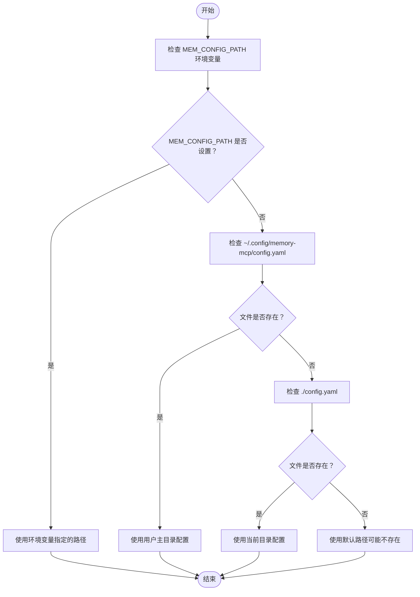
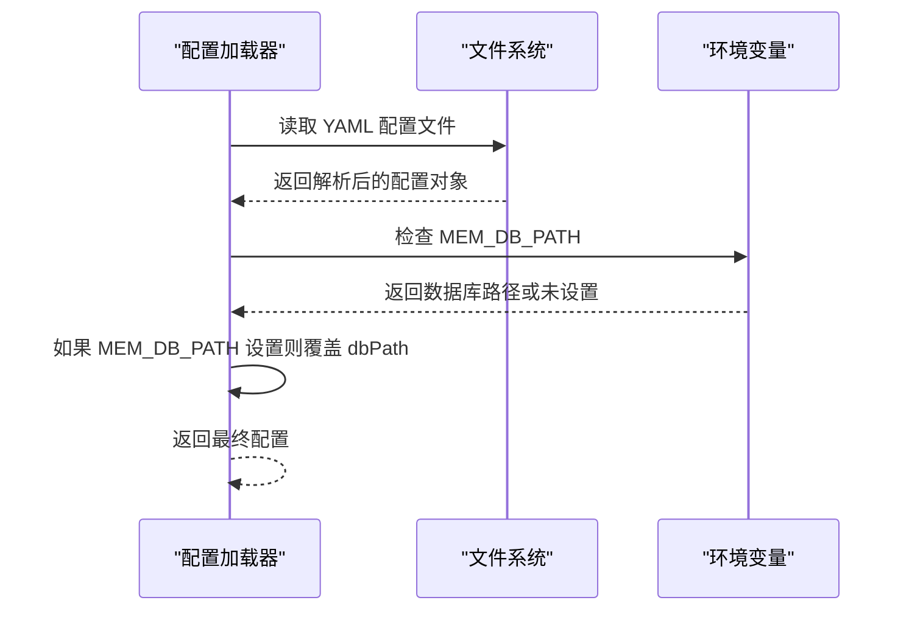
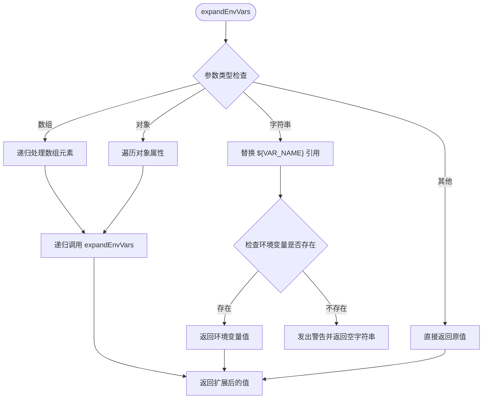
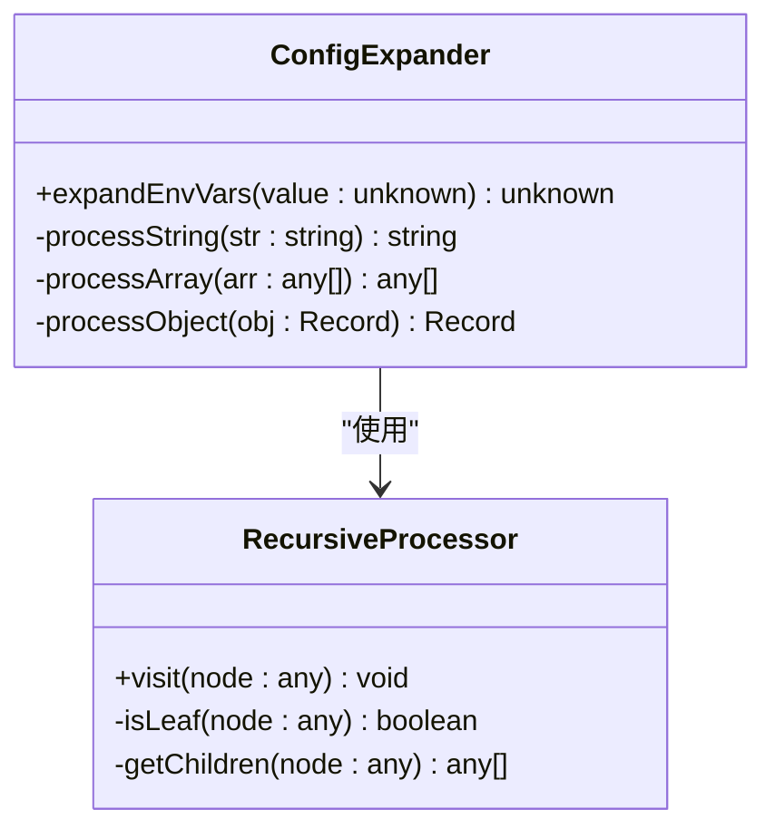
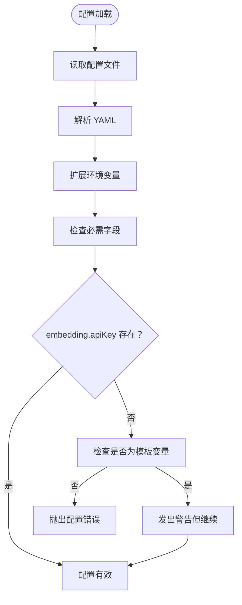

# 环境变量

<cite>
**本文档引用的文件**
- [config.ts](file://src/config.ts)
- [index.ts](file://src/index.ts)
- [cli.ts](file://src/cli.ts)
- [mcp-server.ts](file://src/mcp-server.ts)
- [README.md](file://README.md)
- [package.json](file://package.json)
- [mem.mjs](file://bin/mem.mjs)
</cite>

## 目录
1. [简介](#简介)
2. [环境变量语法](#环境变量语法)
3. [配置文件路径覆盖](#配置文件路径覆盖)
4. [数据库路径动态覆盖](#数据库路径动态覆盖)
5. [环境变量扩展机制](#环境变量扩展机制)
6. [递归处理机制](#递归处理机制)
7. [常见使用示例](#常见使用示例)
8. [调试技巧](#调试技巧)
9. [警告机制与回退行为](#警告机制与回退行为)
10. [最佳实践](#最佳实践)

## 简介

memory-lancedb-mcp 提供了强大的环境变量配置系统，支持在 YAML 配置文件中使用 `${ENV_VAR}` 语法进行变量引用，并提供了多种环境变量覆盖机制。本文档将详细介绍环境变量的使用方法、工作机制和最佳实践。

## 环境变量语法

### 基本语法

项目支持在 YAML 配置文件中使用 `${VARIABLE_NAME}` 语法来引用环境变量。这种语法在配置解析时会被自动替换为对应的环境变量值。

### 语法特点

- **变量格式**：`${VARIABLE_NAME}`
- **大小写敏感**：变量名区分大小写
- **空白字符处理**：变量名会自动去除首尾空白字符
- **嵌套支持**：可以在任何字符串位置使用

### 在配置文件中的应用

在默认配置模板中，多个关键配置项使用了环境变量语法：

```yaml
embedding:
  apiKey: "${OPENAI_API_KEY}"
  model: "text-embedding-3-small"
  baseURL: "https://api.openai.com/v1"

# 可选: 智能提取配置
smartExtraction:
  enabled: true
  apiKey: "${OPENAI_API_KEY}"
```

**章节来源**
- [config.ts:229-290](file://src/config.ts#L229-L290)
- [README.md:682-704](file://README.md#L682-L704)

## 配置文件路径覆盖

### MEM_CONFIG_PATH 环境变量

`MEM_CONFIG_PATH` 是最重要的环境变量，用于完全覆盖默认的配置文件查找逻辑。

### 查找优先级

配置文件的查找遵循严格的优先级顺序：

1. **MEM_CONFIG_PATH 环境变量**（最高优先级）
2. **用户主目录配置**：`~/.config/memory-mcp/config.yaml`
3. **当前目录配置**：`./config.yaml`
4. **默认路径**（可能不存在）

### 路径解析逻辑



**图表来源**
- [config.ts:107-121](file://src/config.ts#L107-L121)

### 实际应用场景

- **开发环境**：使用不同的配置文件进行环境隔离
- **生产部署**：通过环境变量指向特定的配置文件
- **容器化部署**：通过环境变量挂载外部配置

**章节来源**
- [config.ts:107-121](file://src/config.ts#L107-L121)
- [cli.ts:394-443](file://src/cli.ts#L394-L443)

## 数据库路径动态覆盖

### MEM_DB_PATH 环境变量

除了配置文件路径覆盖外，项目还提供了 `MEM_DB_PATH` 环境变量来动态覆盖数据库存储路径。

### 覆盖机制

数据库路径的覆盖发生在配置加载过程的最后阶段：



**图表来源**
- [config.ts:208-213](file://src/config.ts#L208-L213)

### 路径解析特性

- **支持波浪号展开**：`~/path` 会被解析为主目录路径
- **绝对路径支持**：直接使用绝对路径
- **相对路径支持**：相对于当前工作目录

**章节来源**
- [config.ts:208-213](file://src/config.ts#L208-L213)
- [cli.ts:35-41](file://src/cli.ts#L35-L41)

## 环境变量扩展机制

### 扩展函数实现

环境变量扩展是一个递归处理过程，支持复杂的嵌套结构：



**图表来源**
- [config.ts:135-157](file://src/config.ts#L135-L157)

### 处理流程详解

1. **字符串处理**：使用正则表达式 `/\$\{([^}]+)\}/g` 查找所有变量引用
2. **变量验证**：检查环境变量是否存在于 `process.env`
3. **值替换**：将变量引用替换为对应的环境变量值
4. **警告机制**：未设置的变量会发出警告但不会导致配置失败

**章节来源**
- [config.ts:135-157](file://src/config.ts#L135-L157)

## 递归处理机制

### 深度遍历策略

环境变量扩展采用深度优先的递归遍历策略，确保处理配置树中的每个节点：



**图表来源**
- [config.ts:135-157](file://src/config.ts#L135-L157)

### 支持的数据类型

- **字符串**：主要处理目标，支持变量替换
- **数组**：递归处理每个元素
- **对象**：递归处理每个属性值
- **原始类型**：直接返回（数字、布尔值等）

### 性能考虑

- **时间复杂度**：O(n)，其中 n 是配置树中字符串节点的数量
- **空间复杂度**：O(d)，其中 d 是配置树的最大深度
- **内存优化**：使用原地替换减少内存分配

**章节来源**
- [config.ts:135-157](file://src/config.ts#L135-L157)

## 常见使用示例

### 基础环境变量设置

#### OpenAI API 密钥配置

```yaml
# config.yaml
embedding:
  apiKey: "${OPENAI_API_KEY}"
  model: "text-embedding-3-small"
  baseURL: "https://api.openai.com/v1"
```

#### 多供应商支持

```yaml
# SiliconFlow 配置
embedding:
  apiKey: "${SILICONFLOW_API_KEY}"
  model: "Qwen/Qwen3-Embedding-8B"
  baseURL: "https://api.siliconflow.cn/v1"
  dimensions: 4096

# Ollama 本地配置
embedding:
  apiKey: ""
  model: "nomic-embed-text"
  baseURL: "http://localhost:11434"
  dimensions: 768
```

### 高级配置示例

#### 多项目环境隔离

```bash
# 项目A配置
export OPENAI_API_KEY="sk-A-key"
export MEM_CONFIG_PATH="/path/to/projectA/config.yaml"
export MEM_DB_PATH="~/data/projectA/lancedb"

# 项目B配置  
export OPENAI_API_KEY="sk-B-key"
export MEM_CONFIG_PATH="/path/to/projectB/config.yaml"
export MEM_DB_PATH="~/data/projectB/lancedb"
```

#### 开发与生产环境分离

```bash
# 开发环境
export OPENAI_API_KEY="dev-sk-xxxxxxxx"
export MEM_DB_PATH="~/dev_data/lancedb"

# 生产环境
export OPENAI_API_KEY="prod-sk-xxxxxxxx"
export MEM_DB_PATH="/var/lib/memory-lancedb"
```

**章节来源**
- [README.md:100-125](file://README.md#L100-L125)
- [README.md:706-713](file://README.md#L706-L713)

## 调试技巧

### 配置验证工具

项目提供了专门的健康检查命令来验证环境变量配置：

```bash
# 基本健康检查
mem doctor

# 指定配置文件路径
mem doctor --config /path/to/config.yaml

# 测试 MCP 协议握手
mem doctor --mcp
```

### 环境变量检查

在健康检查过程中，系统会执行以下验证步骤：

1. **配置文件存在性检查**
2. **配置文件解析验证**
3. **API 密钥完整性检查**
4. **插件加载状态检查**
5. **工具注册状态检查**

### 常见调试场景

#### 环境变量未设置

当引用的环境变量未设置时，系统会发出警告但继续执行：

```
[mem:config] Warning: env var OPENAI_API_KEY is not set
```

#### 配置文件路径问题

使用 `mem config path` 命令查看当前使用的配置文件路径：

```bash
mem config path
```

#### 配置显示与掩码

使用 `mem config show` 命令显示配置，系统会自动掩码敏感信息：

```bash
mem config show
```

**章节来源**
- [cli.ts:449-517](file://src/cli.ts#L449-L517)
- [cli.ts:394-443](file://src/cli.ts#L394-L443)

## 警告机制与回退行为

### 警告机制

当引用的环境变量未设置时，系统会发出详细的警告信息：

```javascript
console.warn(`[mem:config] Warning: env var ${varName} is not set`);
```

警告信息包含：
- **组件标识**：`[mem:config]`
- **变量名称**：具体的环境变量名
- **上下文信息**：指示变量未设置

### 回退行为

对于未设置的环境变量，系统采用安全的回退策略：

1. **字符串替换为空字符串**：`${UNSET_VAR}` → `""`
2. **不影响配置加载**：配置文件仍可正常加载
3. **运行时验证**：在关键功能处进行验证

### 错误处理策略



**图表来源**
- [config.ts:193-206](file://src/config.ts#L193-L206)

**章节来源**
- [config.ts:138-144](file://src/config.ts#L138-L144)
- [config.ts:193-206](file://src/config.ts#L193-L206)

## 最佳实践

### 环境变量组织

#### 分层管理

```bash
# 基础环境变量
export OPENAI_API_KEY="sk-xxxxxxxx"
export SILICONFLOW_API_KEY="sf-xxxxxxxx"

# 项目特定变量
export MEM_CONFIG_PATH="/path/to/project/config.yaml"
export MEM_DB_PATH="~/data/project/lancedb"

# 环境特定变量
export NODE_ENV="production"
export DEBUG=false
```

#### 安全存储

- **使用密钥管理服务**：在生产环境中使用专用的密钥管理
- **环境变量文件**：使用 `.env` 文件管理开发环境变量
- **最小权限原则**：为不同环境提供最小必要的权限

### 配置文件管理

#### 版本控制策略

```yaml
# .gitignore
.env
.env.local
.env.*.local
```

#### 配置模板

```yaml
# config.yaml.template
embedding:
  apiKey: "${OPENAI_API_KEY}"
  model: "${EMBEDDING_MODEL:-text-embedding-3-small}"
  baseURL: "${EMBEDDING_BASE_URL:-https://api.openai.com/v1}"

# 使用默认值的语法
# ${VARIABLE_NAME:-default_value}
```

### 部署最佳实践

#### Docker 环境

```dockerfile
FROM node:18-alpine

# 设置工作目录
WORKDIR /app

# 复制应用代码
COPY . .

# 安装依赖
RUN npm ci

# 设置环境变量
ENV OPENAI_API_KEY=${OPENAI_API_KEY}
ENV MEM_DB_PATH=/data/lancedb

# 启动应用
CMD ["node", "bin/mem.mjs", "serve"]
```

#### Kubernetes 配置

```yaml
apiVersion: v1
kind: Pod
metadata:
  name: memory-lancedb-mcp
spec:
  containers:
  - name: memory-lancedb-mcp
    image: memory-lancedb-mcp:latest
    env:
    - name: OPENAI_API_KEY
      valueFrom:
        secretKeyRef:
          name: memory-secrets
          key: openai-api-key
    - name: MEM_DB_PATH
      value: "/data/lancedb"
    volumeMounts:
    - name: data-volume
      mountPath: /data
  volumes:
  - name: data-volume
    persistentVolumeClaim:
      claimName: memory-pvc
```

### 监控与日志

#### 关键指标

- **配置加载成功率**：监控配置文件加载的成功率
- **环境变量覆盖率**：跟踪环境变量的使用情况
- **API 密钥有效性**：定期验证 API 密钥的有效性

#### 日志记录

```javascript
// 建议的日志级别
logger.debug("配置文件路径: %s", configPath);
logger.info("环境变量扩展完成，发现 %d 个变量", varCount);
logger.warn("未设置的环境变量: %s", unsetVars.join(", "));
logger.error("配置加载失败: %s", errorMessage);
```

通过遵循这些最佳实践，可以确保环境变量配置的安全性、可靠性和可维护性。