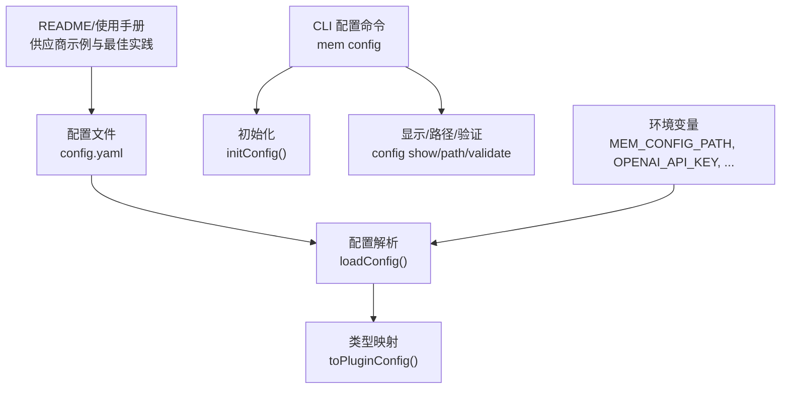
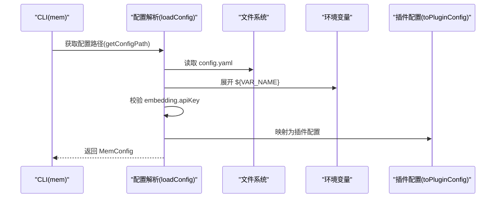
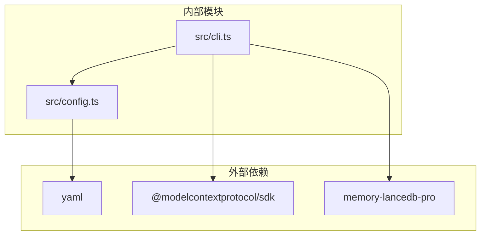

# 配置系统

<cite>
**本文引用的文件**
- [src/config.ts](file://src/config.ts)
- [src/cli.ts](file://src/cli.ts)
- [README.md](file://README.md)
- [docs/USAGE_GUIDE.md](file://docs/USAGE_GUIDE.md)
- [package.json](file://package.json)
- [bin/mem.mjs](file://bin/mem.mjs)
</cite>

## 目录
1. [简介](#简介)
2. [项目结构](#项目结构)
3. [核心组件](#核心组件)
4. [架构总览](#架构总览)
5. [详细组件分析](#详细组件分析)
6. [依赖分析](#依赖分析)
7. [性能考虑](#性能考虑)
8. [故障排除指南](#故障排除指南)
9. [结论](#结论)
10. [附录](#附录)

## 简介
本文件系统性地阐述 memory-lancedb-mcp 的配置系统，涵盖 YAML 配置文件结构、嵌入配置（embedding）的设置方法与多供应商示例、存储路径与默认 scope、智能提取（smartExtraction）开关与参数、环境变量扩展机制（${ENV_VAR}）与配置文件路径覆盖（MEM_CONFIG_PATH）、配置验证与初始化的最佳实践，以及常见场景示例与故障排除。

## 项目结构
配置系统主要由以下模块构成：
- 配置解析与类型定义：负责 YAML 解析、环境变量扩展、路径解析与默认值应用
- CLI 配置管理命令：提供初始化、显示、路径查看、验证与健康检查
- 文档与示例：README 与使用手册提供供应商示例与最佳实践

图表来源
- [src/config.ts:107-214](file://src/config.ts#L107-L214)
- [src/cli.ts:370-443](file://src/cli.ts#L370-L443)
- [README.md:675-714](file://README.md#L675-L714)

章节来源
- [src/config.ts:1-312](file://src/config.ts#L1-L312)
- [src/cli.ts:1-617](file://src/cli.ts#L1-L617)
- [README.md:1-738](file://README.md#L1-L738)

## 核心组件
- 配置类型 MemConfig：定义了嵌入、LLM、自动捕获/召回、智能提取、检索、作用域、自改进、Markdown 镜像等配置字段
- 配置路径解析：支持 MEM_CONFIG_PATH 覆盖、用户主目录默认路径、当前目录回退
- 环境变量扩展：递归展开 ${VAR_NAME} 引用，缺失变量发出警告
- 配置加载与校验：解析 YAML、展开环境变量、校验必需字段（embedding.apiKey）
- 配置初始化模板：提供默认配置文件内容与注释说明
- CLI 配置命令：init/show/path/validate/doctor

章节来源
- [src/config.ts:23-98](file://src/config.ts#L23-L98)
- [src/config.ts:107-121](file://src/config.ts#L107-L121)
- [src/config.ts:135-157](file://src/config.ts#L135-L157)
- [src/config.ts:167-214](file://src/config.ts#L167-L214)
- [src/config.ts:229-290](file://src/config.ts#L229-L290)
- [src/cli.ts:370-443](file://src/cli.ts#L370-L443)

## 架构总览
配置系统在启动时的典型流程如下：
- CLI 解析命令与参数
- 通过配置路径解析确定 config.yaml 位置
- 读取 YAML 并展开环境变量
- 校验必需字段（embedding.apiKey）
- 将配置映射为插件期望的格式
- 启动 MCP 服务或执行工具

图表来源
- [src/config.ts:107-121](file://src/config.ts#L107-L121)
- [src/config.ts:167-214](file://src/config.ts#L167-L214)
- [src/config.ts:220-223](file://src/config.ts#L220-L223)

## 详细组件分析

### YAML 配置文件结构与可用选项
- 嵌入配置（embedding）
  - provider：可选，供应商类型
  - apiKey：必填，支持字符串或数组；支持 ${ENV_VAR}
  - model：必填，嵌入模型名称
  - baseURL：可选，自定义 API 地址
  - dimensions/requestDimensions/omitDimensions：可选，维度控制
  - taskQuery/taskPassage：可选，任务类型
  - normalized/chunking：可选，归一化与分块
- LLM 配置（llm）：可选，用于智能提取等场景
  - auth/apiKey/model/baseURL/timeoutMs
- 自动捕获/召回
  - autoCapture/autoRecall/autoRecallMinLength/autoRecallMaxItems/autoRecallMaxChars/autoRecallTimeoutMs/captureAssistant
- 智能提取
  - smartExtraction：布尔开关
  - extractMinMessages/extractMaxChars：智能提取参数
- 检索配置（retrieval）
  - mode/vectorWeight/bm25Weight/minScore/hardMinScore/rerank/rerankProvider/rerankModel/rerankEndpoint/rerankApiKey/rerankTimeoutMs/candidatePoolSize/recencyHalfLifeDays/recencyWeight/filterNoise/lengthNormAnchor/timeDecayHalfLifeDays/reinforcementFactor/maxHalfLifeMultiplier
- 作用域（scopes）
  - default：默认作用域
  - definitions：作用域定义描述
  - agentAccess：代理访问控制
- 其他高级配置
  - selfImprovement、memoryReflection、mdMirror、admissionControl、memoryCompaction、sessionCompression、extractionThrottle、workspaceBoundary、dbPath、decay、tier 等

章节来源
- [src/config.ts:23-98](file://src/config.ts#L23-L98)
- [README.md:675-714](file://README.md#L675-L714)

### 嵌入配置（embedding）设置与多供应商示例
- OpenAI 示例
  - apiKey: ${OPENAI_API_KEY}
  - model: text-embedding-3-small
  - baseURL: https://api.openai.com/v1
  - dimensions: 1536
- SiliconFlow 示例
  - apiKey: ${SILICONFLOW_API_KEY}
  - model: Qwen/Qwen3-Embedding-8B
  - baseURL: https://api.siliconflow.cn/v1
  - dimensions: 4096
- Ollama 本地示例
  - apiKey: ""（空串）
  - model: nomic-embed-text
  - baseURL: http://localhost:11434
  - dimensions: 768

章节来源
- [README.md:100-125](file://README.md#L100-L125)
- [src/config.ts:235-241](file://src/config.ts#L235-L241)

### 存储路径配置（dbPath）与默认 scope 设置
- 存储路径
  - dbPath：数据库存储根路径，默认位于用户主目录下的共享路径
  - CLI 提供路径解析函数，支持 ~ 与绝对路径
- 默认 scope
  - scopes.default：默认作用域（如 global）
  - README 中给出 defaultScope 的示例与说明

章节来源
- [src/config.ts:232-233](file://src/config.ts#L232-L233)
- [src/cli.ts:35-41](file://src/cli.ts#L35-L41)
- [README.md:692-696](file://README.md#L692-L696)

### 智能提取（smartExtraction）启用与参数设置
- 开关
  - smartExtraction: true/false
- 参数
  - extractMinMessages：最小消息数
  - extractMaxChars：最大字符数
- LLM 配置（可选）
  - llm.apiKey/model/baseURL：当智能提取需要 LLM 时使用

章节来源
- [src/config.ts:52-54](file://src/config.ts#L52-L54)
- [src/config.ts:53-54](file://src/config.ts#L53-L54)
- [src/config.ts:243-247](file://src/config.ts#L243-L247)
- [README.md:698-704](file://README.md#L698-L704)

### 环境变量扩展机制（${ENV_VAR}）与配置文件路径覆盖（MEM_CONFIG_PATH）
- 环境变量扩展
  - expandEnvVars：递归展开字符串中的 ${VAR_NAME}
  - 未设置的变量会发出警告并替换为空字符串
- 配置文件路径覆盖
  - getConfigPath：优先使用 MEM_CONFIG_PATH，其次默认用户目录，再次当前目录，最后返回默认路径
- 其他环境变量
  - MEM_DB_PATH：覆盖 dbPath

章节来源
- [src/config.ts:135-157](file://src/config.ts#L135-L157)
- [src/config.ts:107-121](file://src/config.ts#L107-L121)
- [src/config.ts:208-211](file://src/config.ts#L208-L211)
- [README.md:706-713](file://README.md#L706-L713)

### 配置验证与初始化最佳实践
- 初始化
  - mem config init：创建默认配置文件（可强制覆盖）
  - 默认模板包含 dbPath、embedding、智能提取、检索、作用域、自改进等
- 显示与路径
  - mem config show：显示配置（密钥脱敏）
  - mem config path：显示配置文件路径是否存在
- 验证
  - mem config validate：校验配置有效性
  - mem doctor：综合健康检查（配置文件存在、解析、API Key、插件加载、工具列表）
- 最佳实践
  - 使用 ${ENV_VAR} 引用外部密钥，避免硬编码
  - 通过 MEM_CONFIG_PATH 指定项目专属配置
  - 使用 doctor 命令在启动前完成端到端验证

章节来源
- [src/config.ts:296-311](file://src/config.ts#L296-L311)
- [src/cli.ts:370-443](file://src/cli.ts#L370-L443)
- [src/cli.ts:449-517](file://src/cli.ts#L449-L517)

### 常见配置场景示例
- 基础嵌入配置（OpenAI）
  - 参考 README 的 OpenAI 示例片段
- 本地嵌入（Ollama）
  - 参考 README 的 Ollama 示例片段
- 自定义检索权重
  - 在 retrieval 中调整 vectorWeight/bm25Weight/minScore 等
- 启用智能提取
  - smartExtraction: true，并根据需要设置 llm.apiKey/model/baseURL

章节来源
- [README.md:100-125](file://README.md#L100-L125)
- [README.md:698-704](file://README.md#L698-L704)

## 依赖分析
- 外部依赖
  - yaml：YAML 解析
  - @modelcontextprotocol/sdk：MCP 协议支持
  - memory-lancedb-pro：核心记忆引擎
- 内部依赖
  - CLI 依赖配置解析模块
  - 配置解析依赖 YAML 与 Node 内置 fs/path/os

图表来源
- [package.json:26-31](file://package.json#L26-L31)
- [src/cli.ts:17-27](file://src/cli.ts#L17-L27)
- [src/config.ts:14-17](file://src/config.ts#L14-L17)

章节来源
- [package.json:1-46](file://package.json#L1-L46)
- [src/cli.ts:1-617](file://src/cli.ts#L1-L617)
- [src/config.ts:1-312](file://src/config.ts#L1-L312)

## 性能考虑
- 配置解析为一次性操作，影响启动时间，建议：
  - 将配置文件放置在快速磁盘上
  - 避免在配置中使用过多嵌套对象导致展开成本上升
- 环境变量展开为线性扫描，建议：
  - 控制 ${ENV_VAR} 的数量与层级
  - 在 CI/CD 中预设必要环境变量，减少运行时警告

## 故障排除指南
- 配置文件不存在
  - 现象：提示找不到配置文件
  - 处理：运行 mem config init 创建默认配置，或设置 MEM_CONFIG_PATH
- YAML 解析失败
  - 现象：解析错误
  - 处理：检查 YAML 语法，使用 mem config validate 或 doctor 定位
- 缺少 embedding.apiKey
  - 现象：校验失败
  - 处理：在 config.yaml 中设置 apiKey，或通过 ${ENV_VAR} 注入
- 环境变量未设置
  - 现象：展开时发出警告并替换为空
  - 处理：在运行环境中设置对应变量
- 健康检查失败
  - 使用 mem doctor 逐项检查配置、API Key、插件加载与工具列表

章节来源
- [src/config.ts:170-175](file://src/config.ts#L170-L175)
- [src/config.ts:189-190](file://src/config.ts#L189-L190)
- [src/config.ts:193-206](file://src/config.ts#L193-L206)
- [src/cli.ts:449-517](file://src/cli.ts#L449-L517)

## 结论
本配置系统以 YAML 为中心，结合环境变量扩展与严格的校验流程，提供了灵活且安全的配置管理能力。通过 CLI 的初始化、显示、路径与验证命令，用户可以高效地完成配置的创建与维护。推荐在生产环境中使用 ${ENV_VAR} 管理敏感信息，通过 MEM_CONFIG_PATH 实现多项目隔离，并利用 doctor 命令进行端到端验证。

## 附录
- CLI 配置命令参考
  - mem config init [-f, --force]
  - mem config show [--json]
  - mem config path
  - mem config validate
  - mem doctor [--config <path>] [--mcp]
- 环境变量参考
  - MEM_CONFIG_PATH：覆盖默认配置文件路径
  - OPENAI_API_KEY/SILICONFLOW_API_KEY：嵌入 API 密钥
  - MEM_DB_PATH：覆盖 dbPath

章节来源
- [src/cli.ts:370-443](file://src/cli.ts#L370-L443)
- [src/cli.ts:449-517](file://src/cli.ts#L449-L517)
- [README.md:706-713](file://README.md#L706-L713)