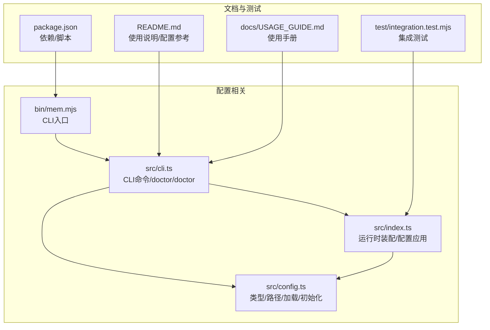
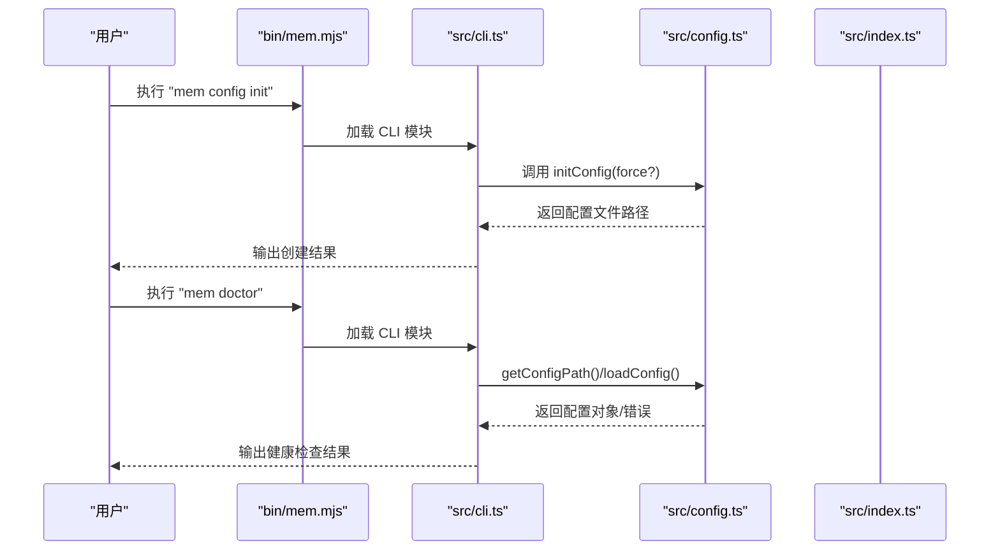
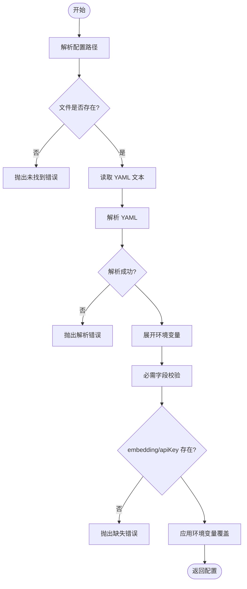
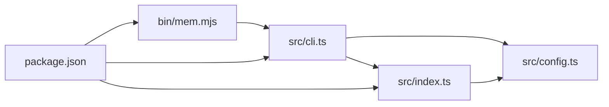

# 配置验证与初始化

<cite>
**本文引用的文件**
- [src/config.ts](file://src/config.ts)
- [src/index.ts](file://src/index.ts)
- [src/cli.ts](file://src/cli.ts)
- [bin/mem.mjs](file://bin/mem.mjs)
- [README.md](file://README.md)
- [docs/USAGE_GUIDE.md](file://docs/USAGE_GUIDE.md)
- [package.json](file://package.json)
- [test/integration.test.mjs](file://test/integration.test.mjs)
</cite>

## 目录
1. [简介](#简介)
2. [项目结构](#项目结构)
3. [核心组件](#核心组件)
4. [架构总览](#架构总览)
5. [详细组件分析](#详细组件分析)
6. [依赖分析](#依赖分析)
7. [性能考虑](#性能考虑)
8. [故障排除指南](#故障排除指南)
9. [结论](#结论)
10. [附录](#附录)

## 简介
本文件聚焦于配置系统的“验证与初始化”主题，涵盖以下要点：
- 配置文件的加载顺序与优先级机制
- 配置验证规则与必需字段检查
- initConfig 初始化功能与默认模板生成
- 配置文件路径解析逻辑与搜索顺序
- 配置错误的诊断方法与常见问题排查
- 配置文件迁移与版本兼容性处理建议
- 配置热更新与重新加载的注意事项

## 项目结构
围绕配置验证与初始化的相关文件与职责如下：
- 配置类型与加载：src/config.ts
- 运行时装配与配置应用：src/index.ts
- CLI 命令入口与配置管理：src/cli.ts
- CLI 可执行入口：bin/mem.mjs
- 使用说明与配置参考：README.md、docs/USAGE_GUIDE.md
- 依赖与脚本：package.json
- 集成测试：test/integration.test.mjs

图表来源
- [src/config.ts:1-312](file://src/config.ts#L1-L312)
- [src/index.ts:1-515](file://src/index.ts#L1-L515)
- [src/cli.ts:1-617](file://src/cli.ts#L1-L617)
- [bin/mem.mjs:1-8](file://bin/mem.mjs#L1-L8)
- [README.md:1-738](file://README.md#L1-L738)
- [docs/USAGE_GUIDE.md:1-672](file://docs/USAGE_GUIDE.md#L1-L672)
- [package.json:1-46](file://package.json#L1-L46)
- [test/integration.test.mjs:1-131](file://test/integration.test.mjs#L1-L131)

章节来源
- [src/config.ts:1-312](file://src/config.ts#L1-L312)
- [src/index.ts:1-515](file://src/index.ts#L1-L515)
- [src/cli.ts:1-617](file://src/cli.ts#L1-L617)
- [bin/mem.mjs:1-8](file://bin/mem.mjs#L1-L8)
- [README.md:1-738](file://README.md#L1-L738)
- [docs/USAGE_GUIDE.md:1-672](file://docs/USAGE_GUIDE.md#L1-L672)
- [package.json:1-46](file://package.json#L1-L46)
- [test/integration.test.mjs:1-131](file://test/integration.test.mjs#L1-L131)

## 核心组件
- 配置类型与路径解析：定义 MemConfig 类型、默认配置目录与路径解析函数
- 配置加载与验证：从 YAML 文件加载、环境变量展开、必需字段校验
- 配置初始化：生成默认配置模板文件
- 运行时装配：将 MemConfig 映射为插件期望的 pluginConfig，并注入运行时
- CLI 配置管理：提供 init/show/path/validate/doctor 等命令

章节来源
- [src/config.ts:23-121](file://src/config.ts#L23-L121)
- [src/config.ts:167-214](file://src/config.ts#L167-L214)
- [src/config.ts:296-311](file://src/config.ts#L296-L311)
- [src/index.ts:207-247](file://src/index.ts#L207-L247)
- [src/cli.ts:374-443](file://src/cli.ts#L374-L443)

## 架构总览
配置系统在启动流程中的交互如下：

图表来源
- [bin/mem.mjs:1-8](file://bin/mem.mjs#L1-L8)
- [src/cli.ts:374-443](file://src/cli.ts#L374-L443)
- [src/config.ts:107-121](file://src/config.ts#L107-L121)
- [src/config.ts:167-214](file://src/config.ts#L167-L214)

## 详细组件分析

### 配置类型与路径解析
- MemConfig 类型定义了完整的配置结构，包括嵌入、LLM、检索、作用域、自改进等字段
- 默认配置目录位于用户主目录下的 .config/memory-mcp
- 路径解析顺序：
  1) 通过环境变量 MEM_CONFIG_PATH 指定的路径
  2) 默认用户配置路径 ~/.config/memory-mcp/config.yaml
  3) 当前工作目录 ./config.yaml
  4) 若以上均不存在，返回默认路径（可能尚未存在）

章节来源
- [src/config.ts:23-98](file://src/config.ts#L23-L98)
- [src/config.ts:104-121](file://src/config.ts#L104-L121)

### 环境变量展开
- 对字符串中的 ${VAR_NAME} 进行递归展开
- 未设置的环境变量会发出警告并替换为空字符串
- 作用于整个配置对象，保证最终配置值可直接使用

章节来源
- [src/config.ts:135-157](file://src/config.ts#L135-L157)

### 配置加载与验证
- 加载流程：
  1) 解析配置路径（优先 MEM_CONFIG_PATH，其次默认用户路径，再次当前目录，最后默认路径）
  2) 读取并解析 YAML
  3) 展开环境变量
  4) 必需字段校验：必须存在 embedding 节点且包含 apiKey
  5) 环境变量覆盖：支持通过 MEM_DB_PATH 覆盖 dbPath
- 异常处理：
  - 配置文件不存在：抛出明确错误，提示初始化或设置环境变量
  - YAML 解析失败：抛出解析错误
  - 配置为空或非对象：抛出错误
  - 缺少 embedding 或 apiKey：抛出错误

图表来源
- [src/config.ts:167-214](file://src/config.ts#L167-L214)
- [src/config.ts:135-157](file://src/config.ts#L135-L157)

章节来源
- [src/config.ts:167-214](file://src/config.ts#L167-L214)

### 配置初始化与默认模板
- initConfig 功能：
  - 若配置文件不存在或强制覆盖，则创建默认配置
  - 自动创建配置目录（递归）
  - 写入默认模板（包含注释与示例）
  - 返回创建的路径
- 默认模板包含：
  - dbPath、embedding（必需）、llm（可选）、autoCapture/autoRecall、smartExtraction、enableManagementTools、sessionStrategy、retrieval、scopes、selfImprovement 等常用字段
  - 模板中嵌入了环境变量占位符，便于通过环境变量注入敏感信息

章节来源
- [src/config.ts:296-311](file://src/config.ts#L296-L311)
- [src/config.ts:229-290](file://src/config.ts#L229-L290)

### 运行时装配与配置映射
- createMemoryRuntime：
  - 优先使用传入的 config 对象；否则加载配置文件
  - 可选地根据 scope 参数覆盖 scopes 配置，实现项目隔离
  - 将 MemConfig 通过 toPluginConfig 映射为插件期望的 pluginConfig
  - 注册插件并触发 gateway_start 事件
- 该流程确保配置在运行时被正确应用，且支持通过 options.config 直接注入配置对象

章节来源
- [src/index.ts:207-247](file://src/index.ts#L207-L247)
- [src/index.ts:220-223](file://src/index.ts#L220-L223)

### CLI 配置管理命令
- config init/show/path/validate/doctor：
  - init：创建默认配置（支持 --force 覆盖）
  - show：显示当前配置（密钥脱敏）
  - path：打印配置文件路径（存在与否）
  - validate：验证配置文件有效性
  - doctor：综合健康检查（配置文件、解析、API Key、插件加载、工具列表）
- doctor 命令会：
  - 检查配置文件存在性
  - 解析配置并检查 embedding.apiKey 是否存在或通过环境变量提供
  - 加载插件并列出工具数量

章节来源
- [src/cli.ts:374-443](file://src/cli.ts#L374-L443)
- [src/cli.ts:454-517](file://src/cli.ts#L454-L517)

## 依赖分析
- 外部依赖：
  - yaml：用于解析 YAML 配置
  - jiti：用于从 node_modules 直接加载 memory-lancedb-pro 的 TypeScript 源码
- 内部依赖：
  - src/config.ts 被 src/index.ts 与 src/cli.ts 引用
  - bin/mem.mjs 作为 CLI 入口加载 dist/cli.js（构建产物）

图表来源
- [bin/mem.mjs:1-8](file://bin/mem.mjs#L1-L8)
- [src/cli.ts:21-27](file://src/cli.ts#L21-L27)
- [src/index.ts:10-12](file://src/index.ts#L10-L12)
- [package.json:26-31](file://package.json#L26-L31)

章节来源
- [package.json:26-31](file://package.json#L26-L31)
- [src/cli.ts:21-27](file://src/cli.ts#L21-L27)
- [src/index.ts:10-12](file://src/index.ts#L10-L12)
- [bin/mem.mjs:1-8](file://bin/mem.mjs#L1-L8)

## 性能考虑
- 配置加载为一次性 I/O 操作，开销极小
- 环境变量展开采用递归遍历，复杂度与配置树大小线性相关
- 建议：
  - 将敏感配置置于环境变量，减少明文写入配置文件
  - 避免在配置中使用过深的嵌套结构，降低展开成本
  - 在 CI/CD 中预设 MEM_CONFIG_PATH，避免多次路径解析

## 故障排除指南
- 配置文件未找到
  - 现象：加载配置时报“配置文件未找到”
  - 处理：执行 mem config init 创建默认配置，或设置 MEM_CONFIG_PATH 指向有效路径
  - 参考：[src/config.ts:170-175](file://src/config.ts#L170-L175)
- YAML 解析失败
  - 现象：解析 YAML 报错
  - 处理：检查 YAML 语法与缩进；使用 mem config validate 验证
  - 参考：[src/config.ts:179-183](file://src/config.ts#L179-L183)
- 缺少必需字段
  - 现象：缺少 embedding 或 embedding.apiKey
  - 处理：在配置中添加 embedding.apiKey，或通过环境变量 ${OPENAI_API_KEY} 等注入
  - 参考：[src/config.ts:193-206](file://src/config.ts#L193-L206)
- 环境变量未设置
  - 现象：${VAR_NAME} 未被替换或为空
  - 处理：设置相应环境变量；doctor 会检测并提示
  - 参考：[src/config.ts:137-144](file://src/config.ts#L137-L144)
- doctor 检查失败
  - 现象：doctor 报告配置错误或插件加载失败
  - 处理：根据 doctor 输出逐项修复；确认 API Key、网络连通性、LanceDB 权限
  - 参考：[src/cli.ts:454-517](file://src/cli.ts#L454-L517)

章节来源
- [src/config.ts:170-183](file://src/config.ts#L170-L183)
- [src/config.ts:193-206](file://src/config.ts#L193-L206)
- [src/config.ts:137-144](file://src/config.ts#L137-L144)
- [src/cli.ts:454-517](file://src/cli.ts#L454-L517)

## 结论
本配置系统通过清晰的加载顺序、严格的验证规则与完善的 CLI 工具，提供了可靠、易用的配置管理能力。默认模板与 doctor 健康检查进一步降低了上手门槛与维护成本。对于生产环境，建议结合环境变量与 CI/CD 管道统一管理敏感配置，并定期使用 doctor 进行健康巡检。

## 附录

### 配置加载顺序与优先级机制
- 优先级从高到低：
  1) 环境变量 MEM_CONFIG_PATH
  2) 用户默认路径 ~/.config/memory-mcp/config.yaml
  3) 当前工作目录 ./config.yaml
  4) 默认路径（可能不存在）
- 路径解析函数：getConfigPath()

章节来源
- [src/config.ts:7-12](file://src/config.ts#L7-L12)
- [src/config.ts:107-121](file://src/config.ts#L107-L121)

### 配置验证规则与必需字段检查
- 必需字段：
  - embedding 节点存在
  - embedding.apiKey 存在（可为环境变量占位符）
- 其他验证：
  - 配置文件存在性
  - YAML 解析成功
  - 配置对象非空
- 环境变量覆盖：
  - MEM_DB_PATH 可覆盖 dbPath

章节来源
- [src/config.ts:193-206](file://src/config.ts#L193-L206)
- [src/config.ts:208-213](file://src/config.ts#L208-L213)

### initConfig 初始化功能与默认模板生成
- 功能：
  - 创建默认配置目录与文件
  - 写入默认模板（含注释与示例）
  - 支持强制覆盖
- 默认模板字段：
  - dbPath、embedding（必需）、llm（可选）、autoCapture/autoRecall、smartExtraction、enableManagementTools、sessionStrategy、retrieval、scopes、selfImprovement 等

章节来源
- [src/config.ts:296-311](file://src/config.ts#L296-L311)
- [src/config.ts:229-290](file://src/config.ts#L229-L290)

### 配置文件路径解析逻辑与搜索顺序
- 解析逻辑：
  - 优先 MEM_CONFIG_PATH
  - 检查默认用户路径
  - 检查当前目录
  - 返回默认路径（可能不存在）
- 相关函数：getConfigPath()、getDefaultConfigDir()

章节来源
- [src/config.ts:107-125](file://src/config.ts#L107-L125)

### 配置错误的诊断方法与常见问题排查
- doctor 命令：
  - 检查配置文件存在性
  - 解析配置并检查 embedding.apiKey
  - 加载插件并列出工具数量
- CLI 命令：
  - config validate：快速验证
  - config show：查看配置（密钥脱敏）
  - config path：查看路径存在性

章节来源
- [src/cli.ts:454-517](file://src/cli.ts#L454-L517)
- [src/cli.ts:374-443](file://src/cli.ts#L374-L443)

### 配置文件迁移与版本兼容性处理指南
- 迁移建议：
  - 保留旧配置中的 embedding.apiKey、dbPath 等关键字段
  - 逐步引入新增字段（如 retrieval、scopes、selfImprovement 等）
  - 使用 doctor 确认迁移后配置有效
- 兼容性：
  - 本项目未提供自动迁移脚本，建议手动对照默认模板补充缺失字段
  - 通过 doctor 检查新增字段是否符合预期

章节来源
- [src/config.ts:229-290](file://src/config.ts#L229-L290)
- [src/cli.ts:454-517](file://src/cli.ts#L454-L517)

### 配置热更新与重新加载的注意事项
- 现状：
  - 配置加载为一次性过程，运行时不会自动重新加载
  - 修改配置后需重启服务或重新创建运行时
- 建议：
  - 在 CI/CD 中统一变更配置并重启服务
  - 使用 --config 指定路径，便于在多实例间切换
  - 对于敏感配置，优先使用环境变量（MEM_DB_PATH 等）

章节来源
- [src/config.ts:167-214](file://src/config.ts#L167-L214)
- [src/index.ts:207-247](file://src/index.ts#L207-L247)