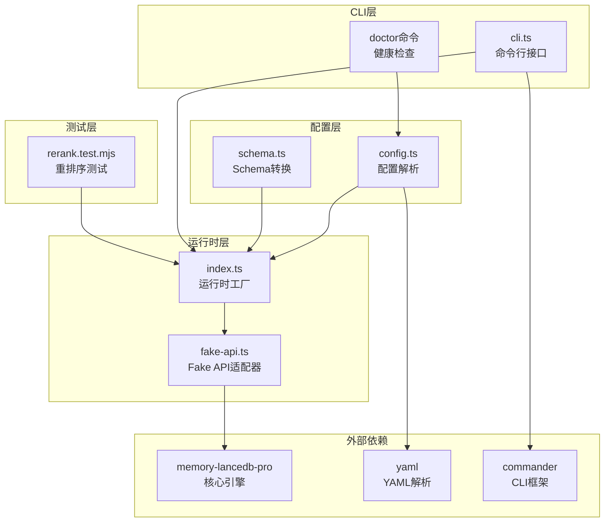
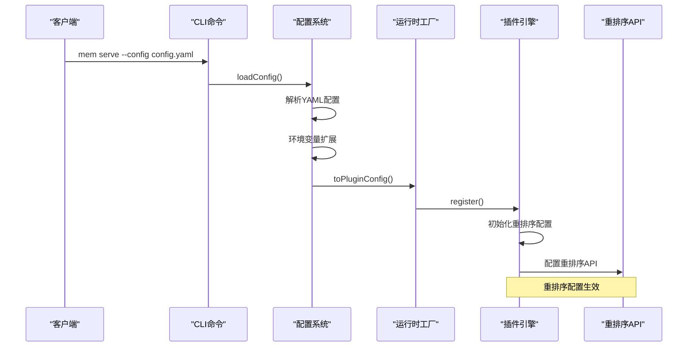
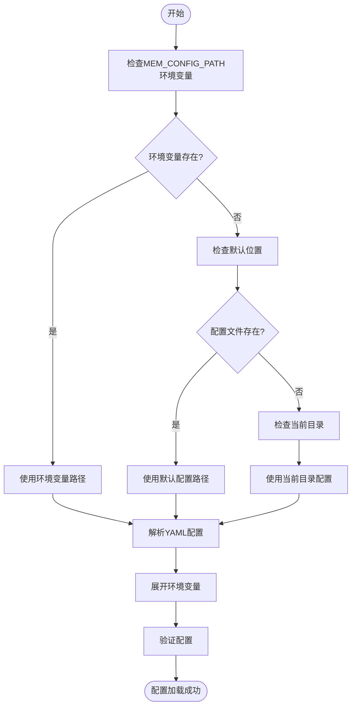
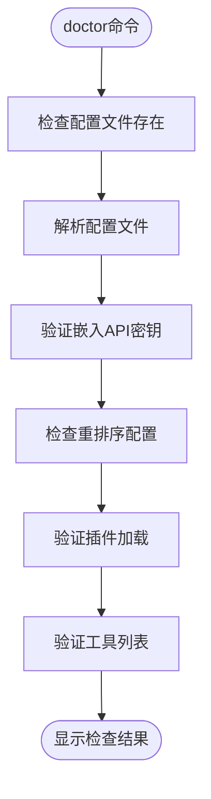
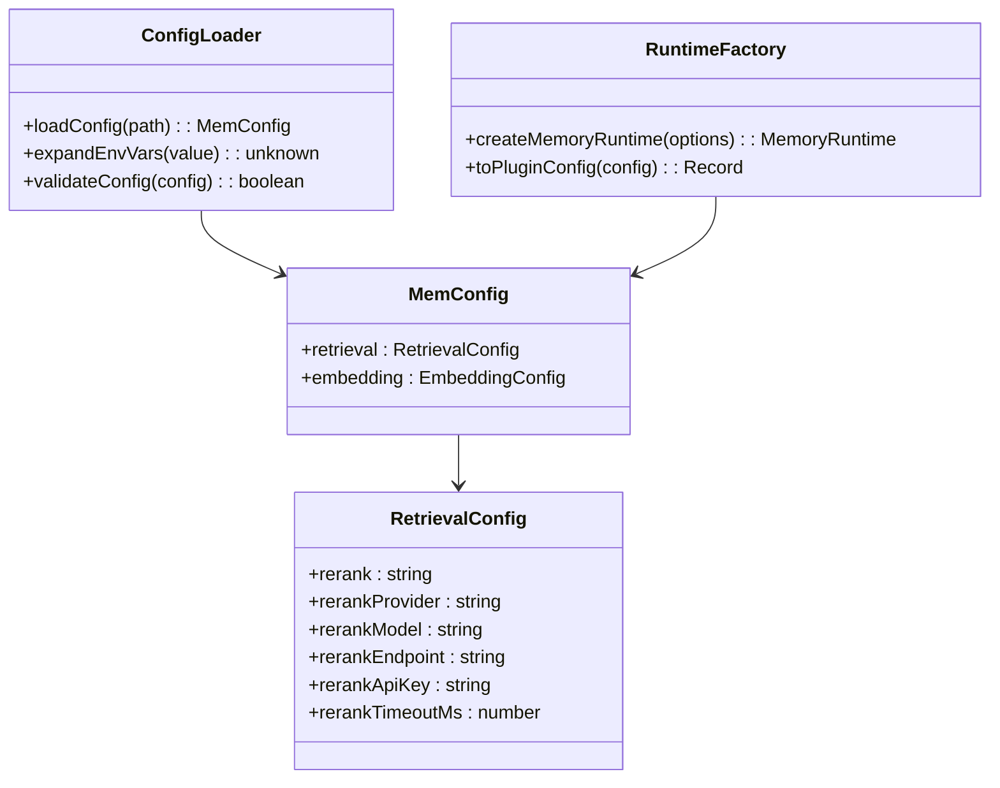
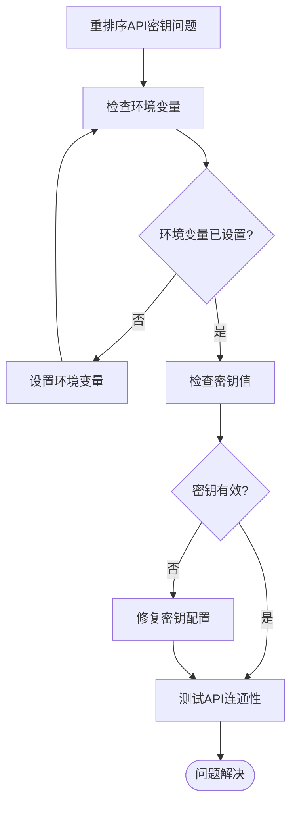

# 重排序模型配置

<cite>
**本文档引用的文件**
- [config.ts](file://src/config.ts)
- [index.ts](file://src/index.ts)
- [cli.ts](file://src/cli.ts)
- [fake-api.ts](file://src/fake-api.ts)
- [rerank.test.mjs](file://test/rerank.test.mjs)
- [README.md](file://README.md)
- [package.json](file://package.json)
</cite>

## 目录
1. [简介](#简介)
2. [项目结构](#项目结构)
3. [核心组件](#核心组件)
4. [架构概览](#架构概览)
5. [详细组件分析](#详细组件分析)
6. [依赖分析](#依赖分析)
7. [性能考虑](#性能考虑)
8. [故障排除指南](#故障排除指南)
9. [结论](#结论)

## 简介

本文档详细介绍了 memory-lancedb-mcp 项目中的重排序模型配置系统。该项目基于 memory-lancedb-pro 构建，为 AI 应用提供持久化长期记忆功能，支持多种重排序模型供应商和配置选项。

重排序模型在混合检索系统中扮演着关键角色，通过对候选结果进行二次精排来显著提升检索精度。系统支持三种重排序模式：交叉编码器（API调用，推荐）、轻量级（本地余弦相似度）和禁用模式。

## 项目结构

该项目采用模块化架构，主要包含以下核心模块：



**图表来源**
- [config.ts:1-356](file://src/config.ts#L1-L356)
- [index.ts:1-515](file://src/index.ts#L1-L515)
- [cli.ts:1-658](file://src/cli.ts#L1-L658)

**章节来源**
- [config.ts:1-356](file://src/config.ts#L1-L356)
- [index.ts:1-515](file://src/index.ts#L1-L515)
- [cli.ts:1-658](file://src/cli.ts#L1-L658)

## 核心组件

### 配置系统

配置系统负责加载和解析 YAML 配置文件，支持环境变量扩展和多种配置源：

- **配置路径解析**：支持 MEM_CONFIG_PATH 环境变量、默认位置和当前目录回退
- **环境变量扩展**：支持 `${ENV_VAR}` 语法的环境变量替换
- **配置验证**：验证必需字段的存在性和有效性

### 重排序配置接口

重排序配置通过 `MemConfig` 接口定义，包含以下关键属性：

- `rerank`: 重排序模式（cross-encoder、lightweight、none）
- `rerankProvider`: 供应商（jina、siliconflow、dashscope、voyage、pinecone、tei）
- `rerankModel`: 模型名称
- `rerankEndpoint`: API 端点
- `rerankApiKey`: API 密钥
- `rerankTimeoutMs`: 超时设置

**章节来源**
- [config.ts:23-104](file://src/config.ts#L23-L104)
- [config.ts:173-229](file://src/config.ts#L173-L229)

## 架构概览

系统采用分层架构，重排序配置在整个架构中发挥关键作用：



**图表来源**
- [cli.ts:124-169](file://src/cli.ts#L124-L169)
- [config.ts:173-229](file://src/config.ts#L173-L229)
- [index.ts:207-242](file://src/index.ts#L207-L242)

## 详细组件分析

### 配置加载流程

配置加载过程包含多个阶段：



**图表来源**
- [config.ts:113-127](file://src/config.ts#L113-L127)
- [config.ts:173-220](file://src/config.ts#L173-L220)

### 重排序配置验证

系统提供多种验证机制确保重排序配置的有效性：

#### 健康检查命令



**图表来源**
- [cli.ts:461-558](file://src/cli.ts#L461-L558)

#### 重排序配置类型定义

重排序配置通过 TypeScript 接口严格定义：

```typescript
interface MemConfig {
  retrieval?: {
    rerank?: string;
    rerankProvider?: string;
    rerankModel?: string;
    rerankEndpoint?: string;
    rerankApiKey?: string;
    rerankTimeoutMs?: number;
    // 其他检索配置...
  };
}
```

**章节来源**
- [config.ts:57-83](file://src/config.ts#L57-L83)
- [cli.ts:507-534](file://src/cli.ts#L507-L534)

### 支持的重排序供应商

系统支持多个重排序供应商，每个供应商都有特定的配置要求：

| 供应商 | 默认模型 | 端点示例 | 特点 |
|--------|----------|----------|------|
| Jina | jina-reranker-v3 | https://api.jina.ai/v1/rerank | 推荐，高质量 |
| SiliconFlow | BAAI/bge-reranker-v2-m3 | https://api.siliconflow.cn/v1/rerank | Jina兼容格式，国内访问友好 |
| DashScope | gte-rerank-v2 | https://dashscope.aliyuncs.com/api/v1/services/rerank/text-rerank/text-rerank | 阿里云，中文优化 |
| Voyage | rerank-3 | https://api.voyageai.com/v1/rerank | 多语言支持 |
| Pinecone | pinecone-rerank-v0 | https://api.pinecone.io/rerank | Pinecone生态 |
| HuggingFace TEI | 自选 | http://localhost:8080/rerank | 自部署，免费 |

**章节来源**
- [config.ts:286-321](file://src/config.ts#L286-L321)
- [README.md:718-775](file://README.md#L718-L775)

### 重排序模式详解

系统支持三种重排序模式，每种模式都有不同的性能特征和使用场景：

#### Cross-Encoder 模式（推荐）

- **特点**：调用重排序 API，精度最高
- **成本**：每次检索一次 API 调用
- **适用场景**：对检索精度要求较高的生产环境

#### Lightweight 模式

- **特点**：本地余弦相似度重排，零成本
- **成本**：无 API 调用费用
- **适用场景**：开发测试、预算有限的场景

#### None 模式

- **特点**：完全禁用重排序
- **成本**：无额外开销
- **适用场景**：仅使用向量检索或性能敏感场景

**章节来源**
- [README.md:706-717](file://README.md#L706-L717)

### 环境变量配置

系统支持通过环境变量配置重排序 API 密钥：

```yaml
# config.yaml 示例
retrieval:
  rerank: "cross-encoder"
  rerankProvider: "jina"
  rerankModel: "jina-reranker-v3"
  rerankEndpoint: "https://api.jina.ai/v1/rerank"
  rerankApiKey: "${JINA_API_KEY}"
```

**章节来源**
- [config.ts:137-163](file://src/config.ts#L137-L163)
- [config.ts:286-321](file://src/config.ts#L286-L321)

## 依赖分析

### 外部依赖关系

```mermaid
graph TB
subgraph "核心依赖"
MemoryLanceDB[memory-lancedb-pro<br/>^1.1.0-beta.10]
YAML[yaml<br/>^2.7.1]
Commander[commander<br/>^14.0.0]
Jiti[jiti<br/>^2.6.1]
end
subgraph "开发依赖"
TypeBox[@sinclair/typebox<br/>0.34.48]
Lefthook[@evilmartians/lefthook<br/>^2.0.11]
TypeScript[typescript<br/>^5.9.3]
end
subgraph "运行时依赖"
SDK[@modelcontextprotocol/sdk<br/>^1.12.1]
end
MemoryLanceDB --> YAML
MemoryLanceDB --> Commander
MemoryLanceDB --> Jiti
MemoryLanceDB --> SDK
```

**图表来源**
- [package.json:33-44](file://package.json#L33-L44)

### 重排序配置的依赖关系

重排序配置依赖于多个组件协同工作：



**图表来源**
- [config.ts:23-104](file://src/config.ts#L23-L104)
- [config.ts:173-229](file://src/config.ts#L173-L229)

**章节来源**
- [package.json:1-54](file://package.json#L1-L54)

## 性能考虑

### 重排序性能特征

不同重排序模式具有不同的性能特征：

| 模式 | API调用次数 | 延迟影响 | 成本 | 适用场景 |
|------|-------------|----------|------|----------|
| Cross-Encoder | 每次检索1次 | 高 | 中等 | 生产环境，高精度需求 |
| Lightweight | 0次 | 低 | 无 | 开发测试，预算有限 |
| None | 0次 | 低 | 无 | 仅向量检索，性能敏感 |

### 配置优化建议

1. **生产环境推荐**：使用 Cross-Encoder 模式，配置合适的供应商
2. **开发环境**：使用 Lightweight 模式，降低开发成本
3. **性能监控**：定期检查重排序 API 的响应时间和成功率
4. **缓存策略**：合理设置重排序超时时间，避免长时间等待

## 故障排除指南

### 常见配置问题

#### 重排序 API 密钥问题



#### 配置验证失败

系统提供详细的配置验证机制：

1. **配置文件存在性检查**
2. **YAML 语法验证**
3. **必需字段检查**
4. **环境变量扩展验证**
5. **重排序配置有效性检查**

**章节来源**
- [cli.ts:461-558](file://src/cli.ts#L461-L558)
- [config.ts:173-220](file://src/config.ts#L173-L220)

### 测试验证

系统包含完整的重排序测试套件：

- **配置解析测试**：验证重排序配置正确解析
- **API 调用测试**：测试与重排序供应商的 API 交互
- **端到端测试**：验证完整检索流程中的重排序功能

**章节来源**
- [rerank.test.mjs:1-506](file://test/rerank.test.mjs#L1-L506)

## 结论

memory-lancedb-mcp 的重排序模型配置系统提供了灵活、可扩展的配置机制，支持多种供应商和模式选择。通过严格的配置验证、环境变量支持和完整的测试覆盖，确保了系统的稳定性和可靠性。

关键特性包括：
- 多供应商支持和灵活配置
- 环境变量扩展机制
- 三种重排序模式选择
- 完整的健康检查和故障排除
- 详细的测试覆盖

这些特性使得该系统能够适应不同的使用场景和需求，为 AI 应用提供高质量的长期记忆功能。