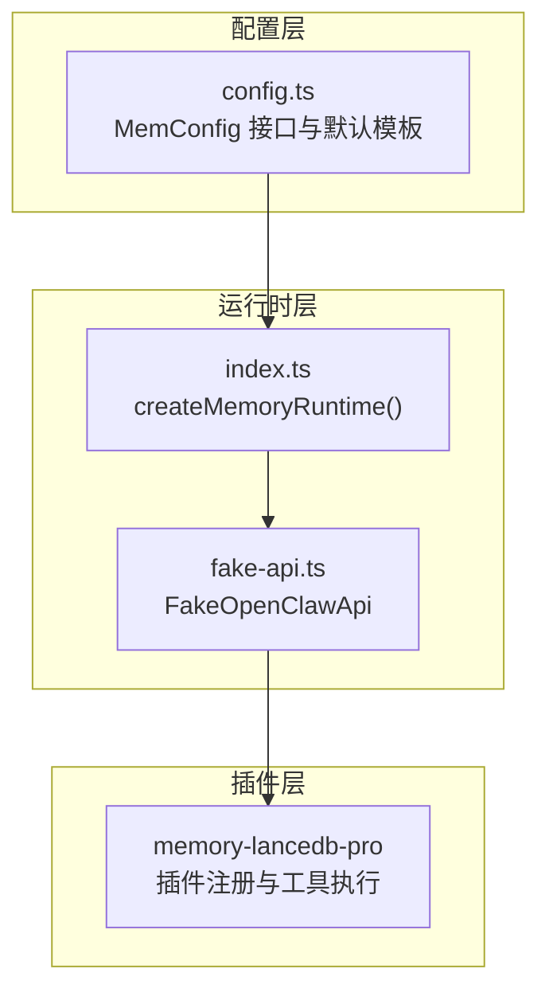
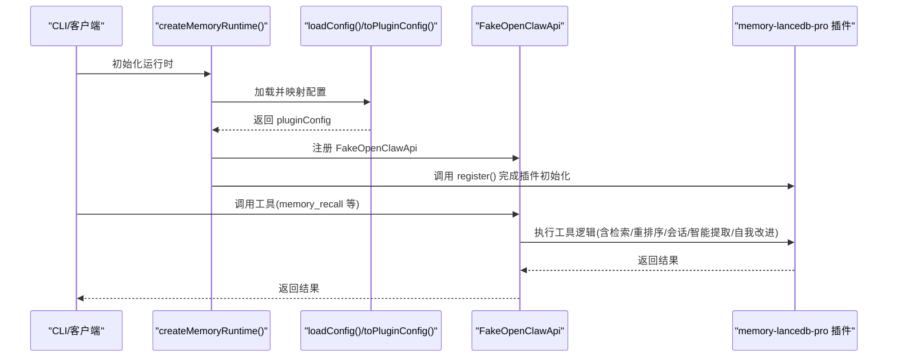
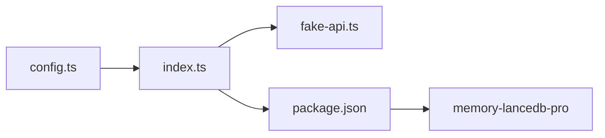

# 高级配置

<cite>
**本文引用的文件**
- [config.ts](file://src/config.ts)
- [index.ts](file://src/index.ts)
- [fake-api.ts](file://src/fake-api.ts)
- [schema.ts](file://src/schema.ts)
- [README.md](file://README.md)
- [USAGE_GUIDE.md](file://docs/USAGE_GUIDE.md)
- [package.json](file://package.json)
</cite>

## 目录
1. [简介](#简介)
2. [项目结构](#项目结构)
3. [核心组件](#核心组件)
4. [架构总览](#架构总览)
5. [详细组件分析](#详细组件分析)
6. [依赖分析](#依赖分析)
7. [性能考虑](#性能考虑)
8. [故障排除指南](#故障排除指南)
9. [结论](#结论)
10. [附录](#附录)

## 简介
本文件聚焦于“高级配置”的深入说明，围绕以下主题展开：
- retrieval 检索配置的各种模式与权重设置
- rerank 重排序功能的配置方法与供应商支持
- sessionStrategy 会话策略的不同选项与适用场景
- smartExtraction 智能提取的配置参数与阈值设置
- selfImprovement 自我改进功能的启用与相关配置
- 性能优化相关的配置建议与最佳实践

目标是帮助使用者在 MCP 环境中，基于 YAML 配置文件对检索、重排序、会话策略、智能提取与自我改进进行精细化控制，并结合实际业务场景给出调优建议。

## 项目结构
本项目通过 YAML 配置文件驱动 memory-lancedb-pro 的插件配置，核心入口负责加载配置、转换为插件期望的格式，并通过 FakeOpenClawApi 暴露 MCP 工具与生命周期钩子。

图表来源
- [config.ts:167-223](file://src/config.ts#L167-L223)
- [index.ts:207-242](file://src/index.ts#L207-L242)
- [fake-api.ts:57-90](file://src/fake-api.ts#L57-L90)

章节来源
- [config.ts:167-223](file://src/config.ts#L167-L223)
- [index.ts:207-242](file://src/index.ts#L207-L242)
- [fake-api.ts:57-90](file://src/fake-api.ts#L57-L90)

## 核心组件
- 配置加载与解析：支持环境变量扩展、路径解析、默认模板生成与校验。
- 配置映射：将 MemConfig 直接映射为插件期望的 pluginConfig。
- 运行时封装：通过 FakeOpenClawApi 注册工具、事件与钩子，供 MCP 服务使用。
- 标签系统：在工具调用前后对“标签”进行预处理与后处理，实现软过滤与展示剥离。

章节来源
- [config.ts:107-214](file://src/config.ts#L107-L214)
- [index.ts:313-453](file://src/index.ts#L313-L453)
- [fake-api.ts:113-160](file://src/fake-api.ts#L113-L160)

## 架构总览
下图展示了从配置到插件工具执行的关键路径，以及与检索、重排序、会话策略、智能提取、自我改进相关的配置入口。

图表来源
- [index.ts:207-242](file://src/index.ts#L207-L242)
- [config.ts:220-223](file://src/config.ts#L220-L223)
- [fake-api.ts:217-235](file://src/fake-api.ts#L217-L235)

## 详细组件分析

### retrieval 检索配置：模式与权重
retrieval 配置位于配置根对象的 retrieval 字段，涵盖检索模式、向量与 BM25 权重、分数阈值、候选池大小、时间衰减、长度归一化、噪声过滤、重排等。

- 检索模式
  - mode: 混合检索模式（如 hybrid），用于向量与 BM25 的融合。
- 权重
  - vectorWeight: 向量检索权重（默认 0.7）
  - bm25Weight: BM25 权重（默认 0.3）
  - 两者之和建议为 1，以保证融合稳定。
- 分数阈值
  - minScore: 融合后最低分数阈值（默认 0.3）
  - hardMinScore: 更严格的硬阈值（默认 0.35），用于进一步筛选。
- 噪声过滤
  - filterNoise: 是否启用噪声过滤（默认 true）。
- 候选池与时间/长度归一化
  - candidatePoolSize: 候选池大小（影响召回规模与性能）。
  - lengthNormAnchor: 长度归一化的锚点（影响不同长度记忆的公平性）。
  - recencyHalfLifeDays / recencyWeight: 时间相关性半衰期与权重。
  - timeDecayHalfLifeDays: 时间衰减半衰期。
  - reinforcementFactor / maxHalfLifeMultiplier: 与记忆强化/半衰期上限相关的因子。
- 重排
  - rerank: 重排策略（如 cross-encoder）
  - rerankProvider / rerankModel / rerankEndpoint / rerankApiKey / rerankTimeoutMs: 供应商、模型、端点、密钥与超时。

调优建议
- 当向量与 BM25 的语义与关键词匹配需求差异较大时，可调整 vectorWeight 与 bm25Weight，逐步微调 minScore 与 hardMinScore。
- 噪声过滤开启有助于降低无关召回，但可能影响召回覆盖面，需根据业务平衡。
- 候选池大小与时间/长度归一化参数会影响召回质量与延迟，建议在测试集上评估。
- 若启用重排，建议先在小样本上验证 rerankProvider/model 的效果，再扩大应用。

章节来源
- [config.ts:57-77](file://src/config.ts#L57-L77)
- [config.ts:267-279](file://src/config.ts#L267-L279)
- [USAGE_GUIDE.md:317-390](file://docs/USAGE_GUIDE.md#L317-L390)

### rerank 重排序：配置方法与供应商支持
- 启用方式：在 retrieval.rerank 中设置策略（如 cross-encoder），并提供 rerankProvider、rerankModel、rerankEndpoint、rerankApiKey、rerankTimeoutMs。
- 供应商支持：配置中预留了 rerankProvider 与 rerankModel 字段，便于扩展至不同供应商（如 Jina 等）。
- 端到端流程：检索阶段先得到候选集，再由重排器对候选进行细粒度排序，最终输出更高质量的排序结果。

章节来源
- [config.ts:63-68](file://src/config.ts#L63-L68)
- [config.ts:275-279](file://src/config.ts#L275-L279)

### sessionStrategy 会话策略：选项与适用场景
- 配置位置：sessionStrategy 字段位于配置根对象。
- 默认值：在默认模板中设为 none。
- 适用场景：
  - none：推荐用于 MCP 模式，避免不必要的会话状态维护。
  - 其他策略（如基于时间/消息数的策略）可在插件侧生效，具体取决于 memory-lancedb-pro 的实现与配置映射。

章节来源
- [config.ts:56](file://src/config.ts#L56)
- [config.ts:265](file://src/config.ts#L265)

### smartExtraction 智能提取：配置参数与阈值
- 开关：smartExtraction（默认 true）
- 阈值：
  - extractMinMessages：最小消息数阈值（默认 2）
  - extractMaxChars：最大字符阈值（默认 8000）
- LLM 配置：可选 llm 字段用于智能提取的 LLM 供应商与模型，若未提供则回退到 embedding 配置。
- 作用：在自动捕获（auto-capture）或显式调用时，对对话内容进行六分类等智能提取与归类。

章节来源
- [config.ts:52-54](file://src/config.ts#L52-L54)
- [config.ts:38-44](file://src/config.ts#L38-L44)
- [config.ts:257-259](file://src/config.ts#L257-L259)
- [README.md:698-704](file://README.md#L698-L704)

### selfImprovement 自我改进：启用与相关配置
- 开启：selfImprovement.enabled（默认 true）
- 辅助开关：
  - beforeResetNote：重置前记录（默认 true）
  - ensureLearningFiles：确保学习文件存在（默认 true）
- 作用：治理与改进记忆，支持记录改进建议、提取技能、审阅待改进项等工具。

章节来源
- [config.ts:85-90](file://src/config.ts#L85-L90)
- [config.ts:286-289](file://src/config.ts#L286-L289)

### 标签系统与检索过滤（补充）
- 标签在工具调用前后进行预处理与后处理，实现软过滤与展示剥离。
- 软过滤：通过 BM25 加权而非硬排除，适合在 recall/list 中进行标签增强。
- 硬过滤：如需严格排除，可结合 category 参数使用。

章节来源
- [index.ts:313-453](file://src/index.ts#L313-L453)
- [USAGE_GUIDE.md:382-389](file://docs/USAGE_GUIDE.md#L382-L389)

## 依赖分析
- 配置依赖：config.ts 提供 MemConfig 接口与默认模板，index.ts 将其映射为插件配置。
- 运行时依赖：index.ts 通过 FakeOpenClawApi 注册工具与事件，供 MCP 服务使用。
- 第三方依赖：memory-lancedb-pro 作为插件核心，jiti 用于直接加载其源码。

图表来源
- [config.ts:220-223](file://src/config.ts#L220-L223)
- [index.ts:207-242](file://src/index.ts#L207-L242)
- [package.json:30](file://package.json#L30)

章节来源
- [package.json:30](file://package.json#L30)
- [index.ts:207-242](file://src/index.ts#L207-L242)
- [config.ts:220-223](file://src/config.ts#L220-L223)

## 性能考虑
- 候选池大小（candidatePoolSize）直接影响召回规模与延迟，建议在测试集上评估不同取值的吞吐与延迟。
- 向量与 BM25 权重（vectorWeight/bm25Weight）应与业务语义重点匹配，避免过度偏向某一模态。
- 分数阈值（minScore/hardMinScore）用于控制召回质量与数量的平衡，建议先放宽阈值观察召回分布，再逐步收紧。
- 重排（rerank）会增加一次额外的推理成本，建议在关键场景启用，并对供应商与模型进行基准测试。
- 噪声过滤（filterNoise）与长度归一化（lengthNormAnchor）有助于提升相关性，但可能降低召回覆盖面，需结合业务目标权衡。
- 时间衰减（timeDecayHalfLifeDays）与强化因子（reinforcementFactor/maxHalfLifeMultiplier）影响记忆新鲜度与稳定性，建议在灰度环境中逐步调整。

## 故障排除指南
- 配置文件缺失或解析失败：检查 MEM_CONFIG_PATH、默认路径与当前目录是否存在 config.yaml；确认 YAML 语法正确。
- 缺少 embedding.apiKey：确保在配置中设置或通过环境变量提供。
- 重排供应商配置无效：核对 rerankProvider/rerankModel/rerankEndpoint/rerankApiKey/rerankTimeoutMs 是否完整且可用。
- 标签过滤不生效：确认在 recall/list 中传入 tags 参数，且标签命名符合白名单规则。
- 自动捕获/召回未触发：检查 autoCapture/autoRecall 相关配置与生命周期事件触发时机。

章节来源
- [config.ts:167-214](file://src/config.ts#L167-L214)
- [config.ts:63-68](file://src/config.ts#L63-L68)
- [index.ts:313-453](file://src/index.ts#L313-L453)
- [USAGE_GUIDE.md:618-666](file://docs/USAGE_GUIDE.md#L618-L666)

## 结论
通过 YAML 配置文件，本项目提供了对检索、重排序、会话策略、智能提取与自我改进的全面控制。建议在生产环境中：
- 基于业务语义重点调整向量与 BM25 权重与分数阈值；
- 在关键场景启用重排并进行供应商与模型的基准测试；
- 合理设置候选池大小与时间/长度归一化参数；
- 使用标签系统进行软过滤，并在必要时结合分类进行硬过滤；
- 启用智能提取与自我改进功能，持续优化记忆质量与稳定性。

## 附录
- 配置路径解析顺序：环境变量覆盖 > 默认用户目录 > 当前目录 > 默认模板。
- 环境变量扩展：支持 ${ENV_VAR} 语法，未设置时会发出警告并替换为空字符串。
- 默认模板包含 dbPath、embedding、llm（可选）、autoCapture/autoRecall、smartExtraction、management tools、sessionStrategy、retrieval、scopes、selfImprovement 等关键项。

章节来源
- [config.ts:107-121](file://src/config.ts#L107-L121)
- [config.ts:135-157](file://src/config.ts#L135-L157)
- [config.ts:229-290](file://src/config.ts#L229-L290)