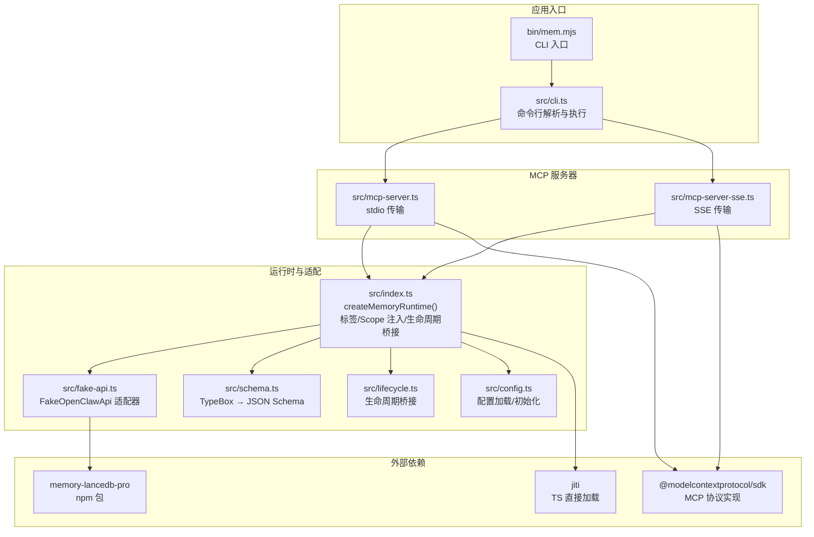
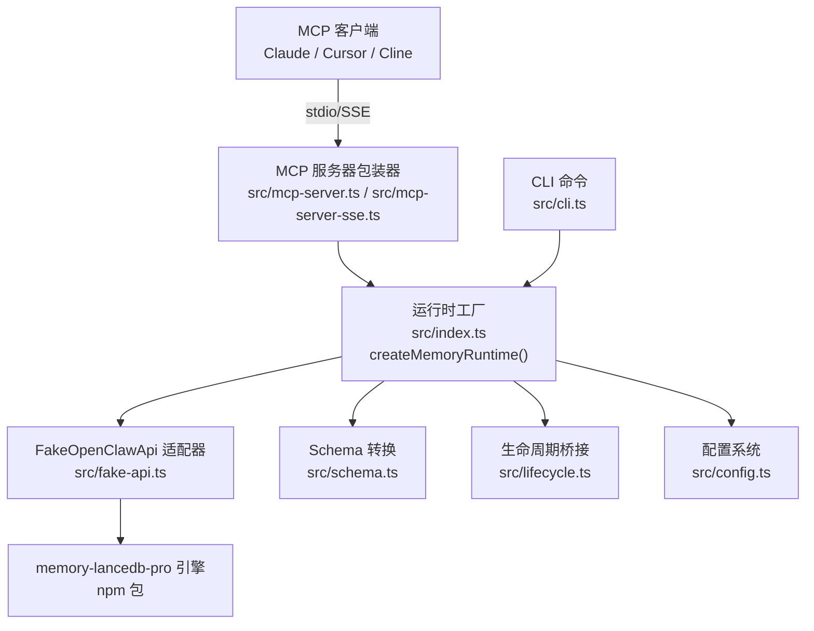
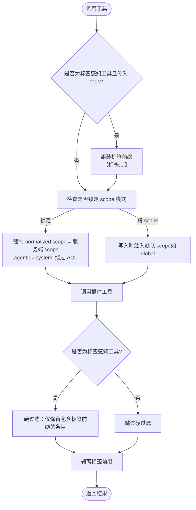
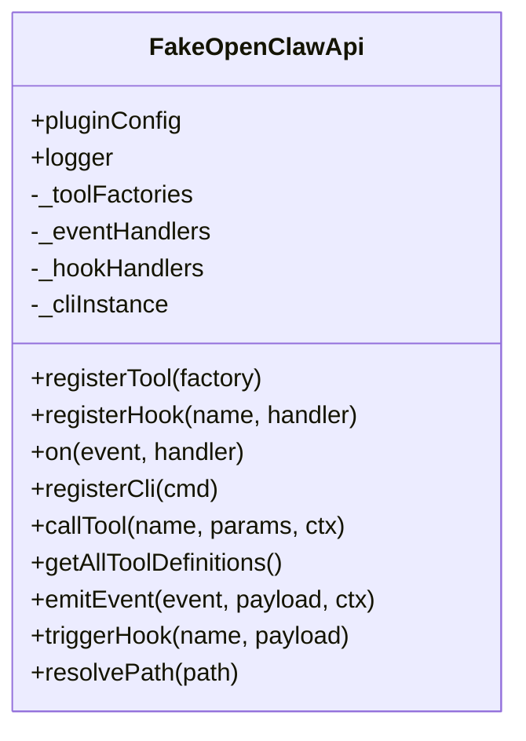
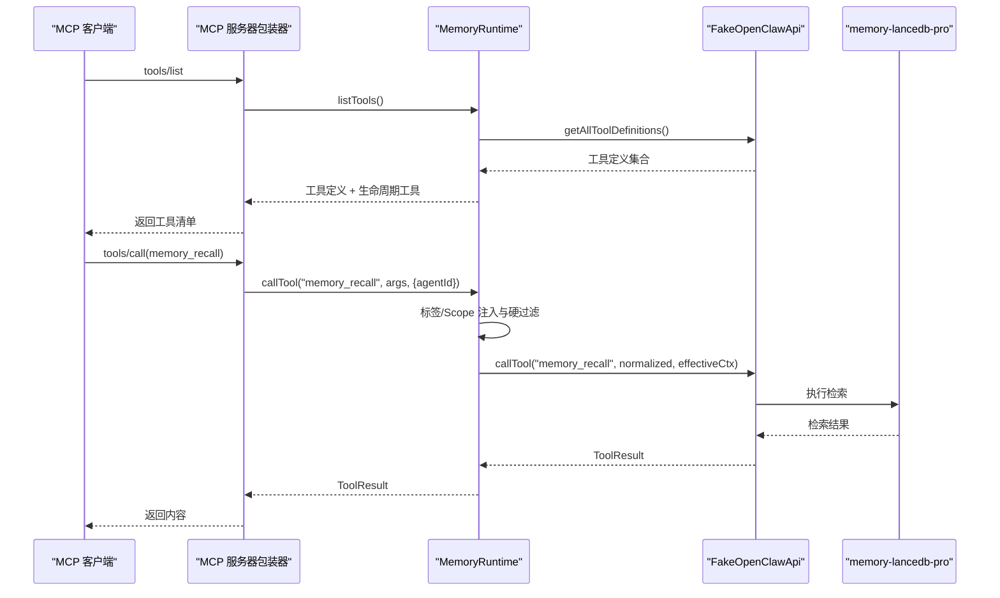
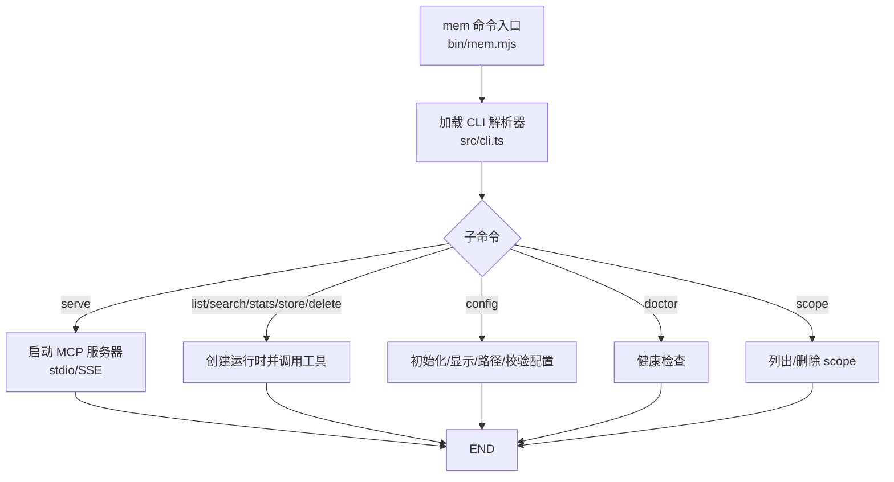
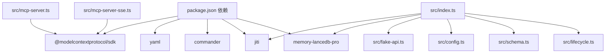

# 项目概述

<cite>
**本文引用的文件**
- [README.md](file://README.md)
- [package.json](file://package.json)
- [src/index.ts](file://src/index.ts)
- [src/mcp-server.ts](file://src/mcp-server.ts)
- [src/mcp-server-sse.ts](file://src/mcp-server-sse.ts)
- [src/fake-api.ts](file://src/fake-api.ts)
- [src/cli.ts](file://src/cli.ts)
- [src/config.ts](file://src/config.ts)
- [src/schema.ts](file://src/schema.ts)
- [src/lifecycle.ts](file://src/lifecycle.ts)
- [bin/mem.mjs](file://bin/mem.mjs)
- [docs/USAGE_GUIDE.md](file://docs/USAGE_GUIDE.md)
- [test/integration.test.mjs](file://test/integration.test.mjs)
</cite>

## 目录
1. [简介](#简介)
2. [项目结构](#项目结构)
3. [核心组件](#核心组件)
4. [架构总览](#架构总览)
5. [详细组件分析](#详细组件分析)
6. [依赖关系分析](#依赖关系分析)
7. [性能考量](#性能考量)
8. [故障排除指南](#故障排除指南)
9. [结论](#结论)
10. [附录](#附录)

## 简介
memory-lancedb-mcp 是为 AI 应用提供“持久化长期记忆”的 MCP Server。它通过桥接 memory-lancedb-pro 的核心能力，实现语义检索、多项目隔离、自动分类与衰减等企业级记忆管理功能，并以零侵入的方式将这些能力暴露为 MCP 工具，供 Claude、Cursor、Cline 等客户端直接使用。

- 价值主张：让 AI 助手“记住”用户偏好、项目架构、历史决策等关键信息，实现越用越懂你的个性化体验。
- 核心来源：基于 memory-lancedb-pro（由 CortexReach 开源），提供混合检索（向量 + BM25）、Weibull 衰减、智能提取等能力。
- 适用场景：AI 代码助手、写作助手、客服、研究助理、个人助理、游戏 NPC 等需要长期记忆的 AI 应用。

**章节来源**
- [README.md:1-738](file://README.md#L1-L738)

## 项目结构
该项目采用模块化的 TypeScript 结构，围绕“MCP 服务器包装器 + FakeOpenClawApi 适配器 + memory-lancedb-pro 引擎”的三层设计展开，CLI 与 MCP 服务器共享运行时逻辑。

**图表来源**
- [bin/mem.mjs:1-8](file://bin/mem.mjs#L1-L8)
- [src/cli.ts:1-617](file://src/cli.ts#L1-L617)
- [src/mcp-server.ts:1-306](file://src/mcp-server.ts#L1-L306)
- [src/mcp-server-sse.ts:1-405](file://src/mcp-server-sse.ts#L1-L405)
- [src/index.ts:1-515](file://src/index.ts#L1-L515)
- [src/fake-api.ts:1-318](file://src/fake-api.ts#L1-L318)
- [src/schema.ts:1-151](file://src/schema.ts#L1-L151)
- [src/lifecycle.ts:1-178](file://src/lifecycle.ts#L1-L178)
- [src/config.ts:1-312](file://src/config.ts#L1-L312)

**章节来源**
- [package.json:1-46](file://package.json#L1-L46)
- [README.md:22-46](file://README.md#L22-L46)

## 核心组件
- createMemoryRuntime：主工厂函数，负责加载配置、构建 FakeOpenClawApi、注册 memory-lancedb-pro 插件、注入标签与 Scope 处理逻辑、暴露工具调用与生命周期事件。
- FakeOpenClawApi：最小化适配器，捕获插件注册的工具、事件与钩子，统一对外提供 callTool、emitEvent、triggerHook 等能力。
- MCP Server（stdio/SSE）：将内存工具暴露为 MCP 工具，支持生命周期工具（自动召回/捕获/会话结束）。
- CLI（mem 命令）：提供 serve/list/search/stats/store/delete/scope/config/doctor 等子命令，支持跨 scope 模式与锁定 scope 模式。
- 配置系统：YAML 配置文件加载与环境变量扩展，映射为插件期望的配置格式。
- Schema 转换：将 TypeBox 参数 schema 转换为 MCP 所需的 JSON Schema。
- 生命周期桥接：将 OpenClaw 的 before_prompt_build、agent_end、session_end 等事件映射为可调用的 MCP 工具。

**章节来源**
- [src/index.ts:190-498](file://src/index.ts#L190-L498)
- [src/fake-api.ts:57-317](file://src/fake-api.ts#L57-L317)
- [src/mcp-server.ts:43-140](file://src/mcp-server.ts#L43-L140)
- [src/mcp-server-sse.ts:57-209](file://src/mcp-server-sse.ts#L57-L209)
- [src/cli.ts:105-617](file://src/cli.ts#L105-L617)
- [src/config.ts:167-223](file://src/config.ts#L167-L223)
- [src/schema.ts:45-150](file://src/schema.ts#L45-L150)
- [src/lifecycle.ts:52-177](file://src/lifecycle.ts#L52-L177)

## 架构总览
该项目通过“包装器 + 适配器 + 引擎”的方式，将 memory-lancedb-pro 的能力以 MCP 协议暴露给客户端。核心设计要点：
- 通过 jiti 直接从 npm 包加载 memory-lancedb-pro 的 TypeScript 源文件，无需本地构建父项目。
- FakeOpenClawApi 实现插件所需的最小接口，捕获工具、事件与钩子，供 MCP 层调用。
- 包装器在工具调用前后注入标签前缀、Scope 强制与 ACL 检查、生命周期事件桥接。
- 支持 stdio（本地 MCP 客户端）与 SSE（HTTP，远程/多客户端）两种传输模式。

**图表来源**
- [src/mcp-server.ts:8-14](file://src/mcp-server.ts#L8-L14)
- [src/mcp-server-sse.ts:11-23](file://src/mcp-server-sse.ts#L11-L23)
- [src/index.ts:159-184](file://src/index.ts#L159-L184)
- [src/fake-api.ts:13-15](file://src/fake-api.ts#L13-L15)
- [src/schema.ts:45-52](file://src/schema.ts#L45-L52)
- [src/lifecycle.ts:13-14](file://src/lifecycle.ts#L13-L14)
- [src/config.ts:220-223](file://src/config.ts#L220-L223)
- [src/cli.ts:18-27](file://src/cli.ts#L18-L27)

**章节来源**
- [README.md:22-46](file://README.md#L22-L46)

## 详细组件分析

### 运行时工厂与标签/Scope 注入
- 标签处理：对 memory_store/memory_recall/memory_list 的 tags 参数进行规范化与前缀嵌入/剥离，确保检索时的软过滤与展示时的干净文本。
- Scope 注入：支持跨 scope 模式与锁定 scope 模式，前者默认写入 global，后者强制所有请求落到指定 scope 并拒绝不一致的 scope。
- 生命周期桥接：在工具调用前注入 agentId 与 sessionKey，确保 ACL 与会话上下文一致。

**图表来源**
- [src/index.ts:313-453](file://src/index.ts#L313-L453)

**章节来源**
- [src/index.ts:190-498](file://src/index.ts#L190-L498)

### FakeOpenClawApi 适配器
- 职责：注册工具工厂、事件处理器、钩子、CLI 实例；提供 callTool/getToolDefinitions/emitEvent/triggerHook 等统一接口。
- 路径解析：支持 ~、绝对路径与相对路径解析，便于配置与数据目录管理。
- 与插件交互：通过 registerTool/registerHook/on 等接口捕获 memory-lancedb-pro 的工具与事件，供 MCP 层使用。

**图表来源**
- [src/fake-api.ts:57-317](file://src/fake-api.ts#L57-L317)

**章节来源**
- [src/fake-api.ts:57-317](file://src/fake-api.ts#L57-L317)

### MCP 服务器（stdio 与 SSE）
- stdio 模式：默认传输，适合本地 MCP 客户端（Claude Desktop、Cursor、Cline）。
- SSE 模式：HTTP 流式传输，支持远程访问与多客户端，提供 /sse 与 /message 端点。
- 生命周期工具：_lifecycle_auto_recall/_lifecycle_auto_capture/_lifecycle_session_end，用于自动召回与自动捕获。

**图表来源**
- [src/mcp-server.ts:61-124](file://src/mcp-server.ts#L61-L124)
- [src/mcp-server-sse.ts:247-287](file://src/mcp-server-sse.ts#L247-L287)
- [src/index.ts:313-453](file://src/index.ts#L313-L453)

**章节来源**
- [src/mcp-server.ts:43-140](file://src/mcp-server.ts#L43-L140)
- [src/mcp-server-sse.ts:57-209](file://src/mcp-server-sse.ts#L57-L209)

### CLI（mem 命令）
- 子命令：serve、list、search、stats、store、delete、config、doctor、scope。
- 传输模式：默认 stdio，支持 --sse 切换至 SSE。
- 跨 scope 模式：--scope 参数控制是否锁定到单一项目空间。
- 健康检查：doctor 命令验证配置、API Key、插件加载与工具清单。

**图表来源**
- [bin/mem.mjs:1-8](file://bin/mem.mjs#L1-L8)
- [src/cli.ts:105-617](file://src/cli.ts#L105-L617)

**章节来源**
- [src/cli.ts:105-617](file://src/cli.ts#L105-L617)

### 配置系统与 Schema 转换
- 配置加载：支持 MEM_CONFIG_PATH 环境变量、默认路径 ~/.config/memory-mcp/config.yaml、当前目录 config.yaml 与默认模板。
- 环境变量扩展：${VAR_NAME} 语法在 YAML 中自动替换为进程环境变量。
- Schema 转换：将 TypeBox schema 转换为 MCP 所需的 JSON Schema，保证 tools/list 返回的参数定义兼容。

**章节来源**
- [src/config.ts:107-223](file://src/config.ts#L107-L223)
- [src/schema.ts:45-150](file://src/schema.ts#L45-L150)

### 生命周期桥接
- before_prompt_build：自动召回，返回可前置到用户提示中的上下文。
- agent_end：自动捕获，从对话消息中提取记忆。
- session_end：会话结束清理。
- message_received：缓存原始消息，用于召回的门控逻辑。

**章节来源**
- [src/lifecycle.ts:52-177](file://src/lifecycle.ts#L52-L177)

## 依赖关系分析
- 依赖关系
  - @modelcontextprotocol/sdk：提供 MCP 协议的服务器与传输实现（stdio/SSE）。
  - memory-lancedb-pro：核心记忆引擎，通过 jiti 直接加载 npm 包源码。
  - yaml：YAML 配置解析与序列化。
  - commander：CLI 参数解析。
  - jiti：TypeScript 源码直载，无需本地构建父项目。
- 外部集成点
  - 嵌入 API：OpenAI、SiliconFlow、Ollama 等，通过配置文件指定。
  - 存储：LanceDB，支持多平台原生模块与跨平台兼容。

**图表来源**
- [package.json:26-31](file://package.json#L26-L31)
- [src/index.ts:12-12](file://src/index.ts#L12-L12)
- [src/mcp-server.ts:8-13](file://src/mcp-server.ts#L8-L13)
- [src/mcp-server-sse.ts:11-15](file://src/mcp-server-sse.ts#L11-L15)

**章节来源**
- [package.json:1-46](file://package.json#L1-L46)

## 性能考量
- 检索性能
  - 混合检索（向量 + BM25）与 RRF 融合，召回多条记忆，适合复杂语义匹配。
  - Weibull 衰减模型用于自然淡化旧记忆，保持记忆新鲜度。
- 写入与更新
  - 标签前缀嵌入不修改父项目 schema，避免额外字段开销。
  - 更新文本会触发重新嵌入，确保检索准确性。
- 传输与并发
  - stdio 模式适合本地客户端，SSE 模式支持远程与多客户端，注意跨 scope 模式下的 ACL 绕过与安全边界。
- 平台兼容
  - Linux 需要 AVX2 指令集；WSL 下需手动安装 Linux 原生模块；ARM64 需确保原生模块匹配。

[本节为通用指导，不直接分析具体文件]

## 故障排除指南
- 配置问题
  - 配置文件不存在或解析失败：使用 mem config init 创建默认配置，或设置 MEM_CONFIG_PATH。
  - API Key 缺失或环境变量未设置：doctor 命令可验证配置与 API Key。
- 插件加载失败
  - 确保已安装 memory-lancedb-pro@beta；通过 jiti 直接加载 npm 包源码。
- Scope 权限拒绝
  - 锁定 scope 模式下，请求的 scope 必须与服务端一致；跨 scope 模式下，写入未指定 scope 的 store 会自动注入 global。
- SSE 安全
  - 跨 scope 模式下，host 为 127.0.0.1 时存在风险，建议通过 --scope 限制或仅在受信网络使用。
- 平台问题
  - Linux 报 Illegal instruction：使用 AVX-only 构建或 ARM64 兼容版本；WSL 缺少原生模块时手动安装。

**章节来源**
- [src/cli.ts:449-517](file://src/cli.ts#L449-L517)
- [docs/USAGE_GUIDE.md:618-672](file://docs/USAGE_GUIDE.md#L618-L672)

## 结论
memory-lancedb-mcp 将 memory-lancedb-pro 的强大记忆能力以 MCP 协议无缝暴露，提供零侵入、可移植、可扩展的长期记忆服务。通过标签与 Scope 的灵活组合，以及自动召回/捕获的生命周期桥接，它能够满足从个人助理到企业级 AI 应用的多样化需求。结合 stdio 与 SSE 两种传输模式，开发者可以快速在本地或远程环境中部署与集成。

[本节为总结性内容，不直接分析具体文件]

## 附录
- 快速价值主张
  - 17 个记忆工具 + 智能生命周期桥接 + 多项目隔离 + 双传输模式（stdio/SSE）。
  - 语义检索 + 多标签分类 + Weibull 衰减 + 零配置 YAML。
- 使用案例
  - AI 代码助手：记住项目架构、编码偏好、常见 Bug 模式。
  - AI 写作助手：记住写作风格、人物设定、读者偏好。
  - AI 客服：记住用户画像、历史诉求、解决方案。
  - AI 研究助理：记住研究方向、文献摘要、关键结论。
  - AI 个人助理：记住日程偏好、饮食禁忌、旅行习惯。
  - AI 游戏 NPC：记住玩家行为、剧情走向、角色关系。

**章节来源**
- [README.md:11-69](file://README.md#L11-L69)
- [README.md:51-61](file://README.md#L51-L61)