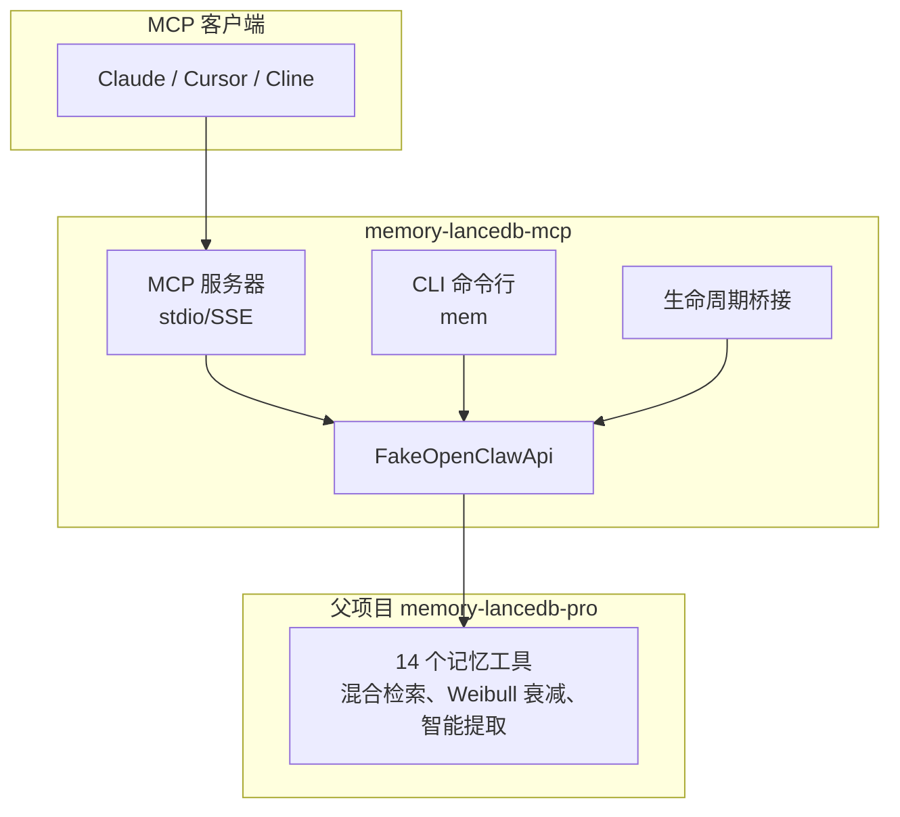
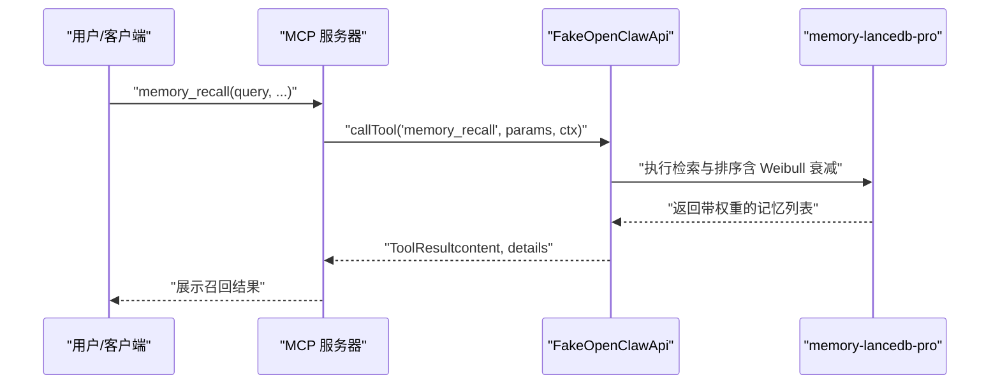
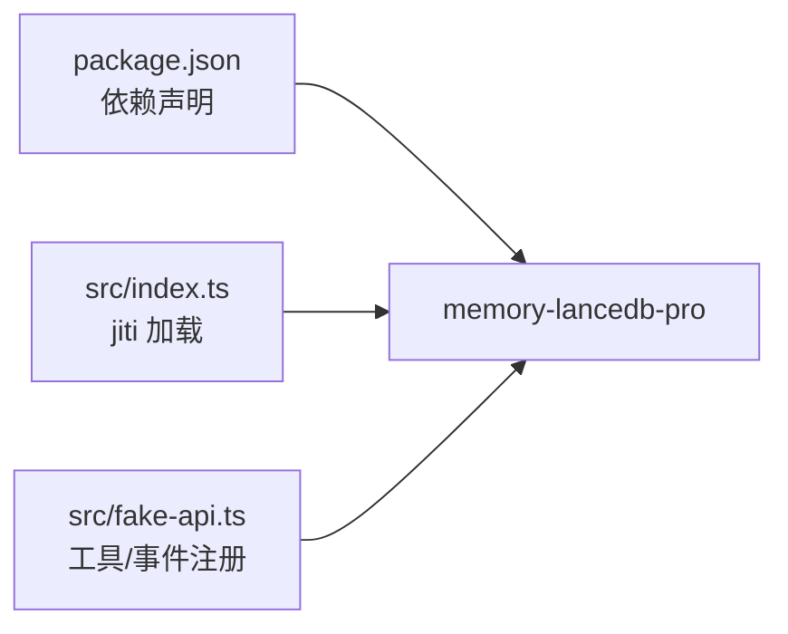

# Weibull 衰减模型

<cite>
**本文引用的文件**
- [README.md](file://README.md)
- [USAGE_GUIDE.md](file://docs/USAGE_GUIDE.md)
- [package.json](file://package.json)
- [src/index.ts](file://src/index.ts)
- [src/config.ts](file://src/config.ts)
- [src/fake-api.ts](file://src/fake-api.ts)
- [src/schema.ts](file://src/schema.ts)
</cite>

## 目录
1. [简介](#简介)
2. [项目结构](#项目结构)
3. [核心组件](#核心组件)
4. [架构总览](#架构总览)
5. [详细组件分析](#详细组件分析)
6. [依赖分析](#依赖分析)
7. [性能考虑](#性能考虑)
8. [故障排除指南](#故障排除指南)
9. [结论](#结论)
10. [附录](#附录)

## 简介
本文件围绕 Weibull 衰减模型在长期记忆系统中的应用展开，结合仓库中对“自动衰减”和“Weibull 衰减”的明确描述，系统阐述其数学原理、参数含义、调优方法、典型配置与可视化思路，并给出在不同业务场景下的落地建议。Weibull 分布以其灵活性和对“早期快速衰减、随后缓慢衰减”的自然拟合能力，成为记忆新鲜度控制的理想选择。

## 项目结构
该项目为 memory-lancedb-pro 的 MCP 适配层，负责：
- 将父项目的能力（含 Weibull 衰减）通过 MCP 协议暴露给外部客户端
- 提供 CLI 工具与生命周期钩子桥接
- 通过 FakeOpenClawApi 注册并转发工具、事件与钩子

**图表来源**
- [README.md:22-45](file://README.md#L22-L45)
- [src/index.ts:154-184](file://src/index.ts#L154-L184)
- [src/fake-api.ts:57-318](file://src/fake-api.ts#L57-L318)

**章节来源**
- [README.md:22-45](file://README.md#L22-L45)
- [src/index.ts:154-184](file://src/index.ts#L154-L184)
- [src/fake-api.ts:57-318](file://src/fake-api.ts#L57-L318)

## 核心组件
- Weibull 衰减模型：在混合检索与记忆管理中用于控制旧记忆的权重衰减，维持记忆的新鲜度与相关性。
- 配置体系：通过 YAML 配置文件映射到插件配置，支持检索权重、半衰期、强化因子等参数。
- 工具与生命周期：通过 FakeOpenClawApi 注册工具与钩子，实现自动召回、自动捕获、会话结束清理等。

**章节来源**
- [README.md:65](file://README.md#L65)
- [src/config.ts:23-98](file://src/config.ts#L23-L98)
- [src/index.ts:207-498](file://src/index.ts#L207-L498)

## 架构总览
Weibull 衰减在检索阶段参与权重计算，与向量相似度、BM25 文本匹配共同决定最终排序。系统通过配置项控制衰减强度与时间尺度，从而影响召回记忆的新鲜度分布。

**图表来源**
- [src/index.ts:248-387](file://src/index.ts#L248-L387)
- [src/fake-api.ts:217-235](file://src/fake-api.ts#L217-L235)

## 详细组件分析

### Weibull 衰减模型的数学原理与物理意义
- Weibull 分布的概率密度函数与累积分布函数具有两个关键参数：
  - 形状参数 k（shape）：控制曲线的斜率与“拐点”位置。k > 1 表现出“早期快速衰减、随后趋于平缓”的特征；k < 1 则呈现“前期缓慢、后期加速衰减”；k ≈ 1 时接近指数衰减。
  - 尺度参数 λ（scale）：决定半衰期的长短。半衰期 T½ 满足 F(T½) = 0.5，即 ln(2)/λ 与时间单位相关。
- 在记忆系统中，Weibull 衰减通常用于将“时间”映射为“权重”，使较新的记忆在排序中占优，同时避免过早将旧记忆清零，从而保持知识的连续性与稳定性。

### 时间相关性与衰减系数
- 时间相关性体现在“距离上次交互/创建的时间”与“当前时间”的差值 Δt 上。Δt 的单位需与配置中的时间尺度（如天）一致。
- 衰减系数通常表示为 f(Δt) = exp(-Δt/τ)，其中 τ 与半衰期相关。在 Weibull 模型中，τ 与尺度参数 λ 的关系为 τ = (ln(2)) / λ。因此，半衰期越大，衰减越慢，记忆留存越久。

### 参数调优方法
- 形状参数 k（shape）
  - 业务目标偏向“快速淘汰过时信息”：增大 k（如 k > 1.2），使前期衰减更快。
  - 业务目标偏向“长期稳定保留”：减小 k（如 k < 0.8），使前期衰减更温和。
- 时间尺度半衰期（timeDecayHalfLifeDays）
  - 需要短期记忆主导：缩短半衰期（如 1–7 天）。
  - 需要长期记忆主导：延长半衰期（如 30–180 天）。
- 强化因子（reinforcementFactor）
  - 当记忆被频繁访问或被标记为高价值时，可提高强化因子以抵消时间衰减，保持其在排序中的优势。

### 配置示例与调优策略
- 快速衰减（适合短期任务、临时偏好）
  - 形状参数 k：较大（如 1.5）
  - 半衰期：较短（如 3 天）
  - 强化因子：中等（如 1.2），用于保护高频访问的记忆
- 慢速衰减（适合长期知识库、稳定偏好）
  - 形状参数 k：较小（如 0.6）
  - 半衰期：较长（如 90 天）
  - 强化因子：较高（如 1.5），以对抗时间推移
- 自定义衰减曲线（根据业务需求微调）
  - 通过调整 k 与半衰期的比例，形成“前陡后缓”或“前缓后陡”的曲线形态，满足不同场景的“新鲜度-稳定性”平衡

注：以上为调优建议与参数物理意义的通用指导。具体数值需结合业务数据与 A/B 实验进行迭代。

### 衰减值计算与时间处理
- 计算流程
  1) 获取每条记忆的创建时间与最近交互时间，计算 Δt（单位与配置一致，如天）。
  2) 使用 Weibull 累积分布函数计算权重 w = F(Δt)。
  3) 将 w 与向量相似度、BM25 得分进行加权融合，得到最终排序分数。
- 时间处理要点
  - 统一时间单位：确保 Δt 与半衰期的单位一致（如均为天）。
  - 边界处理：对于新记忆（Δt 接近 0）应赋予较高权重；对于极旧记忆（Δt 远大于半衰期）权重趋近 0。
  - 稳健性：对 Δt 进行平滑处理（如加常数偏移）可避免极端值导致的剧烈波动。

### 可视化图表与应用场景
- 可视化建议
  - 衰减曲线图：以 Δt 为横轴，权重为纵轴，绘制不同 k 与半衰期下的 Weibull 曲线，直观比较“快速/慢速”模式差异。
  - 时间分布直方图：展示记忆的创建/交互时间分布，辅助确定半衰期的合理区间。
  - 召回命中率随半衰期变化的折线图：通过 A/B 实验评估不同半衰期对召回质量的影响。
- 应用场景
  - AI 代码助手：偏好短期快速更新，适合较短半衰期与中等强化因子。
  - AI 写作/创作：偏好长期风格与设定，适合较长半衰期与较高强化因子。
  - AI 客服：兼顾近期问题与历史知识，可采用中等半衰期并结合强化因子。

### 参数调优最佳实践
- 以业务指标为导向：召回准确率、相关性、用户满意度等。
- 分层调优：先固定 k，调整半衰期；再固定半衰期，微调 k；最后引入强化因子。
- A/B 实验：对比不同参数组合下的排序分布与用户反馈，持续迭代。
- 监控与回滚：建立监控指标，发现异常及时回滚。

**章节来源**
- [README.md:65](file://README.md#L65)
- [src/config.ts:73-78](file://src/config.ts#L73-L78)

## 依赖分析
- 项目依赖 memory-lancedb-pro（通过 jiti 直接加载其 TypeScript 源码），获得 Weibull 衰减、混合检索、智能提取等核心能力。
- 通过 FakeOpenClawApi 暴露工具、事件与钩子，实现与 MCP 协议的对接。

**图表来源**
- [package.json:30](file://package.json#L30)
- [src/index.ts:159-184](file://src/index.ts#L159-L184)
- [src/fake-api.ts:113-151](file://src/fake-api.ts#L113-L151)

**章节来源**
- [package.json:30](file://package.json#L30)
- [src/index.ts:159-184](file://src/index.ts#L159-L184)
- [src/fake-api.ts:113-151](file://src/fake-api.ts#L113-L151)

## 性能考虑
- Weibull 衰减的计算复杂度较低，主要为单次函数计算与向量/文本得分融合，对整体延迟影响有限。
- 参数调优应关注召回质量与响应时间的平衡：过长的半衰期可能导致检索池过大，增加排序成本；过短的半衰期可能降低召回多样性。
- 建议在生产环境中对半衰期与强化因子进行分层灰度，结合监控指标动态调整。

## 故障排除指南
- 配置文件缺失或解析失败：检查配置路径与 YAML 语法，确保 embedding.apiKey 等必需字段存在。
- Weibull 衰减未生效：确认配置中 timeDecayHalfLifeDays 等参数已正确设置，并与检索流程集成。
- MCP 工具不可用：通过 dry-run 验证工具注册情况，检查 FakeOpenClawApi 是否成功注册工具与事件。

**章节来源**
- [src/config.ts:167-214](file://src/config.ts#L167-L214)
- [src/index.ts:248-387](file://src/index.ts#L248-L387)
- [src/fake-api.ts:217-235](file://src/fake-api.ts#L217-L235)

## 结论
Weibull 衰减模型为长期记忆系统提供了灵活且可解释的时间衰减机制。通过形状参数与半衰期的协同调优，可在“新鲜度”与“稳定性”之间取得平衡。结合 A/B 实验与监控指标，可逐步逼近最优参数组合，满足不同业务场景的需求。

## 附录
- 相关配置字段（来源于配置类型定义）：
  - timeDecayHalfLifeDays：时间衰减半衰期（天）
  - reinforcementFactor：强化因子（用于抵消时间衰减）
  - 其他检索相关参数：vectorWeight、bm25Weight、minScore、hardMinScore 等

**章节来源**
- [src/config.ts:73-78](file://src/config.ts#L73-L78)