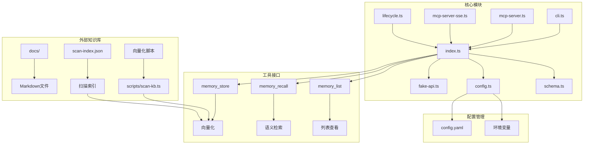
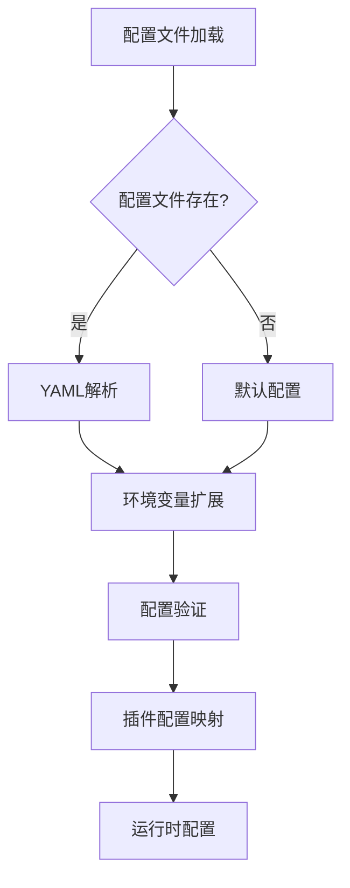
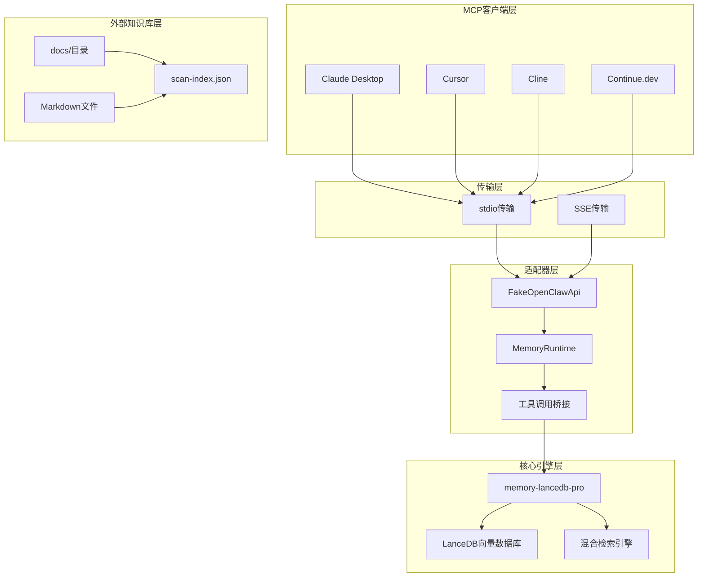
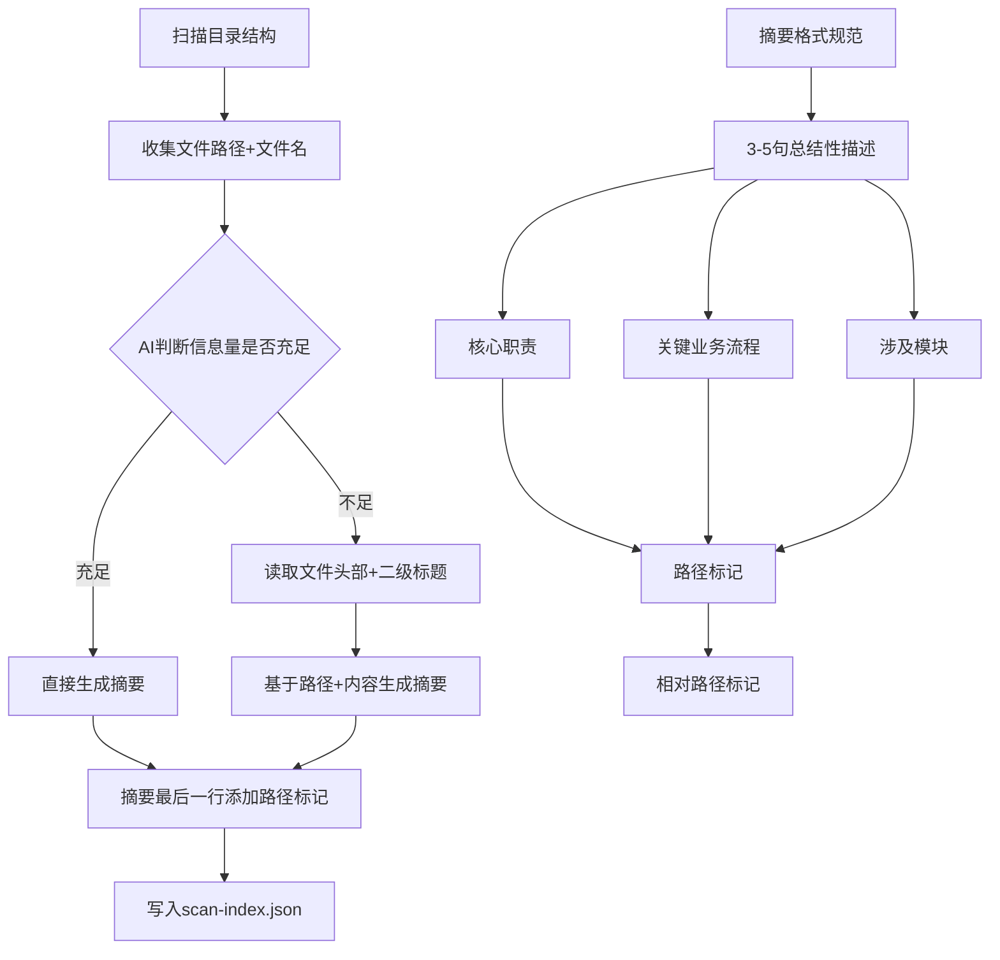
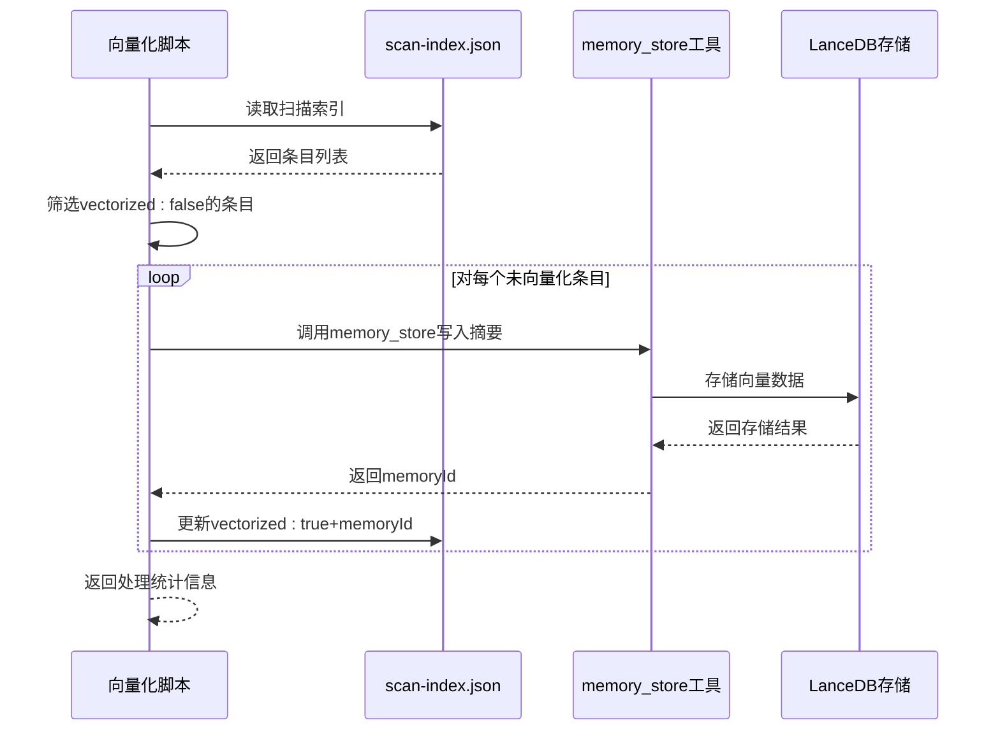
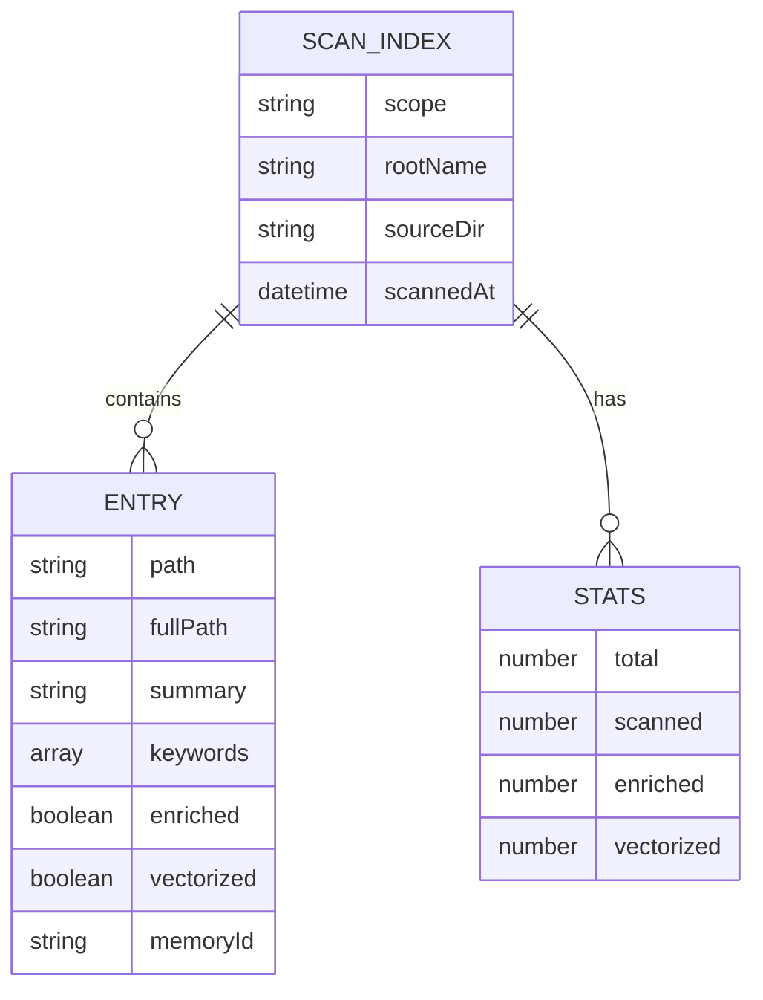
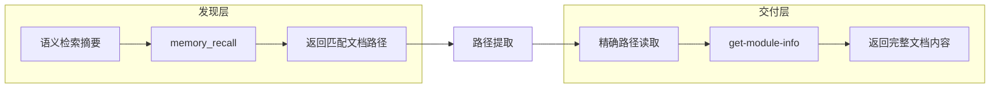
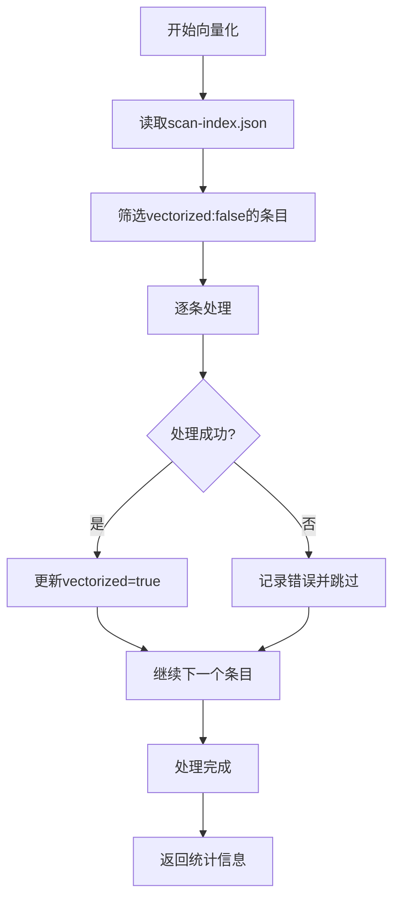
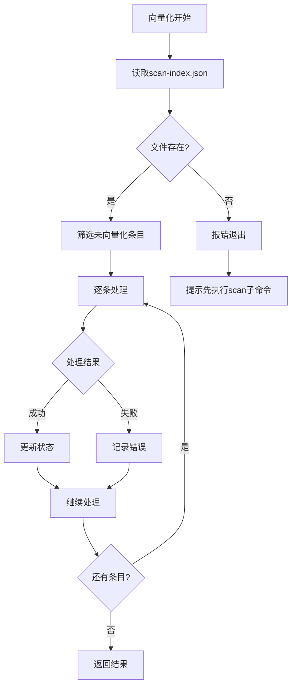
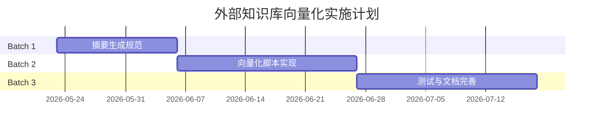

# 外部知识库向量化设计

<cite>
**本文档引用的文件**
- [README.md](file://README.md)
- [外部知识库向量化方案_设计文档.md](file://docs/外部知识库向量化方案_设计文档.md)
- [index.ts](file://src/index.ts)
- [config.ts](file://src/config.ts)
- [schema.ts](file://src/schema.ts)
- [cli.ts](file://src/cli.ts)
- [fake-api.ts](file://src/fake-api.ts)
- [mcp-server.ts](file://src/mcp-server.ts)
- [mcp-server-sse.ts](file://src/mcp-server-sse.ts)
- [lifecycle.ts](file://src/lifecycle.ts)
- [package.json](file://package.json)
- [mem.mjs](file://bin/mem.mjs)
</cite>

## 目录
1. [简介](#简介)
2. [项目结构概览](#项目结构概览)
3. [核心组件分析](#核心组件分析)
4. [架构设计](#架构设计)
5. [外部知识库向量化流程](#外部知识库向量化流程)
6. [数据模型设计](#数据模型设计)
7. [检索机制](#检索机制)
8. [性能优化策略](#性能优化策略)
9. [异常处理机制](#异常处理机制)
10. [实施计划](#实施计划)
11. [总结](#总结)

## 简介

本设计文档针对memory-lancedb-mcp项目中的外部知识库向量化方案进行全面分析。该项目是一个基于MCP（Model Context Protocol）的AI应用长期记忆管理系统，支持语义检索、多项目隔离、自动分类与衰减等功能。

外部知识库向量化设计旨在解决项目已有文件系统形式知识库（如docs/目录下的Markdown文件集合）的导入和检索问题。该方案采用"摘要做发现、原文做交付"的双层架构，通过摘要向量化实现语义检索，通过路径精确读取实现原文交付。

## 项目结构概览

项目采用模块化架构设计，主要包含以下核心模块：



**图表来源**
- [index.ts:1-515](file://src/index.ts#L1-L515)
- [cli.ts:1-658](file://src/cli.ts#L1-L658)
- [config.ts:1-356](file://src/config.ts#L1-L356)

**章节来源**
- [README.md:1-831](file://README.md#L1-L831)
- [package.json:1-54](file://package.json#L1-L54)

## 核心组件分析

### FakeOpenClawApi适配器

FakeOpenClawApi是项目的核心适配器，负责模拟OpenClaw Plugin SDK运行时环境。它实现了memory-lancedb-pro插件所需的最小接口，包括工具工厂注册、事件处理器注册和CLI命令行实例注册。

```mermaid
classDiagram
class FakeOpenClawApi {
+pluginConfig : Record~string, unknown~
+logger : Logger
-_toolFactories : Map~string, ToolFactory~
-_eventHandlers : Map~string, EventHandler[]~
-_hookHandlers : Map~string, EventHandler[]~
-_cliInstance : unknown
+registerTool(factory : Function)
+on(event : string, handler : Function, opts? : Record~string, unknown~)
+registerHook(name : string, handler : Function, opts? : Record~string, unknown~)
+registerCli(cmd : unknown)
+callTool(name : string, params : Record~string, unknown~, ctx : ToolCallContext)
+emitEvent(event : string, payload : unknown, ctx : unknown)
+triggerHook(name : string, payload : unknown)
}
class ToolDefinition {
+name : string
+label? : string
+description : string
+parameters : unknown
+execute : Function
}
class ToolResult {
+content : { type : string; text : string }[]
+details? : Record~string, unknown~
}
FakeOpenClawApi --> ToolDefinition : "注册工具"
FakeOpenClawApi --> ToolResult : "执行工具"
```

**图表来源**
- [fake-api.ts:57-318](file://src/fake-api.ts#L57-L318)

### 配置管理系统

配置系统采用YAML格式，支持环境变量扩展和多种配置源的合并。主要配置项包括嵌入模型设置、检索参数、重排模型配置等。



**图表来源**
- [config.ts:173-220](file://src/config.ts#L173-L220)

**章节来源**
- [fake-api.ts:1-318](file://src/fake-api.ts#L1-L318)
- [config.ts:1-356](file://src/config.ts#L1-L356)

## 架构设计

### 整体架构图



**图表来源**
- [README.md:22-45](file://README.md#L22-L45)
- [mcp-server.ts:43-140](file://src/mcp-server.ts#L43-L140)

### 传输模式设计

项目支持两种传输模式以适应不同的部署场景：

1. **stdio模式**：默认模式，适用于本地MCP客户端（Claude Desktop、Cursor、Cline等）
2. **SSE模式**：HTTP流式传输，支持远程连接和多客户端访问

**章节来源**
- [README.md:16-18](file://README.md#L16-L18)
- [mcp-server.ts:35-140](file://src/mcp-server.ts#L35-L140)
- [mcp-server-sse.ts:46-209](file://src/mcp-server-sse.ts#L46-L209)

## 外部知识库向量化流程

### 摘要生成规范

外部知识库向量化采用严格的摘要生成规范，确保每个文档都有高质量的结构化摘要：



**图表来源**
- [外部知识库向量化方案_设计文档.md:50-60](file://docs/外部知识库向量化方案_设计文档.md#L50-L60)

### 向量化实现流程

向量化过程通过专门的脚本实现，支持增量处理和错误恢复：



**图表来源**
- [外部知识库向量化方案_设计文档.md:92-98](file://docs/外部知识库向量化方案_设计文档.md#L92-L98)

**章节来源**
- [外部知识库向量化方案_设计文档.md:1-269](file://docs/外部知识库向量化方案_设计文档.md#L1-L269)

## 数据模型设计

### 扫描索引文件结构

扫描索引文件（scan-index.json）是向量化过程的核心数据载体，包含完整的文档元数据和处理状态：



**图表来源**
- [外部知识库向量化方案_设计文档.md:149-186](file://docs/外部知识库向量化方案_设计文档.md#L149-L186)

### 向量化内容格式

向量化过程中写入记忆系统的具体内容格式严格规范：

```
[摘要] {summary文本}
[路径] {relativePath}
[关键词] {keywords逗号分隔}
```

这种格式确保了：
- 摘要内容的完整性
- 路径信息的可追溯性
- 关键词的检索优化

**章节来源**
- [外部知识库向量化方案_设计文档.md:147-196](file://docs/外部知识库向量化方案_设计文档.md#L147-L196)

## 检索机制

### 双层检索架构

外部知识库采用"发现层+交付层"的双层架构：



**图表来源**
- [外部知识库向量化方案_设计文档.md:208-221](file://docs/外部知识库向量化方案_设计文档.md#L208-L221)

### 检索参数配置

检索系统支持灵活的参数配置，包括混合检索模式、权重分配、重排策略等：

| 参数 | 默认值 | 说明 |
|------|--------|------|
| retrieval.mode | hybrid | 检索模式：hybrid（向量+BM25）或 vector（纯向量） |
| retrieval.vectorWeight | 0.7 | 向量检索权重 |
| retrieval.bm25Weight | 0.3 | BM25检索权重 |
| retrieval.minScore | 0.3 | 最低分数阈值 |
| retrieval.hardMinScore | 0.35 | 重排后硬性最低分数 |
| retrieval.rerank | cross-encoder | 重排模式 |

**章节来源**
- [README.md:777-794](file://README.md#L777-L794)

## 性能优化策略

### 增量向量化

系统支持增量向量化处理，避免重复处理已向量化的文档：



**图表来源**
- [外部知识库向量化方案_设计文档.md:92-98](file://docs/external-knowledge-base-vectorization-design.md#L92-L98)

### 批量处理优化

系统支持批量向量化操作，减少网络请求开销：

- **批量大小**：支持一次性处理多个文档
- **并发控制**：合理控制并发数量避免资源争用
- **错误隔离**：单个文档失败不影响整体处理进度

**章节来源**
- [外部知识库向量化方案_设计文档.md:245-250](file://docs/外部知识库向量化方案_设计文档.md#L245-L250)

## 异常处理机制

### 错误处理策略

系统建立了完善的异常处理机制，确保向量化过程的稳定性和可靠性：



**图表来源**
- [外部知识库向量化方案_设计文档.md:139-143](file://docs/外部知识库向量化方案_设计文档.md#L139-L143)

### 异常类型分类

| 场景 | 行为 | 是否对外暴露 |
|------|------|-------------|
| scan-index.json不存在 | 报错退出，提示"请先执行scan子命令" | 是 |
| 记忆系统不可用 | 报错退出，不修改scan-index.json状态 | 是 |
| 单条向量化失败 | 记入errors，继续处理其余，该条vectorized保持false | 是 |
| 摘要格式错误（无路径标记） | 跳过该条，记入errors | 是 |
| 路径标记格式错误 | 跳过该条，记入errors | 是 |
| 路径对应的文件不存在 | 跳过该条，记入errors | 是 |

**章节来源**
- [外部知识库向量化方案_设计文档.md:232-242](file://docs/外部知识库向量化方案_设计文档.md#L232-L242)

## 实施计划

### 分阶段实施策略

项目采用分批次实施策略，确保每个阶段的质量和可维护性：



### 关键里程碑

| 批次 | 主题 | 主要产出 | 依赖 |
|------|------|---------|------|
| Batch 1 | 摘要生成规范 | 摘要生成规则、路径标记格式、质量标准 | 无 |
| Batch 2 | 向量化脚本 | `scripts/scan-kb.ts vectorize`子命令实现 | Batch 1 |
| Batch 3 | 测试与文档 | 单元测试、集成测试、使用文档 | Batch 1, 2 |

**章节来源**
- [外部知识库向量化方案_设计文档.md:263-269](file://docs/外部知识库向量化方案_设计文档.md#L263-L269)

## 总结

外部知识库向量化设计通过"摘要做发现、原文做交付"的双层架构，有效解决了传统知识库检索的局限性。该设计具有以下优势：

1. **高效检索**：通过摘要向量化实现语义检索，提高检索精度和效率
2. **精确交付**：通过路径精确读取确保原文内容的完整性和准确性
3. **增量处理**：支持增量向量化，避免重复处理，提高系统性能
4. **错误恢复**：完善的异常处理机制，确保系统稳定运行
5. **灵活配置**：支持多种检索模式和参数配置，适应不同应用场景

该设计方案为AI应用提供了强大的知识管理能力，能够帮助AI助手更好地理解和利用项目知识库，实现越用越懂的个性化体验。