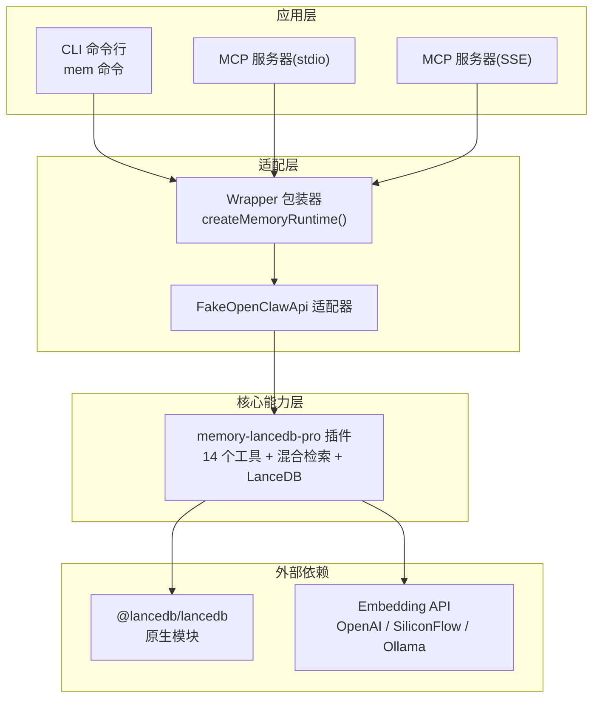
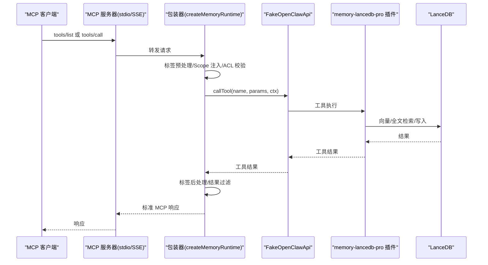
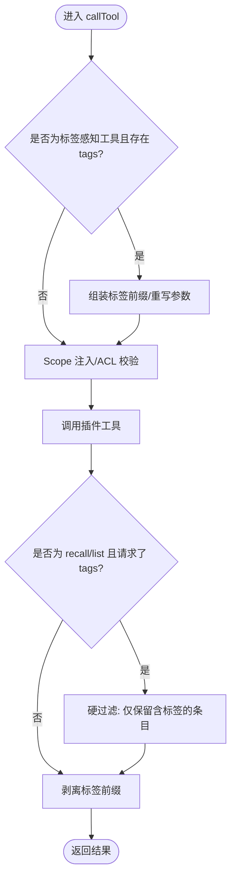
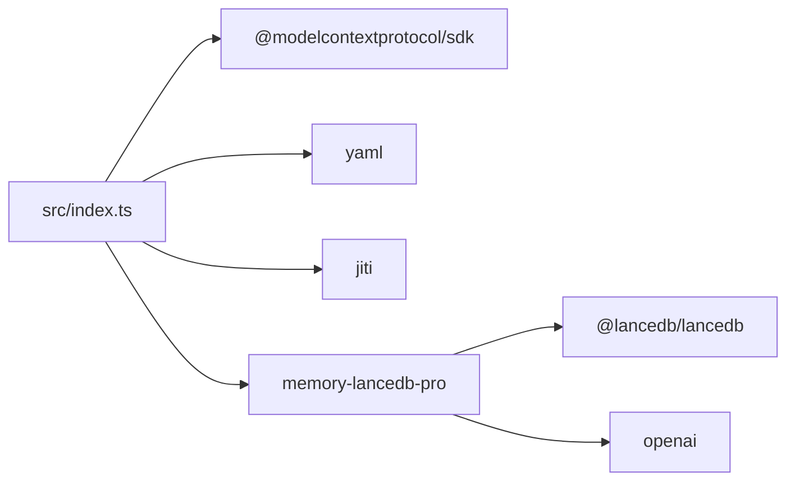

# 性能优化指南

<cite>
**本文档引用的文件**
- [README.md](file://README.md)
- [package.json](file://package.json)
- [src/index.ts](file://src/index.ts)
- [src/config.ts](file://src/config.ts)
- [src/cli.ts](file://src/cli.ts)
- [src/fake-api.ts](file://src/fake-api.ts)
- [src/mcp-server.ts](file://src/mcp-server.ts)
- [src/mcp-server-sse.ts](file://src/mcp-server-sse.ts)
- [src/lifecycle.ts](file://src/lifecycle.ts)
- [src/schema.ts](file://src/schema.ts)
- [bin/mem.mjs](file://bin/mem.mjs)
- [docs/USAGE_GUIDE.md](file://docs/USAGE_GUIDE.md)
- [test/integration.test.mjs](file://test/integration.test.mjs)
</cite>

## 目录
1. [简介](#简介)
2. [项目结构](#项目结构)
3. [核心组件](#核心组件)
4. [架构总览](#架构总览)
5. [详细组件分析](#详细组件分析)
6. [依赖关系分析](#依赖关系分析)
7. [性能考量](#性能考量)
8. [故障排除指南](#故障排除指南)
9. [结论](#结论)
10. [附录](#附录)

## 简介
本指南面向需要在生产环境中稳定运行 memory-lancedb-mcp 的工程团队，聚焦于性能优化与系统稳定性。内容涵盖：
- 内存使用优化策略（缓存配置、批量处理、资源释放）
- 向量数据库（LanceDB）性能调优（索引、查询、存储）
- 系统资源监控与性能指标分析
- 高并发场景配置与扩展策略
- 性能瓶颈识别与解决方案（网络延迟、磁盘 I/O、CPU）
- 不同硬件配置下的优化建议与日志级别调优

## 项目结构
该项目采用“包装器 + 父项目插件”的架构，通过 jiti 直接加载 memory-lancedb-pro 的 TypeScript 源码，零侵入地桥接 MCP 协议与生命周期事件。

图表来源
- [src/index.ts:159-184](file://src/index.ts#L159-L184)
- [src/mcp-server.ts:43-58](file://src/mcp-server.ts#L43-L58)
- [src/mcp-server-sse.ts:57-62](file://src/mcp-server-sse.ts#L57-L62)
- [package.json:26-31](file://package.json#L26-L31)

章节来源
- [README.md:22-45](file://README.md#L22-L45)
- [src/index.ts:159-184](file://src/index.ts#L159-L184)
- [src/mcp-server.ts:43-58](file://src/mcp-server.ts#L43-L58)
- [src/mcp-server-sse.ts:57-62](file://src/mcp-server-sse.ts#L57-L62)
- [package.json:26-31](file://package.json#L26-L31)

## 核心组件
- 包装器工厂：负责加载配置、构建 FakeOpenClawApi、注册插件、注入标签与 Scope 隔离逻辑，并提供工具调用、事件与钩子桥接。
- FakeOpenClawApi：最小化适配器，捕获插件注册的工具、事件与钩子，供 MCP 层使用。
- MCP 服务器：分别支持 stdio 与 SSE 两种传输，统一将工具调用转发给包装器。
- CLI：提供 mem 命令族，支持服务启动、检索、列表、统计、配置管理与健康检查。
- 配置系统：YAML 配置解析、环境变量展开、默认路径与模板初始化。

章节来源
- [src/index.ts:207-498](file://src/index.ts#L207-L498)
- [src/fake-api.ts:57-317](file://src/fake-api.ts#L57-L317)
- [src/mcp-server.ts:43-140](file://src/mcp-server.ts#L43-L140)
- [src/mcp-server-sse.ts:57-209](file://src/mcp-server-sse.ts#L57-L209)
- [src/cli.ts:105-616](file://src/cli.ts#L105-L616)
- [src/config.ts:167-214](file://src/config.ts#L167-L214)

## 架构总览
下图展示了从 MCP 客户端到 LanceDB 的完整调用链路，以及关键的性能控制点（日志抑制、Scope 隔离、标签预处理/后处理）。

图表来源
- [src/mcp-server.ts:86-124](file://src/mcp-server.ts#L86-L124)
- [src/mcp-server-sse.ts:262-287](file://src/mcp-server-sse.ts#L262-L287)
- [src/index.ts:313-453](file://src/index.ts#L313-L453)
- [src/fake-api.ts:217-235](file://src/fake-api.ts#L217-L235)

## 详细组件分析

### 包装器与标签/Scope 处理管线
- 标签预处理：在 memory_store/memory_recall/memory_list 上注入/剥离标签前缀，确保 BM25 命中与展示一致性。
- Scope 注入：根据服务端 --scope 参数强制所有操作落在指定 Scope，或在跨 Scope 模式下自动注入默认 Scope。
- 结果后处理：对 recall/list 结果进行硬过滤（仅保留包含请求标签的条目），并在展示前剥离标签前缀。

图表来源
- [src/index.ts:313-453](file://src/index.ts#L313-L453)

章节来源
- [src/index.ts:313-453](file://src/index.ts#L313-L453)

### 配置系统与环境变量
- 配置文件解析：支持 YAML 文件、环境变量扩展、默认路径与模板初始化。
- 关键性能相关配置：
  - retrieval.mode/vectorWeight/bm25Weight/minScore/hardMinScore：混合检索权重与阈值。
  - embedding.dimensions/requestDimensions/omitDimensions：嵌入维度与兼容性。
  - autoCapture/autoRecall/smartExtraction：自动捕获/召回与智能提取开关。
  - dbPath：LanceDB 存储路径，影响磁盘 I/O 与冷启动时间。

章节来源
- [src/config.ts:167-214](file://src/config.ts#L167-L214)
- [src/config.ts:220-223](file://src/config.ts#L220-L223)
- [src/config.ts:229-290](file://src/config.ts#L229-L290)

### MCP 服务器（stdio/SSE）
- stdio 模式：适合本地客户端（Claude Desktop/Cursor/Cline），默认抑制调试日志以避免污染标准输入输出。
- SSE 模式：提供 /sse 与 /message 接口，便于远程访问与多客户端场景，需注意安全加固（认证/鉴权）。

章节来源
- [src/mcp-server.ts:43-140](file://src/mcp-server.ts#L43-L140)
- [src/mcp-server-sse.ts:57-209](file://src/mcp-server-sse.ts#L57-L209)

### CLI 命令与健康检查
- serve：启动服务（stdio/SSE），支持 dry-run 验证配置与工具清单。
- list/search/stats/store/delete：提供检索、统计、存储、删除等常用操作。
- doctor：健康检查，验证配置、API Key、插件加载与工具清单。

章节来源
- [src/cli.ts:114-169](file://src/cli.ts#L114-L169)
- [src/cli.ts:175-364](file://src/cli.ts#L175-L364)
- [src/cli.ts:449-517](file://src/cli.ts#L449-L517)

### 生命周期桥接
- before_prompt_build/agent_end/message_received/session_end：将平台生命周期事件映射为可调用工具，支持自动召回与自动捕获。

章节来源
- [src/lifecycle.ts:52-153](file://src/lifecycle.ts#L52-L153)
- [src/mcp-server.ts:235-305](file://src/mcp-server.ts#L235-L305)
- [src/mcp-server-sse.ts:378-404](file://src/mcp-server-sse.ts#L378-L404)

## 依赖关系分析
- 依赖关系概览：
  - @modelcontextprotocol/sdk：MCP 协议实现（stdio/SSE 传输）。
  - memory-lancedb-pro：核心记忆引擎，包含 14 个工具、混合检索、LanceDB 集成。
  - yaml：配置解析。
  - jiti：TS 源码直载，无需本地构建。
  - LanceDB 原生模块：按平台自动安装，影响性能与兼容性。

图表来源
- [package.json:26-31](file://package.json#L26-L31)
- [src/index.ts:159-184](file://src/index.ts#L159-L184)

章节来源
- [package.json:26-31](file://package.json#L26-L31)
- [src/index.ts:159-184](file://src/index.ts#L159-L184)

## 性能考量

### 内存使用优化策略
- 日志级别控制
  - stdio 模式默认抑制调试日志，避免污染标准输入输出并减少 I/O。
  - SSE 模式默认开启调试日志，建议在生产环境结合反向代理与日志聚合。
  - CLI doctor 与 mem 命令均支持 --quiet 控制输出。
- 标签处理的内存占用
  - 标签前缀嵌入 text 字段，查询时通过 BM25 命中，展示时剥离，避免额外元数据字段。
  - recall/list 结果硬过滤与文本重建会增加内存分配，建议合理设置 limit 与 tags。
- Scope 隔离与 ACL
  - 锁定 Scope 模式下强制 agentId="system" 绕过 ACL，减少不必要的权限检查开销。
  - 跨 Scope 模式下自动注入默认 Scope，避免写入私有命名空间。

章节来源
- [src/mcp-server.ts:49-51](file://src/mcp-server.ts#L49-L51)
- [src/mcp-server-sse.ts:65-67](file://src/mcp-server-sse.ts#L65-L67)
- [src/index.ts:313-453](file://src/index.ts#L313-L453)

### 向量数据库（LanceDB）性能调优
- 索引优化
  - 使用混合检索（向量 + BM25）时，合理设置 retrieval.vectorWeight 与 retrieval.bm25Weight，平衡语义与关键词命中。
  - 通过 retrieval.minScore/retrieval.hardMinScore 控制召回质量与数量。
- 查询优化
  - query 构造遵循“实体名 + 技术术语”模式，提高召回准确性与稳定性。
  - 使用 tags 参数进行软过滤（BM25 加权），必要时配合 category 进行硬过滤。
- 存储配置
  - dbPath 指向高性能磁盘（SSD），避免机械盘导致的随机 I/O 延迟。
  - 合理设置 embedding.dimensions/requestDimensions，避免不必要的维度转换与内存拷贝。

章节来源
- [src/config.ts:268-280](file://src/config.ts#L268-L280)
- [docs/USAGE_GUIDE.md:318-390](file://docs/USAGE_GUIDE.md#L318-L390)
- [src/config.ts:232-241](file://src/config.ts#L232-L241)

### 系统资源监控与性能指标
- 健康检查
  - mem doctor：验证配置、API Key、插件加载与工具清单，快速定位启动失败原因。
  - /health（SSE）：返回服务状态、工具数量等基础指标。
- 日志与可观测性
  - stdio 模式默认抑制 debug 日志，建议通过反向代理或 systemd 将 stdout/stderr 分离收集。
  - SSE 模式可在反向代理层添加访问日志与速率限制。

章节来源
- [src/cli.ts:449-517](file://src/cli.ts#L449-L517)
- [src/mcp-server-sse.ts:96-105](file://src/mcp-server-sse.ts#L96-L105)

### 高并发场景配置与扩展策略
- 传输模式
  - stdio：单进程、低延迟，适合本地客户端。
  - SSE：多客户端、远程访问，需配合反向代理（Nginx/Traefik）与认证。
- 并发与会话
  - lifecycle 模块使用 sessionKey 标识会话，建议使用唯一标识符避免冲突。
- 资源隔离
  - 使用 --scope 为不同项目/租户提供完全隔离的记忆空间，降低跨项目干扰。

章节来源
- [src/mcp-server.ts:84-84](file://src/mcp-server.ts#L84-L84)
- [src/mcp-server-sse.ts:75-75](file://src/mcp-server-sse.ts#L75-L75)
- [src/lifecycle.ts:60-60](file://src/lifecycle.ts#L60-L60)
- [README.md:426-498](file://README.md#L426-L498)

### 性能瓶颈识别与解决方案
- 网络延迟
  - SSE 模式需考虑客户端与服务端之间的网络 RTT，建议将服务部署在靠近客户端的内网或边缘节点。
  - 使用反向代理启用 HTTP/2/3 与连接复用，减少握手开销。
- 磁盘 I/O
  - 将 dbPath 放置在 SSD 上；定期执行 compact 与去重（memory_compaction）降低写放大。
  - 控制写入频率与批量大小，避免频繁小事务。
- CPU 使用率
  - 合理设置 retrieval.vectorWeight/bm25Weight 与 limit，减少不必要的向量计算与排序。
  - 通过 smartExtraction 与 autoCapture 控制后台处理负载，避免高峰时段集中触发。

章节来源
- [src/config.ts:268-280](file://src/config.ts#L268-L280)
- [src/config.ts:250-265](file://src/config.ts#L250-L265)
- [docs/USAGE_GUIDE.md:318-390](file://docs/USAGE_GUIDE.md#L318-L390)

### 不同硬件配置下的优化建议
- 低配服务器（单核/低内存）
  - 关闭 smartExtraction/autoCapture，降低后台处理压力。
  - 降低 retrieval.limit 与 retrieval.candidatePoolSize，减少向量计算。
  - 使用 SSE + 反向代理，将 stdio 客户端迁移至本地以减少网络抖动。
- 中配服务器（多核/中等内存）
  - 开启 smartExtraction，适度开启 autoCapture。
  - 调整 retrieval.vectorWeight/bm25Weight，平衡召回质量与速度。
- 高配服务器（高并发/大内存）
  - 启用 SSE 并配置多实例 + 负载均衡，结合限流与鉴权。
  - 使用 SSD + RAID10 提升吞吐，定期维护 LanceDB 表与索引。

章节来源
- [src/config.ts:250-280](file://src/config.ts#L250-L280)
- [src/mcp-server-sse.ts:57-62](file://src/mcp-server-sse.ts#L57-L62)

### 日志级别对性能的影响与调优
- 日志级别
  - --quiet 抑制调试日志，stdiosse 模式默认抑制 debug，减少 I/O 与 CPU 占用。
  - 生产环境建议关闭 debug，仅保留 info/warn/error。
- 日志输出
  - stdio 模式避免污染标准输入输出，SSE 模式建议通过反向代理与日志系统分离收集。

章节来源
- [src/mcp-server.ts:49-51](file://src/mcp-server.ts#L49-L51)
- [src/mcp-server-sse.ts:65-67](file://src/mcp-server-sse.ts#L65-L67)
- [src/fake-api.ts:83-89](file://src/fake-api.ts#L83-L89)

## 故障排除指南
- 服务启动失败
  - 使用 mem doctor 验证配置、API Key 与插件加载。
  - 检查 dbPath 权限与磁盘空间。
- 嵌入模型错误
  - 确认 embedding.model/baseURL 与 API Key 配置正确。
- 召回结果不准确
  - 检查 query 构造是否遵循“实体名 + 技术术语”，适当增加 tags 与 category 过滤。
- Scope 权限拒绝
  - 锁定 Scope 模式下，请求的 scope 必须与服务端 --scope 一致；跨 Scope 模式下 memory_store 不指定 scope 会自动写入 global。

章节来源
- [src/cli.ts:449-517](file://src/cli.ts#L449-L517)
- [docs/USAGE_GUIDE.md:618-667](file://docs/USAGE_GUIDE.md#L618-L667)
- [src/index.ts:357-366](file://src/index.ts#L357-L366)

## 结论
通过合理的配置与运行模式选择，memory-lancedb-mcp 可在不同硬件与并发环境下实现稳定的性能表现。建议优先优化检索参数、存储路径与日志级别，结合生命周期工具与 Scope 隔离实现可控的资源占用与高可用性。

## 附录
- CLI 命令速查
  - mem serve：启动服务（stdio/SSE），支持 --scope、--dry-run、--quiet。
  - mem search/list/stats/store/delete：检索、列表、统计、存储、删除。
  - mem doctor：健康检查。
- 配置要点
  - dbPath：指向高性能存储。
  - retrieval：平衡向量与 BM25 权重与阈值。
  - embedding：正确配置模型与维度。
  - autoCapture/autoRecall/smartExtraction：按需开启。

章节来源
- [src/cli.ts:114-169](file://src/cli.ts#L114-L169)
- [src/cli.ts:175-364](file://src/cli.ts#L175-L364)
- [src/cli.ts:449-517](file://src/cli.ts#L449-L517)
- [src/config.ts:229-290](file://src/config.ts#L229-L290)