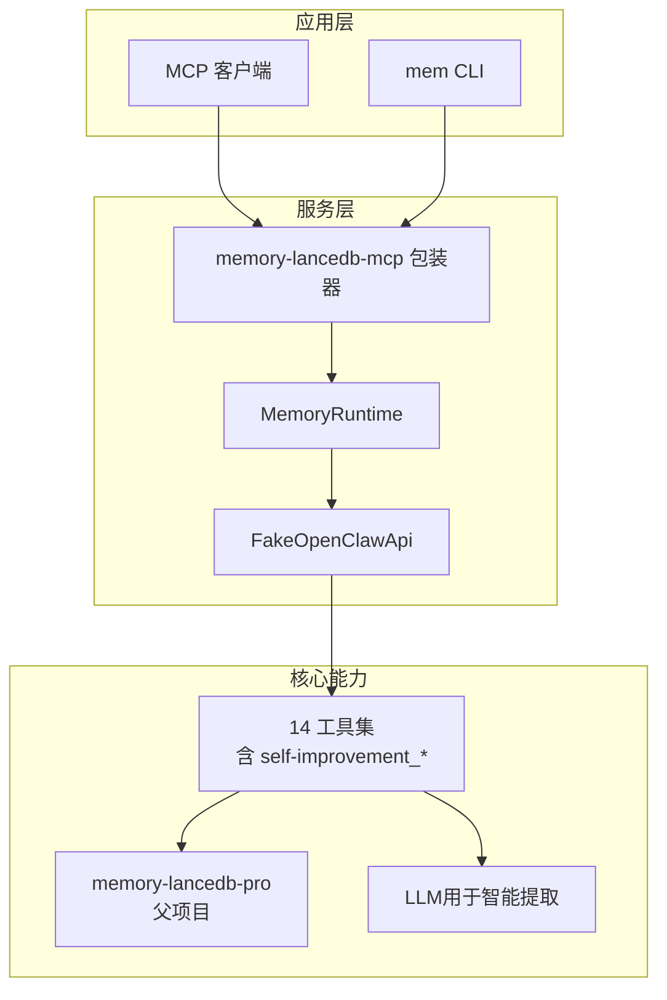
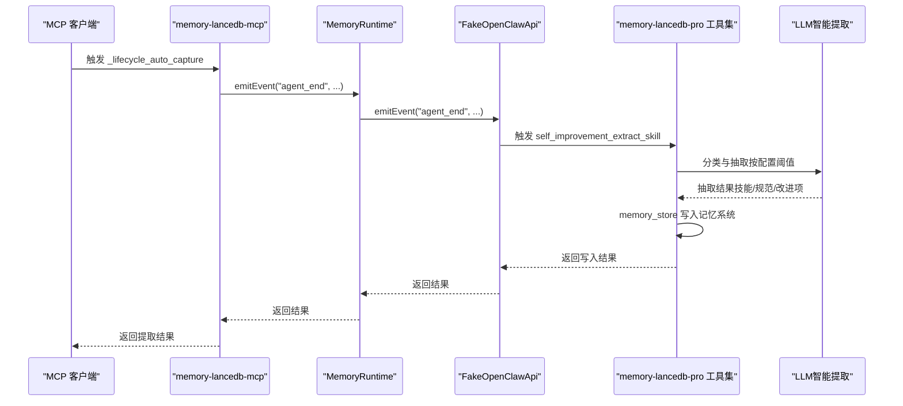
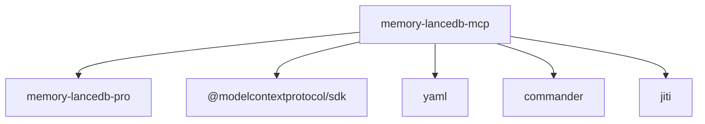

# 智能提取功能

<cite>
**本文引用的文件**
- [README.md](file://README.md)
- [docs/USAGE_GUIDE.md](file://docs/USAGE_GUIDE.md)
- [docs/knowledge-index-skill_DESIGN.md](file://docs/knowledge-index-skill_DESIGN.md)
- [src/index.ts](file://src/index.ts)
- [src/config.ts](file://src/config.ts)
- [src/fake-api.ts](file://src/fake-api.ts)
- [src/schema.ts](file://src/schema.ts)
- [src/lifecycle.ts](file://src/lifecycle.ts)
- [package.json](file://package.json)
</cite>

## 目录
1. [简介](#简介)
2. [项目结构](#项目结构)
3. [核心组件](#核心组件)
4. [架构概览](#架构概览)
5. [详细组件分析](#详细组件分析)
6. [依赖分析](#依赖分析)
7. [性能考量](#性能考量)
8. [故障排除指南](#故障排除指南)
9. [结论](#结论)
10. [附录](#附录)

## 简介
本文件面向“智能提取”功能，系统性阐述其触发条件、启用机制、文本分析算法与提取规则、支持的提取类型、配置选项、使用案例与效果对比、验证与人工审核流程、常见失败原因与解决方案，以及与标签系统的集成方法。智能提取能力来源于 memory-lancedb-pro 的“自我改进”工具族，通过 MCP 生命周期事件自动捕获对话关键信息，并利用 LLM 对话内容进行分类与抽取，形成可检索的记忆条目。

## 项目结构
该项目围绕 memory-lancedb-pro 的 MCP 包装器构建，提供 CLI 与 MCP 工具，支持智能提取、标签系统、Scope 隔离、混合检索与生命周期管理。智能提取功能通过生命周期事件触发，结合配置项启用与参数控制，最终写入记忆系统。

图表来源
- [src/index.ts:207-498](file://src/index.ts#L207-L498)
- [src/fake-api.ts:57-317](file://src/fake-api.ts#L57-L317)
- [package.json:30](file://package.json#L30)

章节来源
- [README.md:11-20](file://README.md#L11-L20)
- [docs/USAGE_GUIDE.md:167-266](file://docs/USAGE_GUIDE.md#L167-L266)

## 核心组件
- 智能提取工具族：self_improvement_log、self_improvement_extract_skill、self_improvement_review
- 生命周期事件桥接：_lifecycle_auto_recall、_lifecycle_auto_capture、_lifecycle_session_end
- 配置项：smartExtraction、extractMinMessages、extractMaxChars
- 标签系统：通过文本前缀【标签:x,y】嵌入，检索时软过滤，展示时剥离
- Scope 隔离：通过 --scope 参数实现多项目完全隔离

章节来源
- [README.md:616-632](file://README.md#L616-L632)
- [docs/USAGE_GUIDE.md:167-266](file://docs/USAGE_GUIDE.md#L167-L266)
- [src/config.ts:52-54](file://src/config.ts#L52-L54)
- [src/index.ts:18-52](file://src/index.ts#L18-L52)

## 架构概览
智能提取在 MCP 生命周期中自动触发，核心流程如下：
- agent_end 生命周期事件触发自动捕获
- 读取对话消息，按配置阈值与长度进行过滤
- 调用 LLM 对话内容进行分类与抽取
- 将抽取结果写入记忆系统（memory_store）

图表来源
- [src/lifecycle.ts:109-128](file://src/lifecycle.ts#L109-L128)
- [src/fake-api.ts:269-287](file://src/fake-api.ts#L269-L287)
- [README.md:616-622](file://README.md#L616-L622)

## 详细组件分析

### 智能提取触发与启用机制
- 触发时机：agent_end 生命周期事件，通常在对话结束或会话收尾时自动触发
- 启用开关：smartExtraction（布尔），默认开启
- 参数控制：extractMinMessages（最小消息数）、extractMaxChars（最大字符数）
- LLM 配置：可使用独立 LLM（llm.*）或回退到 embedding 配置

章节来源
- [src/config.ts:52-54](file://src/config.ts#L52-L54)
- [src/config.ts:256-259](file://src/config.ts#L256-L259)
- [src/lifecycle.ts:109-128](file://src/lifecycle.ts#L109-L128)

### 文本分析算法与提取规则
- 分类与抽取：基于 LLM 对对话内容进行六分类（偏好、事实、决策、实体、反思、其他），并抽取可复用的技能/规范
- 阈值控制：当对话消息数少于 extractMinMessages 或字符数超过 extractMaxChars 时，智能提取被跳过
- 写入策略：抽取结果通过 memory_store 写入，自动注入标签与分类，便于后续检索与治理

章节来源
- [README.md:616-622](file://README.md#L616-L622)
- [docs/USAGE_GUIDE.md:167-266](file://docs/USAGE_GUIDE.md#L167-L266)

### 支持的提取类型
- 技能提取：self_improvement_extract_skill，从记忆中提取可复用的技能/规范
- 改进日志：self_improvement_log，记录改进建议或错误经验
- 审阅流程：self_improvement_review，审阅积压的待改进项

章节来源
- [README.md:616-622](file://README.md#L616-L622)
- [docs/USAGE_GUIDE.md:167-266](file://docs/USAGE_GUIDE.md#L167-L266)

### 配置选项说明
- smartExtraction：启用/禁用智能提取
- extractMinMessages：最小消息数阈值
- extractMaxChars：最大字符数阈值
- llm.*：独立 LLM 配置（可选），用于智能提取
- 其他检索与治理配置：retrieval、selfImprovement 等

章节来源
- [src/config.ts:52-54](file://src/config.ts#L52-L54)
- [src/config.ts:256-259](file://src/config.ts#L256-L259)
- [src/config.ts:38-44](file://src/config.ts#L38-L44)

### 实际使用案例与效果对比
- 案例：在对话结束后自动捕获关键信息，形成“技能/规范”条目，便于后续复用
- 效果对比：与传统手动记忆相比，智能提取减少人工录入成本，提高一致性与覆盖面

章节来源
- [README.md:616-622](file://README.md#L616-L622)
- [docs/USAGE_GUIDE.md:167-266](file://docs/USAGE_GUIDE.md#L167-L266)

### 提取结果的验证与人工审核流程
- 审阅工具：self_improvement_review，用于审阅积压的待改进项
- 人工干预：可在 MCP 客户端中对提取结果进行确认与调整
- 标签与分类：通过标签系统与分类字段辅助人工审核与后续检索

章节来源
- [README.md:616-622](file://README.md#L616-L622)
- [docs/USAGE_GUIDE.md:167-266](file://docs/USAGE_GUIDE.md#L167-L266)

### 与标签系统的集成使用方法
- 标签嵌入：在存储/召回/列表工具中支持 tags 参数，自动嵌入文本前缀【标签:x,y】
- 检索过滤：BM25 全文检索命中标签前缀，作为软过滤条件
- 展示剥离：返回结果中自动剥离标签前缀，保持用户与 AI 的阅读体验

章节来源
- [src/index.ts:18-52](file://src/index.ts#L18-L52)
- [src/index.ts:313-441](file://src/index.ts#L313-L441)
- [docs/USAGE_GUIDE.md:392-421](file://docs/USAGE_GUIDE.md#L392-L421)

## 依赖分析
- 依赖 memory-lancedb-pro：通过 jiti 直接加载父项目源码，零额外编译步骤
- 依赖 @modelcontextprotocol/sdk：MCP 协议实现
- 依赖 yaml：配置文件解析
- 依赖 commander：CLI 命令行解析
- 依赖 jiti：TypeScript 源码动态加载

图表来源
- [package.json:26-31](file://package.json#L26-L31)
- [src/index.ts:159-184](file://src/index.ts#L159-L184)

章节来源
- [package.json:26-31](file://package.json#L26-L31)
- [src/index.ts:159-184](file://src/index.ts#L159-L184)

## 性能考量
- 智能提取为异步后台处理，不阻塞主流程
- LLM 调用成本与消息长度、分类复杂度相关
- 建议合理设置 extractMinMessages 与 extractMaxChars，避免过长对话导致资源浪费

## 故障排除指南
- 配置缺失：确认配置文件中 embedding.apiKey 与 smartExtraction 等关键项
- LLM 不可用：检查 llm.* 配置或回退到 embedding 配置
- Scope 不匹配：在锁定 scope 模式下，确保请求的 scope 与服务端一致
- 标签校验失败：检查标签字符集与格式，避免非法字符

章节来源
- [src/config.ts:167-214](file://src/config.ts#L167-L214)
- [docs/USAGE_GUIDE.md:618-667](file://docs/USAGE_GUIDE.md#L618-L667)

## 结论
智能提取功能通过 MCP 生命周期事件自动触发，结合配置阈值与 LLM 分类抽取，将对话中的关键信息转化为可检索的记忆条目。配合标签系统与 Scope 隔离，既能提升检索效率，又能保证多项目数据的独立性与安全性。建议在生产环境中合理设置提取阈值与 LLM 配置，并通过 self_improvement_review 进行持续的人工审核与优化。

## 附录
- CLI 命令参考与 MCP 工具参考详见使用手册
- Scope 隔离与标签系统详细说明详见使用手册

章节来源
- [docs/USAGE_GUIDE.md:43-166](file://docs/USAGE_GUIDE.md#L43-L166)