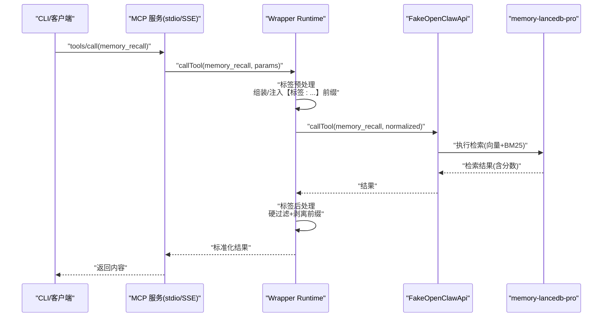
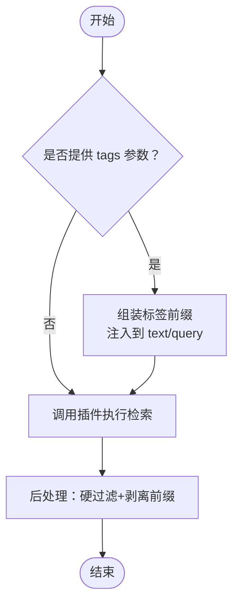
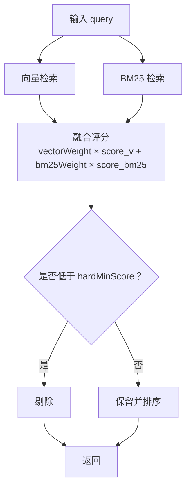
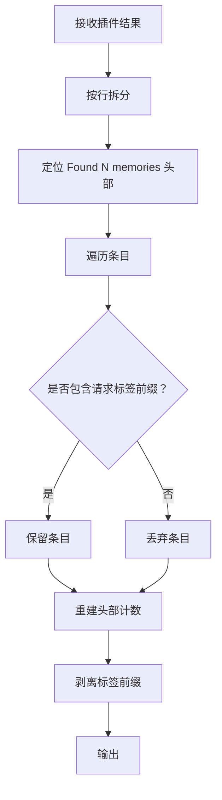
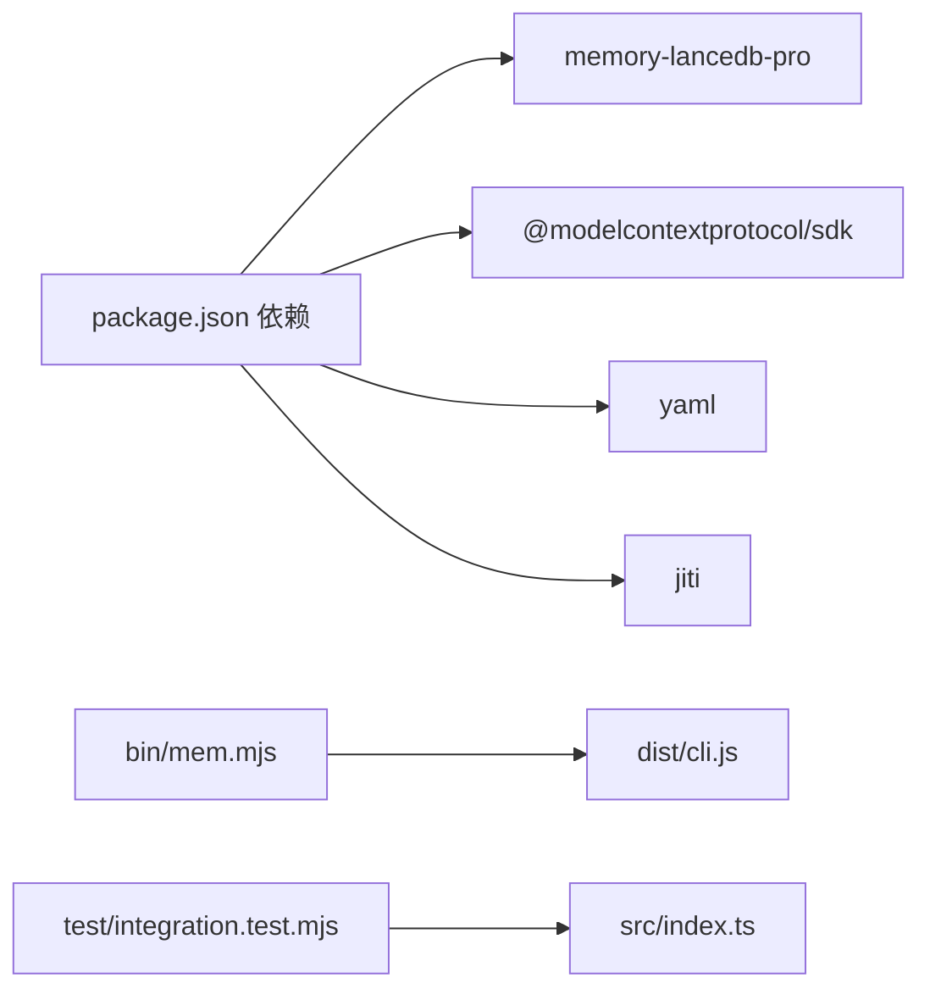

# 混合检索算法

<cite>
**本文引用的文件**
- [README.md](file://README.md)
- [src/index.ts](file://src/index.ts)
- [src/config.ts](file://src/config.ts)
- [src/fake-api.ts](file://src/fake-api.ts)
- [src/schema.ts](file://src/schema.ts)
- [src/lifecycle.ts](file://src/lifecycle.ts)
- [src/cli.ts](file://src/cli.ts)
- [src/mcp-server.ts](file://src/mcp-server.ts)
- [src/mcp-server-sse.ts](file://src/mcp-server-sse.ts)
- [package.json](file://package.json)
- [bin/mem.mjs](file://bin/mem.mjs)
- [test/integration.test.mjs](file://test/integration.test.mjs)
- [docs/USAGE_GUIDE.md](file://docs/USAGE_GUIDE.md)
</cite>

## 目录
1. [简介](#简介)
2. [项目结构](#项目结构)
3. [核心组件](#核心组件)
4. [架构总览](#架构总览)
5. [详细组件分析](#详细组件分析)
6. [依赖分析](#依赖分析)
7. [性能考虑](#性能考虑)
8. [故障排查指南](#故障排查指南)
9. [结论](#结论)
10. [附录](#附录)

## 简介
本文件面向“混合检索算法”的实现与使用，围绕向量检索与 BM25 检索的融合机制展开，重点说明：
- 权重分配与评分计算
- 结果合并策略
- 标签前缀嵌入系统（通过【标签:...】实现精确匹配与语义检索的结合）
- 配置参数说明与调优指南
- 性能基准与最佳实践
- 检索结果的后处理（标签硬过滤与排序）

该项目基于 memory-lancedb-pro 的混合检索能力，通过 wrapper 将其适配为 MCP Server，并在检索链路中引入标签前缀的预处理与后处理逻辑，以实现“精确 + 语义”的双重保障。

## 项目结构
项目采用分层组织：
- CLI 层：提供 mem 命令行工具，支持 serve/search/list/stats 等命令
- MCP 服务层：支持 stdio 与 SSE 两种传输模式
- 运行时层：封装 FakeOpenClawApi，加载 memory-lancedb-pro 插件，暴露工具与生命周期钩子
- 配置层：YAML 配置解析与环境变量扩展
- 标签系统：在存储与检索时自动注入/剥离【标签:...】前缀，实现软过滤与硬过滤的组合

```mermaid
graph TB
subgraph "CLI"
CLI["mem 命令行<br/>src/cli.ts"]
end
subgraph "MCP 服务"
STDIO["stdio 传输<br/>src/mcp-server.ts"]
SSE["SSE 传输<br/>src/mcp-server-sse.ts"]
end
subgraph "运行时"
WRAP["Wrapper Runtime<br/>src/index.ts"]
FAKE["FakeOpenClawApi<br/>src/fake-api.ts"]
end
subgraph "检索与配置"
CFG["配置系统<br/>src/config.ts"]
PLUG["memory-lancedb-pro<br/>package.json"]
DOCS["使用文档<br/>docs/USAGE_GUIDE.md"]
end
CLI --> STDIO
CLI --> SSE
STDIO --> WRAP
SSE --> WRAP
WRAP --> FAKE
FAKE --> PLUG
WRAP --> CFG
CLI --> CFG
WRAP --> DOCS
```

图表来源
- [src/cli.ts:1-617](file://src/cli.ts#L1-L617)
- [src/mcp-server.ts:1-306](file://src/mcp-server.ts#L1-L306)
- [src/mcp-server-sse.ts:1-405](file://src/mcp-server-sse.ts#L1-L405)
- [src/index.ts:1-515](file://src/index.ts#L1-L515)
- [src/fake-api.ts:1-318](file://src/fake-api.ts#L1-L318)
- [src/config.ts:1-312](file://src/config.ts#L1-L312)
- [package.json:1-46](file://package.json#L1-L46)
- [docs/USAGE_GUIDE.md:317-430](file://docs/USAGE_GUIDE.md#L317-L430)

章节来源
- [README.md:22-45](file://README.md#L22-L45)
- [src/cli.ts:1-617](file://src/cli.ts#L1-L617)
- [src/mcp-server.ts:1-306](file://src/mcp-server.ts#L1-L306)
- [src/mcp-server-sse.ts:1-405](file://src/mcp-server-sse.ts#L1-L405)
- [src/index.ts:1-515](file://src/index.ts#L1-L515)
- [src/fake-api.ts:1-318](file://src/fake-api.ts#L1-L318)
- [src/config.ts:1-312](file://src/config.ts#L1-L312)
- [package.json:1-46](file://package.json#L1-L46)
- [docs/USAGE_GUIDE.md:317-430](file://docs/USAGE_GUIDE.md#L317-L430)

## 核心组件
- 标签前缀系统
  - 存储时：将 tags 正规化并组装为【标签:x,y】前缀，注入 text/query
  - 检索时：BM25 精确命中前缀，返回结果后剥离前缀，必要时进行硬过滤
- Wrapper Runtime
  - 在工具调用前后执行标签预处理/后处理
  - 支持跨 scope 与锁定 scope 两种模式，统一 agentId 与 ACL
- 配置系统
  - retrieval.mode、vectorWeight、bm25Weight、minScore、hardMinScore 等关键参数
- MCP 服务
  - stdio 与 SSE 两种传输，暴露工具与生命周期钩子

章节来源
- [src/index.ts:18-82](file://src/index.ts#L18-L82)
- [src/index.ts:313-453](file://src/index.ts#L313-L453)
- [src/config.ts:267-280](file://src/config.ts#L267-L280)
- [src/mcp-server.ts:43-140](file://src/mcp-server.ts#L43-L140)
- [src/mcp-server-sse.ts:57-209](file://src/mcp-server-sse.ts#L57-L209)

## 架构总览
下图展示了从 CLI/MCP 到 Wrapper、FakeOpenClawApi，再到 memory-lancedb-pro 的调用链路，以及标签前缀在检索过程中的作用。



图表来源
- [src/mcp-server.ts:86-124](file://src/mcp-server.ts#L86-L124)
- [src/mcp-server-sse.ts:262-287](file://src/mcp-server-sse.ts#L262-L287)
- [src/index.ts:313-453](file://src/index.ts#L313-L453)
- [src/fake-api.ts:217-235](file://src/fake-api.ts#L217-L235)

## 详细组件分析

### 标签前缀嵌入系统
- 存储阶段
  - 将 tags 正规化（去空白、全角转半角、字符白名单校验），组装为【标签:x,y】前缀
  - 注入到 memory_store 的 text 前部
- 检索阶段
  - memory_recall 的 query 前部同样注入标签前缀，使 BM25 精确命中
  - memory_list 若带 tags，将被重写为 memory_recall(query=前缀)，确保标签过滤生效
- 结果阶段
  - 对返回内容进行硬过滤：仅保留包含请求标签前缀的条目
  - 剥离前缀，保证展示干净文本



图表来源
- [src/index.ts:313-335](file://src/index.ts#L313-L335)
- [src/index.ts:389-453](file://src/index.ts#L389-L453)

章节来源
- [src/index.ts:18-82](file://src/index.ts#L18-L82)
- [src/index.ts:313-453](file://src/index.ts#L313-L453)
- [docs/USAGE_GUIDE.md:392-421](file://docs/USAGE_GUIDE.md#L392-L421)

### 检索融合机制与评分
- 混合模式
  - retrieval.mode: "hybrid"
  - 向量检索与 BM25 检索并行，最终合并
- 权重参数
  - vectorWeight: 0.7
  - bm25Weight: 0.3
- 分数阈值
  - minScore: 0.3
  - hardMinScore: 0.35（用于硬过滤）
- 结果合并
  - 插件侧完成向量与 BM25 的融合与排序
  - Wrapper 层在返回前进行硬过滤与前缀剥离



图表来源
- [src/config.ts:267-280](file://src/config.ts#L267-L280)
- [src/index.ts:389-453](file://src/index.ts#L389-L453)

章节来源
- [src/config.ts:267-280](file://src/config.ts#L267-L280)
- [src/index.ts:389-453](file://src/index.ts#L389-L453)

### 标签硬过滤与结果排序
- 硬过滤
  - 当请求方提供 tags 时，Wrapper 会对插件返回的文本块进行逐条匹配
  - 仅保留包含请求标签前缀的条目，修正头部计数
- 排序
  - 插件侧依据融合评分排序
  - Wrapper 层不改变排序，仅做硬过滤与格式化



图表来源
- [src/index.ts:399-453](file://src/index.ts#L399-L453)

章节来源
- [src/index.ts:399-453](file://src/index.ts#L399-L453)

### 配置参数说明与调优指南
- 检索相关
  - retrieval.mode: "hybrid"
  - retrieval.vectorWeight: 0.7
  - retrieval.bm25Weight: 0.3
  - retrieval.minScore: 0.3
  - retrieval.hardMinScore: 0.35
- 其他
  - retrieval.candidatePoolSize、retrieval.recencyHalfLifeDays、retrieval.recencyWeight 等可按需开启交叉验证
  - retrieval.rerank（cross-encoder）可选启用，需配置 rerankProvider/rerankModel/rerankEndpoint/rerankApiKey

调优建议
- 向量权重偏高：强调语义相似度，适合开放域问答
- BM25 权重偏高：强调关键词匹配，适合精确查询
- 硬过滤阈值提高：减少噪声，但可能漏召回
- 软过滤（BM25 加权）+ 硬过滤（标签）组合：兼顾召回质量与准确性

章节来源
- [src/config.ts:267-280](file://src/config.ts#L267-L280)
- [docs/USAGE_GUIDE.md:317-430](file://docs/USAGE_GUIDE.md#L317-L430)

### 性能基准与最佳实践
- 基准数据
  - 使用“实体名 + 技术术语”风格的 query，Top-1 命中率显著高于纯自然疑问句
  - 示例：包含“users orders payments”等关键词的查询，命中率更高
- 最佳实践
  - 存储记忆前提取 3–5 个唯一标识性关键词
  - 召回时从关键词名单中选取最相关的 3–5 个词组成 query
  - 使用标签进行软过滤，必要时配合 category 实现硬排除
  - 对运维/开发类查询可利用内置 query-expander 进行同义词扩展

章节来源
- [docs/USAGE_GUIDE.md:317-430](file://docs/USAGE_GUIDE.md#L317-L430)

### 后处理机制
- 硬过滤
  - 仅保留包含请求标签前缀的条目
- 前缀剥离
  - 展示给用户的文本不包含【标签:...】前缀
- 头部计数修正
  - 重新统计条目数量并更新头部文案

章节来源
- [src/index.ts:389-453](file://src/index.ts#L389-L453)

## 依赖分析
- 运行时依赖
  - memory-lancedb-pro：提供混合检索、Weibull 衰减、智能提取等能力
  - @modelcontextprotocol/sdk：MCP 协议实现（stdio 与 SSE）
  - yaml、jiti：配置解析与 TS 源码直载
- 本地依赖
  - CLI 通过 bin/mem.mjs 启动 dist/cli.js
  - 测试覆盖 wrapper 加载、工具注册、生命周期事件等



图表来源
- [package.json:26-31](file://package.json#L26-L31)
- [bin/mem.mjs:1-8](file://bin/mem.mjs#L1-L8)
- [test/integration.test.mjs:1-131](file://test/integration.test.mjs#L1-L131)

章节来源
- [package.json:1-46](file://package.json#L1-L46)
- [bin/mem.mjs:1-8](file://bin/mem.mjs#L1-L8)
- [test/integration.test.mjs:1-131](file://test/integration.test.mjs#L1-L131)

## 性能考虑
- 检索融合
  - 向量与 BM25 的融合评分在插件侧完成，Wrapper 层不做二次重排
- 硬过滤成本
  - 硬过滤在内存中进行，对中小规模结果集影响有限
- 前缀剥离
  - 文本处理为线性复杂度，对长文本需关注 I/O 与渲染开销
- 配置优化
  - 适当提高 retrieval.hardMinScore 可降低下游处理负担
  - 合理设置 retrieval.candidatePoolSize 以平衡召回与延迟

## 故障排查指南
- 配置文件
  - 使用 mem doctor 校验配置文件存在性、解析正确性与 API Key 状态
- 工具可用性
  - 使用 mem serve --dry-run 验证工具注册与事件/钩子状态
- 标签问题
  - 非法标签字符会直接报错，避免写入导致前缀结构异常
- 传输模式
  - stdio 模式默认静默调试；SSE 模式可在控制台查看监听信息与警告

章节来源
- [src/cli.ts:449-517](file://src/cli.ts#L449-L517)
- [src/index.ts:41-52](file://src/index.ts#L41-L52)

## 结论
本项目通过“标签前缀 + 混合检索”的组合，实现了“精确 + 语义”的检索增强：
- 标签前缀在存储与检索两端形成闭环，既满足关键词精确匹配，又保留语义检索能力
- Wrapper 在检索链路中承担预处理与后处理职责，确保结果质量与用户体验
- 配置参数提供了灵活的调优空间，结合使用文档的最佳实践，可在不同场景取得稳定效果

## 附录
- 使用文档要点
  - 记忆召回最佳实践：实体名 + 技术术语 > 纯自然疑问句
  - 标签系统：软过滤（BM25 加权）+ 硬过滤（标签）组合
  - 多项目隔离：跨 scope 与锁定 scope 两种模式

章节来源
- [docs/USAGE_GUIDE.md:317-430](file://docs/USAGE_GUIDE.md#L317-L430)