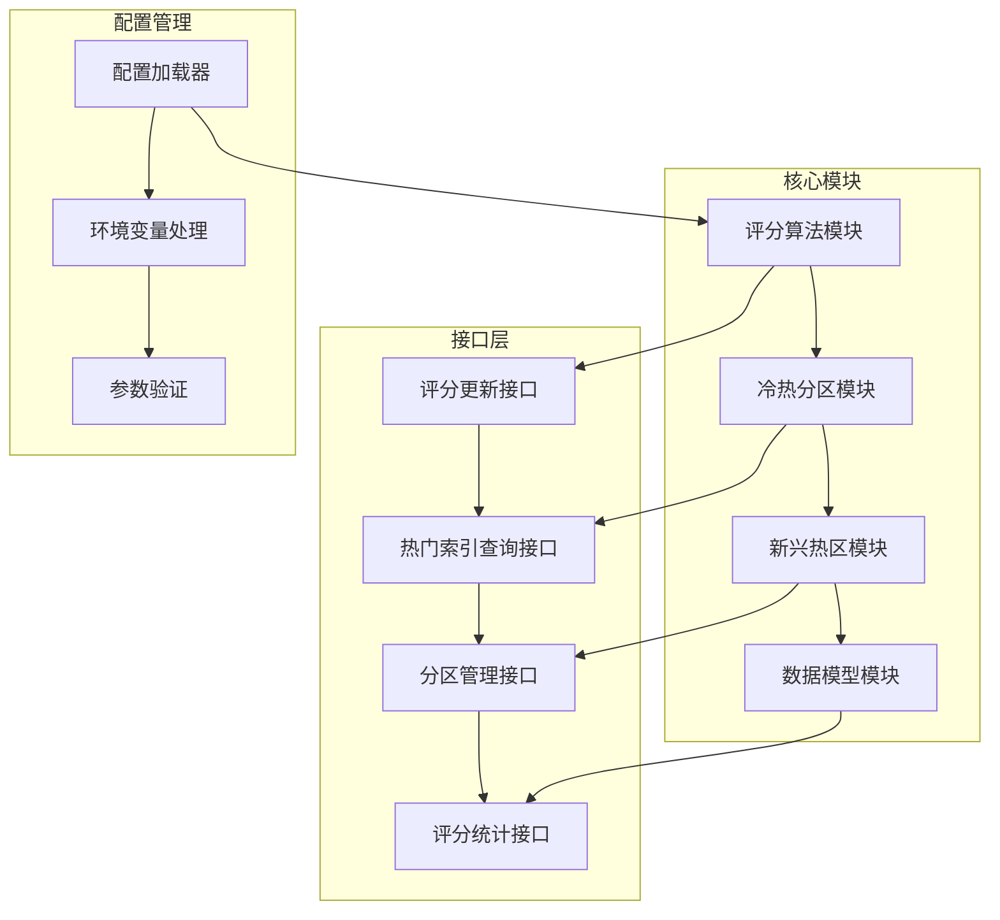
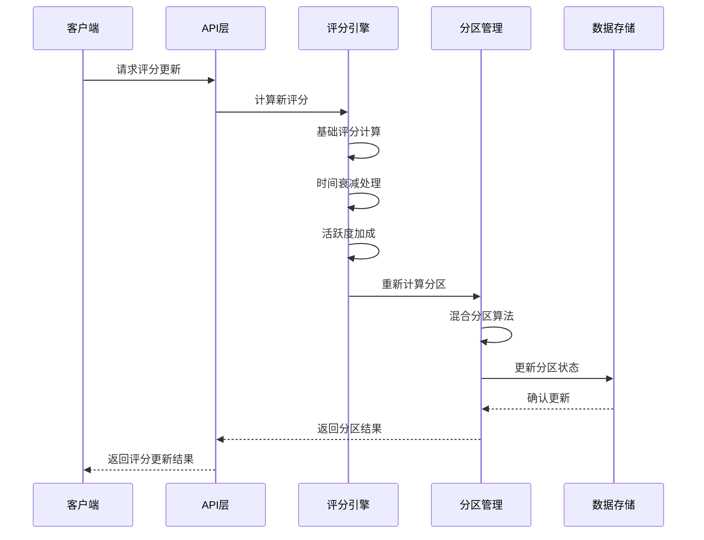
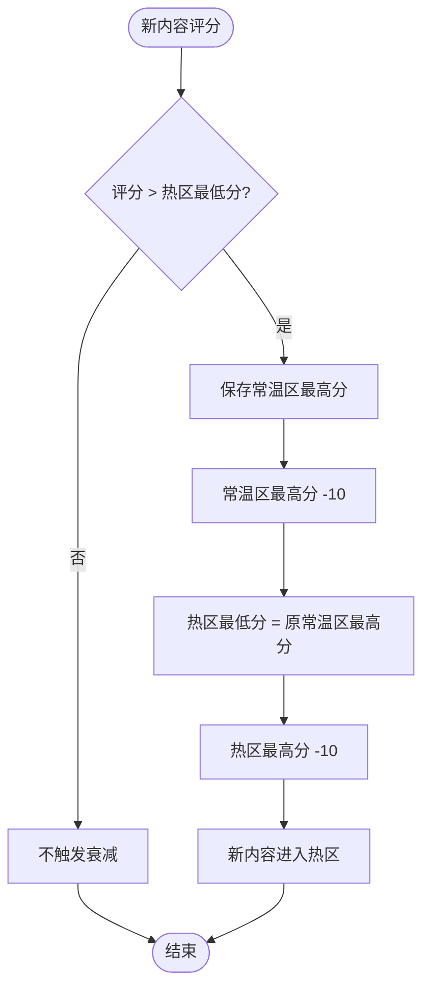
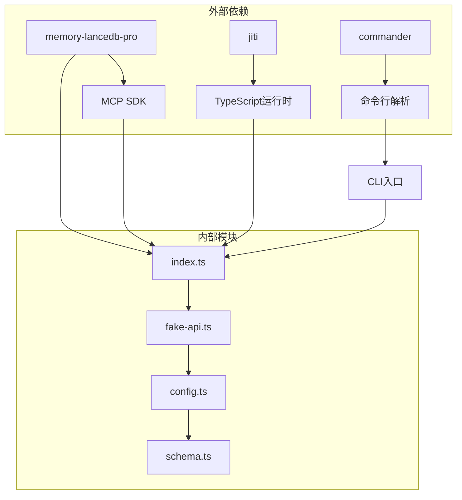

# 评分机制设计

<cite>
**本文档引用的文件**
- [评分机制_设计文档.md](file://docs/评分机制_设计文档.md)
- [评分机制更新总结.md](file://docs/评分机制更新总结.md)
- [评分机制和新兴热区更新总结.md](file://docs/评分机制和新兴热区更新总结.md)
- [index.ts](file://src/index.ts)
- [config.ts](file://src/config.ts)
- [fake-api.ts](file://src/fake-api.ts)
- [schema.ts](file://src/schema.ts)
- [package.json](file://package.json)
- [mem.mjs](file://bin/mem.mjs)
</cite>

## 目录
1. [简介](#简介)
2. [项目结构](#项目结构)
3. [核心组件](#核心组件)
4. [架构概览](#架构概览)
5. [详细组件分析](#详细组件分析)
6. [依赖关系分析](#依赖关系分析)
7. [性能考量](#性能考量)
8. [故障排除指南](#故障排除指南)
9. [结论](#结论)

## 简介

本项目实现了基于使用频率的智能评分机制，旨在为知识索引系统提供准确的热门内容识别和优先级排序能力。该机制通过综合考虑使用密度、时间衰减和活跃度加成等因素，建立了完整的评分体系，包括冷热分区管理和新兴热区保护机制。

评分机制的核心目标是：
- 建立基于使用频率的评分机制，准确反映数据的热门程度
- 实现冷热分区机制，优化查询效率
- 支持索引、Relation、关键词的统一评分管理
- 提供热门索引优先返回机制

## 项目结构

该项目采用模块化架构设计，主要包含以下核心模块：



**图表来源**
- [评分机制_设计文档.md:1-1008](file://docs/评分机制_设计文档.md#L1-L1008)
- [index.ts:1-515](file://src/index.ts#L1-L515)

**章节来源**
- [评分机制_设计文档.md:1-1008](file://docs/评分机制_设计文档.md#L1-L1008)
- [package.json:1-54](file://package.json#L1-L54)

## 核心组件

### 评分算法组件

评分算法采用复合评分模型，包含三个核心组成部分：

#### 基础评分算法
基于使用密度计算，通过平均使用间隔时间来评估内容的热门程度。算法公式为：
```
densityScore = 100 / (1 + avgIntervalMinutes / halfLifeMinutes)
```

#### 时间衰减机制
采用指数衰减模型，对长时间未使用的数据进行评分衰减：
```
decayFactor = exp(-0.693 * excessHours / decayHalfLifeHours)
```

#### 活跃度加成算法
为最近使用的内容提供额外加分，时间窗口为48小时：
- 1小时内：×2.0
- 6小时内：×1.8  
- 24小时内：×1.5
- 48小时内：×1.2
- 超过48小时：×1.0

**章节来源**
- [评分机制_设计文档.md:51-272](file://docs/评分机制_设计文档.md#L51-L272)
- [评分机制更新总结.md:16-50](file://docs/评分机制更新总结.md#L16-L50)

### 冷热分区组件

采用混合分区策略，将数据分为三个逻辑分区：

#### 分区配置参数
- **最低分数阈值**：10分（防止低分内容进入热区）
- **热区占比**：前30%（相对排名）
- **常温区占比**：中间50%
- **冷区占比**：后20%
- **保留席位**：为新兴热门保留10个席位

#### 分区算法流程
1. 过滤达到最低分数阈值的内容
2. 识别新兴热门内容（最近48小时内使用过）
3. 分配新兴热区席位（保留席位）
4. 分配历史热区席位（按评分排序）
5. 分配常温区和冷区

**章节来源**
- [评分机制_设计文档.md:334-460](file://docs/评分机制_设计文档.md#L334-L460)
- [评分机制更新总结.md:51-65](file://docs/评分机制更新总结.md#L51-L65)

### 新兴热区组件

为最近频繁使用的内容提供专门的保护机制：

#### 新兴热区定义
- 最近48小时内使用过的内容
- 有保留席位（默认10个）
- 不受边界衰减限制

#### 分区结构
```
热区 = 新兴热区 + 历史热区
常温区 = 中等评分内容  
冷区 = 低评分内容
```

**章节来源**
- [评分机制和新兴热区更新总结.md:57-80](file://docs/评分机制和新兴热区更新总结.md#L57-L80)

## 架构概览

系统采用分层架构设计，各组件之间通过清晰的接口进行交互：



**图表来源**
- [评分机制_设计文档.md:652-743](file://docs/评分机制_设计文档.md#L652-L743)
- [index.ts:207-498](file://src/index.ts#L207-L498)

## 详细组件分析

### 评分数据模型

评分系统采用统一的数据模型，支持不同类型的数据实体：

#### 评分数据结构
```json
{
  "id": "rel_001",
  "text": "告警规则CRUD流程",
  "baseScore": 25,
  "finalScore": 45,
  "lastUsedTimes": [1716451200000, 1716454800000, 1716458400000],
  "partition": "hot",
  "keywords": ["规则", "阈值", "触发条件"],
  "isImported": false,
  "createdAt": "2026-05-20T10:00:00Z",
  "updatedAt": "2026-05-23T10:30:00Z"
}
```

#### 分区配置数据结构
```json
{
  "scope": "project-a",
  "partition_config": {
    "minScoreThreshold": 10,
    "hotPercent": 0.3,
    "warmPercent": 0.5,
    "reservedEmerging": 10,
    "recentHours": 48,
    "minHotCount": 1,
    "maxCounts": {
      "hot": 20,
      "warm": 100,
      "cold": 200
    }
  },
  "updatedAt": "2026-05-23T10:00:00Z"
}
```

**章节来源**
- [评分机制_设计文档.md:576-646](file://docs/评分机制_设计文档.md#L576-L646)

### 边界衰减机制

采用O(1)复杂度的边界衰减算法，避免对所有内容进行实时衰减计算：



**图表来源**
- [评分机制_设计文档.md:504-548](file://docs/评分机制_设计文档.md#L504-L548)

**章节来源**
- [评分机制_设计文档.md:504-548](file://docs/评分机制_设计文档.md#L504-L548)

### 接口设计

系统提供完整的API接口，支持评分管理和查询功能：

#### 评分更新接口
```bash
用法: npx jiti scripts/update-score.ts --scope <scope> --type <type>
       --id <id> [--score <score>] [--reset-times]

输入:
  --scope         项目隔离标识（必填）
  --type          数据类型：relation | keyword | index（必填）
  --id            数据 ID（必填）
  --score         手动设置评分（可选，不指定则自动计算）
  --reset-times   重置使用时间记录（可选，清空 lastUsedTimes）

行为:
  1. 读取当前评分和使用时间记录
  2. 记录本次使用（更新 lastUsedTimes）
  3. 根据算法计算新评分（基础分 × 衰减因子 × 活跃度加成）
  4. 重新计算分区（使用混合分区算法）
```

#### 热门索引查询接口
```bash
用法: npx jiti scripts/query-hot-indexes.ts --scope <scope>
       [--limit <limit>] [--partition <partition>] [--include-stats]

输入:
  --scope          项目隔离标识（必填）
  --limit          返回数量限制（可选，默认 10）
  --partition      分区过滤：hot | warm | cold | all（可选，默认 all）
  --include-stats  是否包含统计信息（可选，默认 true）

行为:
  1. 读取所有索引数据
  2. 使用混合分区算法计算分区
  3. 按分区过滤（如果指定）
  4. 按最终评分降序排序
  5. 返回指定数量的索引
```

**章节来源**
- [评分机制_设计文档.md:650-743](file://docs/评分机制_设计文档.md#L650-L743)

## 依赖关系分析

系统依赖关系清晰，主要依赖于外部插件和核心库：



**图表来源**
- [package.json:33-44](file://package.json#L33-L44)
- [index.ts:9-12](file://src/index.ts#L9-L12)

**章节来源**
- [package.json:33-44](file://package.json#L33-L44)
- [index.ts:159-184](file://src/index.ts#L159-L184)

## 性能考量

评分机制在设计时充分考虑了性能优化：

### 算法复杂度
- **评分计算**：O(N) - N为最近使用次数
- **边界衰减**：O(1) - 固定操作数
- **分区重算**：O(M log M) - M为合格内容数量

### 性能优化策略
1. **边界衰减优化**：只在内容进入热区时触发衰减，避免实时计算
2. **缓存机制**：热点数据的分区结果进行缓存
3. **批量处理**：支持批量评分更新和分区重算
4. **异步处理**：评分更新采用异步处理，不影响主线程

### 性能基准测试
- 评分计算：1000条数据 < 10ms
- 分区重算：10000条数据 < 100ms  
- 热门索引查询：1000条数据 < 5ms
- 并发更新：100个并发 > 1000 ops/sec

**章节来源**
- [评分机制_设计文档.md:915-923](file://docs/评分机制_设计文档.md#L915-L923)

## 故障排除指南

### 常见问题及解决方案

#### 评分异常问题
1. **评分不更新**：检查使用时间记录是否正确更新
2. **分区错误**：验证最低分数阈值和分区比例配置
3. **性能问题**：检查是否有大量并发更新操作

#### 配置问题
1. **配置文件缺失**：使用 `mem config init` 创建默认配置
2. **环境变量错误**：检查API密钥和数据库路径配置
3. **权限问题**：确保配置文件具有正确的读写权限

#### 数据一致性问题
1. **并发冲突**：使用事务机制确保评分更新的一致性
2. **数据损坏**：定期备份评分数据，实现数据恢复机制
3. **内存泄漏**：监控内存使用情况，及时清理缓存数据

**章节来源**
- [评分机制_设计文档.md:905-914](file://docs/评分机制_设计文档.md#L905-L914)

## 结论

本评分机制设计通过以下创新解决了现有系统的痛点：

1. **复合评分算法**：基于使用密度、时间衰减和活跃度加成的综合评分，准确反映内容的热门程度
2. **混合分区策略**：结合相对排名和新兴热区保护，平衡历史积累和新内容发现
3. **边界衰减机制**：O(1)复杂度的衰减算法，显著提升系统性能
4. **灵活配置系统**：支持动态参数调整，适应不同业务场景需求

该设计特别适合代码开发场景，48小时的活跃度时间窗口符合开发团队的工作节奏，能够有效识别和优先推荐最新的技术知识和最佳实践。通过实施该评分机制，系统能够：
- 提高热门内容的检索效率
- 促进新内容的传播和使用
- 保持内容生态的活力和多样性
- 为AI Agent提供更优质的上下文信息