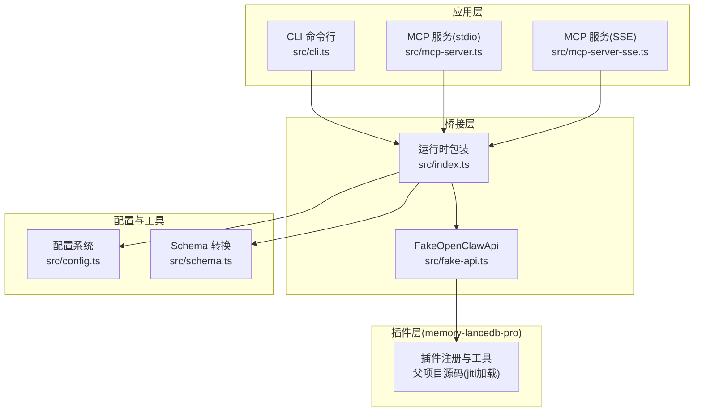
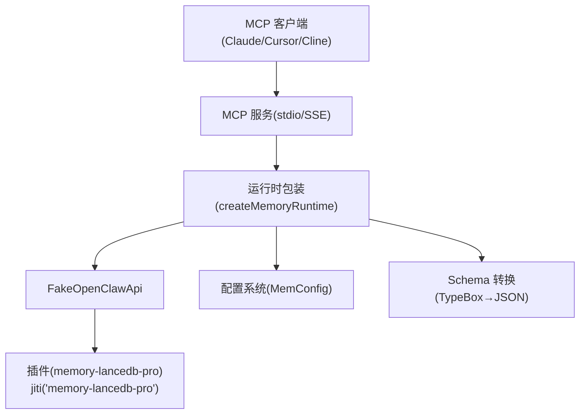
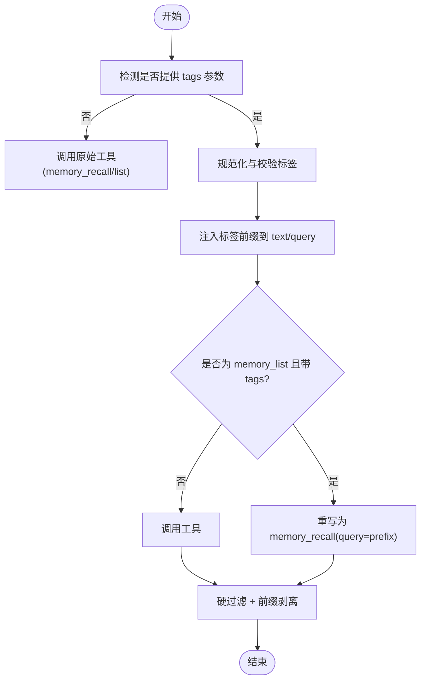
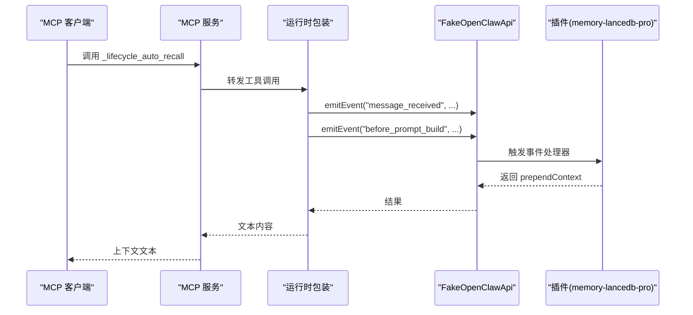
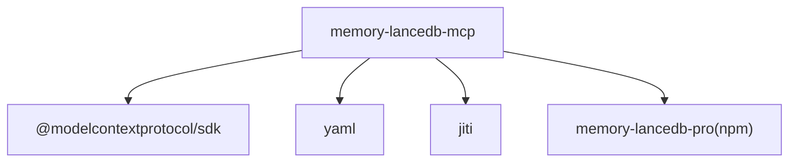

# 高级功能

<cite>
**本文引用的文件**
- [README.md](file://README.md)
- [package.json](file://package.json)
- [src/index.ts](file://src/index.ts)
- [src/config.ts](file://src/config.ts)
- [src/fake-api.ts](file://src/fake-api.ts)
- [src/schema.ts](file://src/schema.ts)
- [src/lifecycle.ts](file://src/lifecycle.ts)
- [src/cli.ts](file://src/cli.ts)
- [src/mcp-server.ts](file://src/mcp-server.ts)
- [src/mcp-server-sse.ts](file://src/mcp-server-sse.ts)
- [bin/mem.mjs](file://bin/mem.mjs)
</cite>

## 目录
1. [简介](#简介)
2. [项目结构](#项目结构)
3. [核心组件](#核心组件)
4. [架构总览](#架构总览)
5. [详细组件分析](#详细组件分析)
6. [依赖分析](#依赖分析)
7. [性能考虑](#性能考虑)
8. [故障排查指南](#故障排查指南)
9. [结论](#结论)
10. [附录](#附录)

## 简介
本文件面向高级用户与工程团队，系统化阐述 memory-lancedb-mcp 的高级功能与实现要点，重点覆盖：
- 混合检索算法（向量 + BM25）的原理、权重配置与性能特征
- Weibull 衰减模型的工作机制与参数调优建议
- 智能提取功能的启用条件、配置方法与使用场景
- 记忆压缩与去重机制的实现思路
- 多供应商嵌入支持（OpenAI、SiliconFlow、Ollama）的配置与切换
- 性能优化建议、资源使用指南与专家级配置技巧
- 高级配置项与对系统性能、记忆质量的影响评估

## 项目结构
该项目围绕“MCP 服务桥接 + 记忆引擎插件”的架构组织，核心模块职责如下：
- 入口与运行时：src/index.ts 负责配置加载、插件注册、工具调用与标签预处理
- 配置系统：src/config.ts 提供 YAML 配置解析、环境变量展开与默认模板
- MCP 服务：src/mcp-server.ts（stdio）与 src/mcp-server-sse.ts（SSE）分别提供本地与远程传输
- 生命周期桥接：src/lifecycle.ts 将 OpenClaw 事件映射为可调用的 MCP 工具
- CLI：src/cli.ts 提供 mem 命令行工具，支持服务启动、检索、统计、作用域管理等
- 假装运行时：src/fake-api.ts 模拟 OpenClaw 插件运行时，承载工具注册与事件系统
- 类型转换：src/schema.ts 将 TypeBox Schema 转换为 MCP JSON Schema

图表来源
- [src/index.ts:159-184](file://src/index.ts#L159-L184)
- [src/mcp-server.ts:43-140](file://src/mcp-server.ts#L43-L140)
- [src/mcp-server-sse.ts:57-209](file://src/mcp-server-sse.ts#L57-L209)
- [src/config.ts:220-223](file://src/config.ts#L220-L223)
- [src/schema.ts:45-150](file://src/schema.ts#L45-L150)

章节来源
- [README.md:22-45](file://README.md#L22-L45)
- [package.json:1-46](file://package.json#L1-L46)

## 核心组件
- 运行时工厂 createMemoryRuntime：负责加载配置、构建 FakeOpenClawApi、注册插件、初始化事件，并提供工具调用、事件发射、钩子触发与 CLI 实例访问
- FakeOpenClawApi：模拟 OpenClaw 运行时，承载工具工厂注册、事件与钩子系统、CLI 注册与路径解析
- 配置系统 MemConfig：统一 YAML 配置到插件配置的映射，支持环境变量展开与默认模板
- 标签系统：对 memory_store/recall/list 的标签前缀注入与后处理剥离，实现软过滤与硬过滤结合
- 生命周期桥接：before_prompt_build 与 agent_end 事件映射为 _lifecycle_auto_recall 与 _lifecycle_auto_capture 工具

章节来源
- [src/index.ts:207-498](file://src/index.ts#L207-L498)
- [src/fake-api.ts:57-317](file://src/fake-api.ts#L57-L317)
- [src/config.ts:23-98](file://src/config.ts#L23-L98)
- [src/lifecycle.ts:52-177](file://src/lifecycle.ts#L52-L177)

## 架构总览
整体架构通过 jiti 直接加载 memory-lancedb-pro 的 TypeScript 源码，零侵入地桥接 MCP 协议与生命周期事件，支持 stdio 与 SSE 两种传输模式。

图表来源
- [README.md:22-45](file://README.md#L22-L45)
- [src/index.ts:159-184](file://src/index.ts#L159-L184)
- [src/mcp-server.ts:43-140](file://src/mcp-server.ts#L43-L140)
- [src/mcp-server-sse.ts:57-209](file://src/mcp-server-sse.ts#L57-L209)

## 详细组件分析

### 混合检索（向量 + BM25）原理与配置
- 检索模式与权重
  - 模式：hybrid（混合）
  - 权重：vectorWeight 与 bm25Weight 控制向量与 BM25 的融合比例
  - 最低分数：minScore 与 hardMinScore 用于过滤噪声
  - 噪声过滤：filterNoise 控制是否启用噪声过滤
  - 候选池：candidatePoolSize 控制候选集合规模
- Weibull 时间衰减
  - recencyHalfLifeDays 与 timeDecayHalfLifeDays 控制近期与时间衰减半衰期
  - reinforcementFactor 与 maxHalfLifeMultiplier 用于强化与上限控制
- 重排序（可选）
  - rerankProvider/model/endpoint/apiKey/timeoutMs 支持交叉编码器重排序
- 性能特征
  - 向量检索提供语义匹配能力，BM25 提升关键词命中与精确匹配
  - 权重与阈值直接影响召回精度与速度；增大 candidatePoolSize 会提高内存与计算开销
  - 启用重排序可提升排序质量，但增加延迟与外部 API 成本

章节来源
- [src/config.ts:57-77](file://src/config.ts#L57-L77)
- [README.md:64-68](file://README.md#L64-L68)

### Weibull 衰减模型工作机制与调优
- 工作机制
  - Weibull 分布用于建模记忆随时间的衰减概率，半衰期决定遗忘速率
  - recencyHalfLifeDays 侧重近期新鲜度，timeDecayHalfLifeDays 侧重长期时间衰减
  - reinforcementFactor 可增强某些记忆的保留强度；maxHalfLifeMultiplier 限制最大半衰期倍数
- 调优建议
  - 高价值记忆：降低衰减半衰期或提高 reinforcementFactor
  - 长期知识：适当延长 timeDecayHalfLifeDays，避免过快丢失
  - 平衡策略：通过 hardMinScore 与 filterNoise 保证召回质量

章节来源
- [src/config.ts:70-76](file://src/config.ts#L70-L76)
- [README.md:65-66](file://README.md#L65-L66)

### 智能提取功能（Smart Extraction）
- 启用条件
  - 配置 smartExtraction: true
  - 可选 llm 段提供 LLM 用于抽取（若未提供则回退到 embedding 配置）
  - 提取最小消息数与最大字符数由 extractMinMessages 与 extractMaxChars 控制
- 配置方法
  - 在 YAML 中设置 smartExtraction、extractMinMessages、extractMaxChars
  - 可选 llm 段提供模型与 API 密钥
- 使用场景
  - 会话结束后自动从对话中抽取偏好、决策、实体等结构化记忆
  - 与生命周期工具 _lifecycle_auto_capture 协同工作
- 注意事项
  - 智能提取会引入外部 LLM 调用成本与时延
  - 建议在 MCP 模式下由代理显式调用 memory_recall，而非依赖自动召回

章节来源
- [src/config.ts:45-55](file://src/config.ts#L45-L55)
- [src/config.ts:256-259](file://src/config.ts#L256-L259)
- [src/lifecycle.ts:109-128](file://src/lifecycle.ts#L109-L128)
- [README.md:13-19](file://README.md#L13-L19)

### 记忆压缩与去重机制
- 压缩与去重入口
  - memory_compact 工具用于去重与压缩，减少存储冗余与提升检索效率
- 实现思路
  - 去重：基于向量相似度与文本指纹，合并重复或高度相似的记忆
  - 压缩：对长记忆进行分块或摘要化处理（具体策略由插件实现）
- 使用建议
  - 定期执行 memory_compact 以维持索引健康
  - 结合标签与分类，提升去重准确性

章节来源
- [README.md:610-614](file://README.md#L610-L614)

### 多供应商嵌入支持（OpenAI、SiliconFlow、Ollama）
- 配置字段
  - provider（可选）、apiKey、model、baseURL、dimensions/requestDimensions、taskQuery/taskPassage、normalized、chunking
- OpenAI
  - 示例：apiKey、model、baseURL、dimensions
- SiliconFlow
  - 示例：apiKey、model、baseURL、dimensions
- Ollama
  - 示例：本地 baseURL、model、dimensions
- 切换方法
  - 修改 YAML 中 embedding 段，或通过环境变量扩展（${ENV_VAR}）
  - 无需重启服务，重新加载配置即可生效

章节来源
- [README.md:100-125](file://README.md#L100-L125)
- [src/config.ts:25-37](file://src/config.ts#L25-L37)

### 标签系统与检索过滤
- 标签前缀注入
  - 在 memory_store/recall/list 中，标签字符串会被规范化并注入到文本前缀，便于 BM25 命中
- 检索过滤
  - recall 与 list 支持 tags 参数；list+tags 会被重写为 recall(query=tagPrefix)
  - 后处理阶段进行硬过滤，仅保留包含请求标签的条目
- 规范化与校验
  - 标签字符白名单与非法字符检测，防止破坏前缀结构
  - 存储时剥离前缀，展示时恢复，保证用户体验

图表来源
- [src/index.ts:313-450](file://src/index.ts#L313-L450)

章节来源
- [src/index.ts:41-52](file://src/index.ts#L41-L52)
- [src/index.ts:55-64](file://src/index.ts#L55-L64)
- [src/index.ts:72-82](file://src/index.ts#L72-L82)
- [src/index.ts:313-450](file://src/index.ts#L313-L450)

### 生命周期桥接与自动捕获/召回
- before_prompt_build → _lifecycle_auto_recall
  - 在发送提示前自动检索相关记忆，返回可前置的上下文
- agent_end → _lifecycle_auto_capture
  - 会话结束后自动从消息中抽取关键信息为记忆
- 事件与钩子
  - 通过 FakeOpenClawApi 的事件系统与钩子注册，实现生命周期回调

图表来源
- [src/mcp-server.ts:235-305](file://src/mcp-server.ts#L235-L305)
- [src/lifecycle.ts:52-91](file://src/lifecycle.ts#L52-L91)
- [src/fake-api.ts:269-287](file://src/fake-api.ts#L269-L287)

章节来源
- [src/lifecycle.ts:52-177](file://src/lifecycle.ts#L52-L177)
- [src/mcp-server.ts:235-305](file://src/mcp-server.ts#L235-L305)

## 依赖分析
- 运行时依赖
  - @modelcontextprotocol/sdk：MCP 协议实现
  - yaml：YAML 解析与序列化
  - jiti：动态加载父项目 TypeScript 源码
- 插件依赖
  - memory-lancedb-pro：核心记忆引擎（通过 npm 安装）

图表来源
- [package.json:26-31](file://package.json#L26-L31)

章节来源
- [package.json:26-31](file://package.json#L26-L31)

## 性能考虑
- 检索性能
  - 合理设置 vectorWeight/bm25Weight 与 candidatePoolSize，避免过度扩大候选集
  - 使用 minScore/hardMinScore 过滤噪声，减少下游处理开销
  - 在高并发场景建议启用 SSE 模式并配合反向代理
- 衰减与存储
  - 适度调整半衰期与强化因子，平衡记忆新鲜度与稳定性
  - 定期执行 memory_compact 降低存储膨胀
- 智能提取
  - 控制 extractMinMessages 与 extractMaxChars，避免过长消息导致成本上升
  - 在 MCP 模式下建议显式调用 memory_recall，减少自动召回带来的额外开销
- 嵌入与重排序
  - 选择合适维度与模型，平衡精度与延迟
  - 重排序器为外部服务，需关注超时与失败重试策略

## 故障排查指南
- 配置文件缺失或格式错误
  - 使用 mem doctor 进行健康检查，定位配置文件路径、解析与密钥有效性
- 插件加载失败
  - 确认 memory-lancedb-pro 已正确安装，版本兼容
- SSE 模式访问受限
  - 未设置 --scope 时处于跨作用域模式，注意网络安全与访问控制
- 标签非法字符
  - 标签仅允许白名单字符，非法字符会直接抛错，避免破坏前缀结构

章节来源
- [src/cli.ts:449-517](file://src/cli.ts#L449-L517)
- [src/index.ts:41-52](file://src/index.ts#L41-L52)

## 结论
本项目通过零侵入的桥接方式，将企业级记忆引擎的能力以 MCP 工具形式提供，支持混合检索、Weibull 衰减、智能提取与生命周期自动化。通过合理的配置与调优，可在保证检索质量的同时控制资源消耗；借助 SSE 模式与多供应商嵌入，满足远程部署与多样化算力需求。建议在生产环境中定期执行压缩去重、监控检索阈值与衰减参数，并结合业务场景选择合适的检索与提取策略。

## 附录
- 高级配置项速览
  - 检索：mode、vectorWeight、bm25Weight、minScore、hardMinScore、rerank*、candidatePoolSize、recency*、timeDecay*
  - 衰减：reinforcementFactor、maxHalfLifeMultiplier
  - 提取：smartExtraction、extractMinMessages、extractMaxChars、llm 段
  - 作用域：scopes.default、scopes.definitions、scopes.agentAccess
- 专家级技巧
  - 使用 SSE 模式时务必设置 --scope 并限制 host，避免跨作用域泄露
  - 在高噪声场景提高 hardMinScore 与开启 filterNoise
  - 对高频更新的记忆提高 reinforcementFactor，降低 timeDecayHalfLifeDays
  - 将智能提取与生命周期工具结合，形成“捕获-沉淀-召回”的闭环