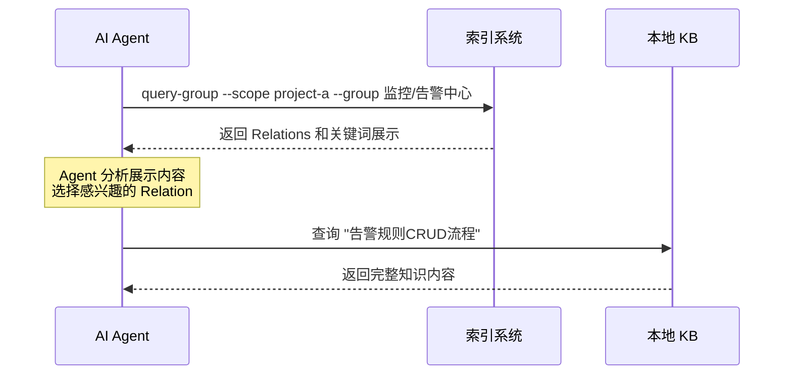
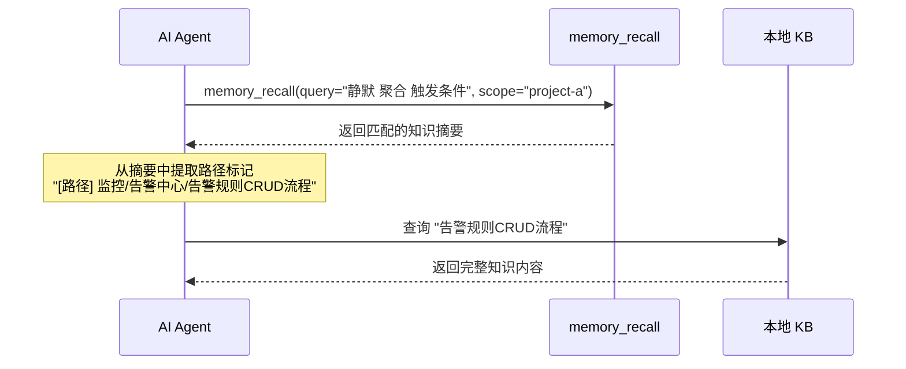

# Relations 和关键词展示方案设计文档

> - 状态：草案
> - 起草时间：2026-05-23
> - 关联文档：知识索引SKILL_设计文档.md、索引展示方案_设计文档.md
> - 实施范围：Relations 和关键词的展示格式、参数控制

## 1. 需求背景 & 目标

### 1.1 背景

通过查询具体索引（Group）获取 Relations 和关键词数据，需要设计一个清晰、高效的展示格式，让 AI Agent 能够快速了解该 Group 下有哪些热门知识条目和可用于语义检索的关键词。

### 1.2 目标

- 目标 1：采用树形文本格式展示 Relations 和关键词，减少 Token 消耗
- 目标 2：支持热门标识，区分不同热度的数据
- 目标 3：支持灵活的展示控制，可选择只展示 Relations、只展示关键词或都展示
- 目标 4：支持热度过滤，可选择展示热区、常温区或冷区数据

---

## 2. 名词术语表

| 术语 | 含义 | 易混淆点 |
|------|------|---------|
| **Relations** | 一个 Group 下的细粒度描述短语，类似文章标题 | 不是 memory_id，是本地缓存的查询 key |
| **关键词词云** | 从已被淘汰或冷门 Relation 中提取的语义标签集合 | 不是可视化词云，是对 LLM 暴露的关键词列表 |
| **热门标识** | 使用 emoji 和文字标识数据的冷热状态 | 不是分类，是状态标识 |
| **展示控制** | 控制展示内容类型（Relations、关键词或都展示） | 不是过滤，是内容类型选择 |
| **热度过滤** | 根据评分过滤展示不同热度的数据 | 不是排序，是分区过滤 |

---

## 3. 展示格式设计

### 3.1 完整展示格式（含新兴热区）

```
=== 监控/告警中心 ===

🔥 热门知识 (Top 5):
├── 告警规则CRUD流程 (score: 85) [热]
├── 通知渠道配置 (score: 72) [热]
├── 静默规则管理 (score: 65) [热]
├── 聚合策略配置 (score: 58) [热]
└── 新告警功能 (score: 27) [新兴热]  ← 新兴热门内容

🏷️ 关键词词云:
├── 🔥 静默, 聚合, 升级, 值班表
├── 🌡️ 分级, 触发条件, 阈值
└── ❄️ Webhook, 邮件, 短信, 渠道
```

**特点**：
- 无操作提示
- 无统计信息
- 关键词显示热门标识
- 结构清晰，Token 高效
- 支持新兴热区标识

### 3.2 分区标识规范

| 分区 | Emoji | 文字 | 评分范围 | 说明 |
|------|-------|------|---------|------|
| 历史热区 | 🔥 | [热] | >= 50 | 历史高频使用，优先展示 |
| 新兴热区 | 🔥 | [新兴热] | 任意 | 48小时内频繁使用，有保留席位 |
| 常温区 | 🌡️ | [常温] | 20-49 | 中频使用，次优先展示 |
| 冷区 | ❄️ | [冷] | < 20 | 低频使用，可能被删除 |
| 导入 | 📥 | [导入] | 0 | 从外部知识库导入 |

**新兴热区标识**：
- 使用 🔥[新兴热] 标识，与历史热区区分
- 新兴热区内容评分可能不高，但最近频繁使用
- 有保留席位（默认10个），保证新内容能快速进入热区

### 3.3 树形符号规范

```
├── 非最后一个子节点
└── 最后一个子节点
│   垂直连接线
    缩进空格
```

---

## 4. 参数控制设计

### 4.1 query-group.mjs 接口

```
用法: node scripts/query-group.mjs --scope <scope> --group <group>
       [--hot-count <count>] [--keyword-limit <limit>] [--show <show>]
       [--partition <partition>] [--mode <mode>] [--emerging]

输入:
  --scope          项目隔离标识（必填）
  --group          Group 路径（必填）
  --hot-count      热门知识展示个数（可选，默认 5）
  --keyword-limit  关键词展示数量限制（可选，默认 20）
  --show           展示内容类型：relations | keywords | all（可选，默认 all）
  --partition      分区过滤：hot | warm | cold | emerging | all（可选，默认 all）
  --mode           展示模式：full | compact（可选，默认 full）
  --emerging       只展示新兴热区内容（可选，默认 false）

输出:
  树形文本格式的 Relations 和关键词展示
```

### 4.2 参数说明

#### 4.2.1 --show

控制展示内容类型。

```
# 展示所有内容（默认）
query-group --scope project-a --group 监控/告警中心 --show all

# 只展示 Relations
query-group --scope project-a --group 监控/告警中心 --show relations

# 只展示关键词
query-group --scope project-a --group 监控/告警中心 --show keywords
```

#### 4.2.2 --partition

控制分区过滤。

```
# 展示所有分区（默认）
query-group --scope project-a --group 监控/告警中心 --partition all

# 只展示热区数据
query-group --scope project-a --group 监控/告警中心 --partition hot

# 只展示常温区数据
query-group --scope project-a --group 监控/告警中心 --partition warm

# 只展示冷区数据
query-group --scope project-a --group 监控/告警中心 --partition cold
```

#### 4.2.3 --hot-count

控制热门知识展示个数。

```
# 默认展示 5 个热门知识
query-group --scope project-a --group 监控/告警中心

# 展示 10 个热门知识
query-group --scope project-a --group 监控/告警中心 --hot-count 10

# 不展示热门知识
query-group --scope project-a --group 监控/告警中心 --hot-count 0
```

#### 4.2.4 --keyword-limit

控制关键词展示数量限制。

```
# 默认展示 20 个关键词
query-group --scope project-a --group 监控/告警中心

# 展示 50 个关键词
query-group --scope project-a --group 监控/告警中心 --keyword-limit 50

# 不展示关键词
query-group --scope project-a --group 监控/告警中心 --keyword-limit 0
```

#### 4.2.5 --mode

控制展示模式。

```
# 完整模式（默认）
query-group --scope project-a --group 监控/告警中心 --mode full

# 精简模式（无评分）
query-group --scope project-a --group 监控/告警中心 --mode compact
```

### 4.3 参数组合示例

```
# 只展示热区 Relations
query-group --scope project-a --group 监控/告警中心 --show relations --partition hot

# 只展示冷区关键词
query-group --scope project-a --group 监控/告警中心 --show keywords --partition cold

# 展示所有内容，精简模式
query-group --scope project-a --group 监控/告警中心 --show all --mode compact

# 展示 10 个热门知识，50 个关键词
query-group --scope project-a --group 监控/告警中心 --hot-count 10 --keyword-limit 50
```

---

## 5. 展示模式设计

### 5.1 完整模式（full）

**默认模式**，展示所有信息：
- 热门知识列表（带评分和分区标识）
- 关键词词云（带热门标识）

**Token 预算**：150-250 tokens

**示例**：
```
=== 监控/告警中心 ===

🔥 热门知识 (Top 5):
├── 告警规则CRUD流程 (score: 85) [热]
├── 通知渠道配置 (score: 72) [热]
├── 静默规则管理 (score: 65) [热]
├── 聚合策略配置 (score: 58) [热]
└── 值班表管理 (score: 45) [常温]

🏷️ 关键词词云:
├── 🔥 静默, 聚合, 升级, 值班表
├── 🌡️ 分级, 触发条件, 阈值
└── ❄️ Webhook, 邮件, 短信, 渠道
```

### 5.2 精简模式（compact）

最小化展示：
- 热门知识列表（无评分）
- 关键词列表（无热门标识）

**Token 预算**：80-120 tokens

**示例**：
```
监控/告警中心:
热门知识:
├── 告警规则CRUD流程
├── 通知渠道配置
├── 静默规则管理
├── 聚合策略配置
└── 值班表管理

关键词: 静默, 聚合, 升级, 值班表, 分级, 触发条件, 阈值, Webhook, 邮件, 短信, 渠道
```

### 5.3 只展示 Relations

```
=== 监控/告警中心 (Relations) ===

🔥 热门知识 (Top 5):
├── 告警规则CRUD流程 (score: 85) [热]
├── 通知渠道配置 (score: 72) [热]
├── 静默规则管理 (score: 65) [热]
├── 聚合策略配置 (score: 58) [热]
└── 值班表管理 (score: 45) [常温]
```

### 5.4 只展示关键词

```
=== 监控/告警中心 (关键词) ===

🏷️ 关键词词云:
├── 🔥 静默, 聚合, 升级, 值班表
├── 🌡️ 分级, 触发条件, 阈值
└── ❄️ Webhook, 邮件, 短信, 渠道
```

---

## 6. 格式化算法设计

### 6.1 主格式化函数

```javascript
function formatRelationsForAgent(scope, group, relationsData, options = {}) {
  const {
    hotCount = 5,
    keywordLimit = 20,
    show = 'all',
    partition = 'all',
    mode = 'full'
  } = options;
  
  let output = '';
  
  // 标题
  if (show === 'all') {
    output += `=== ${group} ===\n\n`;
  } else if (show === 'relations') {
    output += `=== ${group} (Relations) ===\n\n`;
  } else if (show === 'keywords') {
    output += `=== ${group} (关键词) ===\n\n`;
  }
  
  // 热门知识
  if (show === 'all' || show === 'relations') {
    if (hotCount > 0) {
      output += formatHotRelations(relationsData.hot_relations, hotCount, partition, mode);
      output += '\n';
    }
  }
  
  // 关键词词云
  if (show === 'all' || show === 'keywords') {
    if (keywordLimit > 0) {
      output += formatKeywords(relationsData.keywords, keywordLimit, partition, mode);
    }
  }
  
  return output;
}
```

### 6.2 热门知识格式化

```javascript
function formatHotRelations(hotRelations, hotCount, partition, mode) {
  // 过滤分区
  const filtered = filterByPartition(hotRelations, partition);
  
  // 限制数量
  const limited = filtered.slice(0, hotCount);
  
  if (limited.length === 0) {
    return '暂无热门知识\n';
  }
  
  let output = `🔥 热门知识 (Top ${limited.length}):\n`;
  
  limited.forEach((rel, i) => {
    const prefix = i === limited.length - 1 ? '└──' : '├──';
    
    if (mode === 'compact') {
      output += `${prefix} ${rel.text}\n`;
    } else {
      const partitionInfo = getPartitionInfo(rel.score);
      output += `${prefix} ${rel.text} (score: ${rel.score}) [${partitionInfo.text}]\n`;
    }
  });
  
  return output;
}
```

### 6.3 关键词格式化

```javascript
function formatKeywords(keywords, keywordLimit, partition, mode) {
  // 过滤分区
  const filtered = filterKeywordsByPartition(keywords, partition);
  
  // 限制数量
  const limited = filtered.slice(0, keywordLimit);
  
  if (limited.length === 0) {
    return '暂无关键词\n';
  }
  
  let output = `🏷️ 关键词词云:\n`;
  
  if (mode === 'compact') {
    // 精简模式：单行展示
    output += `关键词: ${limited.join(', ')}\n`;
  } else {
    // 完整模式：分组展示，带热门标识
    const groups = chunkArray(limited, 4);
    groups.forEach((group, i) => {
      const prefix = i === groups.length - 1 ? '└──' : '├──';
      const partitionInfo = getKeywordsPartitionInfo(group);
      output += `${prefix} ${partitionInfo.emoji} ${group.join(', ')}\n`;
    });
  }
  
  return output;
}
```

### 6.4 分区信息函数

```javascript
function getPartitionInfo(score) {
  if (score >= 50) {
    return { partition: 'hot', emoji: '🔥', text: '热' };
  } else if (score >= 20) {
    return { partition: 'warm', emoji: '🌡️', text: '常温' };
  } else {
    return { partition: 'cold', emoji: '❄️', text: '冷' };
  }
}

function getKeywordsPartitionInfo(keywords) {
  // 根据关键词的热度确定分区标识
  // 这里简化处理，实际应该根据关键词的评分来确定
  return { emoji: '🔥', text: '热' };
}
```

### 6.5 分区过滤函数

```javascript
function filterByPartition(items, partition) {
  if (partition === 'all') {
    return items;
  }
  
  return items.filter(item => {
    const partitionInfo = getPartitionInfo(item.score);
    return partitionInfo.partition === partition;
  });
}

function filterKeywordsByPartition(keywords, partition) {
  if (partition === 'all') {
    return keywords;
  }
  
  // 关键词需要根据其热度进行过滤
  // 这里简化处理，实际应该根据关键词的评分来确定
  return keywords;
}
```

---

## 7. 交互流程设计

### 7.1 查询流程



### 7.2 语义检索流程



---

## 8. 异常处理

| 场景 | 行为 | 是否对外暴露 |
|------|------|-------------|
| Group 路径不存在 | 返回空 Relations 和关键词，提示"Group 不存在" | 是 |
| 热门知识为空 | 显示"暂无热门知识" | 是 |
| 关键词为空 | 显示"暂无关键词" | 是 |
| --hot-count 超过总数 | 显示所有热门知识，记录警告 | 是（警告） |
| --keyword-limit 超过总数 | 显示所有关键词，记录警告 | 是（警告） |
| --show 无效值 | 报错退出，提示有效值：relations | keywords | all | 是 |
| --partition 无效值 | 报错退出，提示有效值：hot | warm | cold | all | 是 |
| --mode 无效值 | 报错退出，提示有效值：full | compact | 是 |

---

## 9. 性能考虑

- **Token 消耗**：
  - 完整模式：150-250 tokens
  - 精简模式：80-120 tokens
- **格式化延迟**：< 5ms（内存操作）
- **数据读取延迟**：< 10ms（JSON 文件读取）

---

## 10. 测试方案

| 类型 | 范围 | 工具 |
|------|------|------|
| 单元测试 | 格式化函数、分区标识、参数解析 | Node.js test runner |
| 集成测试 | 完整展示流程：参数 → 格式化 → 输出 | Node.js test runner |
| 边界测试 | 空数据、超大数量、无效参数 | Node.js test runner |
| Token 测试 | 不同模式下的 Token 消耗统计 | Token 计数工具 |

---

## 11. 实施计划

| 批次 | 主题 | 主要产出 | 依赖 |
|------|------|---------|------|
| Batch 1 | 格式化算法 | Relations 格式化、关键词格式化、分区过滤 | 无 |
| Batch 2 | 参数控制 | query-group.mjs 参数解析、展示控制、热度过滤 | Batch 1 |
| Batch 3 | 测试与文档 | 单元测试、集成测试、使用文档 | Batch 1, 2 |