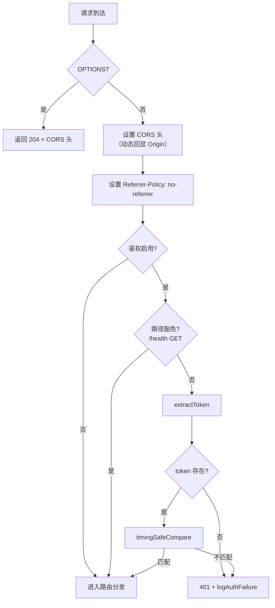
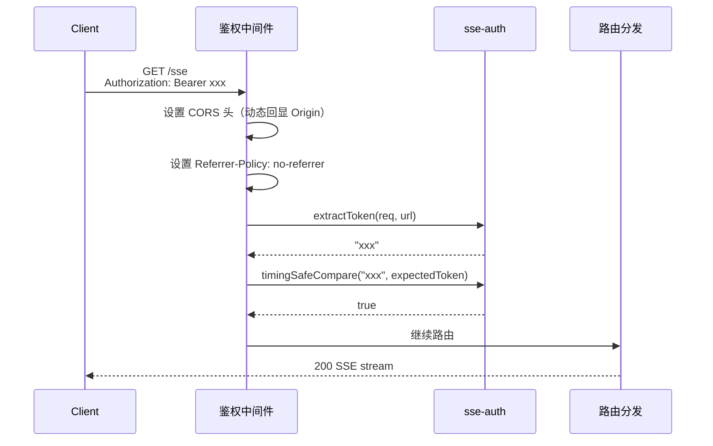

# SSE Auth 代码调整方案

## 1. 需求背景 & 目标

专家团评审发现 SSE Bearer Token 鉴权功能存在 2 个致命缺陷（CORS 自相矛盾、Query token 泄露）、1 个生产 Bug（extractToken 未处理 string[]）、1 个安全旁路（timingSafeCompare 时序泄露），以及鉴权逻辑模式不当和测试覆盖缺口。

**目标：**
- P0：修复 CORS 配置，使浏览器端 Bearer token 可用
- P0：修复 extractToken 对 `string[]` 的处理，消除生产 Bug
- P0：修复 timingSafeCompare 时序旁路，消除 token 长度泄露
- P1：翻转鉴权逻辑为默认保护 + 白名单豁免
- P1：添加 Query token 缓解措施（Referrer-Policy + 启动 WARN）
- P1：补充 HTTP 中间件集成测试
- P1：删除 `void AUTH_ENV_VAR` 死代码

## 2. 名词术语表

| 术语 | 含义 |
|------|------|
| CORS 动态回显 | 仅当请求携带 `Origin` 头时，回显该值到 `Access-Control-Allow-Origin`，并设置 `Vary: Origin`；无 Origin 时不设 CORS 头 |
| 时序安全比较 | 使用 `crypto.timingSafeEqual` 进行常量时间比较，无论输入长度是否一致，比较操作耗时恒定 |
| 鉴权白名单豁免 | 默认所有路径需鉴权，仅 `/health`（GET）和 OPTIONS 方法显式豁免 |
| Dummy buffer | 固定长度的零值 Buffer，用于在长度不一致时执行等时耗哑比较，消除长度旁路 |

## 3. 现状分析（AS-IS）

| 问题 | 位置 | 影响 |
|------|------|------|
| `Access-Control-Allow-Origin: *` + `Allow-Headers: Authorization` | `mcp-server-sse.ts:109-111` | 浏览器 CORS 策略禁止在 `Origin: *` 时发送 Authorization，Bearer 鉴权在浏览器端完全不可用 |
| `extractToken` 跳过 `string[]` | `sse-auth.ts:107` | 反向代理（AWS ALB 等）可能将 authorization 头合并为数组，导致合法请求被拒 |
| `timingSafeEqual(bufA, bufA)` 哑比较 | `sse-auth.ts:143-150` | 哑比较耗时 = bufA.length（攻击者输入），可推断 expectedToken 字节长度；超长输入可 DoS |
| 鉴权条件精确匹配 `/sse`、`/message` | `mcp-server-sse.ts:125-128` | 未来新增路由易遗漏鉴权；违反"默认拒绝"原则 |
| 无 `Referrer-Policy` 头 | `mcp-server-sse.ts` | Query token 可通过 Referer 头泄露到第三方 |
| `void AUTH_ENV_VAR` | `mcp-server-sse.ts:252` | 死代码，增加认知负担 |

## 4. 方案设计（TO-BE）

### 4.1 CORS 修复

仅当请求携带 `Origin` 头时动态回显，否则不设 CORS 头。同时添加 `Vary: Origin` 防止 CDN 缓存错乱。

**被否决方案：** 完全移除 CORS 头——会破坏已有浏览器端 EventSource 客户端。

### 4.2 extractToken 数组处理

当 `authorization` 为 `string[]` 时取第一个元素；若数组为空则视为未携带。

### 4.3 timingSafeCompare 修复

- 引入模块级常量 `DUMMY_BUF = Buffer.alloc(32)`（32 字节覆盖典型 token 长度）
- 长度不一致时执行 `timingSafeEqual(DUMMY_BUF, DUMMY_BUF)`，耗时恒定
- 输入 token 长度超过 1024 字节直接返回 false，防御超长输入 DoS

**被否决方案：** HMAC-based 比较——引入额外密钥管理复杂度，收益不足以抵消。

### 4.4 鉴权逻辑翻转

将条件从"仅保护 /sse 和 /message"改为"保护所有路径，豁免 /health GET 和 OPTIONS"。

### 4.5 Query token 缓解

- 所有响应添加 `Referrer-Policy: no-referrer` 头
- 启动日志：当鉴权启用时，打印 WARN 提示 Query token 的日志泄露风险

### 4.6 死代码清理

删除 `void AUTH_ENV_VAR;` 行及对应的 `AUTH_ENV_VAR` import。

## 5. 架构图 / 流程图



## 6. 模块/类设计

### 6.1 `sse-auth.ts` 变更

| 函数 | 变更类型 | 说明 |
|------|---------|------|
| `extractToken` | 修改 | 处理 `authorization` 为 `string[]` 的情况 |
| `timingSafeCompare` | 修改 | 用 `DUMMY_BUF` 替代 `bufA` 自比较；添加输入长度上限 1024 |
| `DUMMY_BUF` | 新增 | 模块级 `Buffer.alloc(32)` 常量 |
| `MAX_TOKEN_LENGTH` | 新增 | 模块级常量 `1024`，导出供测试引用 |

### 6.2 `mcp-server-sse.ts` 变更

| 位置 | 变更类型 | 说明 |
|------|---------|------|
| CORS 头设置 | 修改 | `Allow-Origin` 改为动态回显 `req.headers.origin`；添加 `Vary: Origin`；无 Origin 时不设 CORS 头 |
| `Referrer-Policy` | 新增 | 所有响应添加 `Referrer-Policy: no-referrer` |
| 鉴权中间件条件 | 修改 | 从黑名单保护翻转为白名单豁免 |
| `void AUTH_ENV_VAR` | 删除 | 移除死代码及对应 import |
| 启动日志 | 修改 | 鉴权启用时增加 Query token WARN |

## 7. 接口设计

### 7.1 `extractToken` 新逻辑（签名不变）

```typescript
// sse-auth.ts — 内部逻辑变更，签名不变
export function extractToken(
  req: Pick<IncomingMessage, "headers">,
  url: URL,
): string | null
```

变更点：`req.headers.authorization` 为 `string[]` 时取 `[0]`。

### 7.2 `timingSafeCompare` 新逻辑（签名不变）

```typescript
// sse-auth.ts — 内部逻辑变更，签名不变
export function timingSafeCompare(a: string, b: string): boolean
```

变更点：长度不一致时用 `DUMMY_BUF` 哑比较；`a.length > MAX_TOKEN_LENGTH` 直接返回 false。

### 7.3 新增导出常量

```typescript
export const MAX_TOKEN_LENGTH = 1024;
```

## 8. 数据模型

不涉及

## 9. 关键流程时序图



## 10. 异常处理 & 边界情况

| 场景 | 处理方式 | 是否对外暴露 |
|------|---------|-------------|
| `authorization` 为空数组 | 视为未携带，回退 query token | 否（内部逻辑） |
| `authorization` 为多元素数组 | 取 `[0]`，忽略后续 | 否 |
| 输入 token 超 1024 字节 | 直接返回 false，不执行比较 | 否（返回 401） |
| 请求无 `Origin` 头 | 不设 CORS 头，不设 `Vary: Origin` | 否 |
| `Origin` 头为空字符串 | 不设 CORS 头 | 否 |
| 未知路径 + 鉴权启用 | 返回 401（翻转后默认保护） | 是（401） |

## 11. 性能 & 安全考虑

**性能：** `DUMMY_BUF` 固定 32 字节，`timingSafeEqual` 耗时恒定且极短（微秒级），无性能影响。输入长度上限 1024 防御超长 token DoS。

**安全：**
- CORS 动态回显消除了 `Origin: *` 与 Bearer 的矛盾，使浏览器端鉴权可用
- `Referrer-Policy: no-referrer` 阻止 Query token 通过 Referer 泄露到第三方（服务端日志泄露仍存在，需文档提示）
- Dummy buffer 消除 token 长度旁路，攻击者无法通过时序推断 token 长度
- 鉴权默认保护消除未来路由遗漏风险

## 12. 测试方案

### 12.1 单测变更（`test/unit/sse-auth.test.mjs`）

| 新增用例 | 覆盖点 |
|---------|--------|
| `extractToken` authorization 为 `string[]` | 取 `[0]` |
| `extractToken` authorization 为空数组 `[]` | 回退 query |
| `timingSafeCompare` 超长输入（>1024） | 直接返回 false |
| `MAX_TOKEN_LENGTH` 导出值 | 等于 1024 |

### 12.2 HTTP 中间件集成测试（新增 `test/sse-auth-middleware.test.mjs`）

使用 `node:http` 创建真实 HTTP server，通过 `createServer` 直接注入中间件逻辑，不依赖 LanceDB runtime。

| 用例 | 请求 | 期望响应 |
|------|------|---------|
| 无 token → 401 | `GET /sse` | 401 + `WWW-Authenticate: Bearer` |
| 有效 token → 200 | `GET /sse` + `Authorization: Bearer <valid>` | 路由正常处理 |
| 无效 token → 401 | `GET /sse` + `Authorization: Bearer <invalid>` | 401 |
| OPTIONS 豁免 | `OPTIONS /sse` | 204（无鉴权） |
| /health GET 豁免 | `GET /health` | 200（无鉴权） |
| CORS 有 Origin | `GET /health` + `Origin: http://app.test` | `Allow-Origin: http://app.test` + `Vary: Origin` |
| CORS 无 Origin | `GET /health` | 无 `Allow-Origin` 头 |
| Referrer-Policy | 任意请求 | `Referrer-Policy: no-referrer` |
| 未知路径 + 鉴权 | `GET /unknown` + 无 token | 401（翻转后默认保护） |
| Query token | `GET /sse?token=<valid>` | 路由正常处理 |

## 13. 实施计划 / 里程碑

| 批次 | 范围 | 产出物 | 依赖 | 风险 | 验收标准 |
|------|------|--------|------|------|---------|
| B1 | P0 修复：CORS + extractToken + timingSafeCompare | `sse-auth.ts`、`mcp-server-sse.ts` 代码变更 + 单测更新 | 无 | CORS 回显可能被 CDN 缓存→`Vary: Origin` 已覆盖 | 所有现有单测通过 + 3 个新单测通过 |
| B2 | P1 增强：鉴权翻转 + Referrer-Policy + 启动 WARN + 死代码清理 + 集成测试 | `mcp-server-sse.ts` 代码变更 + 新集成测试文件 | B1 | 鉴权翻转可能影响非标准路径→集成测试覆盖 | 集成测试全部通过 + 无死代码 |

## 14. 风险 & 待定问题

| 风险 | 影响 | 缓解 |
|------|------|------|
| 浏览器端 EventSource 仍需 Query token（API 限制），Query token 仍会泄露到服务端日志 | 中 | 本次仅添加 Referrer-Policy + 启动 WARN；一次性 ticket 机制作为 v2 改进项 |
| CORS 动态回显可能被缓存代理误缓存 | 低 | `Vary: Origin` 头已覆盖主流缓存代理 |
| 集成测试需要模拟中间件逻辑但不启动 LanceDB runtime | 低 | 提取中间件为可独立测试的函数，或直接构造简易 HTTP server |
