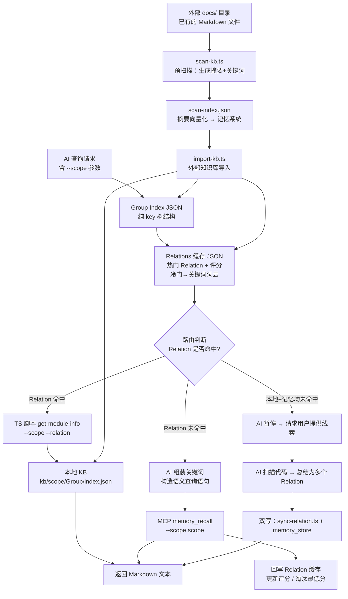
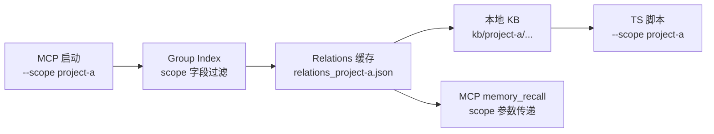
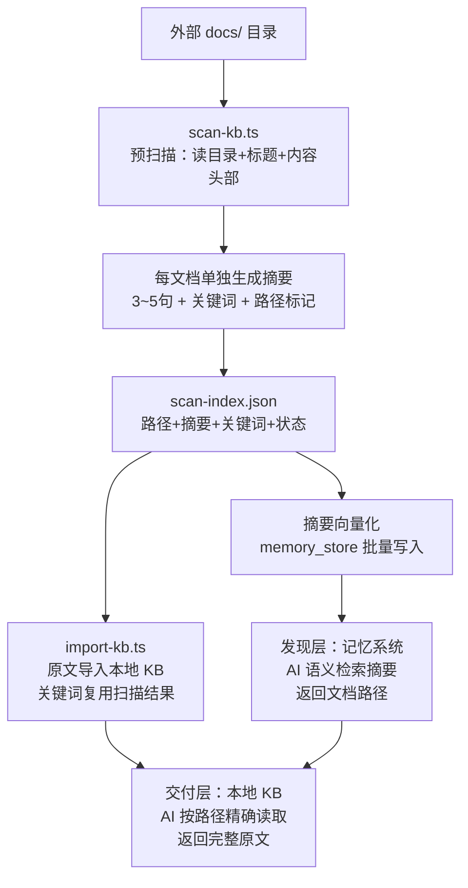
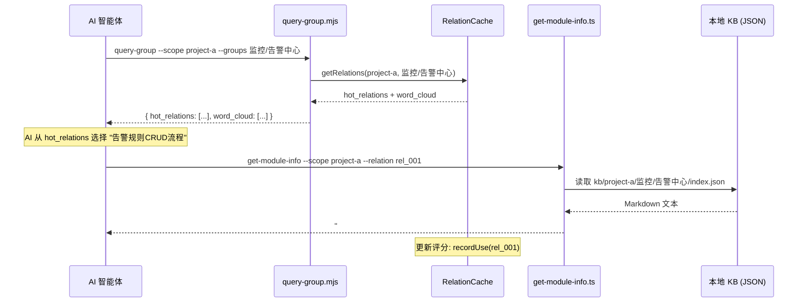
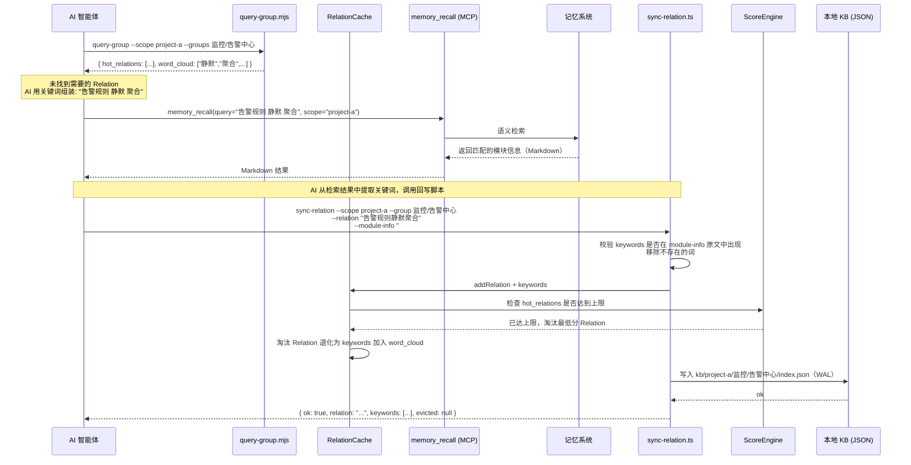
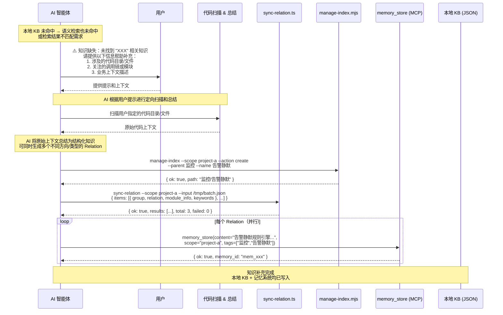
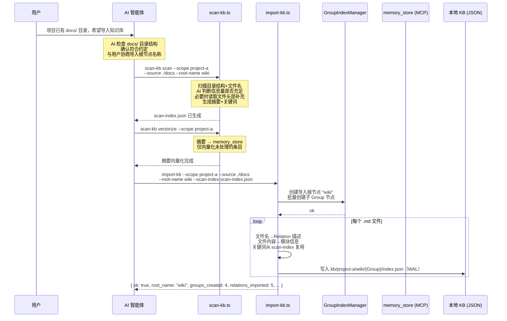
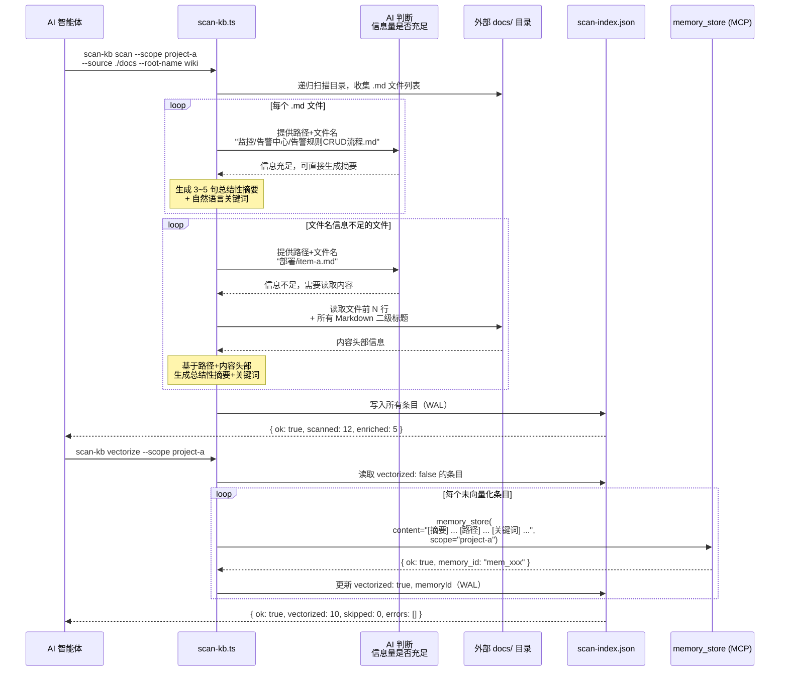

# 02 架构设计

> - 状态：修订版 v2
> - 起草时间：2026-05-25
> - 关联文件：[01-overview.md](01-overview.md)、[03-data-model.md](03-data-model.md)、[04-scoring.md](04-scoring.md)

## 1. 方案概述

在 memory-lancedb-pro 上层构建「Group 树索引 → Relations 缓存 → 本地 KB」三层文件系统。AI 通过一次 Group 索引查询获得项目知识全景；热门 Relation 直接走本地 JSON（<10ms），冷门 Relation 退化为关键词词云，AI 自行组装后走记忆系统语义检索。外部知识库导入采用「摘要做发现、原文做交付」双层架构：预扫描生成摘要+关键词 → 摘要向量化存入记忆系统 → 原文导入本地 KB。所有路径贯穿 scope 命名空间。

## 2. 关键决策点

| 决策 | 选择 | 理由 | 被否决方案 |
|------|------|------|-----------|
| 本地 KB 存储 | JSON 文件 + 目录分层 | 零依赖、可 Git 版本控制、TS 脚本一行解析 | LanceDB：过度设计；SQLite：引入额外依赖 |
| 模块信息格式 | Markdown 纯文本 + 代码定位符 | LLM 天然理解、人可直接读写 | 纯结构化 JSON：字段模板僵化 |
| 淘汰策略 | 最低评分淘汰 | 与 Weibull 衰减思路一致，保留真正热门 | LRU 末尾淘汰：可能淘汰低频但重要的 Relation |
| 淘汰后处理 | 退化为关键词保留在词云 | 不丢失语义锚点，仍可通过关键词回退检索 | 直接删除：数据彻底丢失，冷启动代价高 |
| 查询脚本实现 | JS 脚本（`.mjs`） | 项目已有 jiti 基础设施，直接运行 | TS 需额外编译步骤 |
| 模块检索脚本 | TS 脚本（`.ts`） | 可用 jiti 直接执行，类型安全 | JS 无类型，容易传错参数 |
| Scope 传递 | 全链路显式 `--scope` 参数 | 与 MCP 启动参数一致，无需额外配置 | 环境变量：隐式传递易出错 |
| 记忆系统写入 | 仅通过 MCP `memory_store` 写入 | 记忆系统为权威数据源，本地 KB 是只读缓存副本 | 本地 KB 直接写入：导致双写一致性问题 |
| 关键词规则 | 禁止代码符号，仅自然语言 | 代码路径/类名/方法名会引入噪音，降低语义检索精度 | 允许代码符号：检索时路径信息干扰向量匹配 |
| 导入知识关键词 | 由预扫描统一生成 | 预扫描时已生成摘要+关键词，导入时直接复用 | 导入时不生成：语义检索完全不可见 |
| 导入知识向量化 | 仅摘要向量化 | 摘要语义密度高、匹配质量好、成本极低 | 原文向量化：成本高且语义噪音大 |
| 预扫描渐进式读取 | AI Agent 自主判断 | AI 理解语义，可动态决定是否需要读取内容头部 | 固定阈值：不够智能 |
| 导入根节点 | 独立根节点隔离 | 避免自建知识与导入知识混合 | 共享根节点：两类知识混在一起 |
| 数据一致性 | 自动同步机制 | Agent 发现记忆不存在时自动同步 | 一致性检查：增加复杂度 |
| 并发写入 | WAL 模式 | 临时文件→原子 rename，可靠且简单 | 乐观锁（时间戳）：不可靠 |
| 评分机制 | 简化使用密度公式 | `score = useCount / (1 + hoursSinceLastUse / halfLifeHours)`，冷启动友好、无阶梯突变 | 密度+活跃度+边界衰减：过于复杂 |
| 热门索引机制 | 新兴热区 + 历史热区 | 新兴热区有保留席位，历史热区按评分排序 | 全量返回：信息过载 |
| 衰减机制 | 边界衰减（纯函数） | 只在内容进入热区时触发衰减，计算量 O(1)，纯函数无副作用 | 实时衰减：计算量大 |
| 并发导入 | 拆分合并机制 | 每个 Agent 单独创建索引，完成后合并 | 直接并发写入：可能导致索引冲突 |
| 数据版本控制 | version 字段 | JSON 文件加 version + 向后兼容策略 | 无版本：模型变更时数据丢失 |
| 增量扫描 | git commit diff | `git diff --name-status` 检测 A/M/D，零额外依赖，1 个全局字段 | fileHash/mtime：每条 entry 加字段，复杂度高 |

## 3. 架构图

### 3.1 总体数据流

### 3.2 Scope 隔离层次

### 3.3 外部知识库双层架构（发现层 + 交付层）

**架构要点**：
- **发现层**（摘要 → 记忆系统）：摘要语义密度高，向量化成本低，匹配质量优于原文
- **交付层**（原文 → 本地 KB）：完整文档内容，零网络成本，精确路径读取
- **运行时两步查询**：`memory_recall` 匹配摘要 → 提取路径 → `get-module-info` 读取原文
- **渐进式读取**：AI Agent 自主判断是否需要读取文件内容头部来丰富摘要
- **摘要生成规范**：每个文档单独生成摘要，不复用文档开头内容，需综合判断文档所在路径信息，摘要最后一行必须包含实际存储路径（相对路径）

## 4. 模块设计

### 4.1 模块清单

| 模块 | 职责 | 依赖 |
|------|------|------|
| **GroupIndexManager** | Group 树的增删查：新建节点（需父节点）、读取整棵树、校验合法路径 | 无 |
| **RelationCache** | Relations 缓存的读写、评分更新、最低分淘汰、关键词词云生成 | GroupIndexManager, ScoreEngine |
| **KnowledgeBaseStore** | 本地 KB 的读取和写入：按 scope + Group 路径定位 index.json，读写 Markdown | 无 |
| **RelationSyncEngine** | 记忆系统 → 本地 KB 同步：调用 MCP memory_recall 获取结果，写入本地 KB + 更新缓存 | KnowledgeBaseStore, RelationCache |
| **QueryRouter** | 双路径路由：接收 Group + Relation，先查 RelationCache，命中走本地 KB，未命中走同步引擎 | RelationCache, RelationSyncEngine |
| **SyncRelationScript** | 回写脚本：接收 AI 提供的 relation + 模块信息 + 关键词，校验关键词真实性，写入 Relation 缓存 + 本地 KB；支持批量 JSON 输入 | RelationCache, KnowledgeBaseStore |
| **KnowledgeGapDetector** | 知识缺失检测：当本地 KB 和记忆系统均未命中时，触发知识补充流程 | 无 |
| **KbImporter** | 外部知识库导入：扫描外部目录，按映射规则转换为 Group/Relation 结构，批量写入本地 KB | GroupIndexManager, SyncRelationScript |
| **KbScanner** | 外部知识库预扫描：扫描外部目录结构+文件标题，支持 git 增量扫描（A/M/D 变更检测），AI 自主判断是否读取内容头部，为每篇文档生成总结性摘要+关键词，写入 scan-index.json | GroupIndexManager |
| **ScoreEngine** | 评分计算与淘汰：简化使用密度评分、纯函数边界衰减、新兴热区保留席位 | 无 |

### 4.2 关键模块设计要点

- **GroupIndexManager**：
  - 公开方法：`createNode(parentPath, nodeName)`, `createRoot(rootName)`, `getTree(scope)`, `validatePath(path)`
  - 支持多根节点（`roots` 对象），默认根节点为"项目根"，导入根节点由 `--root-name` 指定
  - 单向树（只支持叶子→根查找），不支持任意图结构

- **RelationCache**：
  - 公开方法：`getRelations(scope, group)`, `addRelation(scope, group, relation, keywords, isImported)`, `generateWordCloud(scope, group, excludeIds)`
  - 热门 Relation 数量上限可配置（默认 10），超出转为词云
  - 导入的 Relation 标记 `isImported: true`，不参与评分淘汰，不参与新兴热区

- **QueryRouter**：
  - 公开方法：`route(scope, group, relation?)` → 返回 Markdown 文本
  - `route()` 内部自动决策，调用方无感知

- **SyncRelationScript**：
  - 公开方法：`sync(scope, group, relationText, moduleInfo, keywords)`, `syncBatch(scope, items)`
  - 关键词两层校验：真实性校验 + 代码符号校验
  - 关键词提取交给 AI，脚本只做校验和写入

- **KbImporter**：
  - 公开方法：`import(scope, sourceDir, rootName, mappingConfig, scanIndex?)`
  - 约定模式（零配置）+ 配置模式（映射文件）
  - 关键词复用预扫描结果

- **KbScanner**：
  - 公开方法：`scan(scope, sourceDir, rootName)`, `vectorize(scope, scanIndex)`
  - 保持为 CLI 工具，与 AI Agent 通过结构化 JSON 交互
  - 渐进式读取由 AI 判断

- **ScoreEngine**：
  - 公开方法：`calculateScore(useCount, hoursSinceLastUse, halfLifeHours)`, `boundaryDecay(hotItems, warmItems, newScore, decayStep)`
  - 简化公式：`score = useCount / (1 + hoursSinceLastUse / halfLifeHours)`
  - 边界衰减为纯函数，返回新对象

## 5. 关键流程时序图

### 5.1 快速路径（Relation 命中）

### 5.2 检索路径（Relation 未命中 → 语义检索 → 回写）

### 5.3 知识缺失路径（本地 KB + 记忆系统均未命中 → 扫描补充）

**关键规则**：
- **必须暂停请求用户**：AI 不可自行猜测或跳过缺失知识
- **用户提示是扫描起点**：AI 根据用户提供的目录、文件、上下文进行定向扫描
- **一次扫描多处总结**：一次扫描可产出多个不同方向/类型/Group 的 Relation
- **双写保证一致**：本地 KB 和记忆系统必须同时写入
- **Group 按需创建**：如果目标 Group 不存在，AI 先调用 `manage-index.mjs` 创建

### 5.4 外部知识库导入路径（约定模式）

### 5.5 预扫描路径（外部知识库 → 摘要生成 → 向量化）

**关键规则**：
- **渐进式读取由 AI 判断**：不依赖固定阈值，AI 自主决定是否需要读取文件内容头部
- **摘要质量优先**：每篇文档 3~5 句总结性描述，不是标题复述
- **关键词禁止代码符号**：仅自然语言词汇
- **摘要向量化格式含路径标记**：`[摘要] ... [路径] ... [关键词] ...`
- **增量向量化**：仅处理 `vectorized: false` 的条目
