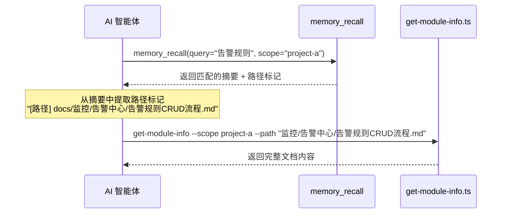
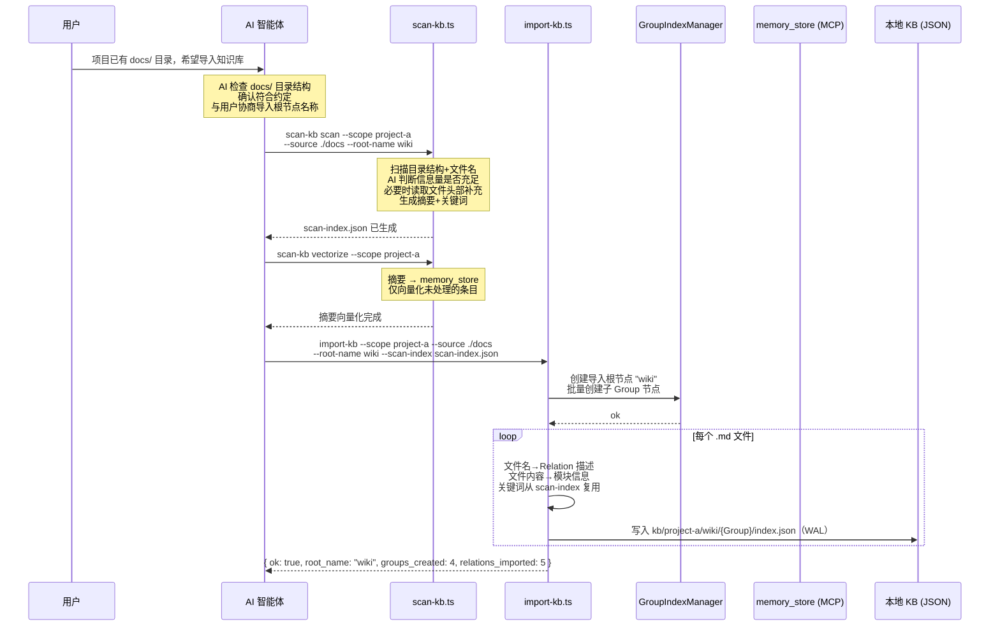
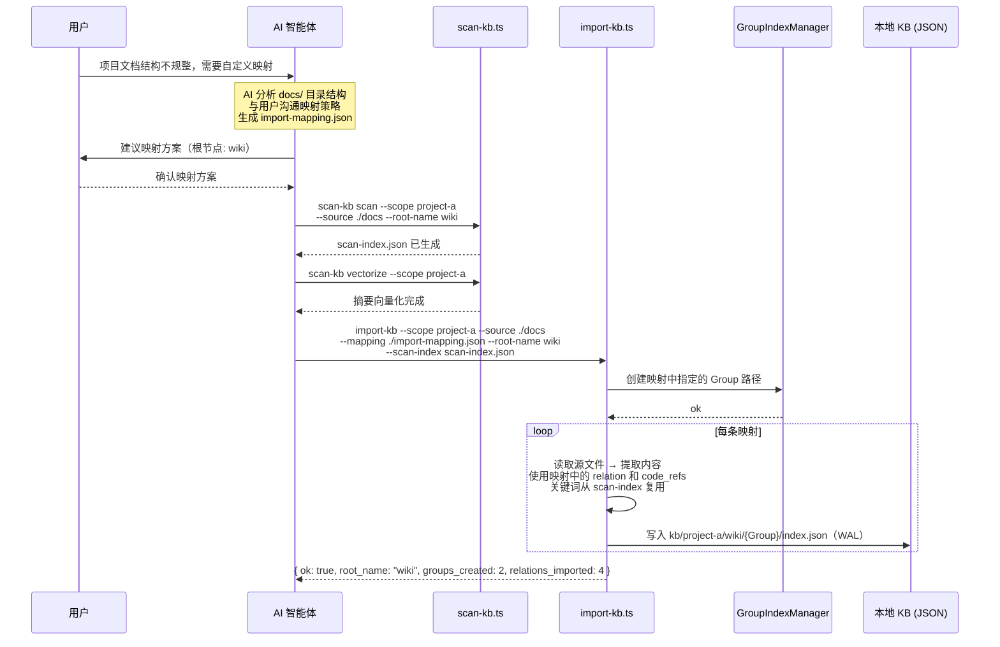

# 07 外部知识库导入

> - 状态：修订版 v2
> - 起草时间：2026-05-25
> - 关联文件：[03-data-model.md](03-data-model.md)、[05-scripts.md](05-scripts.md)
> - 评审改进：P0-scan-kb保持CLI+AI交互协议、P2-向量化事务写入

## 1. 概述

外部知识库导入采用「摘要做发现、原文做交付」双层架构：

- **发现层**：预扫描为每篇文档生成 3~5 句摘要 + 关键词 → 摘要向量化存入记忆系统
- **交付层**：原文存入本地 KB，按路径精确读取

**运行时两步查询**：`memory_recall` 匹配摘要 → 提取路径 → `get-module-info` 读取原文

## 2. 摘要生成规范

### 2.1 摘要生成原则

- **独立生成**：每个文档必须单独生成摘要，不复用文档开头内容
- **路径感知**：摘要需综合判断文档所在路径信息
- **结构化**：3~5 句总结性描述，涵盖核心职责、关键流程、涉及模块
- **路径标记**：摘要最后一行必须包含 `[路径] {relativePath}`

### 2.2 摘要格式

```
[摘要正文]
[路径] {relativePath}
```

**示例**：

```
告警中心下的规则管理模块，支持静态/动态阈值规则的创建、查询、更新、删除。规则创建时校验阈值合法性，支持静默聚合和分级触发。涉及 AlertController、AlertService、AlertRepository 三层调用链。
[路径] docs/监控/告警中心/告警规则CRUD流程.md
```

### 2.3 摘要质量标准

- **长度**：3~5 句总结性描述
- **内容覆盖**：核心职责 + 关键业务流程 + 涉及模块
- **路径信息**：最后一行必须包含 `[路径]` 标记
- **禁止**：不复述标题、不使用文档开头内容、不包含完整原文

## 3. 向量化方案

### 3.1 向量化内容格式

写入记忆系统的内容格式：

```
[摘要] {summary 文本}
[路径] {relativePath}
[关键词] {keywords 逗号分隔}
```

### 3.2 向量化流程

1. 读取 scan-index.json
2. 筛选 `vectorized: false` 的条目（含增量 M 类变更重置的条目）
3. 对每条摘要调用 `memory_store` 写入记忆系统
   - 有 `memoryId` 的条目：覆盖写入（增量 M 类变更）
   - 无 `memoryId` 的条目：新建写入（A 类新增）
4. 写入成功后立即更新 `vectorized: true` + `memoryId`（WAL 写入 scan-index.json）

### 3.3 向量化状态事务性写入（评审 P2 改进）

**问题**：memory_store 成功但更新 scan-index.json 失败 → 重复向量化

**解决方案**：
1. 调用 memory_store 写入记忆系统
2. 成功后立即 WAL 写入 scan-index.json（临时文件→原子 rename）
3. 如果 scan-index.json 写入失败，下次 vectorize 时该条目仍为 `false`，会重复调用 memory_store（幂等，记忆系统覆盖写入）

### 3.4 增量扫描机制

> **O8 决策更新**：使用 git commit diff 实现增量扫描，非 git 仓库退化为全量扫描。

### 3.4.1 设计原理

绝大多数项目的 docs 目录在 git 仓库内，git 本身就是最可靠的变更检测引擎：
- `git diff --name-status {oldCommit} HEAD` 直接返回 A/M/D 标记
- 基于 blob SHA1，绝对精确，无假阳性
- scan-index.json 只需 1 个字段（`lastScannedCommit`），无需每条 entry 加 fileHash

### 3.4.2 模式判定

| 条件 | 扫描模式 |
|------|---------|
| `--source` 在 git 仓库内 + `lastScannedCommit` 有值 | **增量扫描** |
| `--source` 在 git 仓库内 + `lastScannedCommit` 无值 | 全量扫描，记录当前 commit |
| `--source` 不在 git 仓库内 | 全量扫描（当前行为） |

### 3.4.3 增量变更处理

```bash
# 获取变更列表
git diff --name-status a1b2c3d HEAD -- docs/
# 输出：
# A       docs/监控/新增模块.md
# M       docs/部署/更新文档.md
# D       docs/废弃文档.md
```

| 变更类型 | scan-index 处理 | 记忆系统处理 | 本地 KB 处理 |
|---------|----------------|-------------|-------------|
| A（新增） | 新增条目，vectorized=false | vectorize 时 memory_store 新建 | import-kb 写入 |
| M（修改） | 重置 summary/keywords，vectorized=false，保留 memoryId | vectorize 时 memory_store 覆盖（同 memoryId） | import-kb 覆盖写入 |
| D（删除） | 移除条目 | scan 合并结果时 memory_forget(memoryId) | import-kb 移除 Relation + index.json 条目 |

### 3.4.4 增量扫描完成

扫描合并完成后，更新 `lastScannedCommit = HEAD`（WAL 写入 scan-index.json）。

### 3.4.5 降级与安全

- git 命令执行失败 → 退化为全量扫描，输出 warning
- `lastScannedCommit` 指向的 commit 不存在（如 rebase 后）→ 退化为全量扫描
- 首次全量扫描自动记录当前 commit，后续自动增量

## 4. 运行时两步查询

### 4.1 查询流程



### 4.2 路径提取规则

- 格式：`[路径] {relativePath}`
- 提取方式：查找 `[路径]` 标记后的相对路径
- 路径转换：将相对路径转换为本地 KB 中的完整路径

## 5. 导入流程

### 5.1 约定模式导入



### 5.2 配置模式导入



## 6. 导入关键规则

- **根节点隔离**：导入的外部知识库必须在独立的根节点下（如"wiki"），与自建知识的"项目根"严格隔离
- **预扫描先行**：导入前先执行 `scan-kb.ts` 生成摘要+关键词并摘要向量化，导入时通过 `--scan-index` 复用关键词
- **摘要做发现、原文做交付**：摘要向量化后 AI 可通过语义检索发现知识路径，再按路径精确读取本地 KB 原文
- **约定优先**：目录结构清晰时零配置导入
- **配置兜底**：目录结构不规整时由 AI 与用户协商生成映射配置
- **幂等安全**：重复导入同一目录不会产生重复 Relation，已存在的 Relation 会被覆盖更新
- **导入知识不参与新兴热区**：`isImported: true` 的 Relation 不参与新兴热区席位分配
- **增量扫描**：使用 git commit diff 检测变更（A/M/D），非 git 仓库退化为全量扫描（O8 更新，详见 §3.4）
- **摘要质量**：初期纯 AI 判断，不引入人工抽检；上线后根据反馈决定（O9 决策）
- **关键词白名单**：初期禁止代码符号，不增加技术术语白名单；后续可迭代增加（O10 决策）
