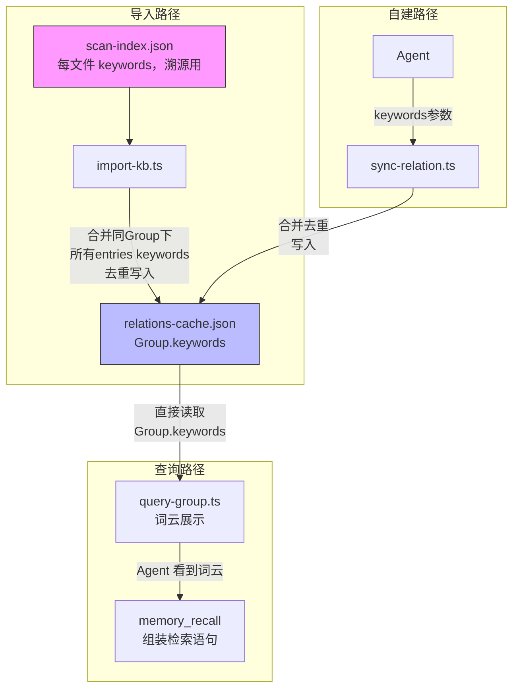
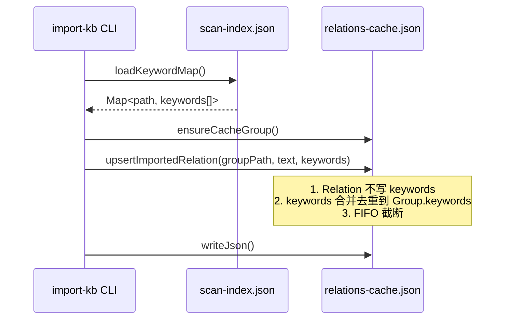
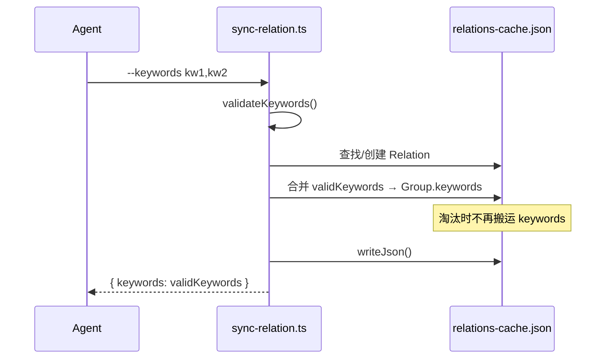

# Keywords Group 级别重构设计文档

> 状态：草案
> 起草时间：2026-05-26
> 关联文件：[03-data-model.md](03-data-model.md)、[05-scripts.md](05-scripts.md)

## 1. 需求背景 & 目标

当前 keywords 在 `relations-cache.json` 中存在 3 份冗余：`Relation.keywords`、`word_cloud_keywords`、`scan-index.json`。淘汰 Relation 时需搬运 keywords 到 word_cloud，query-group 需遍历合并 N 个 Relation.keywords 才能展示词云。

**目标**：
1. 消除 keywords 冗余：3 份 → 2 份（`Group.keywords` + `scan-index.json`）
2. 简化逻辑：删除淘汰退化搬运代码
3. 提升检索精度：Agent 直接从 Group.keywords 组装 memory_recall 查询

## 2. 名词术语表

| 术语 | 含义 |
|------|------|
| `Group.keywords` | 新字段，替代 `word_cloud_keywords`，存储 Group 级主题标签 |
| `word_cloud_keywords` | 旧字段，将被重命名为 `keywords` |
| 淘汰退化逻辑 | `sync-relation.ts` 中被淘汰 Relation 的 keywords 搬运到 `word_cloud_keywords` 的代码 |
| `maxKeywordCount` | 分区配置项，keywords 上限（默认 50） |
| FIFO 截断 | 超出 maxKeywordCount 时，从头部移除最早加入的关键词 |

## 3. 现状分析（AS-IS）

当前 `relations-cache.json` 中 Group 对象结构：

```
Group {
  hot_relations: Relation[]     ← 每个 Relation 含 keywords: string[]
  word_cloud_keywords: string[] ← 淘汰 Relation 时搬运 keywords 的目标
  max_hot_count: number
}
```

**痛点**：
- `Relation.keywords` 与 `word_cloud_keywords` 语义重叠，keywords 归属粒度过细
- `sync-relation.ts` 淘汰时需搬运 keywords（L208-218），增加复杂度
- `query-group.ts` 展示词云需合并 `word_cloud_keywords` + 所有 `Relation.keywords`（L500-504），效率低
- `import-kb.ts` 将 keywords 写入 Relation 级而非 Group 级

## 4. 方案设计（TO-BE）

**核心变更**：keywords 归属从 Relation 级提升到 Group 级。

1. **删除** `Relation.keywords` 字段
2. **重命名** `word_cloud_keywords` → `keywords`（语义更清晰）
3. **import-kb**：将 scan-index 中同 Group 下所有 entries 的 keywords 合并去重写入 `Group.keywords`
4. **sync-relation**：传入的 keywords 合并去重写入 `Group.keywords`，淘汰时不再搬运
5. **query-group**：直接读取 `Group.keywords`，不再遍历合并

**被否决方案**：保留 `Relation.keywords` 但查询时忽略 → 仍有写入冗余，未根治问题。

## 5. 架构图 / 流程图



## 6. 模块/类设计

### 6.1 `import-kb.ts`

**改动点**：

| 函数 | 变更 | 说明 |
|------|------|------|
| `GroupData` 接口 | `word_cloud_keywords` → `keywords` | 字段重命名 |
| `upsertImportedRelation()` | 删除 `keywords` 参数和写入 | 不再往 Relation 写 keywords |
| `upsertImportedRelation()` | 新增：将 keywords 合并去重到 `groupData.keywords` | 写入 Group 级 |
| `ensureCacheGroup()` | 初始化 `keywords: []` 替代 `word_cloud_keywords: []` | 新建 Group 时的默认值 |

**`upsertImportedRelation` 新签名**：

```typescript
function upsertImportedRelation(
  cache: RelationsCache,
  groupPath: string,
  relationText: string,
  keywords: string[]  // 仍接收，但写入 Group 级而非 Relation 级
): void {
  const groupData = ensureCacheGroup(cache, groupPath);

  // Relation 不再存 keywords
  const existing = groupData.hot_relations.find(item => item.text === relationText);
  if (existing) {
    existing.isImported = true;
    existing.score = 0;
    existing.useCount = 0;
    existing.lastUsedTime = null;
  } else {
    groupData.hot_relations.push({
      id: generateNextId(cache),
      text: relationText,
      score: 0,
      useCount: 0,
      lastUsedTime: null,
      isImported: true,
    });
  }

  // keywords 合并去重到 Group 级
  const uniqueKw = [...new Set(keywords.map(k => k.trim()).filter(Boolean))];
  for (const kw of uniqueKw) {
    if (!groupData.keywords.includes(kw)) {
      groupData.keywords.push(kw);
    }
  }
  // FIFO 截断
  const maxKw = (cache.partition_config || DEFAULT_PARTITION_CONFIG).maxKeywordCount;
  if (groupData.keywords.length > maxKw) {
    groupData.keywords.splice(0, groupData.keywords.length - maxKw);
  }
}
```

### 6.2 `sync-relation.ts`

**改动点**：

| 函数/逻辑 | 变更 | 说明 |
|-----------|------|------|
| `GroupData` 接口 | `word_cloud_keywords` → `keywords` | 字段重命名 |
| `SyncResult` 接口 | `keywords` 字段保留（返回值仍含有效关键词列表） | Agent 需确认 |
| `syncSingleRelation()` | 删除 `existingRel.keywords` 合并逻辑（L167-169） | 不再写 Relation.keywords |
| `syncSingleRelation()` | 将 validKeywords 合并到 `groupData.keywords` | 写入 Group 级 |
| `syncSingleRelation()` | **删除** L208-219 淘汰退化搬运逻辑 | keywords 天然在 Group 级 |
| 新建 Group | `word_cloud_keywords: []` → `keywords: []` | 字段重命名 |
| `Relation` 创建 | 删除 `keywords` 字段 | Relation 不再含 keywords |

**淘汰逻辑变更**（原 L196-223）：

```typescript
// 变更前：淘汰时搬运 keywords
// 变更后：淘汰时直接移除，不搬运
if (groupData.hot_relations.length >= config.maxHotCount) {
  let minIdx = 0;
  for (let i = 1; i < groupData.hot_relations.length; i++) {
    if (groupData.hot_relations[i].score < groupData.hot_relations[minIdx].score) {
      minIdx = i;
    }
  }
  const evictedRel = groupData.hot_relations[minIdx];
  evicted = evictedRel.text;
  // 不再搬运 keywords，直接移除
  groupData.hot_relations.splice(minIdx, 1);
}
```

**keywords 合并到 Group 级**（替换原 Relation 级写入）：

```typescript
// 合并到 Group.keywords（替代原 Relation.keywords 合并）
const uniqueKw = [...new Set(validKeywords.map(k => k.trim()).filter(Boolean))];
for (const kw of uniqueKw) {
  if (!groupData.keywords.includes(kw)) {
    groupData.keywords.push(kw);
  }
}
const maxKw = config.maxKeywordCount;
if (groupData.keywords.length > maxKw) {
  groupData.keywords.splice(0, groupData.keywords.length - maxKw);
}
```

### 6.3 `lib/scoring.ts`

**改动点**：

| 类型 | 变更 | 说明 |
|------|------|------|
| `Relation` 接口 | 删除 `keywords: string[]` | Relation 不再含 keywords |

```typescript
// 变更前
export interface Relation {
  id: string;
  text: string;
  score: number;
  useCount: number;
  lastUsedTime: number | null;
  keywords: string[];      // ← 删除
  isImported: boolean;
}

// 变更后
export interface Relation {
  id: string;
  text: string;
  score: number;
  useCount: number;
  lastUsedTime: number | null;
  isImported: boolean;
}
```

## 7. 接口设计

### 7.1 `query-group.ts`

**改动点**：

| 函数 | 变更 | 说明 |
|------|------|------|
| `GroupData` 接口 | `word_cloud_keywords` → `keywords` | 字段重命名 |
| `formatGroupRelations()` compact 模式 | 直接读 `data.keywords`，不再合并 Relation.keywords | L500-504 简化 |
| `formatGroupRelations()` full 模式词云 | 直接从 `data.keywords` 读取，按分区热度标记 | L525-545 重写 |

**compact 模式简化**：

```typescript
// 变更前：合并 word_cloud_keywords + 所有 Relation.keywords
// 变更后：直接读 Group.keywords
lines.push(`关键词: ${data.keywords.join(', ')}`);
```

**full 模式词云重写**：

```typescript
// 变更前：遍历 Relation.keywords 按 hot/warm/cold 分层
// 变更后：从 Group.keywords 读取，无法按 Relation 分区热度分层
// 简化为：直接输出所有 keywords
if (data.keywords.length > 0) {
  lines.push('🏷️ 关键词词云:');
  lines.push(`└── ${data.keywords.join(', ')}`);
}
```

> **注意**：full 模式词云不再按 hot/warm/cold 分层。因为 keywords 属于 Group 级而非 Relation 级，无法按 Relation 分区归类。这是一次展示信息的简化，换来了数据模型的清晰。

### 7.2 `get-module-info.ts`

**改动点**：仅 `GroupData` 接口中 `word_cloud_keywords` → `keywords`。该脚本不读取 keywords 字段，**无逻辑改动**。

## 8. 数据模型

### 8.1 新 `relations-cache.json` 结构

```json
{
  "version": 1,
  "scope": "project-a",
  "partition_config": { "..." : "不变" },
  "groups": {
    "项目根/监控/告警中心": {
      "hot_relations": [
        {
          "id": "rel_001",
          "text": "告警规则CRUD流程",
          "score": 5.2,
          "useCount": 8,
          "lastUsedTime": 1716458400000,
          "isImported": false
        }
      ],
      "keywords": ["静默", "聚合", "升级", "值班表", "分级", "规则", "阈值", "触发条件"],
      "max_hot_count": 10
    }
  },
  "updatedAt": "2026-05-26T10:00:00Z"
}
```

**变更汇总**：

| 位置 | 变更前 | 变更后 |
|------|--------|--------|
| Group 级 | `word_cloud_keywords: string[]` | `keywords: string[]` |
| Relation 级 | `keywords: string[]` | 字段删除 |

### 8.2 数据迁移方案

**迁移脚本**：`knowledge-index/scripts/migrate-keywords.ts`

**逻辑**（幂等）：

```
对每个 scope 下的 relations-cache.json：
  1. 读取 cache
  2. 对每个 Group：
     a. 合并 word_cloud_keywords + 所有 hot_relations[].keywords → 去重
     b. 设置 Group.keywords = 合并结果
     c. 删除 Group.word_cloud_keywords
     d. 删除每个 Relation.keywords
     e. FIFO 截断到 maxKeywordCount
  3. WAL 写回
```

**幂等保证**：
- 已迁移的 Group 无 `word_cloud_keywords` 和 `Relation.keywords`，合并结果不变
- `version` 字段不变（字段增删属于兼容变更，旧版本忽略未知字段）

### 8.3 模板文件更新

`_template/relations-cache.json` 无需改动（初始 `groups: {}`，无 Group 对象）。

## 9. 关键流程时序图

### 9.1 import-kb 写入 Group.keywords



### 9.2 sync-relation 写入 Group.keywords



## 10. 异常处理 & 边界情况

| 异常场景 | 处理方式 | 是否对外暴露 |
|----------|----------|:----------:|
| 迁移中断（部分 Group 已迁移） | 幂等：已迁移 Group 无 `word_cloud_keywords`，合并结果不变 | 否 |
| `maxKeywordCount` 溢出 | FIFO 截断：从头部移除最早加入的关键词 | 否 |
| 增量导入同 Group 新文件 | keywords 合并去重，非覆盖 | 否 |
| 同一 Group 下多次 sync-relation | keywords 累积而非替换 | 否 |
| 旧数据中 Relation.keywords 含代码符号 | 迁移时原样合并（校验在 sync-relation 入口做，迁移不做二次校验） | 否 |
| 旧数据中 `word_cloud_keywords` 和 `Relation.keywords` 有重叠 | 去重合并，不重复 | 否 |

## 11. 性能 & 安全考虑

**性能**：keywords 合并去重使用 `Array.includes()` 遍历，单次 O(n)，`maxKeywordCount` 上限 50，可接受。

**安全**：无新增安全风险。keywords 校验规则不变（`sync-relation.ts` 的 `validateKeywords` 仍执行）。

## 12. 测试方案

| 测试类型 | 覆盖范围 | 验证指标 |
|----------|----------|----------|
| 单元测试 | `Relation` 类型无 `keywords` 字段 | TypeScript 编译通过 |
| 单元测试 | `GroupData` 含 `keywords` 字段 | TypeScript 编译通过 |
| 集成测试 | `import-kb` 后 `Group.keywords` = 合并去重(scan-index entries[].keywords) | 导入后验证 JSON |
| 集成测试 | `sync-relation` 后 `Group.keywords` 包含新 keywords 且去重 | 同步后验证 JSON |
| 集成测试 | `sync-relation` 淘汰后不再搬运 keywords | 淘汰后 Group.keywords 不变 |
| 集成测试 | `query-group` 词云与 `Group.keywords` 一致 | 输出文本校验 |
| 迁移测试 | 迁移后 Group.keywords 包含原所有 Relation.keywords + word_cloud_keywords | 迁移前后数据校验 |
| 迁移测试 | 迁移幂等：重复执行结果不变 | 二次迁移后数据不变 |

## 13. 实施计划 / 里程碑

| 批次 | 范围 | 产出物 | 依赖 | 验收标准 |
|------|------|--------|------|----------|
| B1 | 数据模型 + 写入路径 | `scoring.ts`/`import-kb.ts`/`sync-relation.ts` 改动 | - | import/sync 后 Group.keywords 正确；TypeScript 编译通过 |
| B2 | 读取路径 + 迁移 | `query-group.ts`/`get-module-info.ts` 改动 + `migrate-keywords.ts` | B1 | query-group 词云正确；迁移脚本幂等 |
| B3 | 测试 + 文档更新 | `test/*.test.ts` 测试数据更新 + 所有涉及文档 | B1,B2 | 测试全部通过；文档无 Relation.keywords 或 word_cloud_keywords 旧描述 |

## 14. 风险 & 待定问题

### 已知风险

1. **full 模式词云不再分层**：原 hot/warm/cold 分层基于 Relation 级 keywords，重构后 keywords 属于 Group 级，无法按 Relation 分区归类。如需恢复分层需额外设计。**接受此风险**，简化换清晰。
2. **迁移后 Relation.keywords 丢失**：迁移后单个 Relation 不再携带 keywords 信息。如需 Relation 级关键词需回查 `scan-index.json` 或 `local KB index.json`。**接受**，Group 级 keywords 覆盖场景足够。

### 待定问题

- 无

### 文档更新清单

| 文档 | 更新内容 |
|------|----------|
| `docs/knowledge-index/03-data-model.md` | §4 Relations 缓存示例和设计要点 |
| `docs/knowledge-index/05-scripts.md` | import-kb / sync-relation / query-group 参数和输出说明 |
| `docs/knowledge-index/architecture.md` | 如有关键词相关描述 |
| `docs/knowledge-index/workflows.md` | 如有关键词相关描述 |
| `docs/知识索引SKILL_设计文档.md` | L776/789/802-803 的 `word_cloud_keywords` |
| `docs/Relations和关键词展示_设计文档.md` | L316 的 `word_cloud_keywords` |
| `docs/knowledge-index/09-testing.md` | L97 的 `word_cloud_keywords` |
