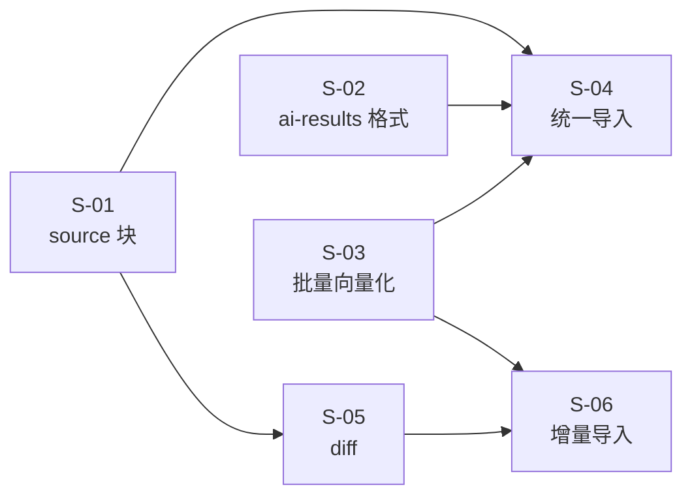
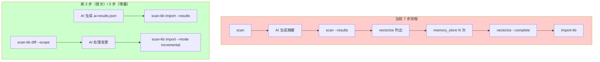
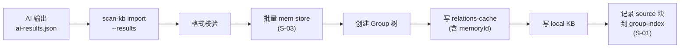

# 外部知识库导入流程统一化 设计文档（全局）

> - 状态：草案
> - 起草时间：2026-05-26
> - 关联子文档：
>   - [S-01 group-index source 块](scan-kb_S01_group-index-source_DESIGN.md)
>   - [S-02 ai-results.json 格式扩展](scan-kb_S02_ai-results-format_DESIGN.md)
>   - [S-03 CLI 批量 mem store 向量化](scan-kb_S03_cli-batch-vectorize_DESIGN.md)
>   - [S-04 统一导入命令](scan-kb_S04_unified-import_DESIGN.md)
>   - [S-05 增量 diff 子命令](scan-kb_S05_diff-subcommand_DESIGN.md)
>   - [S-06 增量导入](scan-kb_S06_incremental-import_DESIGN.md)
> - 实施范围：`knowledge-index/scripts/scan-kb.ts` 重构，`import-kb.ts` 内嵌，`scope.ts` / `relations-cache.json` / `group-index.json` 扩展

## 1. 需求背景 & 目标

### 1.1 背景

当前将外部 Markdown 知识库导入 knowledge-index 需要 **7 个步骤**：scan 生成待处理列表 → AI 生成摘要 → scan --results 合并 → vectorize 列出待向量化 → memory_store 逐条写入 → vectorize --complete 回写 → import-kb 创建 Group 结构。其中 `scan-pending.json` 和 `scan-index.json` 是两个纯中间产物，`vectorize` 子命令只做数据搬运不做实际向量化。首次导入时这些中间产物完全不需要。

### 1.2 整体目标

- 目标 1：首次导入从 **7 步压缩到 2 步**（AI 生成 ai-results.json → 一条命令完成全部）
- 目标 2：增量更新从全量重跑改为 **3 步**（diff → AI 处理变更 → 增量导入）
- 目标 3：消除 `scan-pending.json`、`scan-index.json` 两个中间产物和 `vectorize` 子命令
- 目标 4：CLI 内建批量向量化能力，消除 AI 逐条调 MCP memory_store 的 N 次往返

### 1.3 明确不在范围内

- 不改变 `relations-cache.json` 的 partition/scoring 逻辑
- 不改变 import-kb 的 convention/mapping 两种模式的核心语义
- 不涉及 `kb/{scope}/{groupPath}/index.json` 的内容结构变更
- 不自动执行 `memory_forget`（由 AI 根据 diff 结果自行决定）

## 2. 名词术语表

| 术语 | 含义 | 易混淆点 |
|------|------|---------|
| `source` 块 | `group-index.json` 新增字段，记录 `{dir, rootName, commit}` | 不同于旧的 `scan-index.json.sourceDir`，后者将被删除 |
| `ai-results.json` | AI 输出的结构化结果文件，含顶层 `meta` + `entries[]` | `entries[]` 新增 `groupPath`、`memoryId`、`action` 字段；顶层新增 `meta:{sourceDir,rootName}` |
| `mem store` | `bin/mem.mjs store` CLI 命令，用于写入记忆 | 与 MCP 工具 `memory_store` 功能相同但无需 MCP 协议 |
| `batchVectorize` | CLI 内部函数，循环调用 `mem store` 为每条 summary 向量化 | 通过解析 stdout `Memory ID:` 行获取 memoryId |
| `diff` | 新子命令，对比 `source.commit` 与 `HEAD` 输出变更文件列表 | 不同于 `git diff`，增加 memoryId 关联输出 |

## 3. 方案设计（TO-BE）

### 3.1 整体架构

将 `scan` + `vectorize` + `import-kb` 三条独立命令合并为一条 `scan-kb import`。AI 只需生成 `ai-results.json`（首次不带 memoryId，增量可带），CLI 内部完成：格式校验 → 批量 `mem store` 向量化 → 创建 Group 树 → 写入 relations-cache + local KB → 在 group-index.json 记录 `source` 块（含 git commit hash）。增量时通过 `scan-kb diff` 获取变更列表。

### 3.2 子需求划分

| 编号 | 子需求 | 职责边界 | 对外接口概述 |
|------|--------|---------|-------------|
| S-01 | group-index.json 新增 source 块 | 类型定义 + 读/写/更新逻辑 | `getSource(scope)`, `setSource(scope, source)` |
| S-02 | ai-results.json 格式扩展 | 新增 `memoryId`、`groupPath` 字段 | `ScanResultEntry` 接口扩展 |
| S-03 | CLI 批量 mem store 向量化 | 循环调用 `mem store` 并解析 memoryId | `batchVectorize(entries, scope): Map<path, memoryId>` |
| S-04 | 统一导入命令 | 组合 S-01/S-03 + Group 创建 + 文件写入 | `scan-kb import --scope --results [--mapping]` |
| S-05 | 增量 diff 子命令 | 读 group-index.source.commit → git diff → 输出变更 | `scan-kb diff --scope` |
| S-06 | 增量导入 | 在 S-04 基础上增加增量模式 | `scan-kb import --mode incremental --results` |

### 3.3 子需求依赖关系



### 3.4 关键决策点

| 决策 | 选择 | 理由 | 备选 |
|------|------|------|------|
| memoryId 持久化位置 | `relations-cache.json` 的 hot_relation 中 | relation 维度元数据中心，与 keywords 同位置 | ❌ local KB：与模块内容耦合过紧 |
| 批量向量化方式 | `execFileSync` 调用 `mem store` CLI | 复用已有 CLI，无需新增依赖 | ❌ import createMemoryRuntime：引入运行时初始化复杂度 |
| memoryId 解析方式 | 在 `src/cli.ts` 末尾追加 `Memory ID: <id>` 行，正则匹配 | 不引入 `--json` flag，最小侵入 | ❌ `--json`：增加 CLI 维护成本 |
| 增量 modify 实现 | `mem delete <oldId>` + `mem store` 拿新 id | `memory_store` 是 create 语义，无 update；避免双写脏数据 | ❌ 复用旧 memoryId：实际产生两条独立记忆 |
| 增量 delete 实现 | `mem delete <oldId>` + 清索引 | 避免搜索返回已删除内容 | ❌ 只清索引、留记忆：搜索冗余 |
| 增量操作语义标记 | S-02 的 `entry.action` 枚举字段 | 与 add/modify 同维度，语义清晰 | ❌ `summary: "__DELETE__"`：与 summary 非空契约冲突 |
| `scan-index.json` 迁移 | 不自动迁移，存量 scope 重新导入 | 简化实现，scope 数据量小 | ❌ 自动迁移：增加维护成本 |
| import-kb.ts 处理 | 逻辑内嵌到 scan-kb.ts，原文件保留只读 | 避免破坏性删除，后续可清理 | ❌ 直接删除：影响 git history 可追溯性 |

## 4. 架构图 / 流程图

### 4.1 AS-IS（7 步）vs TO-BE（2/3 步）



### 4.2 TO-BE 核心链路



## 5. 模块/类设计（边界与契约）

### 5.1 子需求边界

| 子需求 | 拥有模块 | 协作接口 | 不暴露 |
|--------|---------|---------|--------|
| S-01 | `scope.ts` / `group-index.json` | `getSource()`, `setSource()` | source 块的内部 normalize 逻辑 |
| S-02 | `scan-kb.ts` types | `ScanResultEntry` interface | 格式校验正则 |
| S-03 | `scan-kb.ts` batch module | `batchVectorize(entries, scope)` | 并发控制 / 超时重试 |
| S-04 | `scan-kb.ts` import command | CLI entry point | Group 创建 / 文件写入细节 |
| S-05 | `scan-kb.ts` diff command | CLI entry point | git 命令拼装 |
| S-06 | `scan-kb.ts` import --mode | CLI entry point | 增量合并逻辑 |

### 5.2 跨子需求接口契约

| 接口 | 调用方 | 提供方 | 输入 | 输出 | 异常 |
|------|--------|--------|------|------|------|
| `getSource(scope)` | S-04, S-05 | S-01 | `scope: string` | `GroupIndexSource \| null` | 无（null 表示首次） |
| `setSource(scope, source)` | S-04, S-06 | S-01 | `scope, {dir, rootName, commit}` | `void` | `IOError` |
| `batchVectorize(entries, scope)` | S-04, S-06 | S-03 | `AiResultEntry[], scope` | `Map<path, memoryId>` | 部分失败 → skip+error |
| `ScanResultEntry` interface | S-04, S-06 | S-02 | TypeScript type | — | — |

```typescript
// S-03 → S-04/S-06 核心契约
interface BatchVectorizeResult {
  ok: Map<string, string>;      // path → memoryId
  errors: { path: string; error: string }[];
}
```

```typescript
// S-01 → S-04/S-05/S-06 核心契约
interface GroupIndexSource {
  dir: string;        // 外部知识库绝对路径
  rootName: string;   // Group 根节点名
  commit: string;     // git commit hash
}
```

## 6. 待设计需求

无。6 个子需求全部覆盖，一期完成。

## 7. 风险 & 待定问题

### 7.1 全局风险

| 风险 | 影响范围 | 预案 |
|------|---------|------|
| `mem store` CLI stdout 格式变化 | S-03, S-04, S-06 | 用正则解析 + 回退 JSON 解析；CI 中增加格式兼容测试 |
| 存量 scope 已有 scan-pending/index.json | S-04 | 文档注明：推荐删除旧产物重新导入，存量文件不影响新命令 |

### 7.2 跨子需求依赖风险

| 依赖 | 风险描述 | 缓解措施 |
|------|---------|---------|
| S-04 → S-03 | 批量向量化失败导致导入中断 | S-03 返回 partial result，S-04 只写成功的条目 |
| S-06 → S-05 | diff 输出格式变更 | S-05 的输出接口统一为 `DiffResult` type |

### 7.3 待定问题（Open Questions）

- [x] `mem store` 返回的 memoryId 如何从 stdout 解析 → 在 `src/cli.ts` 末尾追加 `Memory ID: <id>` 行，正则匹配
- [x] 并发 `mem store` 是否有锁冲突风险？→ 默认串行执行，一期不引入并发
