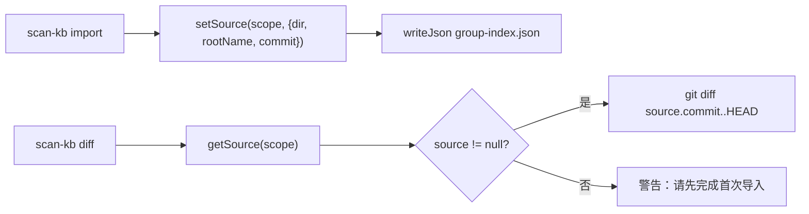
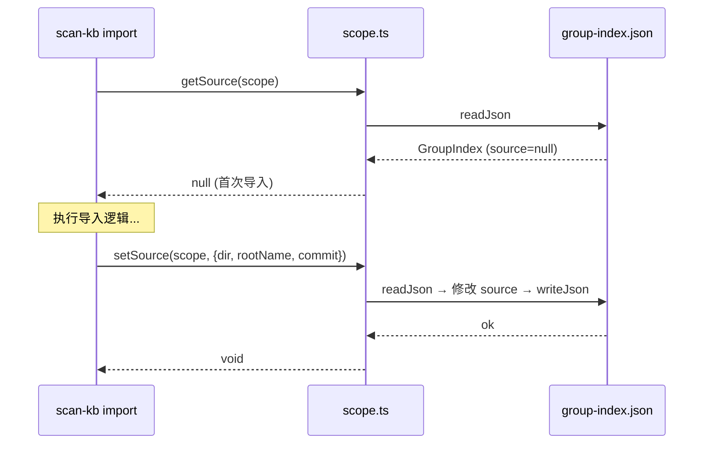

# S-01：group-index.json 新增 `source` 块 设计文档

> - 状态：草案
> - 起草时间：2026-05-26
> - 关联父文档：[scan-kb-import-unified_DESIGN.md](scan-kb-import-unified_DESIGN.md)
> - 实施范围：`knowledge-index/scripts/lib/scope.ts` 类型扩展，`scripts/import-kb.ts` 写入逻辑

## 1. 需求背景 & 目标

### 1.1 背景

当前 `group-index.json` 只存储 Group 树结构 `{version, scope, roots, updatedAt}`，不记录导入来源信息。删除 `scan-index.json` 后，git commit hash、source 目录路径、rootName 无处追踪，增量更新无法确定 diff 起点。

### 1.2 目标

- 目标 1：`group-index.json` 新增 `source` 块，记录 `{dir, rootName, commit}`
- 目标 2：提供 `getSource(scope)` / `setSource(scope, source)` 读写函数
- 目标 3：存量 `group-index.json`（无 source 块）兼容读取，返回 null

### 1.3 明确不在范围内

- 不改变 `roots` 树结构的语义和 Group 创建逻辑
- 不涉及 source 块的格式校验（由调用方 S-04 负责）

## 2. 名词术语表

| 术语 | 含义 | 易混淆点 |
|------|------|---------|
| `source` 块 | `group-index.json` 顶层新字段，标记导入来源 | 不同于旧 `scan-index.json` 的 `sourceDir` 字段 |
| `source.commit` | 导入时源仓库的 git HEAD hash | 每次 import 后更新，是 diff 的起点 |

## 3. 现状分析（AS-IS）

### 3.1 现有实现

当前 `group-index.json` 结构：

```json
{
  "version": 1,
  "scope": "mcp-test",
  "roots": { "wiki": { "部署运维": {} } },
  "updatedAt": "2026-05-26T09:47:24.823Z"
}
```

`GroupIndex` TypeScript 接口定义在 `import-kb.ts` 中，scope 元数据定义在 `scope.ts` 中。

### 3.2 痛点

- `sourceDir`、`rootName`、`lastScannedCommit` 都在 `scan-index.json` 中，删除后无处记录
- `group-index.json` 无来源追溯能力，增量更新缺少 diff 基准点

## 4. 方案设计（TO-BE）

### 4.1 方案概述

在 `GroupIndex` 接口新增 `source?: GroupIndexSource | null` 字段。首次导入时写入，增量导入时更新 `commit`。存量文件缺失时返回 `null`，调用方据此判断为首次导入。

### 4.2 关键决策点

| 决策 | 选择 | 理由 | 备选 |
|------|------|------|------|
| source 块放置位置 | `group-index.json` 顶层 | 与 roots 同级，自然归属 | ❌ 新建独立文件：增加文件碎片 |
| 旧文件兼容 | `source` 字段可选，缺失返回 null | 存量 scope 无需迁移 | ❌ 强制迁移：增加维护成本 |
| commit 更新时机 | 每次 `scan-kb import` 成功后更新 | 保证 source.commit 始终指向最后一次成功导入 | ❌ 导入前更新：失败后不一致 |

### 4.3 与现状的差异

- `GroupIndex` 接口：新增 `source?: GroupIndexSource | null`
- `scope.ts`：新增 `getSource()`、`setSource()` 函数
- `import-kb.ts`：Group 创建完成后调用 `setSource()`

## 5. 架构图 / 流程图



## 6. 模块/类设计

| 模块 | 职责 | 依赖 |
|------|------|------|
| `GroupIndexSource` interface | 定义 source 块的 TypeScript 类型 | 无 |
| `getSource(scope)` | 读 group-index.json 并返回 source 块 | `readJson`, `getGroupIndexPath` |
| `setSource(scope, source)` | 写/更新 source 块到 group-index.json | `readJson`, `writeJson`, `getGroupIndexPath` |

## 7. 接口设计

```typescript
// scope.ts 新增
interface GroupIndexSource {
  dir: string;        // 外部知识库根目录绝对路径
  rootName: string;   // Group 根节点名称
  commit: string;     // 导入时的 git HEAD commit hash
}

// 扩展已有 GroupIndex
interface GroupIndex {
  // ... 现有字段
  source?: GroupIndexSource | null;
}

function getSource(scope: string): GroupIndexSource | null;
function setSource(scope: string, source: GroupIndexSource): void;
```

| 接口 | 输入 | 输出 | 异常 |
|------|------|------|------|
| `getSource` | `scope: string` | `GroupIndexSource \| null` | 无（文件不存在返回 null） |
| `setSource` | `scope, GroupIndexSource` | `void` | IO 异常时 throw |

## 8. 数据模型

```json
// group-index.json（新增 source 块后）
{
  "version": 1,
  "scope": "mcp-test",
  "roots": { "wiki": { "部署运维": {} } },
  "updatedAt": "2026-05-26T10:30:00.000Z",
  "source": {
    "dir": "/root/memory-lancedb-pro/mcp-wrapper/.qoder/repowiki/zh/content",
    "rootName": "wiki",
    "commit": "9af06f67670476c9689cc186304d62a7c18b9724"
  }
}
```

## 9. 关键流程时序图



## 10. 异常处理 & 边界情况

| 场景 | 行为 | 是否对外暴露 |
|------|------|-------------|
| group-index.json 不存在 | `getSource` 返回 null，`setSource` throw | 是 |
| source 字段缺失（存量文件） | `getSource` 返回 null | 否 |
| `setSource` 时文件写入失败 | throw IOError | 是 |

## 11. 性能 & 安全考虑

无特殊考虑。`group-index.json` 文件通常 <10KB，读写均为同步 I/O。

## 12. 测试方案

| 类型 | 范围 | 工具 |
|------|------|------|
| 单元测试 | `getSource` / `setSource` 读写正确性 | `node --test` |
| 兼容测试 | 存量 group-index.json（无 source）读取不报错 | `node --test` |
| 集成测试 | import 完成后 source 块正确写入 | 端到端脚本 |

## 13. 实施计划 / 里程碑

| 批次 | 主题 | 主要产出 | 依赖 |
|------|------|---------|------|
| Batch 1 | 类型定义 | `GroupIndexSource` interface, `GroupIndex` 扩展 | 无 |
| Batch 2 | 读写函数 | `getSource()`, `setSource()` | Batch 1 |
| Batch 3 | 集成到 import | `import-kb.ts` 调用 `setSource` | Batch 2 |

## 14. 风险 & 待定问题

### 14.1 已知风险

| 风险 | 影响 | 预案 |
|------|------|------|
| 存量 group-index.json 无 source 块 | 首次 diff 报"请先导入" | 提供清晰提示信息 |

### 14.2 待定问题（Open Questions）

- [ ] 是否需要记录多次导入的历史 commit？→ 暂不需要，只记录最后一次
