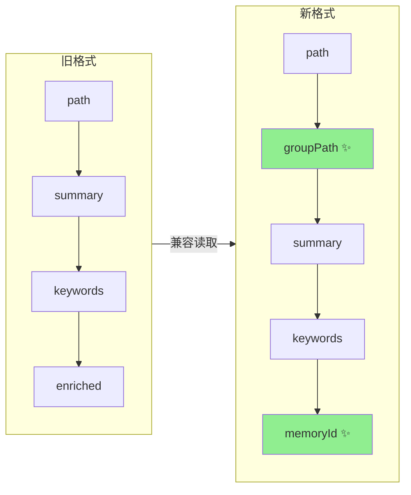

# S-02：`ai-results.json` 格式扩展 设计文档

> - 状态：草案
> - 起草时间：2026-05-26
> - 关联父文档：[scan-kb-import-unified_DESIGN.md](scan-kb-import-unified_DESIGN.md)
> - 实施范围：`knowledge-index/scripts/scan-kb.ts` 的 `ScanResultEntry` 接口和相关合并逻辑

## 1. 需求背景 & 目标

### 1.1 背景

旧 `ai-results.json` 只含 `{path, summary, keywords, enriched}`。新流程要求 AI 一次输出中携带 `groupPath`（Group 归属）和 `memoryId`（增量时覆盖写入）。同时消除 `scan-pending.json` 后，文件目录结构信息由 AI 直接从路径推导 `groupPath`。

### 1.2 目标

- 目标 1：`ai-results.json` 顶层新增 `meta: { sourceDir, rootName }`，作为 import/diff 命令推导上下文的权威来源
- 目标 2：`ScanResultEntry` 新增 `groupPath` 字段（必填，格式 `rootName/dir1/dir2`）
- 目标 3：`ScanResultEntry` 新增 `memoryId` 字段（可选，增量时携带）
- 目标 4：`ScanResultEntry` 新增 `action?: 'add' | 'modify' | 'delete'` 字段，统一标记增量操作（删除时其他字段可空）
- 目标 5：向后兼容读取旧格式（缺失字段用默认值填充）

### 1.3 明确不在范围内

- 不改变 `summary` 和 `keywords` 的生成规则
- 不要求 AI 同时填写 `memoryId`（首次导入可空，由 S-03 批量写入后回填）
- `action` 字段缺失时默认按 `add` 处理（首次导入场景）

## 2. 名词术语表

| 术语 | 含义 | 易混淆点 |
|------|------|---------|
| `meta` | `ai-results.json` 顶层字段，记录 `{sourceDir, rootName}` | 与 `group-index.json` 的 `source` 块对应，但由 AI 写入 |
| `groupPath` | 条目在 Group 树中的完整路径 | 不含文件名，只到目录层级 |
| `memoryId` | 记忆系统中的记录 ID | 首次导入为空，增量导入可携带用于覆盖 |
| `action` | 增量操作语义：add/modify/delete | 缺失时按 add 处理，避免破坏首次导入语义 |

## 3. 现状分析（AS-IS）

### 3.1 现有实现

```typescript
// 当前 ScanResultEntry（scan-kb.ts）
interface ScanResultEntry {
  path: string;         // 相对于 sourceDir 的文件路径
  summary: string;
  keywords: string[];
  enriched?: boolean;
  replaces?: string;    // 已废弃
}
```

### 3.2 痛点

- `groupPath` 当前在 `handleScanMerge` 中通过 `buildFullPath()` 计算，依赖 `scan-pending.json` 的 `rootName` 和 `dir` 字段
- 删除 `scan-pending.json` 后，无法从 pending 数据结构推导 dir 信息
- `memoryId` 无承载字段，需要单独的 `vectorize --complete` 回写

## 4. 方案设计（TO-BE）

### 4.1 方案概述

`ai-results.json` 顶层新增 `meta: { sourceDir, rootName }`，记录 AI 处理时的源目录与 rootName，作为 import/diff 的权威推导来源。`ScanResultEntry` 新增三个字段：`groupPath` 由 AI 根据文件路径推导（`rootName/dir1/dir2`），`memoryId` 由 AI 或 CLI 填充，`action` 标记增量操作类型。`handleScanMerge` 不再依赖 `scan-pending.json`。

### 4.2 关键决策点

| 决策 | 选择 | 理由 | 备选 |
|------|------|------|------|
| meta 放置位置 | `ai-results.json` 顶层 `meta` 字段 | 与 entries 平级，结构清晰 | ❌ 放 CLI 参数：每次调用都要手填，AI 已知信息冗余传递 |
| groupPath 由谁推导 | AI 推导（按目录结构约定） | 删除 scan-pending 后 CLI 无 dir 信息 | ❌ CLI 再次遍历 sourceDir：与去中间化目标矛盾 |
| memoryId 字段类型 | `string \| null \| undefined` | 区分"不携带"（undefined）和"明确为空"（null） | ❌ 只用 string：无法区分状态 |
| 增量操作标记 | 独立 `action` 枚举字段 | 语义清晰，删除条目不依赖 summary 哨兵值 | ❌ `summary: "__DELETE__"`：与 summary 非空契约冲突，AI 可能误生成 |
| 向后兼容 | 缺失字段用默认值，不报错 | 存量 ai-results.json 可直接使用 | ❌ 强制新格式：破坏已有数据 |

### 4.3 与现状的差异

- `AiResultsFile` 接口：新增顶层 `meta: { sourceDir: string; rootName: string }`
- `ScanResultEntry` 接口：新增 `groupPath: string`、`memoryId?: string | null`、`action?: 'add' | 'modify' | 'delete'`
- `handleScanMerge` / `handleImport`：不再读取 `scan-pending.json`，直接从 `meta` + `groupPath` 取值

## 5. 架构图 / 流程图



## 6. 模块/类设计

| 模块 | 职责 | 依赖 |
|------|------|------|
| `ScanResultEntry` | 接口定义 | 无 |
| `normalizeAiResults()` | 读取 ai-results.json 并补全默认值 | `ScanResultEntry` |

## 7. 接口设计

```typescript
// scan-kb.ts 新增/修改
interface AiResultsMeta {
  sourceDir: string;          // ✨ 外部知识库根目录（绝对路径或相对 cwd 的路径）
  rootName: string;           // ✨ Group 根节点名
}

interface ScanResultEntry {
  path: string;
  groupPath: string;          // ✨ 新增：如 "wiki/部署运维"
  summary: string;
  keywords: string[];
  enriched?: boolean;
  memoryId?: string | null;   // ✨ 新增：首次空，增量可带
  action?: 'add' | 'modify' | 'delete';  // ✨ 新增：增量操作语义，缺失视为 add
  replaces?: string;          // 保留兼容
}

interface AiResultsFile {
  meta: AiResultsMeta;        // ✨ 新增顶层 meta
  entries: ScanResultEntry[];
}
```

| 接口 | 输入 | 输出 | 异常 |
|------|------|------|------|
| `normalizeAiResults(file)` | `resultsFile: string` | `{ meta, entries }` | 文件不存在 / JSON 解析失败 / meta 缺失 → fail |

`groupPath` 推导规则：`meta.rootName + "/" + path.dirname(entry.path)`，根目录文件为 `meta.rootName`。
`action` 缺失时默认为 `add`；`action === 'delete'` 时 `summary`/`keywords` 可为空，但必须携带 `memoryId`。

## 8. 数据模型

### 8.1 新格式示例（首次导入，无 memoryId）

```json
{
  "meta": {
    "sourceDir": "/root/memory-lancedb-pro/mcp-wrapper/.qoder/repowiki/zh/content",
    "rootName": "wiki"
  },
  "entries": [
    {
      "path": "部署运维/备份恢复.md",
      "groupPath": "wiki/部署运维",
      "summary": "面向LanceDB数据库的备份恢复SOP...",
      "keywords": ["备份", "恢复", "LanceDB", "灾难恢复"],
      "enriched": true
    }
  ]
}
```

### 8.2 增量格式示例（含 add/modify/delete）

```json
{
  "meta": {
    "sourceDir": "/root/memory-lancedb-pro/mcp-wrapper/.qoder/repowiki/zh/content",
    "rootName": "wiki"
  },
  "entries": [
    {
      "path": "新功能/实时同步.md",
      "groupPath": "wiki/新功能",
      "summary": "实时数据同步方案...",
      "keywords": ["实时", "同步"],
      "action": "add"
    },
    {
      "path": "部署运维/备份恢复.md",
      "groupPath": "wiki/部署运维",
      "summary": "更新后的备份恢复SOP...",
      "keywords": ["备份", "恢复", "增量备份"],
      "memoryId": "mem_abc123",
      "action": "modify"
    },
    {
      "path": "API文档/废弃接口.md",
      "groupPath": "wiki/API文档",
      "summary": "",
      "keywords": [],
      "memoryId": "mem_xyz789",
      "action": "delete"
    }
  ]
}
```

## 9. 关键流程时序图

无需时序图。格式读取为同步 JSON 解析。

## 10. 异常处理 & 边界情况

| 场景 | 行为 | 是否对外暴露 |
|------|------|-------------|
| `meta` 缺失 | fail：明确报错"meta.sourceDir / meta.rootName 必填" | 是 |
| `meta.sourceDir` 不存在 | fail：路径不存在 | 是 |
| `groupPath` 缺失 | 从 `path` 自动推导：`${meta.rootName}/${dirname(path)}` | 否（静默修复） |
| `groupPath` 首段与 `meta.rootName` 不一致 | fail：避免 Group 树脏写 | 是 |
| `memoryId` 缺失 | 视为 null，由 S-03 批量向量化后填充 | 否 |
| `action` 缺失 | 默认按 `add` 处理 | 否 |
| `action === 'delete'` 但无 `memoryId` | fail：删除条目必须携带 memoryId | 是 |
| JSON 格式非法 | fail 并输出具体错误行 | 是 |
| entry 数量为 0 | 正常完成，无导入内容 | 否 |

## 11. 性能 & 安全考虑

无特殊考虑。`ai-results.json` 通常 <100KB，解析耗时可忽略。

## 12. 测试方案

| 类型 | 范围 | 工具 |
|------|------|------|
| 单元测试 | `normalizeAiResults` 新格式解析、旧格式兼容 | `node --test` |
| 边界测试 | `groupPath`/`memoryId` 缺失补全、空 entries | `node --test` |

## 13. 实施计划 / 里程碑

| 批次 | 主题 | 主要产出 | 依赖 |
|------|------|---------|------|
| Batch 1 | 接口扩展 | `ScanResultEntry` 新增字段 | 无 |
| Batch 2 | 解析逻辑 | `normalizeAiResults()` 函数 | Batch 1 |

## 14. 风险 & 待定问题

### 14.1 已知风险

| 风险 | 影响 | 预案 |
|------|------|------|
| AI 推导的 `groupPath` 与约定不一致 | Group 树创建错误 | `groupPath` 提供校验 + 自动修复（去除多余前缀） |

### 14.2 待定问题

- [ ] `groupPath` 校验规则：是否需要严格匹配目录层级？→ 建议宽松处理，允许 AI 自行推导
