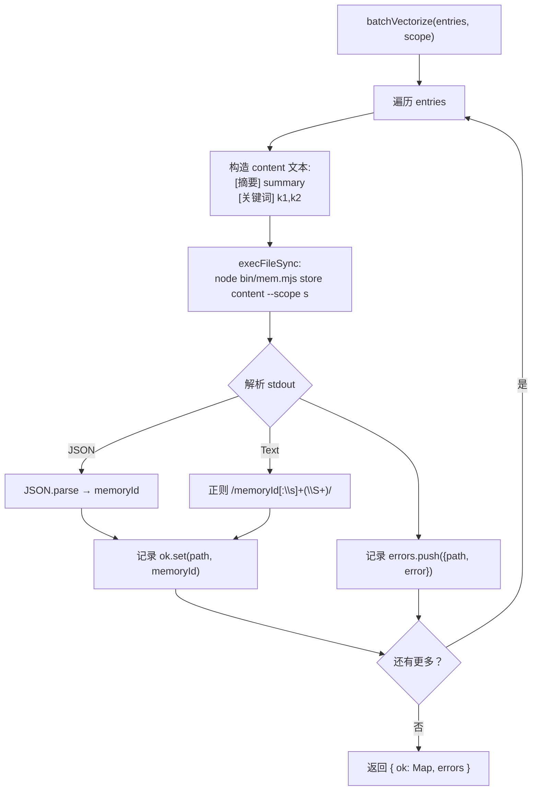
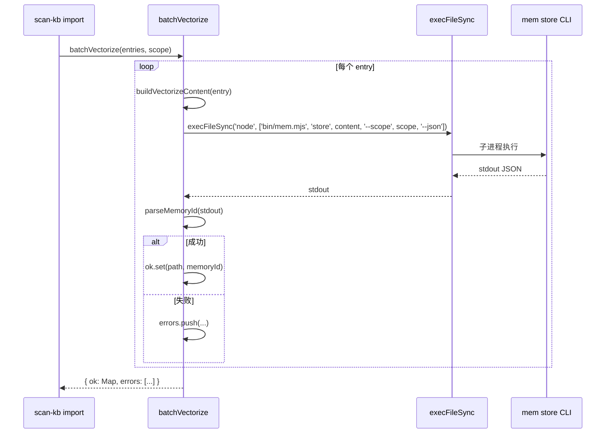

# S-03：CLI 批量 `mem store` 向量化 设计文档

> - 状态：草案
> - 起草时间：2026-05-26
> - 关联父文档：[scan-kb-import-unified_DESIGN.md](scan-kb-import-unified_DESIGN.md)
> - 实施范围：`knowledge-index/scripts/scan-kb.ts` 新增 `batchVectorize` 模块

## 1. 需求背景 & 目标

### 1.1 背景

当前向量化流程：AI 逐条调用 MCP `memory_store` → 收集 `memoryId` → `vectorize --complete` 回写。66 个文件意味着 66 次 MCP tool call，每次需要 LLM 往返。而 CLI 工具 `bin/mem.mjs store` 已具备相同的写入能力，直接子进程调用可消除 MCP 协议和 LLM 往返开销。

### 1.2 目标

- 目标 1：`batchVectorize(entries, scope)` 函数，循环调用 `mem store` 为每条 summary 向量化
- 目标 2：从 `mem store` 已有 stdout 文本格式中解析 `memoryId`（不引入新 `--json` flag）
- 目标 3：返回 partial result，成功条目带 memoryId，失败条目带 error

### 1.3 明确不在范围内

- 不修改 `bin/mem.mjs store` CLI 本身（不加 `--json` 参数）
- 不处理 embedding 模型配置（由 mem store 的 config.yaml 控制）
- 不实现向量检索（只管写入）

## 2. 名词术语表

| 术语 | 含义 | 易混淆点 |
|------|------|---------|
| `mem store` | `bin/mem.mjs store "<text>" --scope <s>` CLI 命令 | 与 MCP 工具 `memory_store` 同功能但不同通道 |
| `partial result` | 部分条目成功、部分失败的结果 | 区别于"全量成功或全部回滚" |
| `concurrency` | 并行执行的 `mem store` 子进程数 | 默认 1（串行），可配置 |

## 3. 现状分析（AS-IS）

### 3.1 现有实现

当前 `vectorize` 子命令只做数据搬运：`vectorize` 列出待向量化条目（含 content 文本）→ AI 逐条调 `memory_store` → `vectorize --complete` 回写 memoryId。不执行实际的 embedding 操作。

### 3.2 痛点

- 66 次 MCP tool call，LLM 需要多轮往返
- `vectorize` + `vectorize --complete` 两步本身是冗余协议
- AI 不擅长批量循环操作，容易漏调或错序

## 4. 方案设计（TO-BE）

### 4.1 方案概述

`batchVectorize()` 串行遍历 entries（且仅处理 `action !== 'delete'` 的条目），对每条调用 `execFileSync('node', ['bin/mem.mjs', 'store', content, '--scope', scope, '--category', 'kb-import'])`，从 stdout 用正则 `/Memory ID:\s*(\S+)/` 提取 memoryId。失败条目 skip 并记录 error，不中断其他条目。

> **依赖**：`src/cli.ts` 的 `store` action 已在 stdout 末尾追加 `Memory ID: <id>` 行（人类可读输出保留，新增一行供程序解析）。这是 S-03 实施的**前置条件**，已在准备阶段完成。

### 4.2 关键决策点

| 决策 | 选择 | 理由 | 备选 |
|------|------|------|------|
| 调用方式 | `execFileSync` 子进程 | 隔离 mem store 的进程状态，复用已有 CLI 入口 | ❌ import createMemoryRuntime：需重排 dist 依赖、引入双初始化复杂度 |
| 并发策略 | 串行执行 | 避免 LanceDB 写入锁冲突；用户已确认接受串行延时 | ❌ 并发：可能导致 write lock |
| memoryId 解析 | 正则 `/Memory ID:\s*(\S+)/` 匹配 cli.ts 新增的固定输出行 | 不增加 `--json` 维护成本，格式由本仓库自有 cli.ts 控制 | ❌ JSON 输出：需要新增 flag 与解析分支 |
| 失败策略 | skip + 记录 error，继续后续 | 部分成功优于全部失败 | ❌ 遇错即停：66 条中 1 条失败浪费进度 |
| 统一 category | `--category kb-import` | 便于后续检索/统计/清理 | ❌ 留空：与普通记忆混杂 |

### 4.3 与现状的差异

- 新增 `batchVectorize` 函数替代 `vectorize` 子命令全部逻辑
- `vectorize` 子命令删除，其 150 行业务逻辑移至本模块

## 5. 架构图 / 流程图



## 6. 模块/类设计

| 模块 | 职责 | 依赖 |
|------|------|------|
| `batchVectorize()` | 主函数：遍历 + 调用 + 解析 + 汇总 | `execFileSync`, `path` |
| `buildVectorizeContent()` | 构造 mem store 的 text 参数 | 无 |
| `parseMemoryId()` | 从 stdout 提取 memoryId | 无 |

## 7. 接口设计

```typescript
interface BatchVectorizeResult {
  ok: Map<string, string>;  // path → memoryId
  errors: { path: string; error: string }[];
}

function batchVectorize(
  entries: ScanResultEntry[],
  scope: string
): BatchVectorizeResult;

function buildVectorizeContent(entry: ScanResultEntry): string;
function parseMemoryId(stdout: string): string | null;
```

| 接口 | 输入 | 输出 | 异常 |
|------|------|------|------|
| `batchVectorize` | `ScanResultEntry[], scope` | `BatchVectorizeResult` | 不抛异常，失败记入 errors |
| `parseMemoryId` | `stdout: string` | `string \| null` | 无 |

## 8. 数据模型

### 8.1 mem store content 格式

```
[摘要] 面向LanceDB数据库的备份恢复SOP，含全量增量备份策略...
[关键词] 备份, 恢复, LanceDB, 灾难恢复, 定时任务
[路径] 部署运维/备份恢复.md
```

### 8.2 mem store 实际 stdout（含本期新增的 ID 行）

```
Stored: "[摘要] 面向LanceDB数据库的备份恢复SOP..." in scope 'mcp-test'
Memory ID: 0123abcd-4567-89ef-0123-456789abcdef
```

### 8.3 memoryId 解析正则

```
/^Memory ID:\s*(\S+)$/m
```

> 该格式由 `src/cli.ts` 控制，是本仓库自有 CLI，无外部兼容压力。

## 9. 关键流程时序图



## 10. 异常处理 & 边界情况

| 场景 | 行为 | 是否对外暴露 |
|------|------|-------------|
| `mem store` 子进程超时 | 30s 超时 kill，记录 error | 是（errors 数组） |
| stdout 无 `Memory ID:` 行 | 记录 error：`无法解析 memoryId` | 是 |
| `mem store` 返回非 0 退出码 | 记录 error：exitCode + stderr | 是 |
| entry 数组为空 | 直接返回空 Map | 否 |
| entry.action === 'delete' | 由调用方 (S-06) 过滤，不入 batchVectorize | 否 |

## 11. 性能 & 安全考虑

### 11.1 性能

- 预期耗时：每条 `mem store` 约 1~3 秒（含 embedding），66 条约 1~3 分钟
- 关键瓶颈：embedding API 调用延迟，非子进程启动开销
- 不做并行：避免 LanceDB write lock 冲突

### 11.2 安全

- 子进程不继承父进程环境变量中的敏感信息
- content 文本做基本转义，防止 shell 注入

## 12. 测试方案

| 类型 | 范围 | 工具 |
|------|------|------|
| 单元测试 | `parseMemoryId` 正则解析（JSON + text 格式） | `node --test` |
| 单元测试 | `buildVectorizeContent` 输出格式 | `node --test` |
| 集成测试 | 真实 mem store 调用，验证 memoryId 可后续 recall | E2E 脚本 |
| 边界测试 | 空 entries、全失败、部分失败 | `node --test` |

## 13. 实施计划 / 里程碑

| 批次 | 主题 | 主要产出 | 依赖 |
|------|------|---------|------|
| Batch 1 | 基础函数 | `buildVectorizeContent()`, `parseMemoryId()` | 无 |
| Batch 2 | 主函数 | `batchVectorize()` 循环逻辑 | Batch 1 |
| Batch 3 | 集成 import | S-04 中调用 `batchVectorize` | Batch 2 |

## 14. 风险 & 待定问题

### 14.1 已知风险

| 风险 | 影响 | 预案 |
|------|------|------|
| `Memory ID:` 行格式被未来改动破坏 | 全部条目无 memoryId | 单元测试覆盖该格式，cli.ts 修改 PR 中需同步更新 |
| embedding API 失败 | 整条跳过 | 记录 error，继续下一条 |
| LanceDB write lock | 子进程串行，不应出现，但若出现则重试 | 重试 1 次 |

### 14.2 待定问题

- [x] `mem store --json` flag → 决定不引入，改用现有 stdout 加 `Memory ID:` 行
- [x] 是否需要 `--category kb-import` 统一标记导入的记忆？→ 已采纳，默认追加
