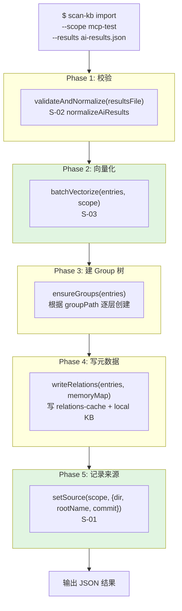
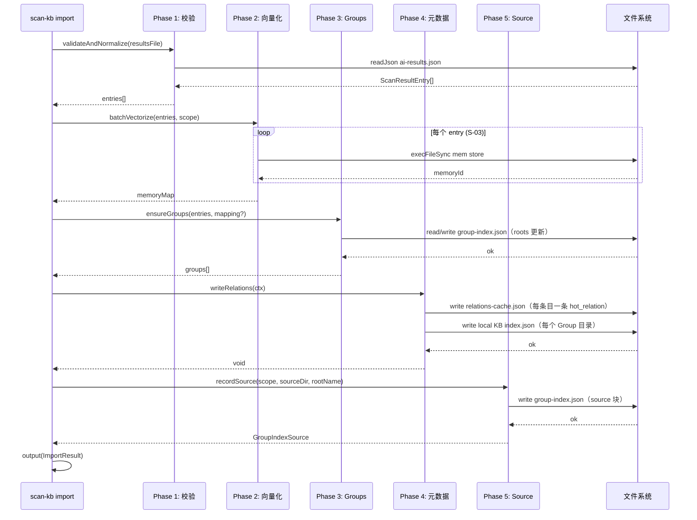

# S-04：统一导入命令 设计文档

> - 状态：草案
> - 起草时间：2026-05-26
> - 关联父文档：[scan-kb-import-unified_DESIGN.md](scan-kb-import-unified_DESIGN.md)
> - 实施范围：`knowledge-index/scripts/scan-kb.ts` 新增 `import` 子命令；`import-kb.ts` 逻辑内嵌并保留只读

## 1. 需求背景 & 目标

### 1.1 背景

当前流程中 `scan --results`（步骤 3）、`vectorize` + `vectorize --complete`（步骤 4/5/6）、`import-kb`（步骤 7）是三条独立命令。它们共享同一批数据（`scan-index.json` + `ai-results.json`），但通过中间文件串行衔接。在新架构中 `scan-index.json` / `scan-pending.json` 已消除，需要一条命令吃入 `ai-results.json` 并完成从向量化到 Group 创建的全部工作。

### 1.2 目标

- 目标 1：新增 `scan-kb import --scope <s> --results <file> [--source-dir <d>] [--root-name <n>] [--mapping]` 命令
- 目标 2：一条命令完成：格式校验 → 批量 mem store 向量化 → Group 树创建 → relations-cache 写入 → local KB 写入 → source 块记录
- 目标 3：兼容 `--mapping` 模式（手工指定每个 entry 的 Group 归属）
- 目标 4：返回结构化 JSON 结果，含 `ok`（成功条目数）、`errors`（失败列表）、`groups`（创建的 Group 路径）

### 1.3 明确不在范围内

- 不改变 `--mapping` 文件的格式定义
- 不自动生成 `ai-results.json`（仍由 AI 生成）
- 不处理增量导入（增量模式由 S-06 覆盖）

## 2. 名词术语表

| 术语 | 含义 | 易混淆点 |
|------|------|---------|
| `convention` 模式 | 默认模式，根据 `groupPath` 自动创建 Group 层级 | 与 `--mapping` 模式互斥 |
| `mapping` 模式 | 由 `--mapping <file>` 显式指定每条 path 的 Group 归属 | 优先级高于 `groupPath` 字段 |
| `import` 子命令 | 统一的导入 CLI 入口 | 合并了旧的 `scan`（部分）、`vectorize`、`import-kb` |

## 3. 现状分析（AS-IS）

### 3.1 现有实现

分散在三个子命令中：

```typescript
// scan-kb.ts: handleScanMerge (步骤3)
// 读 scan-pending.json + ai-results.json → 合并为 scan-index.json

// scan-kb.ts: handleVectorizeList (步骤4)
// 读 scan-index.json → 列出未向量化条目

// scan-kb.ts: handleVectorizeComplete (步骤6)
// 读 vectorize-complete.json → 回写 scan-index.json

// import-kb.ts: handleImport (步骤7)
// 读 scan-index.json → 建 Group 树 → 写 relations-cache + group-index + local KB
```

### 3.2 痛点

- 4 次 CLI 调用才能完成一次导入
- 中间产物 `scan-index.json` 是唯一数据载体，增加耦合
- `vectorize` 子命令本身不做实际向量化，只是协议层
- import-kb.ts 的 `convention` 模式需要通过 `scan-index.json` 的 `fullPath` 推导 Group 路径

## 4. 方案设计（TO-BE）

### 4.1 方案概述

新增 `import` 子命令，内部串联 5 个阶段：

```
Phase 1: validateAndNormalize — 读取 ai-results.json，校验并补全默认值
Phase 2: batchVectorize — 调用 S-03 的 batchVectorize() 为每条 summary 写入记忆
Phase 3: ensureGroups — 根据 groupPath 创建 Group 树
Phase 4: writeRelations — 写入 relations-cache.json（含 memoryId）+ local KB
Phase 5: recordSource — 写入 group-index.json 的 source 块
```

每个阶段完成后输出进度信息。Phase 2 的失败不中断后续（partial result）。

### 4.2 关键决策点

| 决策 | 选择 | 理由 | 备选 |
|------|------|------|------|
| import-kb.ts 处理 | 逻辑内嵌到 scan-kb.ts，原文件加 `//DEPRECATED` 注释保留只读 | 减少文件间耦合，避免重复 IO | ❌ 直接删除：丢失 git 历史可追溯性 |
| 阶段间数据传递 | 内存对象 `ImportContext` | 避免额外文件 IO | ❌ 写临时文件：退化为旧架构 |
| memoryId 持久化位置 | `relations-cache.json` 的 hot_relation 条目 | relation 维度的自然元数据中心（已有 keywords 等字段） | ❌ 独立文件：增加碎片 |
| 空 ai-results.json 行为 | 正常返回 ok=0，不报错 | 允许 AI 只处理部分文件 | ❌ 报错退出：过度严格 |
| import-kb.ts mapping 模式 | 内嵌时保留完整 mapping 校验+读取逻辑 | mapping 模式是已有久经考验的特性 | ❌ 放弃 mapping：破坏兼容性 |

### 4.3 与现状的差异

- 删除：`handleVectorizeList`、`handleVectorizeComplete`、`vectorize` 子命令注册
- 修改：`handleScanMerge` 的 groupPath 构建逻辑（不再依赖 scan-pending.json）
- 新增：`handleImport` 函数（约 200 行）、`ImportContext` 接口
- 内嵌：import-kb.ts 的 `handleImport` 核心逻辑（Group 创建 + 文件写入）
- 保留只读：`import-kb.ts` 加 `//DEPRECATED` 注释

## 5. 架构图 / 流程图



## 6. 模块/类设计

| 模块 | 职责 | 依赖 |
|------|------|------|
| `ImportContext` | 贯穿 5 个阶段的数据载体 | `ScanResultEntry[]`, `BatchVectorizeResult` |
| `validateAndNormalize()` | 读 ai-results.json → 校验 + 补全默认值 | S-02 `normalizeAiResults` |
| `ensureGroups()` | 从 entries 的 `groupPath` 建 Group 树（复用 import-kb.ts 树构建逻辑） | `GroupIndex`, `scope.ts` |
| `writeRelations()` | 遍历 entries，为每个 file 写 hot_relation（含 memoryId）到 relations-cache + 写 local KB index.json | `relations-cache.json`, local KB |
| `recordSource()` | 获取当前 git HEAD → 调用 S-01 `setSource` | S-01 |
| `handleImport()` | CLI 入口：串联 5 个 phase + 输出 JSON | 以上全部 |

## 7. 接口设计

```typescript
// scan-kb.ts 新增

interface ImportContext {
  scope: string;
  sourceDir: string;          // --source-dir 或从 ai-results 推导
  rootName: string;           // --root-name 或从 ai-results 推导
  entries: ScanResultEntry[]; // 已校验的条目
  memoryMap: Map<string, string>; // path → memoryId（Phase 2 产出）
  mapping?: Map<string, string>;  // --mapping 文件解析结果
  groups: string[];           // 创建的 Group 路径列表（Phase 3 产出）
}

interface ImportResult {
  ok: number;                          // 成功导入条目数
  errors: { path: string; error: string }[]; // 失败列表
  groups: string[];                    // 新建的 Group 路径
  source: GroupIndexSource | null;     // 记录的 source 块
}

function handleImport(args: {
  scope: string;
  results: string;         // ai-results.json 路径
  sourceDir?: string;      // 可选，从 ai-results 或已有 source 推导
  rootName?: string;       // 可选，同上
  mapping?: string;        // 可选，mapping 文件路径
}): void;

function validateAndNormalize(resultsFile: string): ScanResultEntry[];
function ensureGroups(entries: ScanResultEntry[], mapping?: Map<string,string>): string[];
function writeRelations(ctx: ImportContext): void;
function recordSource(scope: string, sourceDir: string, rootName: string): GroupIndexSource;
```

| 接口 | 输入 | 输出 | 异常 |
|------|------|------|------|
| `handleImport` | CLI args | JSON via `output()` | fail on fatal errors |
| `validateAndNormalize` | `resultsFile: string` | `ScanResultEntry[]` | fail（JSON 非法 / 空文件） |
| `ensureGroups` | `entries, mapping?` | `string[]`（Group 路径） | fail（IO 写入失败） |
| `writeRelations` | `ImportContext` | `void` | fail（文件写入失败） |
| `recordSource` | `scope, dir, name` | `GroupIndexSource` | fail（IO 失败） |

### CLI 参数

```bash
# 首次导入（convention 模式）
scan-kb import --scope mcp-test --results ai-results.json \
  --source-dir /path/to/external/kb --root-name wiki

# 首次导入 + mapping 模式
scan-kb import --scope mcp-test --results ai-results.json \
  --source-dir /path/to/external/kb --root-name wiki \
  --mapping mapping.json

# 仅依赖 ai-results.json 中推导的 sourceDir/rootName
scan-kb import --scope mcp-test --results ai-results.json
```

## 8. 数据模型

### 8.1 ImportContext（内存中传递）

```typescript
interface ImportContext {
  scope: 'mcp-test';
  sourceDir: '/root/.../repowiki/zh/content';
  rootName: 'wiki';
  entries: [
    {
      path: '部署运维/备份恢复.md',
      groupPath: 'wiki/部署运维',
      summary: '...',
      keywords: ['备份', '恢复'],
      memoryId: null
    }
  ];
  memoryMap: Map { '部署运维/备份恢复.md' => 'mem_abc123' };
  groups: ['wiki', 'wiki/部署运维'];
}
```

### 8.2 ImportResult（CLI 输出）

```json
{
  "ok": true,
  "action": "import",
  "scope": "mcp-test",
  "stats": {
    "total": 66,
    "vectorized": 65,
    "errors": 1
  },
  "errors": [
    {
      "path": "API文档/废弃接口.md",
      "error": "mem store exited with code 1: Embedding API timeout"
    }
  ],
  "groups": [
    "wiki",
    "wiki/部署运维",
    "wiki/API文档"
  ],
  "source": {
    "dir": "/root/.../repowiki/zh/content",
    "rootName": "wiki",
    "commit": "9af06f67670476c9689cc186304d62a7c18b9724"
  }
}
```

## 9. 关键流程时序图



## 10. 异常处理 & 边界情况

| 场景 | 行为 | 是否对外暴露 |
|------|------|-------------|
| ai-results.json 不存在 | fail: "ai results file not found" | 是 |
| ai-results.json JSON 格式非法 | fail: 含具体 error message | 是 |
| ai-results.json entries 为空 | 正常返回 ok=0，不创建 Group | 否 |
| sourceDir 未指定且无法推导 | fail: "source-dir is required, provide --source-dir" | 是 |
| rootName 未指定且无法推导 | fail: "root-name is required, provide --root-name" | 是 |
| Phase 2 部分条目向量化失败 | 记录 error → 继续处理成功的条目 → Phase 3/4/5 只处理成功条目 | 是（errors[]） |
| Phase 2 全部失败 | 返回 ok=0，errors 含全部条目，不执行 Phase 3/4/5 | 是 |
| Phase 3 Group 创建失败（IO） | fail（致命错误，无法继续） | 是 |
| Phase 4 relations-cache 写入失败 | fail（致命错误） | 是 |
| Phase 5 setSource 失败 | fail（致命错误） | 是 |
| mapping 文件存在但格式非法 | fail: 含具体 error message | 是 |
| mapping 文件中 path 与 entries 不匹配 | 跳过不匹配条目，警告输出 | 是（warnings[]） |

## 11. 性能 & 安全考虑

### 11.1 性能

- 主要耗时在 Phase 2（串行 mem store，约 N * 2秒），预期 66 文件约 2-3 分钟
- Phase 3/4/5 为纯文件 IO，耗时 <1 秒
- 整体无数据库锁冲突风险（串行执行）

### 11.2 安全

- ai-results.json 的 `summary` 字段在 `buildVectorizeContent` 中不直接拼接到 shell，通过 `execFileSync` 的 args 数组传递（安全）
- mapping 文件路径校验：不允许包含 `../` 路径穿越

## 12. 测试方案

| 类型 | 范围 | 工具 |
|------|------|------|
| 单元测试 | `validateAndNormalize` 各种格式输入 | `node --test` |
| 单元测试 | `ensureGroups` 树创建正确性 | `node --test` |
| 集成测试 | 完整 `import --results` 端到端（mock mem store） | E2E 脚本 |
| 边界测试 | 空 results、全部向量化失败、mapping 不匹配 | `node --test` |
| 回归测试 | import-kb convention/mapping 模式行为一致 | E2E 脚本 |

## 13. 实施计划 / 里程碑

| 批次 | 主题 | 主要产出 | 依赖 |
|------|------|---------|------|
| Batch 1 | ImportContext + validateAndNormalize | 类型定义 + Phase 1 实现 | S-02 |
| Batch 2 | handleImport 骨架 + Phase 3/4/5 | 主函数 + Group 创建 + 元数据写入 | S-01, Batch 1 |
| Batch 3 | 集成 batchVectorize | Phase 2 调用 | S-03, Batch 2 |
| Batch 4 | CLI 注册 + import-kb.ts DEPRECATED | yargs 子命令注册 + 旧文件标记 | Batch 3 |
| Batch 5 | mapping 模式支持 | --mapping 参数解析 | Batch 2 |

## 14. 风险 & 待定问题

### 14.1 已知风险

| 风险 | 影响 | 预案 |
|------|------|------|
| import-kb.ts 逻辑内嵌时遗漏细微行为差异 | 导入结果与旧版不一致 | E2E 测试与旧版行为对比 |
| local KB index.json 写入与 import-kb 不一致 | 下游 agent 读取失败 | 完全复用 import-kb 的 writeLocalKbIndex 逻辑 |

### 14.2 待定问题

- [ ] `--source-dir` / `--root-name` 是否完全可选？→ 首次导入必须，增量可选（已有 source 块可推导）
- [ ] 是否需要在 Phase 2 和 Phase 3 之间提供 `--dry-run` 模式？→ 暂不实现，一期专注于流水线
