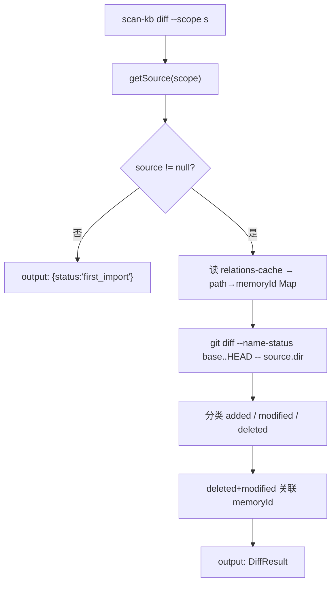
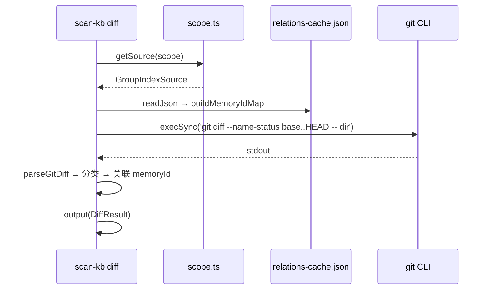

# S-05：增量 diff 子命令 设计文档

> - 状态：草案
> - 起草时间：2026-05-26
> - 关联父文档：[scan-kb-import-unified_DESIGN.md](scan-kb-import-unified_DESIGN.md)
> - 实施范围：`knowledge-index/scripts/scan-kb.ts` 新增 `diff` 子命令

## 1. 需求背景 & 目标

### 1.1 背景

删除 `scan-index.json` 后，增量扫描的 diff 起点变更为 `group-index.json` 的 `source.commit`（S-01）。需要一个独立子命令输出变更文件列表（含 memoryId），供 AI 生成增量 `ai-results.json`。

### 1.2 目标

- 目标 1：新增 `scan-kb diff --scope <s> [--output <file>]` 命令
- 目标 2：读取 `source.commit` → `git diff --name-status` → 输出 `{added, modified, deleted}`
- 目标 3：`deleted` + `modified` 条目关联 `memoryId`（从 `relations-cache.json` 查询）
- 目标 4：source 块不存在时输出友好提示（non-error）

### 1.3 明确不在范围内

- 不自动执行 `memory_forget`（AI 判断）
- 不生成 `ai-results.json`
- 不修改任何文件（只读命令）

## 2. 名词术语表

| 术语 | 含义 | 易混淆点 |
|------|------|---------|
| `diff` | 新子命令，对比 `source.commit` 与 HEAD | 不同于 `git diff`，额外输出业务语义 |
| `baseCommit` | 上次导入时的 commit | 从 `source.commit` 读取 |
| `DiffResult` | diff 命令的结构化输出 | added/modified/deleted 三类 |

## 3. 现状分析（AS-IS）

现有 `buildIncrementalPending()`（约 120 行）：从 `scan-index.json` 读 `lastScannedCommit` → `git diff --name-status` → 构造 `ScanPending`。痛点：与 `scan-index.json` 强耦合，不独立可用，deleted 缺少 memoryId。

## 4. 方案设计（TO-BE）

1. `getSource(scope)` 获取 `baseCommit` → 为空则输出 `{status:'first_import'}` 提示
2. 读 `relations-cache.json` 构建 `path → memoryId` 映射
3. `execSync('git diff --name-status baseCommit..HEAD -- source.dir')`
4. 解析 stdout 为 `{added, modified, deleted}`，R 状态拆解为 delete+add

### 4.2 关键决策点

| 决策 | 选择 | 理由 | 备选 |
|------|------|------|------|
| diff 范围 | `source.dir` 下 `.md` 文件 | 关注知识库文件 | ❌ 整个 repo |
| memoryId 来源 | `relations-cache.json` | 所有已导入条目已在此 | ❌ 遍历 local KB |
| 重命名 | R → deleted(旧) + added(新) | 简化 AI 处理 | ❌ 保留关联 |
| 无变更 | 返回 ok=true, changes=0 | 脚本友好 | ❌ 报错 |

## 5. 架构图 / 流程图



## 6. 模块/类设计

| 模块 | 职责 | 依赖 |
|------|------|------|
| `DiffResult` / `DiffChangeGroup` | TypeScript 类型 | 无 |
| `parseGitDiff(stdout)` | 解析 git diff 输出 | 无 |
| `buildMemoryIdMap(scope)` | 从 relations-cache 构建 path→memoryId | relations-cache.json |
| `handleDiff(args)` | CLI 入口 | S-01, 以上 |

## 7. 接口设计

```typescript
interface DiffEntry {
  path: string;
  absPath?: string;       // added/modified
  memoryId?: string;      // deleted/modified
}

interface DiffChangeGroup {
  added: DiffEntry[];
  modified: DiffEntry[];
  deleted: DiffEntry[];
}

interface DiffResult extends DiffChangeGroup {
  ok: true; action: 'diff'; scope: string;
  baseCommit: string; headCommit: string;
  sourceDir: string; rootName: string;
  stats: { added: number; modified: number; deleted: number; total: number };
}

// source 不存在时
interface NoSourceResult {
  ok: true; action: 'diff'; status: 'first_import'; scope: string;
  hint: string;
}

function handleDiff(args: { scope: string; outputFile?: string }): void;
function parseGitDiff(stdout: string): { status: string; path: string }[];
function buildMemoryIdMap(scope: string): Map<string, string>;
```

### CLI 参数

```bash
scan-kb diff --scope mcp-test
scan-kb diff --scope mcp-test --output diff-result.json
```

## 8. 数据模型（DiffResult）

```json
{
  "ok": true, "action": "diff", "scope": "mcp-test",
  "baseCommit": "9af06f67...", "headCommit": "3d2a1b8c...",
  "sourceDir": "/root/.../repowiki/zh/content",
  "rootName": "wiki",
  "stats": { "added": 3, "modified": 5, "deleted": 2, "total": 10 },
  "added": [
    { "path": "新功能/实时同步.md", "absPath": "/root/.../新功能/实时同步.md" }
  ],
  "modified": [
    { "path": "部署运维/备份恢复.md", "absPath": "/root/.../部署运维/备份恢复.md", "memoryId": "mem_abc123" }
  ],
  "deleted": [
    { "path": "API文档/废弃接口.md", "memoryId": "mem_xyz789" }
  ]
}
```

## 9. 关键流程时序图



## 10. 异常处理 & 边界情况

| 场景 | 行为 | 暴露 |
|------|------|------|
| source 块不存在 | 输出 `{status:'first_import', hint}` | 是 |
| git diff 失败（非 git repo） | fail: "not a git repository" | 是 |
| relations-cache 不存在 | memoryId 全部为空 | 否 |
| git diff 无变更 | 返回 stats.total=0 | 否 |
| 重命名（R100） | 拆解为 deleted+added | 否 |

## 11. 性能 & 安全

- git diff 操作 <1 秒
- stdout 解析安全（纯字符串解析，无 shell 注入风险）

## 12. 测试方案

| 类型 | 范围 | 工具 |
|------|------|------|
| 单元测试 | `parseGitDiff` 各种 git 输出 | `node --test` |
| 集成测试 | 完整 diff 端到端（真实 git repo） | E2E 脚本 |
| 边界测试 | source 不存在、无变更、全部删除 | `node --test` |

## 13. 实施计划 / 里程碑

| 批次 | 主题 | 产出 | 依赖 |
|------|------|------|------|
| Batch 1 | 类型定义 + parseGitDiff | 接口 + 解析函数 | 无 |
| Batch 2 | handleDiff 实现 | CLI 入口完整逻辑 | S-01, Batch 1 |

## 14. 风险 & 待定问题

| 风险 | 影响 | 预案 |
|------|------|------|
| git diff 输出格式在不同 Git 版本不一致 | 解析失败 | 单元测试覆盖 2.x/3.x |
| 文件路径含空格/特殊字符 | 解析偏移 | git diff --name-status 的 `\t` 分隔符稳定 |

- [ ] 是否需要 `--path-prefix` 参数限制 diff 范围？→ 一期不需要
