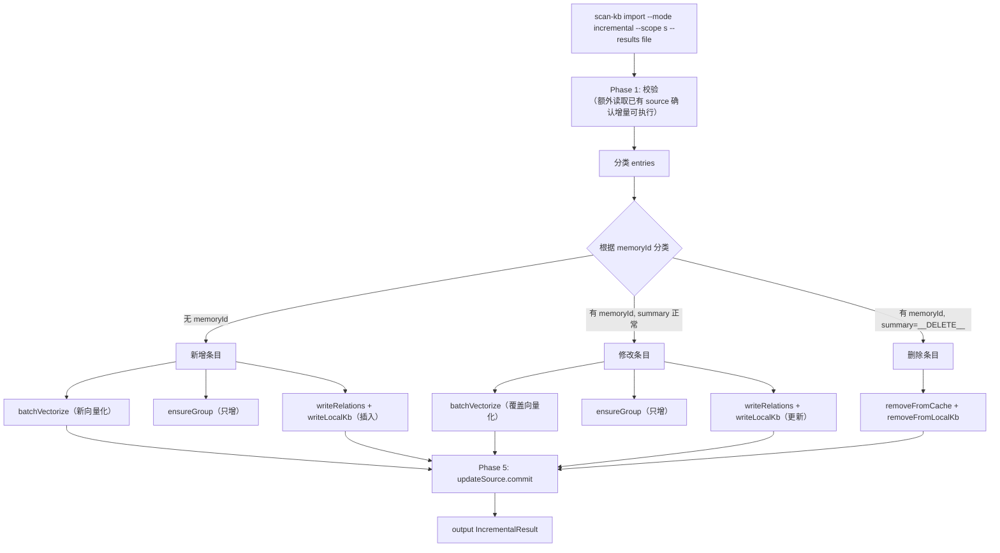
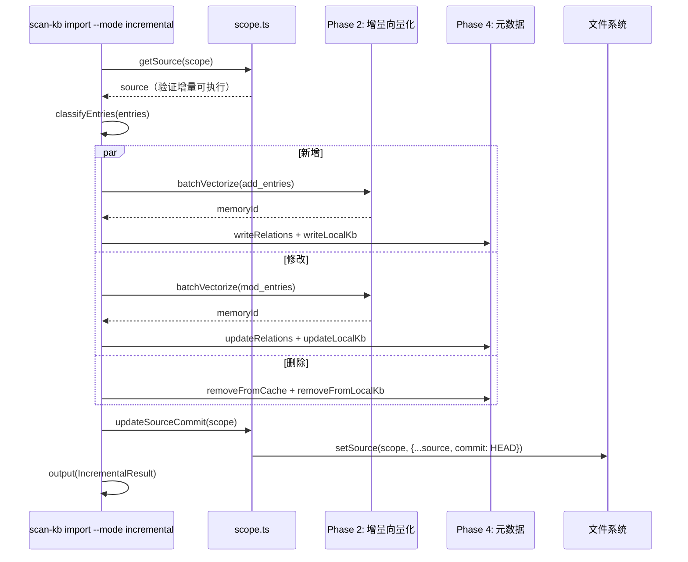

# S-06：增量导入 设计文档

> - 状态：草案
> - 起草时间：2026-05-26
> - 关联父文档：[scan-kb-import-unified_DESIGN.md](scan-kb-import-unified_DESIGN.md)
> - 实施范围：`knowledge-index/scripts/scan-kb.ts` 的 `import` 子命令新增 `--mode incremental`

## 1. 需求背景 & 目标

### 1.1 背景

首次导入后（S-04），外部知识库持续更新。S-05 `diff` 子命令输出变更文件列表 → AI 处理变更生成增量 `ai-results.json` → 需要一条命令完成增量导入：新增文件向量化、修改文件覆盖、删除文件更新索引。

### 1.2 目标

- 目标 1：`scan-kb import --mode incremental --scope <s> --results <file>` 支持增量导入
- 目标 2：根据 `ai-results.json` 的 `memoryId` 区分三种操作：
  - 无 `memoryId` → 新增（new vectorize + Group 创建）
  - 有 `memoryId` 且 `summary` 变化 → 更新（re-vectorize，覆盖记忆）
  - 有 `memoryId` 且标记为删除 → 从索引移除（不调 memory_forget）
- 目标 3：导入完成后更新 `source.commit` 到当前 HEAD

### 1.3 明确不在范围内

- 不自动调用 `memory_forget`（删除操作只从索引移除，AI 自行决定是否 forget）
- 不生成 `ai-results.json`（由 AI 根据 S-05 diff 结果生成）
- 不处理重排序 / repartition（由 `relations-cache.json` 的已有逻辑处理）

## 2. 名词术语表

| 术语 | 含义 | 易混淆点 |
|------|------|---------|
| `incremental` | 增量导入模式 | 与 `full`（首次导入）互斥 |
| `upsert` | 存在则更新、不存在则插入 | 对应 modified 和 added |
| `index-remove` | 从 relations-cache + local KB 移除，**不**调 memory_forget | 只清索引，不删记忆本体 |

## 3. 现状分析（AS-IS）

当前增量流程：`handleScanPrepare` 有 `buildIncrementalPending` 逻辑（基于 `scan-index.json.lastScannedCommit` 做 git diff → 构造 ScanPending）→ `handleScanMerge` 合并新结果 → `vectorize` 只向量化新增/修改的 → `import-kb` 全量重写 Group 树。痛点：全量重写 Group 树效率低，无法精确处理单条删除。

## 4. 方案设计（TO-BE）

S-04 的 `handleImport` 新增 `--mode` 参数，`incremental` 模式下的差异化行为：

```typescript
// handleImport 增量分支
if (mode === 'incremental') {
  // Phase 1: 校验（同 S-04，额外校验 memoryId 一致性）
  
  // Phase 2: 增量向量化
  //   - 无 memoryId → 新增：batchVectorize
  //   - 有 memoryId → 更新：batchVectorize（覆盖旧 memory）
  //   - 标记删除 → 跳过向量化
  
  // Phase 3: 增量更新 Group 树（新增目录 → 创建，无文件目录 → 保留不删）
  
  // Phase 4: 增量写元数据
  //   - 新增/更新 → 写/更新 relations-cache + local KB
  //   - 删除 → 从 relations-cache 移除 hot_relation + 从 local KB 移除条目
  
  // Phase 5: 更新 source.commit
}
```

### 4.2 关键决策点

| 决策 | 选择 | 理由 | 备选 |
|------|------|------|------|
| 删除方式 | 从索引移除，不调 memory_forget | 不逆操作，AI 自行决定 | ❌ 自动 forget |
| Group 树处理 | 只增不删 | 目录可能被其他文件使用 | ❌ 自动清理空目录 |
| 更新时 re-vectorize | 调用 mem store 并覆盖旧 memoryId | 保证记忆内容与文件同步 | ❌ 复用旧 vector |
| 增量 ai-results.json 标记删除 | 通过 `summary: "__DELETE__"` 或 JSON 键标记 | 简单明确 | ❌ 单独 delete-list 文件 |

### 4.3 与现状的差异

- `handleImport` 新增 `--mode` 参数，默认 `full`
- 增量模式下 Phase 3/4 行为与 full 模式不同
- 新增 `removeFromCache(scope, path)` 和 `removeFromLocalKb(scope, groupPath, path)` 函数

## 5. 架构图 / 流程图



## 6. 模块/类设计

| 模块 | 职责 | 依赖 |
|------|------|------|
| `IncrementalResult` | 增量导入结果类型 | 扩展 `ImportResult` |
| `classifyEntries(entries)` | 按 memoryId 分类为 add/modify/delete | 无 |
| `removeFromCache(scope, path)` | 从 relations-cache 移除 hot_relation | relations-cache.json |
| `removeFromLocalKb(scope, groupPath, path)` | 从 local KB index.json 移除条目 | local KB |
| `updateSourceCommit(scope)` | 更新 source.commit 为当前 HEAD | S-01 |

## 7. 接口设计

```typescript
interface IncrementalResult extends ImportResult {
  mode: 'incremental';
  stats: ImportStats & {
    added: number;
    modified: number;
    deleted: number;
  };
  previousCommit: string;  // 旧的 source.commit
  newCommit: string;       // 更新后的 HEAD
}

interface IncrementalEntry extends ScanResultEntry {
  action: 'add' | 'modify' | 'delete';  // classifyEntries 产出
}

function classifyEntries(entries: ScanResultEntry[]): IncrementalEntry[];
function removeFromCache(scope: string, path: string): void;
function removeFromLocalKb(scope: string, groupPath: string, filename: string): void;
function updateSourceCommit(scope: string): void;
```

### CLI 参数

```bash
# 增量导入
scan-kb import --mode incremental --scope mcp-test --results ai-results-incremental.json

# 增量导入 + mapping
scan-kb import --mode incremental --scope mcp-test --results ai-results.json --mapping mapping.json
```

## 8. 数据模型

### 8.1 增量 ai-results.json 示例

```json
{
  "entries": [
    {
      "path": "新功能/实时同步.md",
      "groupPath": "wiki/新功能",
      "summary": "实时数据同步方案...",
      "keywords": ["实时", "同步"]
    },
    {
      "path": "部署运维/备份恢复.md",
      "groupPath": "wiki/部署运维",
      "summary": "更新后的备份恢复SOP...",
      "keywords": ["备份", "恢复", "增量备份"],
      "memoryId": "mem_abc123"
    },
    {
      "path": "API文档/废弃接口.md",
      "groupPath": "wiki/API文档",
      "summary": "__DELETE__",
      "keywords": [],
      "memoryId": "mem_xyz789"
    }
  ]
}
```

### 8.2 IncrementalResult 输出

```json
{
  "ok": true, "action": "import", "mode": "incremental",
  "scope": "mcp-test",
  "stats": { "total": 3, "added": 1, "modified": 1, "deleted": 1, "errors": 0 },
  "errors": [],
  "groups": ["wiki/新功能"],
  "previousCommit": "9af06f67...",
  "newCommit": "3d2a1b8c..."
}
```

## 9. 关键流程时序图



## 10. 异常处理 & 边界情况

| 场景 | 行为 | 暴露 |
|------|------|------|
| source 块不存在 | fail: "增量导入需要首次导入，请先 scan-kb import full" | 是 |
| entries 全为 delete | 正常执行，只删索引不向量化 | 否 |
| 修改的文件 path 在 relations-cache 中不存在 | 记录 warning，按新增处理 | 是 |
| 删除的文件 path 在 relations-cache 中不存在 | 记录 warning，跳过 | 是 |
| 无 memoryId 的条目已存在 | 按新增处理（可能创建重复记忆） | 警告 |

## 11. 性能 & 安全

- 增量向量化只处理 add + modify，N 通常远小于 full 的 66
- 删除操作纯索引修改，O(1) IO
- 安全：同 S-04，args 数组传参防注入

## 12. 测试方案

| 类型 | 范围 | 工具 |
|------|------|------|
| 单元测试 | `classifyEntries` 分类正确性 | `node --test` |
| 单元测试 | `removeFromCache` / `removeFromLocalKb` | `node --test` |
| 集成测试 | 完整增量导入 E2E：full → 模拟变更 → diff → incremental | E2E 脚本 |
| 边界测试 | 空 entries、全 delete、source 不存在 | `node --test` |

## 13. 实施计划 / 里程碑

| 批次 | 主题 | 产出 | 依赖 |
|------|------|------|------|
| Batch 1 | classifyEntries + removeXxx | 分类函数 + 移除函数 | 无 |
| Batch 2 | handleImport 增量分支 | import --mode incremental 完整流程 | S-01, S-03, S-04, Batch 1 |
| Batch 3 | updateSourceCommit | source.commit 更新 | S-01, Batch 2 |

## 14. 风险 & 待定问题

| 风险 | 影响 | 预案 |
|------|------|------|
| 增量更新覆盖 memory 后旧 memory 仍可被搜索 | 短期搜索冗余 | 可接受：旧记忆仍有效，用户可控 |
| 删除记忆未 forget 导致检索噪音 | 搜索返回已删除内容 | AI 可根据 diff 结果自行调 memory_forget |

- [ ] `summary: "__DELETE__"` 是否是最佳删除标记？→ 考虑备选字段 `action: "delete"`
- [ ] 增量导入是否需要 `--dry-run`？→ 一期不实现
