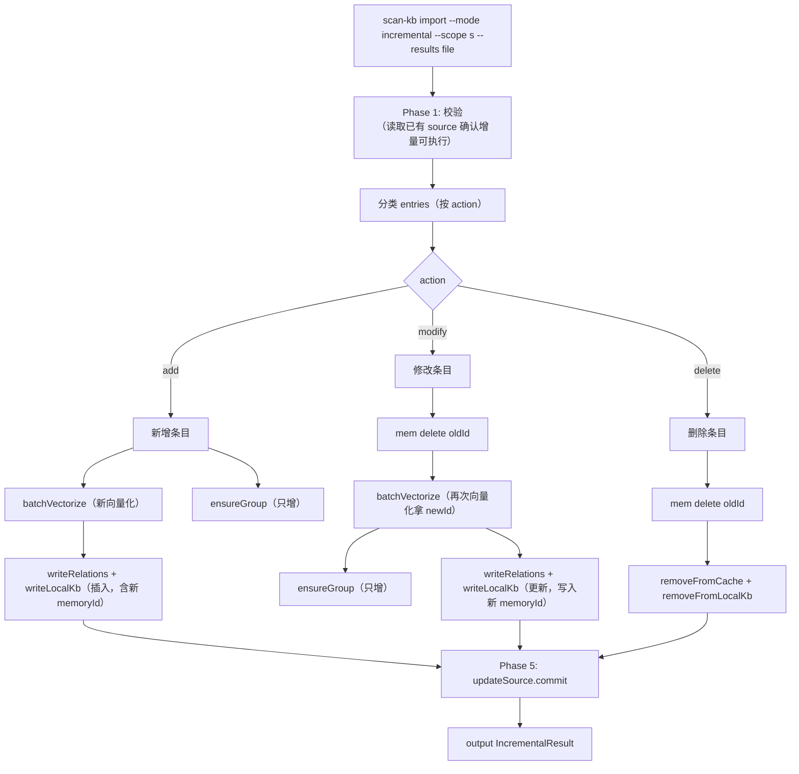
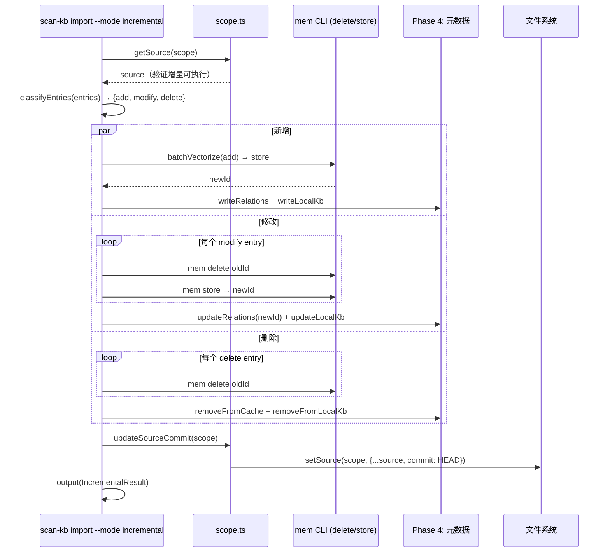

# S-06：增量导入 设计文档

> - 状态：草案
> - 起草时间：2026-05-26
> - 关联父文档：[scan-kb-import-unified_DESIGN.md](scan-kb-import-unified_DESIGN.md)
> - 实施范围：`knowledge-index/scripts/scan-kb.ts` 的 `import` 子命令新增 `--mode incremental`

## 1. 需求背景 & 目标

### 1.1 背景

首次导入后（S-04），外部知识库持续更新。S-05 `diff` 子命令输出变更文件列表 → AI 处理变更生成增量 `ai-results.json` → 需要一条命令完成增量导入：新增文件向量化、修改文件覆盖、删除文件更新索引。

### 1.2 目标

- 目标 1：`scan-kb import --mode incremental --scope <s> --results <file>` 支持增量导入
- 目标 2：根据 `ai-results.json` 的 `entry.action` 字段（S-02 定义）区分三种操作：
  - `action === 'add'`（或缺失）→ 新增（new vectorize + Group 创建）
  - `action === 'modify'` → 更新（先 `mem delete <oldId>` 再 `mem store`，更新索引中的 memoryId）
  - `action === 'delete'` → 从索引移除 + `mem delete <oldId>`（彻底删除记忆，避免搜索冗余）
- 目标 3：导入完成后更新 `source.commit` 到当前 HEAD

### 1.3 明确不在范围内

- 不生成 `ai-results.json`（由 AI 根据 S-05 diff 结果生成）
- 不处理重排序 / repartition（由 `relations-cache.json` 的已有逻辑处理）

## 2. 名词术语表

| 术语 | 含义 | 易混淆点 |
|------|------|---------|
| `incremental` | 增量导入模式 | 与 `full`（首次导入）互斥 |
| `upsert` | 存在则更新、不存在则插入 | 对应 modified 和 added |
| `delete+create` | modify 路径的实现：先 `mem delete <oldId>` 再 `mem store` 拿到 newId | 因 `memory_store` 是 create 语义，无 update，避免双写 |
| `forget on delete` | delete 路径同步调 `mem delete`，从索引和记忆库双向移除 | 与早期"只清索引"方案不同，避免搜索返回死链 |

## 3. 现状分析（AS-IS）

当前增量流程：`handleScanPrepare` 有 `buildIncrementalPending` 逻辑（基于 `scan-index.json.lastScannedCommit` 做 git diff → 构造 ScanPending）→ `handleScanMerge` 合并新结果 → `vectorize` 只向量化新增/修改的 → `import-kb` 全量重写 Group 树。痛点：全量重写 Group 树效率低，无法精确处理单条删除。

## 4. 方案设计（TO-BE）

S-04 的 `handleImport` 新增 `--mode` 参数，`incremental` 模式下的差异化行为：

```typescript
// handleImport 增量分支
if (mode === 'incremental') {
  // Phase 1: 校验（同 S-04，额外校验 source 块存在 + memoryId 一致性）

  // Phase 2: 按 action 分类 → 分别处理
  //   - action === 'add'    → batchVectorize → 新 memoryId
  //   - action === 'modify' → mem delete oldId → batchVectorize → 新 memoryId（替换旧 id）
  //   - action === 'delete' → mem delete oldId → 仅清索引（不 batchVectorize）

  // Phase 3: 增量更新 Group 树（add/modify 新增目录 → 创建，delete 留空 Group）

  // Phase 4: 增量写元数据
  //   - add/modify → 写/更新 relations-cache + local KB
  //   - delete → 从 relations-cache 移除 hot_relation + 从 local KB 移除条目

  // Phase 5: 更新 source.commit
}
```

### 4.2 关键决策点

| 决策 | 选择 | 理由 | 备选 |
|------|------|------|------|
| modify 实现方式 | `mem delete oldId` + `mem store` 拿 newId | `memory_store` 是 create 语义无 update，避免双写脏数据 | ❌ 复用 oldId：实际会产生两条独立记忆 |
| delete 实现方式 | `mem delete oldId` + 清索引 | 用户已确认采用，避免搜索返回已删除内容 | ❌ 只清索引：旧记忆仍可被搜索 |
| Group 树处理 | 只增不删 | 目录可能被其他文件使用 | ❌ 自动清理空目录 |
| 增量删除标记 | S-02 的 `action: 'delete'` 字段 | 与 add/modify 同维度，无哨兵值 | ❌ `summary: "__DELETE__"`：S-02 已废弃此方案 |
| mem delete 失败时 | 记录 warning，继续后续操作 | 删除幂等，避免单条阻塞全部 | ❌ 整体回滚：复杂度高，收益低 |

### 4.3 与现状的差异

- `handleImport` 新增 `--mode` 参数，默认 `full`
- 增量模式下 Phase 2/3/4 行为与 full 模式不同
- 新增 `removeFromCache(scope, path)` 和 `removeFromLocalKb(scope, groupPath, path)` 函数
- 新增 `deleteMemory(memoryId)` 辅助函数（封装 `mem delete <id>` 子进程调用）

## 5. 架构图 / 流程图



## 6. 模块/类设计

| 模块 | 职责 | 依赖 |
|------|------|------|
| `IncrementalResult` | 增量导入结果类型 | 扩展 `ImportResult` |
| `classifyEntries(entries)` | 按 `entry.action` 分类为 add/modify/delete | S-02 |
| `deleteMemory(memoryId)` | 调用 `mem delete <id>` 子进程封装 | execFileSync |
| `removeFromCache(scope, path)` | 从 relations-cache 移除 hot_relation | relations-cache.json |
| `removeFromLocalKb(scope, groupPath, path)` | 从 local KB index.json 移除条目 | local KB |
| `updateSourceCommit(scope)` | 更新 source.commit 为当前 HEAD | S-01 |

## 7. 接口设计

```typescript
interface IncrementalResult extends ImportResult {
  mode: 'incremental';
  stats: ImportStats & {
    added: number;
    modified: number;
    deleted: number;
  };
  previousCommit: string;  // 旧的 source.commit
  newCommit: string;       // 更新后的 HEAD
}

interface IncrementalEntry extends ScanResultEntry {
  action: 'add' | 'modify' | 'delete';  // classifyEntries 产出，强制非可选
}

function classifyEntries(entries: ScanResultEntry[]): {
  add: IncrementalEntry[];
  modify: IncrementalEntry[];
  delete: IncrementalEntry[];
};
function deleteMemory(memoryId: string): { ok: boolean; error?: string };
function removeFromCache(scope: string, path: string): void;
function removeFromLocalKb(scope: string, groupPath: string, filename: string): void;
function updateSourceCommit(scope: string): void;
```

### CLI 参数

```bash
# 增量导入
scan-kb import --mode incremental --scope mcp-test --results ai-results-incremental.json

# 增量导入 + mapping
scan-kb import --mode incremental --scope mcp-test --results ai-results.json --mapping mapping.json
```

## 8. 数据模型

### 8.1 增量 ai-results.json 示例

> 参见 [S-02 § 8.2](scan-kb_S02_ai-results-format_DESIGN.md)。本文件统一使用 `action: 'add' | 'modify' | 'delete'` 字段标记，不再使用 `summary: "__DELETE__"` 哨兵值。

```json
{
  "meta": {
    "sourceDir": "/root/.../repowiki/zh/content",
    "rootName": "wiki"
  },
  "entries": [
    { "path": "新功能/实时同步.md", "groupPath": "wiki/新功能",
      "summary": "实时数据同步方案...", "keywords": ["实时", "同步"],
      "action": "add" },
    { "path": "部署运维/备份恢复.md", "groupPath": "wiki/部署运维",
      "summary": "更新后的备份恢复SOP...", "keywords": ["备份", "恢复", "增量备份"],
      "memoryId": "mem_abc123", "action": "modify" },
    { "path": "API文档/废弃接口.md", "groupPath": "wiki/API文档",
      "summary": "", "keywords": [],
      "memoryId": "mem_xyz789", "action": "delete" }
  ]
}
```

### 8.2 IncrementalResult 输出

```json
{
  "ok": true, "action": "import", "mode": "incremental",
  "scope": "mcp-test",
  "stats": { "total": 3, "added": 1, "modified": 1, "deleted": 1, "errors": 0 },
  "errors": [],
  "groups": ["wiki/新功能"],
  "previousCommit": "9af06f67...",
  "newCommit": "3d2a1b8c..."
}
```

## 9. 关键流程时序图



## 10. 异常处理 & 边界情况

| 场景 | 行为 | 暴露 |
|------|------|------|
| source 块不存在 | fail: "增量导入需要首次导入，请先 scan-kb import full" | 是 |
| entries 全为 delete | 正常执行，只 mem delete + 清索引 | 否 |
| modify 条目无 memoryId | 警告并降级为 add 处理 | 是 |
| modify/delete 时 `mem delete oldId` 失败 | 记录 warning，modify 继续 store；delete 继续清索引（幂等性原则） | 是 |
| delete 的 path 在 relations-cache 中不存在 | 记录 warning，跳过索引清理但仍 mem delete | 是 |
| add 条目的 path 在 relations-cache 中已存在 | 警告 + 覆盖（视为隐式 modify，不再 mem delete 旧值） | 是 |

## 11. 性能 & 安全

- 增量向量化只处理 add + modify，N 通常远小于 full 的 66
- 删除操作纯索引修改，O(1) IO
- 安全：同 S-04，args 数组传参防注入

## 12. 测试方案

| 类型 | 范围 | 工具 |
|------|------|------|
| 单元测试 | `classifyEntries` 分类正确性 | `node --test` |
| 单元测试 | `removeFromCache` / `removeFromLocalKb` | `node --test` |
| 集成测试 | 完整增量导入 E2E：full → 模拟变更 → diff → incremental | E2E 脚本 |
| 边界测试 | 空 entries、全 delete、source 不存在 | `node --test` |

## 13. 实施计划 / 里程碑

| 批次 | 主题 | 产出 | 依赖 |
|------|------|------|------|
| Batch 1 | classifyEntries + removeXxx | 分类函数 + 移除函数 | 无 |
| Batch 2 | handleImport 增量分支 | import --mode incremental 完整流程 | S-01, S-03, S-04, Batch 1 |
| Batch 3 | updateSourceCommit | source.commit 更新 | S-01, Batch 2 |

## 14. 风险 & 待定问题

| 风险 | 影响 | 预案 |
|------|------|------|
| `mem delete` 失败但 `mem store` 成功（modify 路径） | 残留旧 memory + 新 memory 两份，搜索冗余 | 在 IncrementalResult.errors 标记 `orphan_memory_id`；提供独立清理脚本（v2） |
| 增量过程被中断（部分 add/modify 已写入） | 索引与记忆库不一致 | source.commit 仅在全部成功后更新，下次 diff 重跑可补救 |
| 大量 delete 单次执行慢（N × 子进程） | 操作时长线性增长 | 一期接受；v2 考虑批量 mem delete API |

- [x] `summary: "__DELETE__"` → 已替换为 S-02 的 `action: 'delete'` 字段
- [x] modify 路径是否复用旧 memoryId → 已确认改为 delete+create
- [ ] 增量导入是否需要 `--dry-run`？→ 一期不实现
