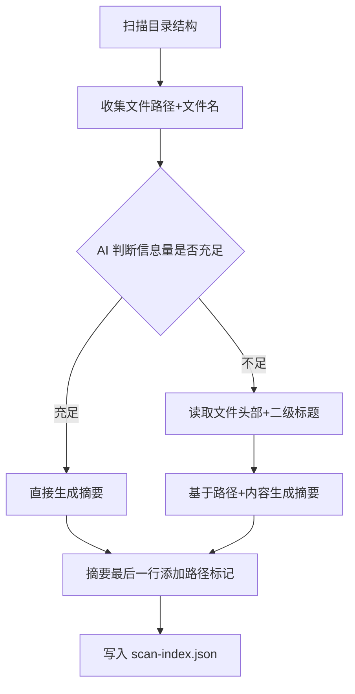
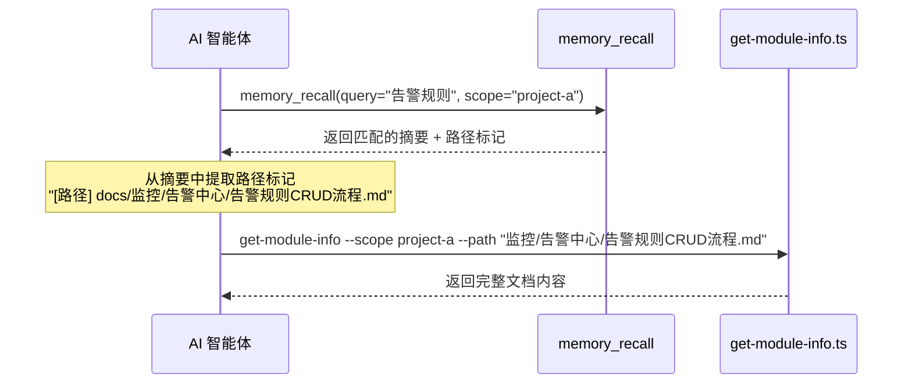

# 外部知识库向量化方案设计文档

> - 状态：草案
> - 起草时间：2026-05-23
> - 关联文档：知识索引SKILL_设计文档.md
> - 实施范围：外部知识库预扫描与摘要向量化流程

## 1. 需求背景 & 目标

### 1.1 背景

项目已有文件系统形式的知识库（如 `docs/` 目录下的 Markdown 文件集合），需要导入到知识索引系统中。外部知识库采用「摘要做发现、原文做交付」双层架构：
- **发现层**：摘要向量化后存入记忆系统，AI 通过语义检索摘要发现知识所在路径
- **交付层**：原文存入本地 KB，AI 通过路径精确读取完整文档内容

### 1.2 目标

- 目标 1：为每个文档单独生成摘要，不复用文档开头内容
- 目标 2：摘要需综合判断文档所在路径信息，生成结构化摘要
- 目标 3：摘要最后一行必须包含实际存储路径（相对路径），便于 Agent 直接定位文档
- 目标 4：摘要向量化后，AI 可通过语义检索发现知识路径

---

## 2. 名词术语表

| 术语 | 含义 | 易混淆点 |
|------|------|---------|
| **外部知识库** | 项目已有的文件系统形式知识库（如 docs/ 目录下的 Markdown 文件集合） | 不是 memory-lancedb-pro 的记忆数据，是项目自带的文档资产 |
| **预扫描** | 外部知识库导入前，由 AI Agent 扫描目录结构+文件标题（必要时读取内容头部），为每篇文档生成总结性摘要和关键词的过程 | 不是全文扫描，是轻量级元数据提取+摘要生成 |
| **摘要** | 预扫描为每篇文档生成的 3~5 句总结性描述，涵盖核心职责、关键流程、涉及模块，用于语义检索的发现层 | 不是标题复述，是结构化总结；不包含完整原文 |
| **摘要向量化** | 将摘要写入记忆系统（向量存储）的过程，使 AI 可通过语义检索发现知识路径 | 不是原文向量化，仅摘要向量化 |
| **发现层** | 双层架构的上层：摘要向量化后存入记忆系统，AI 通过语义检索摘要发现知识所在路径 | 不返回原文，只返回路径+摘要 |
| **交付层** | 双层架构的下层：原文存入本地 KB，AI 通过路径精确读取完整文档内容 | 不做语义检索，只做精确路径读取 |
| **扫描索引文件** | 预扫描产出的 JSON 文件（scan-index.json），记录每篇文档的路径、摘要、关键词、向量化状态 | 不是 Group 索引，是预扫描的专属产出物 |

---

## 3. 摘要生成规范

### 3.1 摘要生成原则

- **独立生成**：每个文档必须单独生成摘要，不复用文档开头内容
- **路径感知**：摘要需综合判断文档所在路径信息，路径是重要的语义上下文
- **结构化**：摘要为 3~5 句总结性描述，涵盖核心职责、关键流程、涉及模块
- **路径标记**：摘要最后一行必须包含实际存储路径（相对路径）

### 3.2 摘要生成流程



### 3.3 摘要格式规范

```
[摘要正文]
[路径] {relativePath}
```

**示例**：
```
告警中心下的规则管理模块，支持静态/动态阈值规则的创建、查询、更新、删除。规则创建时校验阈值合法性，支持静默聚合和分级触发。涉及 AlertController、AlertService、AlertRepository 三层调用链。
[路径] docs/监控/告警中心/告警规则CRUD流程.md
```

### 3.4 摘要质量标准

- **长度**：3~5 句总结性描述
- **内容覆盖**：
  - 核心职责：该文档主要描述什么内容
  - 关键业务流程：涉及的主要流程或操作
  - 涉及模块：相关的代码模块或组件
- **路径信息**：最后一行必须包含实际存储路径（相对路径）
- **禁止内容**：
  - 不复述文档标题
  - 不使用文档开头内容作为摘要
  - 不包含完整原文

---

## 4. 向量化方案设计

### 4.1 向量化流程

1. **读取扫描索引**：读取 `scan-index.json` 文件
2. **筛选未向量化条目**：筛选 `vectorized: false` 的条目
3. **调用 memory_store**：对每条摘要调用 `memory_store` 写入记忆系统
4. **更新状态**：写入成功后更新 `vectorized: true` + `memoryId`

### 4.2 向量化内容格式

写入记忆系统的内容格式：
```
[摘要] {summary 文本}
[路径] {relativePath}
[关键词] {keywords 逗号分隔}
```

**示例**：
```
[摘要] 告警中心下的规则管理模块，支持静态/动态阈值规则的创建、查询、更新、删除。规则创建时校验阈值合法性，支持静默聚合和分级触发。涉及 AlertController、AlertService、AlertRepository 三层调用链。
[路径] docs/监控/告警中心/告警规则CRUD流程.md
[关键词] 规则, 阈值, CRUD, 触发条件, 静默, 聚合
```

### 4.3 向量化脚本接口

```
用法: npx jiti scripts/scan-kb.ts vectorize --scope <scope>
       [--scan-index <scanIndexFile>]

输入:
  --scope        项目隔离标识（必填）
  --scan-index   扫描索引文件路径（可选，默认 kb/{scope}/scan-index.json）

行为:
  1. 读取 scan-index.json
  2. 筛选 vectorized: false 的条目
  3. 对每条摘要调用 memory_store 写入记忆系统，content 中包含摘要文本 + 文档路径标记
  4. 写入成功后更新 vectorized: true + memoryId

输出 (JSON):
{
  "ok": true,
  "vectorized": 10,
  "skipped": 2,
  "errors": []
}

异常:
  - scan-index.json 不存在 → 报错退出，提示"请先执行 scan 子命令"
  - 记忆系统不可用 → 报错退出，不修改 scan-index.json 状态
  - 单条向量化失败 → 记入 errors，继续处理其余，该条 vectorized 保持 false
```

---

## 5. 数据模型

### 5.1 扫描索引文件（scan-index.json）

文件路径：`kb/{scope}/scan-index.json`

```json
{
  "scope": "project-a",
  "rootName": "wiki",
  "sourceDir": "./docs",
  "scannedAt": "2026-05-23T10:00:00Z",
  "entries": [
    {
      "path": "监控/告警中心/告警规则CRUD流程.md",
      "fullPath": "wiki/监控/告警中心/告警规则CRUD流程",
      "summary": "告警中心下的规则管理模块，支持静态/动态阈值规则的创建、查询、更新、删除。规则创建时校验阈值合法性，支持静默聚合和分级触发。涉及 AlertController、AlertService、AlertRepository 三层调用链。\n[路径] docs/监控/告警中心/告警规则CRUD流程.md",
      "keywords": ["规则", "阈值", "CRUD", "触发条件", "静默", "聚合"],
      "enriched": false,
      "vectorized": true,
      "memoryId": "mem_abc123"
    },
    {
      "path": "部署/frontend-deploy.md",
      "fullPath": "wiki/部署/frontend-deploy",
      "summary": "前端部署流程文档，涵盖 npm 构建、CDN 分发、环境配置和回滚策略。构建产物通过 CI/CD 自动上传至 CDN，支持蓝绿发布和快速回滚。\n[路径] docs/部署/frontend-deploy.md",
      "keywords": ["前端", "部署", "CDN", "构建", "回滚"],
      "enriched": true,
      "vectorized": false,
      "memoryId": null
    }
  ],
  "stats": {
    "total": 12,
    "scanned": 12,
    "enriched": 5,
    "vectorized": 10
  }
}
```

**设计要点**：
- `path`：相对于 --source 的文件路径，用于 import-kb.ts 匹配
- `fullPath`：含根节点前缀的完整 Group 路径，用于向量化时嵌入摘要内容
- `summary`：3~5 句总结性描述，最后一行必须包含实际存储路径（相对路径）
- `keywords`：自然语言关键词，由 AI 生成，禁止代码符号
- `enriched`：是否读取了文件内容头部来丰富摘要（`true` 表示文件名信息不足，已补充读取）
- `vectorized`：是否已向量化到记忆系统，用于增量向量化（仅处理 `false` 的条目）
- `memoryId`：记忆系统中的记录 ID，向量化成功后填入

---

## 6. 运行时查询流程

### 6.1 两步查询机制

AI 通过以下两步查询外部知识库：

1. **语义检索摘要**：调用 `memory_recall` 查询摘要，返回匹配的文档路径
2. **精确读取原文**：根据路径调用 `get-module-info` 读取完整文档内容



### 6.2 路径提取规则

从 `memory_recall` 返回的摘要中提取路径标记：
- 格式：`[路径] {relativePath}`
- 提取方式：查找 `[路径]` 标记后的相对路径
- 路径转换：将相对路径转换为本地 KB 中的完整路径

---

## 7. 异常处理

| 场景 | 行为 | 是否对外暴露 |
|------|------|-------------|
| scan-index.json 不存在 | 报错退出，提示"请先执行 scan 子命令" | 是 |
| 记忆系统不可用 | 报错退出，不修改 scan-index.json 状态 | 是 |
| 单条向量化失败 | 记入 errors，继续处理其余，该条 vectorized 保持 false | 是 |
| 摘要格式错误（无路径标记） | 跳过该条，记入 errors | 是 |
| 路径标记格式错误 | 跳过该条，记入 errors | 是 |
| 路径对应的文件不存在 | 跳过该条，记入 errors | 是 |

---

## 8. 性能考虑

- **向量化延迟**：每个文件一次 `memory_store` 调用，100 个文件约 1~2 分钟
- **增量向量化**：仅处理 `vectorized: false` 的条目，已向量化的不重复处理
- **批量处理**：支持批量向量化，减少网络请求次数

---

## 9. 测试方案

| 类型 | 范围 | 工具 |
|------|------|------|
| 单元测试 | 摘要格式验证、路径标记提取 | Node.js test runner |
| 集成测试 | 完整向量化流程：scan-index.json → memory_store → 验证向量化状态 | Node.js test runner + mock MCP |
| 边界测试 | 空摘要、无路径标记、路径不存在 | Node.js test runner |

---

## 10. 实施计划

| 批次 | 主题 | 主要产出 | 依赖 |
|------|------|---------|------|
| Batch 1 | 摘要生成规范 | 摘要生成规则、路径标记格式、质量标准 | 无 |
| Batch 2 | 向量化脚本 | `scripts/scan-kb.ts vectorize` 子命令实现 | Batch 1 |
| Batch 3 | 测试与文档 | 单元测试、集成测试、使用文档 | Batch 1, 2 |