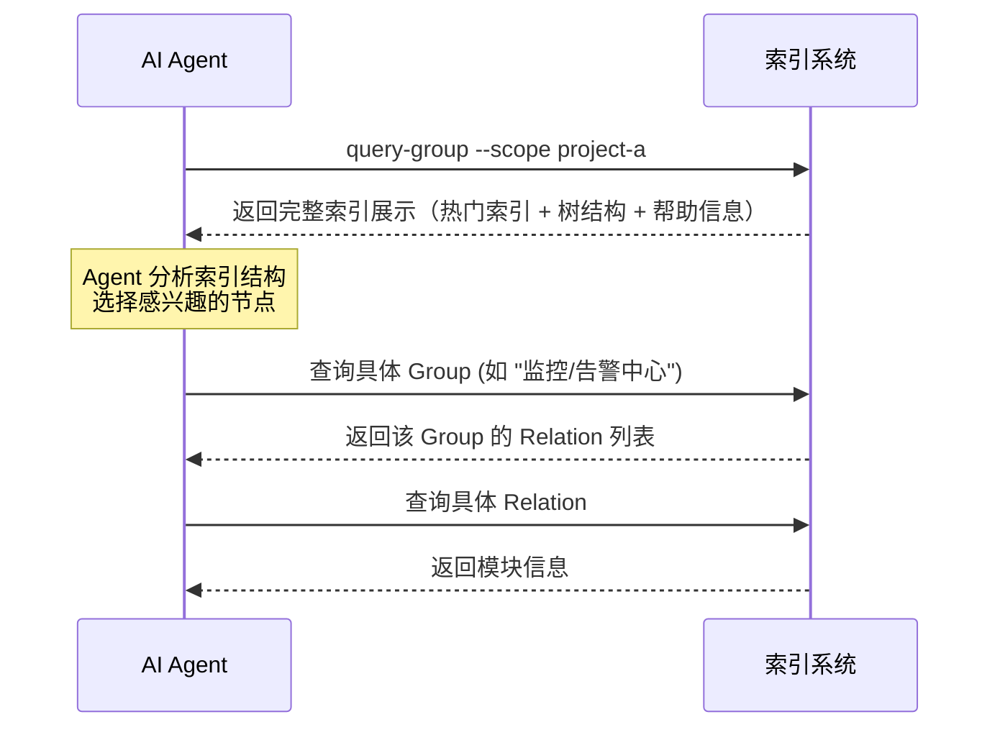
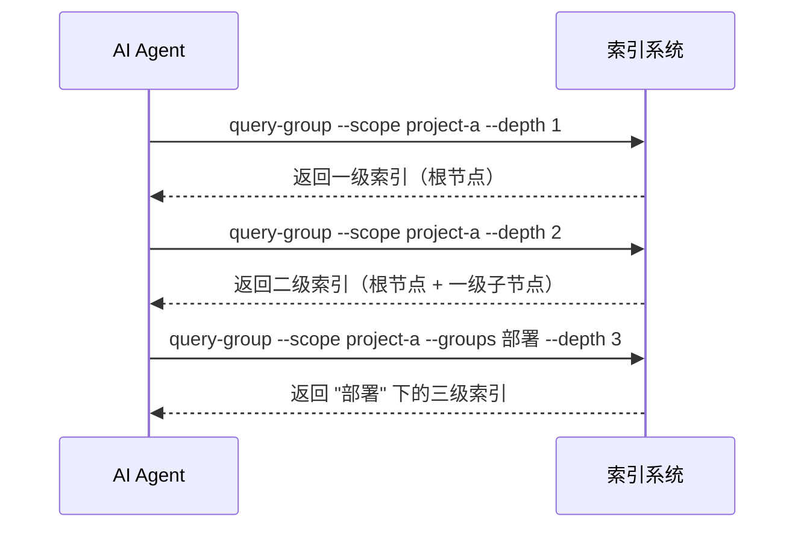
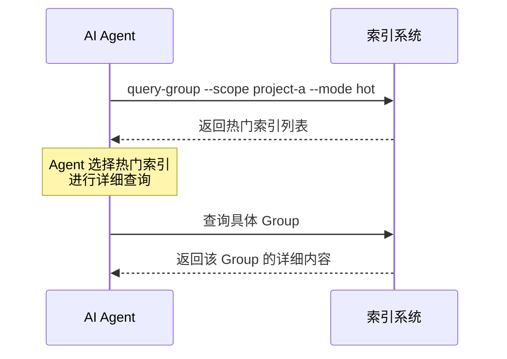

# 索引展示方案设计文档

> - 状态：草案
> - 起草时间：2026-05-23
> - 关联文档：知识索引SKILL_设计文档.md、评分机制_设计文档.md
> - 实施范围：索引展示格式、交互流程、参数控制

## 1. 需求背景 & 目标

### 1.1 背景

知识索引系统需要向 AI Agent 展示项目知识结构，帮助 Agent 快速了解项目有哪些知识域、哪些是热门内容。当前设计采用 JSON 格式展示，存在 Token 消耗大、层级关系不清晰、缺少热门优先展示等问题。

### 1.2 目标

- 目标 1：采用树形文本格式展示索引，减少 Token 消耗
- 目标 2：支持热门索引优先展示，提高 Agent 查询效率
- 目标 3：支持层级控制，Agent 可指定查看特定深度的索引
- 目标 4：支持参数化配置，灵活控制展示效果
- 目标 5：提供清晰的帮助信息，降低 Agent 学习成本

---

## 2. 名词术语表

| 术语 | 含义 | 易混淆点 |
|------|------|---------|
| **索引展示** | 将知识索引结构以文本形式呈现给 AI Agent | 不是 UI 界面，是文本格式的结构化展示 |
| **热门索引** | 评分最高的索引，优先展示给 Agent | 不是固定数量，根据参数动态调整 |
| **层级控制** | 控制索引树的展示深度 | 不是过滤，是限制显示深度 |
| **分区标识** | 使用 emoji 和文字标识数据的冷热状态 | 不是分类，是状态标识 |
| **Token 预算** | 展示内容占用的 Token 数量 | 不是限制，是优化目标 |

---

## 3. 展示格式设计

### 3.1 树形文本格式（方案A）

采用树形文本格式展示索引，具有以下特点：

- **Token 高效**：比 JSON 格式节省 50% 以上 Token
- **结构清晰**：使用树形符号展示层级关系
- **热门优先**：热门索引单独展示在顶部
- **状态标识**：使用 emoji 和文字标识数据状态

### 3.2 完整展示格式（含新兴热区）

```
=== 知识索引 [scope: project-a] ===

🔥 热门索引 (Top 5):
├── 监控/告警中心 (score: 85) [热]
├── 部署/前端 (score: 72) [热]
├── 监控/日志查询 (score: 65) [热]
├── 部署/后端 (score: 58) [热]
└── 新功能/模块A (score: 27) [新兴热]  ← 新兴热门内容

📁 完整索引树:
项目根/
├── 部署/ (score: 130) [热]
│   ├── 前端 (score: 72) [热]
│   ├── 后端 (score: 58) [热]
│   └── 启动脚本 (score: 12) [冷]
├── 监控/ (score: 198) [热]
│   ├── 告警中心 (score: 85) [热]
│   ├── 日志查询 (score: 65) [热]
│   ├── APM查询 (score: 45) [常温]
│   └── 告警组 (score: 8) [冷]
├── 新功能/ (score: 27) [新兴热]
│   ├── 模块A (score: 27) [新兴热]  ← 48小时内频繁使用
│   └── 模块B (score: 5) [冷]
└── wiki/ (score: 0) [冷]
    ├── 监控/ (score: 0) [冷]
    │   └── 告警中心 (score: 0) [冷]
    └── 部署/ (score: 0) [冷]
        ├── 前端 (score: 0) [冷]
        └── 后端 (score: 0) [冷]

💡 帮助信息:
- 查询具体 Group: "查询 <路径>" (如 "查询 监控/告警中心")
- 查看热门索引: "热门索引"
- 查看新兴热门: "新兴热门"
- 查看特定层级: "索引层级 <N>" (如 "索引层级 2")
- 查看帮助: "帮助"

📊 统计信息:
- 总索引数: 18
- 热区索引: 6 (新兴热: 2, 历史热: 4)
- 常温区索引: 3
- 冷区索引: 9
```

### 3.3 分区标识规范

| 分区 | Emoji | 文字 | 评分范围 | 说明 |
|------|-------|------|---------|------|
| 历史热区 | 🔥 | [热] | >= 50 | 历史高频使用，优先展示 |
| 新兴热区 | 🔥 | [新兴热] | 任意 | 48小时内频繁使用，有保留席位 |
| 常温区 | 🌡️ | [常温] | 20-49 | 中频使用，次优先展示 |
| 冷区 | ❄️ | [冷] | < 20 | 低频使用，可能被删除 |
| 导入 | 📥 | [导入] | 0 | 从外部知识库导入 |

**新兴热区标识**：
- 使用 🔥[新兴热] 标识，与历史热区区分
- 新兴热区内容评分可能不高，但最近频繁使用
- 有保留席位（默认10个），保证新内容能快速进入热区

### 3.4 树形符号规范

```
├── 非最后一个子节点
└── 最后一个子节点
│   垂直连接线
    缩进空格
```

**示例**：
```
├── 节点1
├── 节点2
│   ├── 子节点2.1
│   └── 子节点2.2
└── 节点3
```

---

## 4. 参数控制设计

### 4.1 query-group.mjs 接口

```
用法: node scripts/query-group.mjs --scope <scope> [--groups <group1,group2>]
       [--hot-count <count>] [--depth <depth>] [--partition <partition>]
       [--mode <mode>] [--emerging] [--help]

输入:
  --scope       项目隔离标识（必填）
  --groups      逗号分隔的 Group 路径列表（可选，默认返回完整 Group 树）
  --hot-count   热门索引展示个数（可选，默认 5）
  --depth       索引层级深度（可选，默认 4，最大 10）
  --partition   分区过滤：hot | warm | cold | emerging | all（可选，默认 all）
  --mode        展示模式：full | hot | compact | help（可选，默认 full）
  --emerging    只展示新兴热区内容（可选，默认 false）
  --help        显示帮助信息

输出:
  树形文本格式的索引展示
```

### 4.2 参数说明

#### 4.2.1 --hot-count

控制热门索引展示个数（包括新兴热区和历史热区）。

```
# 默认展示 5 个热门索引
query-group --scope project-a

# 展示 10 个热门索引
query-group --scope project-a --hot-count 10

# 不展示热门索引
query-group --scope project-a --hot-count 0
```

#### 4.2.2 --emerging

只展示新兴热区内容（最近48小时内使用过的内容）。

```
# 只展示新兴热区内容
query-group --scope project-a --emerging

# 展示所有内容（默认）
query-group --scope project-a --no-emerging
```

#### 4.2.3 --partition

分区过滤，支持新兴热区过滤。

```
# 只展示热区内容（包括新兴热区和历史热区）
query-group --scope project-a --partition hot

# 只展示新兴热区内容
query-group --scope project-a --partition emerging

# 只展示常温区内容
query-group --scope project-a --partition warm

# 只展示冷区内容
query-group --scope project-a --partition cold
```

#### 4.2.2 --depth

控制索引树的展示深度。

```
# 默认展示 4 层
query-group --scope project-a

# 只展示 1 层（根节点）
query-group --scope project-a --depth 1

# 展示 2 层
query-group --scope project-a --depth 2

# 展示所有层级（最大 10 层）
query-group --scope project-a --depth 10
```

**层级说明**：
- 层级 1：根节点（如 "项目根"、"wiki"）
- 层级 2：一级子节点（如 "部署"、"监控"）
- 层级 3：二级子节点（如 "前端"、"告警中心"）
- 层级 N：N-1 级子节点

#### 4.2.4 --partition

控制分区过滤。

```
# 展示所有分区
query-group --scope project-a --partition all

# 只展示热区索引（包括新兴热区和历史热区）
query-group --scope project-a --partition hot

# 只展示新兴热区索引
query-group --scope project-a --partition emerging

# 只展示常温区索引
query-group --scope project-a --partition warm

# 只展示冷区索引
query-group --scope project-a --partition cold
```

#### 4.2.5 --mode

控制展示模式。

```
# 完整模式（默认）
query-group --scope project-a --mode full

# 只展示热门索引（包括新兴热区和历史热区）
query-group --scope project-a --mode hot

# 只展示新兴热区索引
query-group --scope project-a --mode emerging

# 精简模式（无评分，无帮助信息）
query-group --scope project-a --mode compact

# 显示帮助信息
query-group --scope project-a --mode help
```

### 4.3 参数组合示例

```
# 展示前 10 个热门索引，只显示 2 层深度
query-group --scope project-a --hot-count 10 --depth 2

# 只展示热区索引，精简模式
query-group --scope project-a --partition hot --mode compact

# 展示 3 层深度，不显示热门索引
query-group --scope project-a --depth 3 --hot-count 0

# 显示帮助信息
query-group --scope project-a --help
```

---

## 5. 展示模式设计

### 5.1 完整模式（full）

**默认模式**，展示所有信息：
- 热门索引（Top N，包括新兴热区和历史热区）
- 完整索引树（带评分和分区标识）
- 帮助信息
- 统计信息

**Token 预算**：300-500 tokens

### 5.2 热门模式（hot）

只展示热门索引，适合快速浏览：
- 热门索引（Top N，包括新兴热区和历史热区）
- 简要统计信息

**Token 预算**：100-150 tokens

### 5.3 新兴热区模式（emerging）

只展示新兴热区索引，适合查看最近热门内容：
- 新兴热区索引（最近48小时内使用过的内容）
- 简要统计信息

**Token 预算**：80-120 tokens

**示例**：
```
=== 新兴热区 [scope: project-a] ===

🔥 新兴热门索引 (Top 5):
├── 新功能/模块A (score: 27) [新兴热] - 最后使用: 2小时前
├── 监控/告警中心 (score: 85) [新兴热] - 最后使用: 6小时前
├── 部署/前端 (score: 72) [新兴热] - 最后使用: 12小时前
├── 部署/后端 (score: 58) [新兴热] - 最后使用: 24小时前
└── 监控/APM查询 (score: 45) [新兴热] - 最后使用: 36小时前

📊 统计:
- 新兴热区索引: 5
- 保留席位: 10
- 最后使用时间范围: 2小时前 - 36小时前
```

**示例**：
```
=== 热门索引 [scope: project-a] ===

🔥 热门索引 (Top 5):
├── 监控/告警中心 (score: 85) [热]
├── 部署/前端 (score: 72) [热]
├── 监控/日志查询 (score: 65) [热]
├── 部署/后端 (score: 58) [热]
└── 监控/APM查询 (score: 45) [常温]

📊 统计: 总索引 15 | 热区 5 | 常温区 3 | 冷区 7
```

### 5.3 精简模式（compact）

最小化展示，节省 Token：
- 索引树结构（无评分）
- 无帮助信息
- 无统计信息

**Token 预算**：150-200 tokens

**示例**：
```
项目根/
├── 部署/
│   ├── 前端
│   ├── 后端
│   └── 启动脚本
├── 监控/
│   ├── 告警中心
│   ├── 日志查询
│   ├── APM查询
│   └── 告警组
└── wiki/
    ├── 监控/
    │   └── 告警中心
    └── 部署/
        ├── 前端
        └── 后端
```

### 5.4 帮助模式（help）

只显示帮助信息：

**示例**：
```
=== 知识索引帮助 ===

📖 查询命令:
- 查询 <路径>     查看具体 Group 的详细内容
- 热门索引        查看热门索引
- 索引层级 <N>    查看特定层级的索引
- 帮助            显示此帮助信息

🔧 参数说明:
--scope <scope>       项目隔离标识（必填）
--groups <group1,group2>  逗号分隔的 Group 路径列表
--hot-count <count>   热门索引展示个数（默认 5）
--depth <depth>       索引层级深度（默认 4，最大 10）
--partition <partition>  分区过滤：hot | warm | cold | all
--mode <mode>         展示模式：full | hot | compact | help

💡 示例:
query-group --scope project-a
query-group --scope project-a --hot-count 10 --depth 2
query-group --scope project-a --partition hot --mode compact
```

---

## 6. 交互流程设计

### 6.1 首次查询流程



### 6.2 层级查询流程



### 6.3 热门索引查询流程



---

## 7. 格式化算法设计

### 7.1 主格式化函数

```javascript
function formatIndexForAgent(scope, indexData, options = {}) {
  const {
    hotCount = 5,
    depth = 4,
    partition = 'all',
    mode = 'full'
  } = options;
  
  let output = '';
  
  // 帮助模式
  if (mode === 'help') {
    return formatHelp();
  }
  
  // 热门模式
  if (mode === 'hot') {
    return formatHotIndex(scope, indexData, hotCount);
  }
  
  // 完整模式
  output += `=== 知识索引 [scope: ${scope}] ===\n\n`;
  
  // 热门索引
  if (hotCount > 0) {
    output += formatHotIndexSection(indexData, hotCount);
    output += '\n';
  }
  
  // 完整索引树
  output += `📁 完整索引树:\n`;
  output += formatTree(indexData.roots, '', true, depth, partition);
  
  // 精简模式不显示帮助和统计
  if (mode !== 'compact') {
    output += '\n';
    output += formatHelpSection();
    output += '\n';
    output += formatStats(indexData);
  }
  
  return output;
}
```

### 7.2 树格式化函数

```javascript
function formatTree(node, prefix = '', isLast = true, depth = 4, partition = 'all', currentDepth = 1) {
  if (currentDepth > depth) {
    return '';
  }
  
  let output = '';
  const keys = Object.keys(node);
  
  keys.forEach((key, i) => {
    const isLastItem = i === keys.length - 1;
    const connector = isLastItem ? '└──' : '├──';
    const newPrefix = prefix + (isLastItem ? '    ' : '│   ');
    
    // 获取评分和分区
    const score = getScore(key);
    const partitionInfo = getPartitionInfo(score);
    
    // 分区过滤
    if (partition !== 'all' && partitionInfo.partition !== partition) {
      return;
    }
    
    // 格式化节点
    const scoreText = ` (score: ${score})`;
    const partitionText = ` [${partitionInfo.text}]`;
    
    if (typeof node[key] === 'object' && Object.keys(node[key]).length > 0) {
      // 有子节点
      output += `${prefix}${connector} ${key}/${scoreText}${partitionText}\n`;
      output += formatTree(node[key], newPrefix, isLastItem, depth, partition, currentDepth + 1);
    } else {
      // 叶子节点
      output += `${prefix}${connector} ${key}${scoreText}${partitionText}\n`;
    }
  });
  
  return output;
}
```

### 7.3 分区信息函数

```javascript
function getPartitionInfo(score) {
  if (score >= 50) {
    return { partition: 'hot', emoji: '🔥', text: '热' };
  } else if (score >= 20) {
    return { partition: 'warm', emoji: '🌡️', text: '常温' };
  } else {
    return { partition: 'cold', emoji: '❄️', text: '冷' };
  }
}
```

### 7.4 热门索引格式化

```javascript
function formatHotIndexSection(indexData, hotCount) {
  const hotIndexes = getHotIndexes(indexData, hotCount);
  
  let output = `🔥 热门索引 (Top ${hotIndexes.length}):\n`;
  
  hotIndexes.forEach((item, i) => {
    const prefix = i === hotIndexes.length - 1 ? '└──' : '├──';
    const partitionInfo = getPartitionInfo(item.score);
    output += `${prefix} ${item.path} (score: ${item.score}) [${partitionInfo.text}]\n`;
  });
  
  return output;
}
```

---

## 8. 异常处理

| 场景 | 行为 | 是否对外暴露 |
|------|------|-------------|
| --scope 未指定 | 报错退出，提示"必须通过 --scope 指定项目 scope" | 是 |
| --depth 超过最大值 | 自动限制为最大值（10），记录警告 | 是（警告） |
| --hot-count 超过总数 | 显示所有索引，记录警告 | 是（警告） |
| --partition 无效值 | 报错退出，提示有效值：hot | warm | cold | all | 是 |
| --mode 无效值 | 报错退出，提示有效值：full | hot | compact | help | 是 |
| 索引数据为空 | 显示空索引提示，不报错 | 是 |
| 评分数据缺失 | 显示 score: 0，记录警告 | 是（警告） |

---

## 9. 性能考虑

- **Token 消耗**：
  - 完整模式：300-500 tokens
  - 热门模式：100-150 tokens
  - 精简模式：150-200 tokens
- **格式化延迟**：< 5ms（内存操作）
- **数据读取延迟**：< 10ms（JSON 文件读取）

---

## 10. 测试方案

| 类型 | 范围 | 工具 |
|------|------|------|
| 单元测试 | 格式化函数、分区标识、参数解析 | Node.js test runner |
| 集成测试 | 完整展示流程：参数 → 格式化 → 输出 | Node.js test runner |
| 边界测试 | 空索引、超大索引、无效参数 | Node.js test runner |
| Token 测试 | 不同模式下的 Token 消耗统计 | Token 计数工具 |

---

## 11. 实施计划

| 批次 | 主题 | 主要产出 | 依赖 |
|------|------|---------|------|
| Batch 1 | 格式化算法 | 树格式化函数、分区标识函数、热门索引格式化 | 无 |
| Batch 2 | 参数控制 | query-group.mjs 参数解析、模式切换、层级控制 | Batch 1 |
| Batch 3 | 测试与文档 | 单元测试、集成测试、使用文档 | Batch 1, 2 |