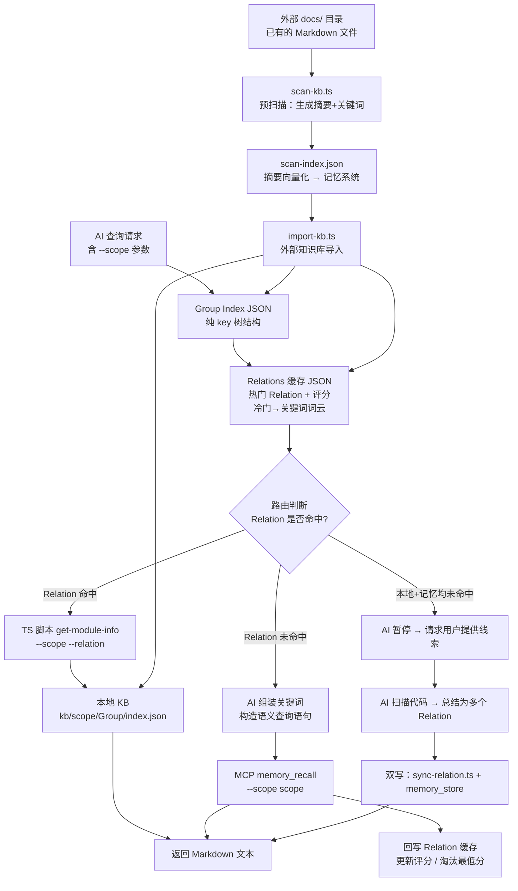
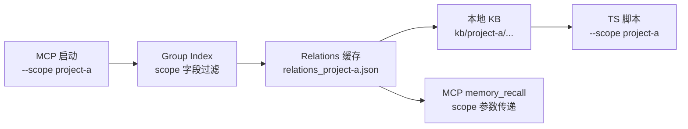
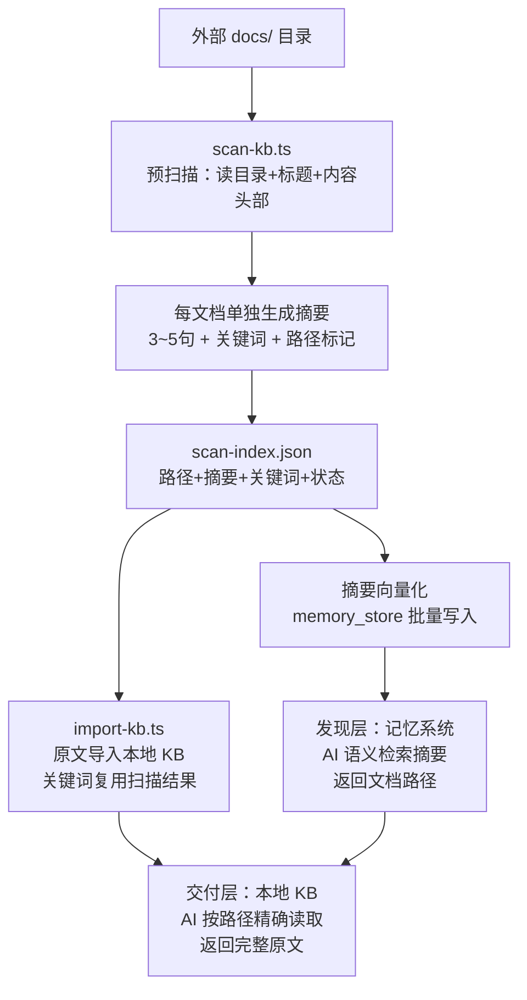
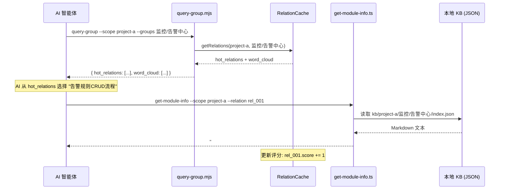
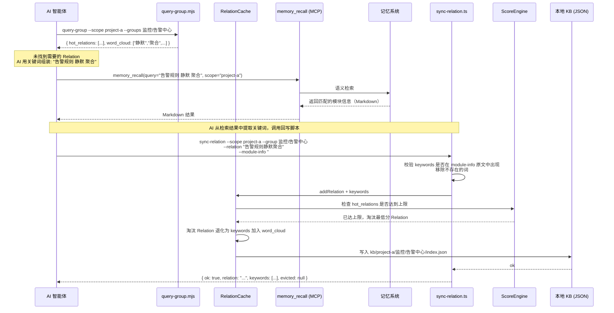
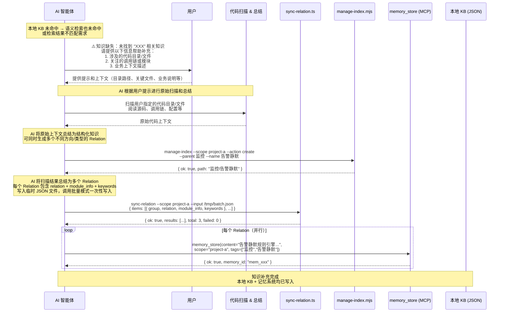
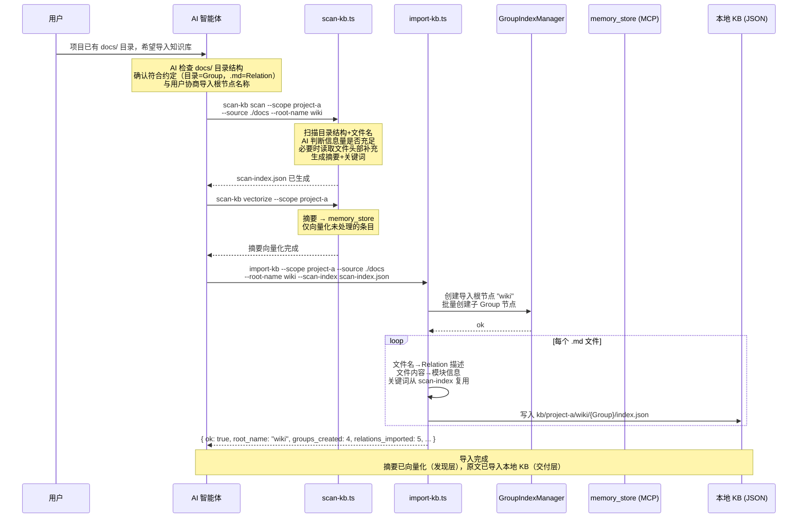
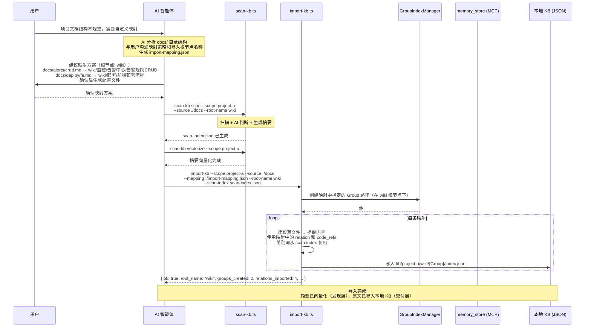
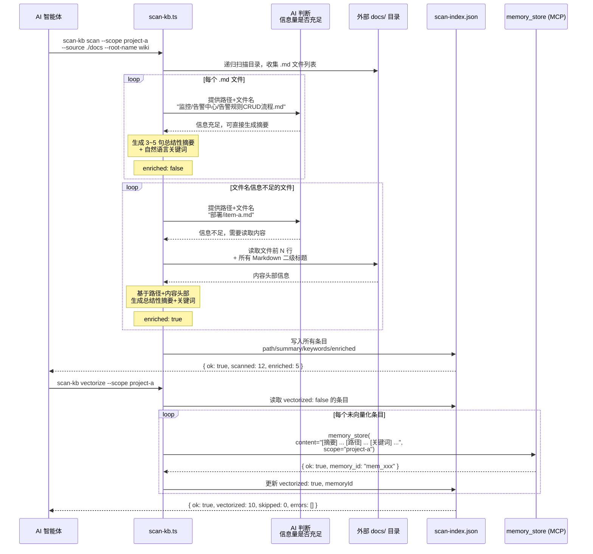

# 知识索引 SKILL 设计文档

> - 状态：草案
> - 起草时间：2026-05-22
> - 关联文档：
>   - 外部知识库向量化方案_设计文档.md
>   - 评分机制_设计文档.md
>   - 索引展示方案_设计文档.md
>   - Relations和关键词展示_设计文档.md
> - 实施范围：新建 scripts/ + kb/ + skills/ 目录下的 SKILL.md，不修改现有 src/

## 1. 需求背景 & 目标

### 1.1 背景

当前 memory-lancedb-pro 已提供混合检索（向量 + BM25）和记忆生命周期管理能力，但 AI 智能体每次检索项目知识都需走一次网络请求。同时，项目代码模块多、调用链复杂，AI 需要一个轻量级导航入口来快速定位"要查什么"——而非每次从零开始语义搜索。此外，多项目场景下需要按 scope 隔离各自的索引、缓存和本地知识库。

### 1.2 目标

- 目标 1：AI 首次接触项目时，可通过 Group 树索引一次获取完整知识导航结构，无需多次试探查询
- 目标 2：热门知识走本地 JSON 快速路径（<10ms），避免重复语义检索的网络成本
- 目标 3：冷门知识退化为关键词词云，引导 AI 自行组装 Relation 再走语义检索，保证覆盖率
- 目标 4：按 scope 隔离项目数据，MCP 启动参数 `--scope` 全链路传递至脚本和本地存储
- 目标 5：知识缺失时 AI 主动暂停并引导用户补充，通过定向扫描→总结→双写完成知识闭环
- 目标 6：支持将项目已有的文件系统形式知识库快速导入，无需从零构建本地 KB
- 目标 7：外部知识库通过预扫描生成摘要并摘要向量化，使导入知识对语义检索可见（摘要做发现、原文做交付）

### 1.3 明确不在范围内

- 不涉及 memory-lancedb-pro 内部检索算法修改
- 不涉及 LLM 嵌入/向量生成（本地 JSON 只做精确 key 查找）
- 不涉及 scope 机制本身的实现（复用已有 `--scope` 参数）
- 不涉及 Group 索引的自动生成（由开发者通过管理脚本手动创建，或通过 import-kb.ts 从外部知识库导入）
- 不涉及 UI/可视化界面
- 不涉及原文内容向量化（外部知识库仅摘要向量化，原文只存本地 KB）
- 不涉及增量扫描 / fileHash 变更检测（初期每次全量扫描）
- 不涉及扫描索引文件的自动过期清理

---

## 2. 名词术语表

| 术语 | 含义 | 易混淆点 |
|------|------|---------|
| **Group** | 索引树的节点，按业务领域命名（如"监控/告警中心"），构成树形结构，有不可变根节点 | 不是记忆分类（如 Profile/Preferences），是项目特定的知识分区 |
| **Relation** | 一个 Group 下的细粒度描述短语，类似文章标题（如"告警规则CRUD流程"） | 不是 memory_id，是本地缓存的查询 key |
| **模块信息** | Relation 对应的 Markdown 纯文本知识内容（调用流程、架构、关联模块等） | 不是代码文件本身，是对代码知识的归纳总结 |
| **关键词** | 从已被淘汰或冷门 Relation 中提取的语义标签，组成词云供 AI 组装查询 | 不是 tags；关键词无结构，纯用于语义检索的查询构造 |
| **词云** | 当 Relation 数量超过展示阈值时，未展示的 Relation 退化为关键词集合 | 不是可视化词云，是对 LLM 暴露的关键词列表 |
| **双路径路由** | 快速路径（本地 JSON 命中）→ 零成本；检索路径（组装关键词 → 记忆系统语义检索）→ 有成本 | 不是二选一互斥，是先尝试快速路径、失败后回退检索路径 |
| **Scope** | 项目隔离标识，MCP 启动时指定，所有脚本和存储路径均按 scope 命名空间隔离 | 与 memory-lancedb-pro 已有的 `--scope` 参数语义一致 |
| **评分** | Relation 的使用频次指标，值越大表示越常被命中 | 不是 Weibull 衰减分，是独立的缓存热度分 |
| **新兴热区** | 最近48小时内频繁使用的内容，有保留席位，能快速进入热区 | 不是固定分区，是基于使用时间动态变化的区域 |
| **外部知识库** | 项目已有的文件系统形式知识库（如 docs/ 目录下的 Markdown 文件集合），可作为本地 KB 的数据源 | 不是 memory-lancedb-pro 的记忆数据，是项目自带的文档资产 |
| **导入映射** | 描述外部知识库目录/文件到 Group/Relation 结构的映射规则，用于批量导入 | 不是 Group 树本身，是外部→内部的转换配置 |
| **导入根节点** | 外部知识库导入时自动创建的专属根节点，用于区分自建知识和导入知识，避免混合 | 不是默认的"项目根"节点，命名由 `--root-name` 指定（如"wiki"） |
| **代码定位符** | 模块信息中附带的代码路径引用，格式为相对路径 + 可选的类名/方法名，帮助 AI 快速定位源码 | 不是完整的代码内容，是路径级别的精确定位 |
| **批量向量化** | 将外部知识库内容批量写入记忆系统（向量存储）的过程，由独立脚本完成 | 不是本地 KB 写入，是向记忆系统的批量灌入 |
| **预扫描** | 外部知识库导入前，由 AI Agent 扫描目录结构+文件标题（必要时读取内容头部），为每篇文档生成总结性摘要和关键词的过程 | 不是全文扫描，是轻量级元数据提取+摘要生成 |
| **摘要** | 预扫描为每篇文档生成的 3~5 句总结性描述，涵盖核心职责、关键流程、涉及模块，用于语义检索的发现层 | 不是标题复述，是结构化总结；不包含完整原文 |
| **扫描索引文件** | 预扫描产出的 JSON 文件（scan-index.json），记录每篇文档的路径、摘要、关键词、向量化状态，同时作为"已扫描"的状态追踪 | 不是 Group 索引，是预扫描的专属产出物 |
| **发现层** | 双层架构的上层：摘要向量化后存入记忆系统，AI 通过语义检索摘要发现知识所在路径 | 不返回原文，只返回路径+摘要摘要 |
| **交付层** | 双层架构的下层：原文存入本地 KB，AI 通过路径精确读取完整文档内容 | 不做语义检索，只做精确路径读取 |

---

## 3. 现状分析（AS-IS）

### 3.1 现有实现

memory-lancedb-pro 已具备：
- **混合检索**：向量（ANN）+ BM25 + Cross-Encoder 重排序
- **记忆生命周期**：Weibull 衰减 + 三级晋升（Peripheral/Working/Core）
- **MCP 工具**：`memory_recall`、`memory_store`、`memory_forget`、`memory_update` 等
- **Scope 隔离**：`--scope` 启动参数 + 工具级 scope 参数

但 AI 智能体每次查询都需要：
1. 构造自然语言查询语句
2. 调用 `memory_recall` MCP 工具（网络请求 + 向量检索 + 重排序）
3. 从返回结果中筛选相关知识

### 3.2 痛点

- **无导航入口**：AI 不知道项目有哪些知识域，只能通过试探性查询逐步了解
- **重复检索成本**：热门知识（如"部署流程"）每次都被重复检索，即使内容未变
- **冷门知识不可见**：低频 Relation 在缓存中消失后，AI 完全不知道其存在
- **索引维护手工**：没有系统化的索引管理工具，靠人工记忆 Group 结构

---

## 4. 方案设计（TO-BE）

### 4.1 方案概述

在 memory-lancedb-pro 上层构建「Group 树索引 → Relations 缓存 → 本地 KB」三层文件系统。AI 通过一次 Group 索引查询获得项目知识全景；热门 Relation 直接走本地 JSON（TS 脚本），冷门 Relation 退化为关键词词云，AI 自行组装后走记忆系统语义检索。外部知识库导入采用「摘要做发现、原文做交付」双层架构：预扫描生成摘要+关键词 → 摘要向量化存入记忆系统 → 原文导入本地 KB。所有路径贯穿 scope 命名空间。

### 4.2 关键决策点

| 决策 | 选择 | 理由 | 被否决方案 |
|------|------|------|-----------|
| 本地 KB 存储 | JSON 文件 + 目录分层 | 零依赖、可 Git 版本控制、TS 脚本一行解析 | LanceDB：过度设计（无需向量检索）；SQLite：引入额外依赖 |
| 模块信息格式 | Markdown 纯文本 + 代码定位符 | LLM 天然理解、人可直接读写；代码路径帮助 AI 快速定位源码 | 纯结构化 JSON：字段模板僵化；纯文本无代码路径：AI 需额外搜索定位 |
| 淘汰策略 | 最低评分淘汰 | 与 Weibull 衰减思路一致，保留真正热门 | LRU 末尾淘汰：可能淘汰低频但重要的 Relation |
| 淘汰后处理 | 退化为关键词保留在词云 | 不丢失语义锚点，仍可通过关键词回退检索 | 直接删除：数据彻底丢失，冷启动代价高 |
| 查询脚本实现 | JS 脚本（`.mjs`） | 项目已有 jiti 基础设施，直接运行；JS 生态成熟 | TS 需额外编译步骤 |
| 模块检索脚本 | TS 脚本（`.ts`） | 可用 jiti 直接执行，类型安全 | JS 无类型，容易传错参数 |
| Scope 传递 | 全链路显式 `--scope` 参数 | 与 MCP 启动参数一致，无需额外配置 | 环境变量：隐式传递易出错 |
| 记忆系统写入 | 仅通过 MCP `memory_store` 写入 | 记忆系统为权威数据源，本地 KB 是只读缓存副本 | 本地 KB 直接写入：导致双写一致性问题 |
| 关键词规则 | 禁止代码符号，仅自然语言 | 代码路径/类名/方法名会引入噪音，降低语义检索精度 | 允许代码符号：检索时路径信息干扰向量匹配 |
| 导入知识关键词 | 由预扫描统一生成 | 预扫描时已生成摘要+关键词，导入时直接复用，避免重复生成 | 导入时不生成：语义检索完全不可见；导入后再生成：额外成本 |
| 导入知识向量化 | 仅摘要向量化 | 摘要语义密度高、匹配质量好、成本极低；原文中代码/配置会稀释语义信号 | 原文向量化：成本高且语义噪音大；不向量化：导入知识对语义检索不可见 |
| 预扫描渐进式读取 | AI Agent 自主判断 | AI 理解语义，可动态决定是否需要读取内容头部补充信息，比固定阈值更灵活 | 固定阈值（文件名长度）：不够智能；全部读取：不必要的 I/O 开销 |
| 导入根节点 | 独立根节点隔离 | 避免自建知识与导入知识混合，Group 路径天然隔离 | 共享根节点：两类知识混在一起，难以区分来源 |
| 数据一致性 | 自动同步机制 | 当 Agent 发现记忆不存在时自动同步，无需主动检查 | 一致性检查：增加复杂度，实际场景中自动同步更高效 |
| 评分机制 | 基于使用密度的复合评分 | 基础分（使用密度）× 活跃度加成（48小时窗口），更准确反映使用频率 | 简单+1计数：无法区分使用频率，可能被临时高频调用误导 |
| 热门索引机制 | 新兴热区 + 历史热区 | 新兴热区（48小时内使用）有保留席位，历史热区按评分排序 | 全量返回：信息过载，Agent 需要筛选 |
| 衰减机制 | 边界衰减 | 只在内容进入热区时触发衰减，计算量 O(1)，自动流动 | 实时衰减：计算量大，性能差 |
| 并发导入 | 拆分合并机制 | 每个 Agent 单独创建索引，完成后合并，避免索引混乱 | 直接并发写入：可能导致索引冲突和数据不一致 |
| 超大文件处理 | 直接删除 | 文档数据不应存在超大文件，读取会浪费巨量 Token | 限制读取：仍可能产生大文件，增加复杂度 |
| 特殊字符处理 | 直接删除 | 最简单有效，避免复杂转义逻辑 | 转义处理：增加复杂度，可能引入新问题 |
| 数据备份 | 自动备份机制 | 避免知识库丢失后重新创建，提供恢复能力 | 无备份：数据丢失风险高 |
| 乐观锁机制 | 文件修改时间戳检测 | 避免高并发产生数据问题，简单有效 | 无锁机制：可能导致数据覆盖丢失 |
| 冷热分区 | 三区机制（新兴热区/历史热区/常温区/冷区） | 新兴热区有保留席位，历史热区按评分排序，自动流动 | 单一分区：无法区分使用频率，缓存效率低 |
| 归档机制 | 支持归档 | 淘汰的 Relation 可归档以供审计 | 无归档：数据丢失，无法追溯 |

### 4.3 方案对比

方案唯一，无需对比。

### 4.4 与现状的差异

| 现状 | 新方案 |
|------|--------|
| AI 每次检索都走 `memory_recall` 网络请求 | 热门知识走本地 JSON 直接读取，零网络请求 |
| 无项目知识导航入口 | Group 树索引提供一次性全景导航 |
| 无缓存机制，重复查询反复检索 | Relations 缓存 + 评分机制，高频知识常驻 |
| scope 仅在记忆系统内部生效 | scope 贯穿索引、缓存、本地 KB 全链路 |
| 知识缺失时 AI 无感知，反复空查 | 知识缺失时 AI 主动暂停，引导用户补充后扫描总结并双写 |
| 项目已有文档无法复用，需从零构建 | 支持外部知识库导入，通过映射规则快速复用已有文档资产 |
| 导入知识对语义检索不可见（仅精确路径命中） | 预扫描生成摘要+关键词，摘要向量化后语义检索可发现，命中路径后再读原文 |

---

## 5. 架构图 / 流程图

### 5.1 总体数据流



### 5.2 Scope 隔离层次



### 5.3 外部知识库双层架构（发现层 + 交付层）



**架构要点**：
- **发现层**（摘要 → 记忆系统）：摘要语义密度高，向量化成本低，匹配质量优于原文
- **交付层**（原文 → 本地 KB）：完整文档内容，零网络成本，精确路径读取
- **运行时两步查询**：`memory_recall` 匹配摘要 → 提取路径 → `get-module-info` 读取原文
- **渐进式读取**：AI Agent 自主判断是否需要读取文件内容头部来丰富摘要，不依赖固定阈值
- **摘要生成规范**：每个文档单独生成摘要，不复用文档开头内容，需综合判断文档所在路径信息，摘要最后一行必须包含实际存储路径（相对路径）

---

## 6. 模块/类设计

### 6.1 模块清单

| 模块 | 职责 | 依赖 |
|------|------|------|
| **GroupIndexManager** | Group 树的增删查：新建节点（需父节点）、读取整棵树、校验合法路径 | 无 |
| **RelationCache** | Relations 缓存的读写、评分更新、最低分淘汰、关键词词云生成 | GroupIndexManager |
| **KnowledgeBaseStore** | 本地 KB 的读取和写入：按 scope + Group 路径定位 index.json，读写 Markdown | 无 |
| **RelationSyncEngine** | 记忆系统 → 本地 KB 同步：调用 MCP memory_recall 获取结果，写入本地 KB + 更新缓存 | KnowledgeBaseStore, RelationCache |
| **QueryRouter** | 双路径路由：接收 Group + Relation，先查 RelationCache，命中走本地 KB，未命中走同步引擎 | RelationCache, RelationSyncEngine |
| **SyncRelationScript** | 回写脚本：接收 AI 提供的 relation + 模块信息 + 关键词，校验关键词真实性，写入 Relation 缓存 + 本地 KB；支持批量 JSON 输入 | RelationCache, KnowledgeBaseStore |
| **KnowledgeGapDetector** | 知识缺失检测：当本地 KB 和记忆系统均未命中时，触发知识补充流程（扫描→总结→写入） | 无 |
| **KbImporter** | 外部知识库导入：扫描外部目录，按映射规则转换为 Group/Relation 结构，批量写入本地 KB，复用预扫描生成的关键词 | GroupIndexManager, SyncRelationScript |
| **KbScanner** | 外部知识库预扫描：扫描外部目录结构+文件标题，AI 自主判断是否读取内容头部，为每篇文档生成总结性摘要+关键词，写入 scan-index.json | GroupIndexManager |
| **ScoreEngine** | 评分计算与淘汰：基于使用密度的复合评分、边界衰减机制、新兴热区保留席位 | 无 |

### 6.2 关键模块设计要点

- **GroupIndexManager**：
  - 公开方法：`createNode(parentPath, nodeName)`, `createRoot(rootName)`, `getTree(scope)`, `validatePath(path)`
  - 不暴露：树结构内部存储格式
  - 设计取舍：支持多根节点（`roots` 对象），默认根节点为"项目根"，导入根节点由 `--root-name` 指定；单向树（只支持叶子→根查找），不支持任意图结构

- **RelationCache**：
  - 公开方法：`getRelations(scope, group)`, `addRelation(scope, group, relation, keywords, isImported)`, `generateWordCloud(scope, group, excludeIds)`
  - 不暴露：评分算法的衰减细节（由 ScoreEngine 负责）
  - 设计取舍：热门 Relation 数量上限可配置（默认 10），超出转为词云；导入的 Relation 标记 `isImported: true`，不生成关键词，不参与评分淘汰

- **QueryRouter**：
  - 公开方法：`route(scope, group, relation?)` → 返回 Markdown 文本
  - 不暴露：内部是走快速路径还是检索路径
  - 设计取舍：`route()` 内部自动决策，调用方无感知

- **SyncRelationScript**：
  - 公开方法：`sync(scope, group, relationText, moduleInfo, keywords)` → 写入缓存 + KB；`syncBatch(scope, items)` → 批量写入
  - 关键词由 AI 从 moduleInfo 中提取并传入，脚本做两层校验：
    1. 真实性校验：验证每个 keyword 在 moduleInfo 原文中存在，移除不存在的词
    2. 代码符号校验：检测 keyword 是否包含路径/类名特征（`.`、`/`、文件扩展名等），移除并放入 invalid_keywords
  - 设计取舍：关键词提取交给 AI（理解语义、更准确），脚本只做校验和写入，职责分离

- **KnowledgeGapDetector**：
  - 公开方法：`detect(localResult, memoryResult)` → 返回是否知识缺失
  - 判定规则：本地 KB 返回 null 且 memory_recall 返回空结果，或 memory_recall 结果与查询意图明显不匹配
  - 设计取舍：匹配度判断由 AI 自行决策，本模块仅提供辅助信息（如原始查询 vs 返回摘要的相似度提示）

- **KbImporter**：
  - 公开方法：`import(scope, sourceDir, rootName, mappingConfig, scanIndex?)` → 扫描外部目录并批量写入
  - 支持两种映射模式：
    1. **约定模式**（零配置）：目录结构即 Group 树，文件名即 Relation，文件内容即模块信息
    2. **配置模式**：通过映射配置文件（`import-mapping.json`）自定义目录→Group、文件→Relation 的映射规则
  - 导入流程：创建导入根节点 → 扫描文件 → 解析映射 → 生成 Group 树 + Relations → 批量写入本地 KB
  - 关键词复用：如果提供了 scan-index.json，导入时直接复用预扫描生成的关键词，不再重新生成
  - 设计取舍：约定模式优先（零配置即可用），配置模式作为高级覆盖；导入为一次性操作，不做增量同步

- **KbScanner**：
  - 公开方法：`scan(scope, sourceDir, rootName)` → 扫描外部目录，生成摘要+关键词，写入 scan-index.json；`vectorize(scope, scanIndex)` → 将 scan-index.json 中的摘要批量写入记忆系统
  - 渐进式读取策略：先读取目录层级+文件名，交由 AI Agent 判断摘要信息量是否充足；若不足，AI 自主决定读取文件前 N 行 + 所有 Markdown 二级标题（`##`）来补充
  - 摘要质量标准：每篇文档 3~5 句总结性描述，涵盖核心职责、关键业务流程、涉及的主要模块或组件
  - 关键约束：关键词由 AI 生成，禁止代码符号（类名、方法名、路径等），仅自然语言词汇
  - 设计取舍：渐进式读取由 AI 判断而非固定阈值，灵活但依赖 AI 能力；摘要做发现层而非原文向量化，成本低且语义匹配更好

- **ScoreEngine**：
  - 公开方法：`calculateDensityScore(lastUsedTimes)`, `calculateActivityBonus(lastUsedTime, now)`, `calculateFinalScore(lastUsedTimes, now)`, `boundaryDecay(hotItems, warmItems, newScore)`
  - 评分算法：基于使用密度的复合评分（基础分 × 活跃度加成）
  - 边界衰减：只在内容进入热区时触发衰减，计算量 O(1)，自动流动
  - 新兴热区：最近48小时内使用过的内容有保留席位（默认10个）
  - 设计取舍：不使用实时衰减，采用边界衰减机制，性能最优

---

## 7. 接口设计

### 7.1 脚本接口总览

| 脚本 | 语言 | 用途 |
|------|------|------|
| `scripts/query-group.mjs` | JS | 查询 Group：传入 Group 路径，返回热门 Relation + 关键词词云 |
| `scripts/get-module-info.ts` | TS | 模块检索：传入 Relation，从本地 KB 读取 Markdown 文本 |
| `scripts/sync-relation.ts` | TS | 关系回写：接收 AI 提供的 relation + 模块信息 + 关键词，校验关键词真实性，写入缓存 + 本地 KB；支持批量 JSON 输入 |
| `scripts/import-kb.ts` | TS | 外部知识库导入：扫描外部目录，按映射规则转换为 Group/Relation 结构，批量写入本地 KB，复用预扫描关键词 |
| `scripts/scan-kb.ts` | TS | 外部知识库预扫描：扫描目录+标题（必要时内容头部），生成摘要+关键词，写入 scan-index.json；支持摘要向量化 |
| `scripts/manage-index.mjs` | JS | 索引管理：新建/删除 Group 节点 |

### 7.2 query-group.mjs

```
用法: node scripts/query-group.mjs --scope <scope> [--groups <group1,group2>]
       [--hot-count <count>] [--depth <depth>] [--partition <partition>]
       [--mode <mode>] [--help]

输入:
  --scope       项目隔离标识（必填）
  --groups      逗号分隔的 Group 路径列表（可选，默认返回完整 Group 树）
  --hot-count   热门索引展示个数（可选，默认 5）
  --depth       索引层级深度（可选，默认 4，最大 10）
  --partition   分区过滤：hot | warm | cold | all（可选，默认 all）
  --mode        展示模式：full | hot | compact | help（可选，默认 full）
  --help        显示帮助信息

输出:
  树形文本格式的索引展示（详见 index-display_DESIGN.md）

示例输出:
=== 知识索引 [scope: project-a] ===

🔥 热门索引 (Top 5):
├── 监控/告警中心 (score: 85) [热]
├── 部署/前端 (score: 72) [热]
├── 监控/日志查询 (score: 65) [热]
├── 部署/后端 (score: 58) [热]
└── 监控/APM查询 (score: 45) [常温]

📁 完整索引树:
项目根/
├── 部署/ (score: 130) [热]
│   ├── 前端 (score: 72) [热]
│   ├── 后端 (score: 58) [热]
│   └── 启动脚本 (score: 12) [冷]
├── 监控/ (score: 198) [热]
│   ├── 告警中心 (score: 85) [热]
│   ├── 日志查询 (score: 65) [热]
│   ├── APM查询 (score: 45) [常温]
│   └── 告警组 (score: 8) [冷]
└── wiki/ (score: 0) [冷]
    ├── 监控/ (score: 0) [冷]
    │   └── 告警中心 (score: 0) [冷]
    └── 部署/ (score: 0) [冷]
        ├── 前端 (score: 0) [冷]
        └── 后端 (score: 0) [冷]

💡 帮助信息:
- 查询具体 Group: "查询 <路径>" (如 "查询 监控/告警中心")
- 查看热门索引: "热门索引"
- 查看特定层级: "索引层级 <N>" (如 "索引层级 2")
- 查看帮助: "帮助"

📊 统计信息:
- 总索引数: 15
- 热区索引: 5
- 常温区索引: 3
- 冷区索引: 7
```

### 7.3 get-module-info.ts

```
用法: npx jiti scripts/get-module-info.ts --scope <scope> --group <group> --relation <relationId>

输入:
  --scope     项目隔离标识（必填）
  --group     Group 路径（必填）
  --relation  Relation ID 或名称（必填）

输出 (stdout):
  Markdown 纯文本（模块信息）

异常:
  - Relation 不存在 → 返回 null + 提示走检索路径
  - 本地 KB 文件损坏 → 返回错误信息 + 建议从记忆系统同步
```

### 7.4 sync-relation.ts

支持两种调用模式：**单条模式**（命令行参数）和**批量模式**（JSON 文件输入）。

#### 单条模式

```
用法: npx jiti scripts/sync-relation.ts --scope <scope> --group <group>
       --relation <relationText> --module-info <markdownContent>
       --keywords <keyword1,keyword2,...>

输入:
  --scope        项目隔离标识（必填）
  --group        Group 路径（必填）
  --relation     Relation 描述文本，即语义检索命中的知识标题（必填）
  --module-info  AI 对代码的理解总结，完整 Markdown 文本（必填）
  --keywords     逗号分隔的关键词列表，由 AI 从 module-info 中提取（必填）
                 关键词必须在 module-info 原文中真实存在，不可臆造
                 关键词禁止使用代码符号（类名、方法名、路径、文件名等），
                 仅使用自然语言词汇，避免代码信息带来的语义检索精度损失

行为:
  1. 校验 keywords 中的每个词是否在 module-info 原文中出现，移除不存在的词
  2. 校验 keywords 中是否包含代码符号（含 `.`、`/`、`.ts`、`.js` 等路径或类名特征），移除并放入 invalid_keywords
  3. 将 relation + keywords 写入 Relations 缓存（评分初始化为 1）
  4. 如 hot_relations 达到上限，触发最低分淘汰 → 退化为关键词
  5. 将 module-info 写入本地 KB 的 index.json

输出 (JSON):
{ "ok": true, "relation": "告警规则静默聚合", "keywords": ["静默", "聚合", "触发条件"], "invalid_keywords": ["AlertSilence"], "evicted": null }
```

#### 批量模式

```
用法: npx jiti scripts/sync-relation.ts --scope <scope> --input <jsonFile>

输入:
  --scope   项目隔离标识（必填）
  --input   JSON 文件路径，包含批量写入数据（必填）

JSON 文件格式:
{
  "items": [
    {
      "group": "监控/告警中心",
      "relation": "告警规则CRUD流程",
      "module_info": "# 告警规则CRUD\n\n## 调用链\n1. AlertController.create()...",
      "keywords": ["CRUD", "规则", "阈值", "触发条件"]
    },
    {
      "group": "监控/告警中心",
      "relation": "通知渠道配置",
      "module_info": "# 通知渠道配置\n\n## 架构\n通知模块采用策略模式...",
      "keywords": ["Webhook", "邮件", "短信", "渠道"]
    },
    {
      "group": "部署/前端",
      "relation": "前端构建流程",
      "module_info": "# 前端构建\n\n## 步骤\n1. npm run build...",
      "keywords": ["webpack", "构建", "CDN"]
    }
  ]
}

行为:
  对 items 中每条记录执行与单条模式相同的逻辑，统一写入后一次性持久化。
  同一 Group 的多条 Relation 合并为一次文件写入，减少 I/O 开销。

输出 (JSON):
{
  "ok": true,
  "results": [
    { "relation": "告警规则CRUD流程", "keywords": ["CRUD","规则","阈值","触发条件"], "invalid_keywords": [], "evicted": null },
    { "relation": "通知渠道配置", "keywords": ["Webhook","邮件","短信","渠道"], "invalid_keywords": [], "evicted": "rel_003" }
  ],
  "total": 2,
  "failed": 0
}

异常:
  - module-info 为空 → 跳过该条，记录到 failed，不中断批量
  - keywords 中有不存在于原文的词 → 移除该词，放入 invalid_keywords，仍继续写入
  - keywords 中包含代码符号（含 `.`、`/`、`.ts` 等路径或类名特征）→ 移除该词，放入 invalid_keywords
  - keywords 为空数组 → 写入 relation 但 keywords 为空，发出警告
  - group 路径不存在 → 跳过该条，记录到 failed
```

### 7.5 import-kb.ts

支持两种映射模式将外部知识库导入本地 KB。导入前建议先执行 `scan-kb.ts` 预扫描，导入时通过 `--scan-index` 复用扫描结果中的关键词。

#### 约定模式（零配置）

```
用法: npx jiti scripts/import-kb.ts --scope <scope> --source <sourceDir>
       --root-name <rootName> [--scan-index <scanIndexFile>]

输入:
  --source        外部知识库根目录路径（必填），目录结构即 Group 树
  --scope         项目隔离标识（必填）
  --root-name     导入根节点名称（必填），用于区分自建知识和导入知识
                  例如 "wiki"、"docs"、"confluence"，不可与已有根节点重名
  --scan-index    扫描索引文件路径（可选），由 scan-kb.ts 生成
                  提供后复用其中的关键词，不再重新生成

约定规则:
  - 导入根节点：在 Group 树中创建独立的根节点（由 --root-name 指定），与自建的"项目根"隔离
  - 目录 → Group：子目录名即为 Group 节点名，嵌套目录即为子 Group
  - 文件 → Relation：.md 文件名（去掉扩展名）即为 Relation 描述文本
  - 文件内容 → 模块信息：.md 文件正文即为模块信息
  - 关键词复用：如提供 --scan-index，从 scan-index.json 中读取对应文件的关键词；未提供则关键词为空
  - 非法文件（非 .md）跳过，不报错

示例目录结构:
  docs/
  ├── 监控/
  │   ├── 告警中心/
  │   │   ├── 告警规则CRUD流程.md
  │   │   └── 通知渠道配置.md
  │   └── 日志查询.md
  └── 部署/
      ├── 前端.md
      └── 后端.md

导入结果:
  导入根节点: wiki
  Group 树: wiki/监控/告警中心, wiki/监控/日志查询, wiki/部署/前端, wiki/部署/后端
  Relations: 告警规则CRUD流程, 通知渠道配置, 日志查询, 前端, 后端

输出 (JSON):
{
  "ok": true,
  "root_name": "wiki",
  "groups_created": 4,
  "relations_imported": 5,
  "files_skipped": 2,
  "errors": []
}
```

#### 配置模式

```
用法: npx jiti scripts/import-kb.ts --scope <scope> --source <sourceDir>
       --mapping <mappingFile> --root-name <rootName> [--scan-index <scanIndexFile>]

输入:
  --source        外部知识库根目录路径（必填）
  --scope         项目隔离标识（必填）
  --mapping       映射配置文件路径（必填，JSON 格式）
  --root-name     导入根节点名称（必填），用于区分自建知识和导入知识
  --scan-index    扫描索引文件路径（可选），由 scan-kb.ts 生成，提供后复用其中的关键词

映射配置文件格式 (import-mapping.json):
{
  "root_name": "wiki",
  "groups": [
    {
      "path": "监控/告警中心",
      "sources": [
        {
          "file": "alerts/crud-guide.md",
          "relation": "告警规则CRUD流程",
          "code_refs": ["src/controllers/alert.ts: AlertController", "src/services/alert.ts: AlertService.validate"]
        },
        {
          "file": "alerts/notification.md",
          "relation": "通知渠道配置",
          "code_refs": ["src/services/notification.ts: ChannelFactory"]
        }
      ]
    },
    {
      "path": "部署",
      "sources": [
        {
          "file": "deploy/frontend-deploy.md",
          "relation": "前端部署流程",
          "code_refs": ["scripts/deploy-fe.sh"]
        },
        {
          "file": "deploy/backend-deploy.md",
          "relation": "后端部署流程",
          "code_refs": ["Dockerfile", "k8s/backend.yaml"]
        }
      ]
    }
  ]
}

配置规则:
  - root_name: 导入根节点名称，覆盖命令行 --root-name（可选，优先级更高）
  - groups[].path: 目标 Group 路径（相对于导入根节点），不存在则自动创建
  - groups[].sources[].file: 相对于 --source 的文件路径
  - groups[].sources[].relation: 导入后的 Relation 描述文本
  - groups[].sources[].code_refs: 可选，代码定位符列表，格式见 8.5 节
  - 不生成关键词：导入时关键词从 scan-index.json 复用，不由 import-kb.ts 自行生成
  - 同一文件可映射到不同 Group 下的不同 Relation

输出 (JSON):
{
  "ok": true,
  "root_name": "wiki",
  "groups_created": 2,
  "relations_imported": 4,
  "files_skipped": 0,
  "errors": []
}

异常:
  - --source 目录不存在 → 报错退出
  - --root-name 与已有根节点重名 → 报错退出，提示"根节点已存在，请使用不同名称"
  - 映射文件中引用的文件不存在 → 跳过该条，记入 errors
  - .md 文件内容为空 → 跳过该条，记入 errors
  - 映射文件 JSON 格式错误 → 报错退出
```

### 7.6 manage-index.mjs

```
用法: node scripts/manage-index.mjs --scope <scope> [--action create|delete|create-root]
       [--parent <parentPath>] [--name <nodeName>] [--root-name <rootName>]

输入:
  --scope      项目隔离标识（必填）
  --action     操作：create（默认）| delete | create-root
  --parent     父节点路径（create/delete 时必填，含根节点前缀如"项目根/监控"）
  --name       新节点名称（create 时必填）
  --root-name  新根节点名称（create-root 时必填，不可与已有根节点重名）

输出 (JSON):
{ "ok": true, "path": "监控/告警中心" }

约束:
  - 默认根节点"项目根"不可删除
  - 删除非空节点需二次确认
  - create-root 创建新的根节点，用于手动创建导入根节点（import-kb.ts 会自动调用）
```

### 7.7 scan-kb.ts

外部知识库预扫描脚本，分两个子命令：`scan`（生成摘要+关键词）和 `vectorize`（摘要向量化）。

#### scan 子命令

```
用法: npx jiti scripts/scan-kb.ts scan --scope <scope> --source <sourceDir>
       --root-name <rootName> [--output <outputFile>]

输入:
  --scope       项目隔离标识（必填）
  --source      外部知识库根目录路径（必填）
  --root-name   导入根节点名称（必填），与 import-kb.ts 保持一致
  --output      扫描索引文件输出路径（可选，默认 kb/{scope}/scan-index.json）

行为:
  1. 递归扫描 --source 目录，收集所有 .md 文件的路径、目录层级、文件名
  2. 将每个文件的路径信息交给 AI Agent，AI 判断仅靠路径+文件名是否足以生成总结性摘要
  3. 若 AI 判断信息不足，自主决定读取文件前 N 行 + 所有 Markdown 二级标题（##）来补充
  4. AI 为每篇文档生成 3~5 句总结性摘要（涵盖核心职责、关键流程、涉及模块）+ 自然语言关键词
  5. 将所有结果写入 scan-index.json

输出 (JSON):
{
  "ok": true,
  "root_name": "wiki",
  "total_files": 12,
  "scanned": 12,
  "enriched": 5,
  "output": "kb/project-a/scan-index.json"
}

异常:
  - --source 目录不存在 → 报错退出
  - .md 文件内容为空 → 跳过该文件，记入 warnings
  - AI 摘要生成失败 → 跳过该文件，记入 errors，继续处理其余
```

#### vectorize 子命令

```
用法: npx jiti scripts/scan-kb.ts vectorize --scope <scope>
       [--scan-index <scanIndexFile>]

输入:
  --scope        项目隔离标识（必填）
  --scan-index   扫描索引文件路径（可选，默认 kb/{scope}/scan-index.json）

行为:
  1. 读取 scan-index.json
  2. 筛选 vectorized: false 的条目
  3. 对每条摘要调用 memory_store 写入记忆系统，content 中包含摘要文本 + 文档路径标记
  4. 写入成功后更新 vectorized: true + memoryId

摘要向量化格式:
  写入记忆系统的内容格式：
  [摘要] {summary 文本}
  [路径] {rootName}/{Group}/{文件名}
  [关键词] {keywords 逗号分隔}

输出 (JSON):
{
  "ok": true,
  "vectorized": 10,
  "skipped": 2,
  "errors": []
}

异常:
  - scan-index.json 不存在 → 报错退出，提示"请先执行 scan 子命令"
  - 记忆系统不可用 → 报错退出，不修改 scan-index.json 状态
  - 单条向量化失败 → 记入 errors，继续处理其余，该条 vectorized 保持 false
```

---

## 8. 数据模型

### 8.1 Group 树索引 JSON

文件路径：`kb/{scope}/group-index.json`

```json
{
  "scope": "project-a",
  "roots": {
    "项目根": {
      "部署": {
        "前端": {},
        "后端": {},
        "启动脚本": {}
      },
      "监控": {
        "告警中心": {},
        "日志查询": {},
        "APM查询": {},
        "告警组": {}
      }
    },
    "wiki": {
      "监控": {
        "告警中心": {
          "告警规则CRUD流程": {},
          "通知渠道配置": {}
        }
      },
      "部署": {
        "前端": {},
        "后端": {}
      }
    }
  },
  "updatedAt": "2026-05-22T10:00:00Z"
}
```

**设计要点**：
- 支持多个根节点（`roots` 对象），每个根节点下独立一棵子树
- 自建知识的默认根节点为"项目根"，导入知识的根节点由 `--root-name` 指定（如"wiki"）
- 仅存 key（节点名），value 为空对象 `{}`（叶子）或嵌套对象（分支）
- 完整树可一次性塞入 LLM context
- 树深度建议 ≤ 4 层，避免过度嵌套

### 8.2 Relations 缓存 JSON

文件路径：`kb/{scope}/relations-cache.json`

```json
{
  "scope": "project-a",
  "groups": {
    "项目根/监控/告警中心": {
      "hot_relations": [
        {
          "id": "rel_001",
          "text": "告警规则CRUD流程",
          "score": 15,
          "keywords": ["规则", "阈值", "触发条件"],
          "isImported": false
        },
        {
          "id": "rel_002",
          "text": "通知渠道配置",
          "score": 12,
          "keywords": ["邮件", "短信", "渠道"],
          "isImported": false
        }
      ],
      "word_cloud_keywords": ["静默", "聚合", "升级", "值班表", "分级"],
      "max_hot_count": 10
    },
    "wiki/监控/告警中心": {
      "hot_relations": [
        {
          "id": "rel_101",
          "text": "告警规则CRUD流程",
          "score": 0,
          "keywords": ["规则", "阈值", "CRUD", "触发条件"],
          "isImported": true
        }
      ],
      "word_cloud_keywords": [],
      "max_hot_count": 10
    }
  },
  "updatedAt": "2026-05-22T10:00:00Z"
}
```

**设计要点**：
- Group 路径含根节点前缀（如"项目根/监控/告警中心"、"wiki/监控/告警中心"），确保不同根节点下的同名 Group 不冲突
- `hot_relations` 按 score 降序排列
- 当 `hot_relations` 达到 `max_hot_count` 上限且有新 Relation 加入时：
  1. 淘汰 score 最低的 Relation 到回收区
  2. 从回收 Relation 中提取 keywords 合并到 `word_cloud_keywords`
- `word_cloud_keywords` 自动去重
- `max_hot_count` 可配置（默认 10）
- `isImported: true` 的 Relation：keywords 从预扫描结果复用、score 为 0、不参与评分淘汰

### 8.3 本地 KB 目录结构

```
kb/
├── project-a/
│   ├── group-index.json          # Group 树索引
│   ├── relations-cache.json      # Relations 缓存
│   ├── scan-index.json           # 预扫描索引（摘要+关键词+向量化状态）
│   ├── 部署/
│   │   └── index.json            # Relation → Markdown 映射
│   ├── 监控/
│   │   └── index.json
│   └── ...
├── project-b/
│   ├── group-index.json
│   ├── relations-cache.json
│   └── ...
└── _template/                    # 新 scope 初始化模板
    ├── group-index.json
    └── relations-cache.json
```

**本地 KB index.json** 格式：

```json
{
  "告警规则CRUD流程": "# 告警规则CRUD\n\n## 调用链\n1. AlertController.create() → AlertService.validate()\n2. AlertService.create() → AlertRepository.insert()\n3. AlertRepository 写入 MongoDB alerts 集合\n\n## 关键模块\n- **AlertController**: src/controllers/alert.ts: AlertController\n- **AlertService**: src/services/alert.ts: AlertService.validate",
  "通知渠道配置": "# 通知渠道配置\n\n## 架构\n通知模块采用策略模式：\n- ChannelFactory 根据 type 创建对应 Channel\n- WebhookChannel: HTTP POST 回调\n- EmailChannel: SMTP 发送\n- SMSChannel: 短信网关 API\n\n## 配置\n- 渠道配置存储在 config/notification.yml\n\n## 代码定位\n- src/services/notification.ts: ChannelFactory\n- src/channels/webhook.ts: WebhookChannel.send"
}
```

### 8.5 代码定位符（code_refs）格式

代码定位符用于在模块信息中精确标注源码位置，帮助 AI 快速定位到关键代码，而非仅依赖文字描述。

**格式规范**：

```
<相对路径>[: <类名>[.<方法名>]]
```

**示例**：

| 代码定位符 | 含义 |
|-----------|------|
| `src/controllers/alert.ts` | 定位到文件 |
| `src/controllers/alert.ts: AlertController` | 定位到文件中的关键类 |
| `src/services/alert.ts: AlertService.validate` | 定位到类中的关键方法 |
| `scripts/deploy-fe.sh` | 定位到脚本文件 |
| `config/notification.yml` | 定位到配置文件 |
| `k8s/backend.yaml` | 定位到部署配置 |

**使用规则**：
- **路径必须是相对路径**，相对于项目根目录，不以 `/` 开头
- **类名和方法名可选**，仅在需要精确定位时添加
- **推荐在模块信息中附上代码定位符**，大多数时候代码比总结更到位
- **关键词中禁止使用代码符号**（类名、方法名、路径等），避免路径信息带来的语义检索精度损失
- 代码定位符写在 Markdown 正文中（如 `## 关键模块` 章节），而非单独字段

**在 Markdown 中的推荐写法**：

```markdown
## 关键模块
- **AlertController**: src/controllers/alert.ts: AlertController
- **AlertService**: src/services/alert.ts: AlertService.validate
- **AlertRepository**: src/repositories/alert.ts: AlertRepository.insert

## 部署脚本
- scripts/deploy-fe.sh
- Dockerfile
```

### 8.4 约束

- Group 名称：中文/英文均可，同一层级不可重名
- Relation ID：自动生成（格式 `rel_{自增序号}`），不可手动指定
- 本地 KB Markdown 正文：无长度限制，建议每段 ≤ 2000 字
- 评分范围：0 ~ N，无上限，不使用衰减
- 代码定位符：必须为相对路径，可选附加类名/方法名（格式：`path: Class.method`）
- 关键词规则：禁止使用代码符号（类名、方法名、路径、文件名等），仅使用自然语言词汇，避免代码信息带来的语义检索精度损失
- 导入知识：关键词由预扫描生成并复用；摘要向量化存入记忆系统；原文仅存本地 KB
- 摘要质量标准：3~5 句总结性描述，涵盖核心职责、关键业务流程、涉及模块，不是标题复述

### 8.6 扫描索引文件（scan-index.json）

文件路径：`kb/{scope}/scan-index.json`

```json
{
  "scope": "project-a",
  "rootName": "wiki",
  "sourceDir": "./docs",
  "scannedAt": "2026-05-22T10:00:00Z",
  "entries": [
    {
      "path": "监控/告警中心/告警规则CRUD流程.md",
      "fullPath": "wiki/监控/告警中心/告警规则CRUD流程",
      "summary": "告警中心下的规则管理模块，支持静态/动态阈值规则的创建、查询、更新、删除。规则创建时校验阈值合法性，支持静默聚合和分级触发。涉及 AlertController、AlertService、AlertRepository 三层调用链。",
      "keywords": ["规则", "阈值", "CRUD", "触发条件", "静默", "聚合"],
      "enriched": false,
      "vectorized": true,
      "memoryId": "mem_abc123"
    },
    {
      "path": "部署/item-a.md",
      "fullPath": "wiki/部署/item-a",
      "summary": "前端部署流程文档，涵盖 npm 构建、CDN 分发、环境配置和回滚策略。构建产物通过 CI/CD 自动上传至 CDN，支持蓝绿发布和快速回滚。",
      "keywords": ["前端", "部署", "CDN", "构建", "回滚"],
      "enriched": true,
      "vectorized": false,
      "memoryId": null
    }
  ],
  "stats": {
    "total": 12,
    "scanned": 12,
    "enriched": 5,
    "vectorized": 10
  }
}
```

**设计要点**：
- `path`：相对于 --source 的文件路径，用于 import-kb.ts 匹配
- `fullPath`：含根节点前缀的完整 Group 路径，用于向量化时嵌入摘要内容
- `summary`：3~5 句总结性描述，语义密度高，作为向量化内容主体
- `keywords`：自然语言关键词，由 AI 生成，禁止代码符号
- `enriched`：是否读取了文件内容头部来丰富摘要（`true` 表示文件名信息不足，已补充读取）
- `vectorized`：是否已向量化到记忆系统，用于增量向量化（仅处理 `false` 的条目）
- `memoryId`：记忆系统中的记录 ID，向量化成功后填入
- 渐进式读取由 AI 判断：AI 根据路径+文件名判断信息量是否充足，自主决定是否读取更多内容

---

## 9. 关键流程时序图

### 9.1 快速路径（Relation 命中）



### 9.2 检索路径（Relation 未命中 → 语义检索 → 回写）



### 9.3 知识缺失路径（本地 KB + 记忆系统均未命中 → 扫描补充）

当 AI 在本地 KB 和记忆系统中均未检索到期望的知识，或检索结果与需求不匹配时，说明该知识尚未被索引。AI 应主动暂停并请求用户协助补充。



**关键规则**：
- **必须暂停请求用户**：AI 不可自行猜测或跳过缺失知识，必须明确告知用户知识缺口并请求协助
- **用户提示是扫描起点**：AI 根据用户提供的目录、文件、上下文进行定向扫描，而非全项目无差别扫描
- **一次扫描多处总结**：一次扫描可产出多个不同方向/类型/Group 的 Relation，避免重复扫描
- **双写保证一致**：本地 KB 和记忆系统必须同时写入，保持数据源一致
- **Group 按需创建**：如果目标 Group 不存在，AI 先调用 `manage-index.mjs` 创建，再写入 Relation

### 9.4 外部知识库导入路径（项目已有文档 → 批量导入）

当项目已有文件系统形式的知识库（如 `docs/` 目录下的 Markdown 文件集合），先通过 `scan-kb.ts` 预扫描生成摘要+关键词并摘要向量化，再通过 `import-kb.ts` 导入本地 KB（复用关键词）。

#### 约定模式导入



#### 配置模式导入



**关键规则**：
- **根节点隔离**：导入的外部知识库必须在独立的根节点下（如"wiki"），与自建知识的"项目根"严格隔离，避免两类知识混合
- **预扫描先行**：导入前先执行 `scan-kb.ts` 生成摘要+关键词并摘要向量化，导入时通过 `--scan-index` 复用关键词
- **摘要做发现、原文做交付**：摘要向量化后 AI 可通过语义检索发现知识路径，再按路径精确读取本地 KB 原文
- **约定优先**：如果外部知识库目录结构清晰（目录=领域，文件=主题），直接用约定模式零配置导入
- **配置兜底**：目录结构不规整或需要重命名时，由 AI 与用户协商生成映射配置，再执行配置模式导入
- **幂等安全**：重复导入同一目录不会产生重复 Relation，已存在的 Relation 会被覆盖更新
- **运行时两步查询**：AI 通过 `memory_recall` 匹配摘要 → 提取路径标记 → 调用 `get-module-info` 读取原文

### 9.5 预扫描路径（外部知识库 → 摘要生成 → 向量化）

外部知识库导入前的预扫描流程，由 `scan-kb.ts` 执行，分两步：scan（生成摘要+关键词）和 vectorize（摘要向量化）。



**关键规则**：
- **渐进式读取由 AI 判断**：不依赖固定阈值（如文件名长度），AI 自主决定是否需要读取文件内容头部
- **摘要质量优先**：每篇文档 3~5 句总结性描述，涵盖核心职责、关键流程、涉及模块，不是标题复述
- **关键词禁止代码符号**：与自建知识一致，仅自然语言词汇，避免路径/类名/方法名干扰语义检索
- **摘要向量化格式含路径标记**：`[摘要] ... [路径] ... [关键词] ...`，确保 `memory_recall` 返回时 AI 可提取路径去读原文
- **增量向量化**：仅处理 `vectorized: false` 的条目，已向量化的不重复处理

---

## 10. 异常处理 & 边界情况

| 场景 | 行为 | 是否对外暴露 |
|------|------|-------------|
| `--scope` 未指定 | 抛出错误，提示"必须通过 --scope 指定项目 scope" | 是 |
| Group 路径不存在 | 返回空 `hot_relations` + 空 `word_cloud`；不崩溃 | 是 |
| Relation ID 在本地 KB 中不存在 | 返回 null + 提示"请在记忆系统中通过关键词检索" | 是 |
| 本地 KB JSON 损坏/格式错误 | 返回错误信息 + 损坏文件路径；建议"从记忆系统同步恢复" | 是 |
| Relations 缓存 JSON 损坏 | 降级：跳过缓存层，所有查询直接走检索路径；下次写入覆盖损坏文件 | 否（自动恢复） |
| 记忆系统不可用（MCP 超时/错误） | 返回"记忆系统不可用，请稍后重试"；不写入损坏数据 | 是 |
| 并发写入 Relations 缓存 | 使用乐观锁机制：检测文件修改时间戳，冲突时返回错误提示重试 | 是（错误） |
| 新 scope 首次使用 | 从 `_template/` 复制初始化文件；自动创建目录 | 否（自动初始化） |
| 淘汰 Relation 时无 keywords 可提取 | 丢弃该 Relation，不生成关键词 | 否 |
| 本地 KB + 记忆系统均未命中 | AI 暂停并提示用户知识缺失，请求提供目录/文件/上下文线索，然后进行定向扫描和总结 | 是 |
| 记忆系统检索结果与需求不匹配 | 视同未命中，AI 暂停并提示用户补充知识 | 是 |
| sync-relation 传入空 module-info | 报错拒绝写入，提示"模块信息不能为空" | 是 |
| sync-relation keywords 中有不存在于原文的词 | 移除该词，放入 invalid_keywords 返回，仍继续写入 | 是（警告） |
| sync-relation keywords 为空数组 | 写入 relation 但 keywords 为空，发出警告 | 是（警告） |
| sync-relation 批量模式中某条 group 不存在 | 跳过该条，记录到 failed，不中断其余条目 | 是 |
| import-kb --source 目录不存在 | 报错退出，提示"源目录路径不存在" | 是 |
| import-kb --root-name 与已有根节点重名 | 报错退出，提示"根节点已存在，请使用不同名称" | 是 |
| import-kb 映射文件中引用的文件不存在 | 跳过该条，记入 errors，继续处理其余 | 是 |
| import-kb .md 文件内容为空 | 跳过该条，记入 errors | 是 |
| import-kb 重复导入同一目录 | 幂等：已存在的 Relation 覆盖更新，不产生重复 | 否 |
| import-kb 超大文件（>10MB） | 直接删除，不导入，记录警告 | 是（警告） |
| import-kb 特殊字符处理 | 直接删除特殊字符，记录警告 | 是（警告） |
| import-kb 并发导入冲突 | 使用拆分合并机制：每个 Agent 单独创建索引，完成后合并 | 否（自动处理） |
| scan-kb --source 目录不存在 | 报错退出，提示"源目录路径不存在" | 是 |
| scan-kb .md 文件内容为空 | 跳过该文件，记入 warnings | 是（警告） |
| scan-kb AI 摘要生成失败 | 跳过该文件，记入 errors，继续处理其余 | 是 |
| scan-kb vectorize 时 scan-index.json 不存在 | 报错退出，提示"请先执行 scan 子命令" | 是 |
| scan-kb vectorize 单条向量化失败 | 记入 errors，继续处理其余，该条 vectorized 保持 false | 是 |
| scan-kb vectorize 时记忆系统不可用 | 报错退出，不修改 scan-index.json 状态 | 是 |
| import-kb 未提供 --scan-index | 正常导入，关键词为空，不影响本地 KB 功能 | 否（警告） |
| 数据备份失败 | 报错退出，提示"备份失败，请检查磁盘空间和权限" | 是 |
| 乐观锁冲突 | 返回错误，提示"数据已被修改，请重试" | 是 |
| 冷热分区数量超限 | 将最低评分数据转移到次级分区，无次级分区则删除 | 否（自动处理） |
| 归档操作失败 | 报错退出，提示"归档失败，请检查权限" | 是 |
| Agent 发现记忆不存在 | 自动触发同步机制，从记忆系统或本地 KB 同步数据 | 否（自动处理） |

---

## 11. 性能 & 安全考虑

### 11.1 性能

- **预期延迟**：
  - Group 树索引读取：<5ms（单 JSON 文件读取 + 解析）
  - 快速路径：<10ms（两次文件读取：缓存 + KB）
  - 检索路径：依赖 memory_recall 响应时间（通常 500ms~2s）
  - 预扫描：目录扫描 + AI 摘要生成，每个文件 1~5s（取决于是否需读取内容头部），100 个文件约 2~5 分钟
  - 摘要向量化：每个文件一次 memory_store 调用，100 个文件约 1~2 分钟
- **关键瓶颈点**：Relations 缓存 JSON 文件随 Relation 增长而变大，需要定期压缩（见 11.1 不做的优化）
- **不做的优化**：
  - 不做内存缓存（每次读取文件，保持简单一致）
  - 不做文件拆分（单 scope 单文件，避免碎片化）
  - 不做批量 I/O（每次操作独立，保证一致性优先于性能）
- **冷热分区机制**：
  - 索引、Relation、关键词全部采用评分机制
  - 分区为三个等级：热区、常温区、冷区
  - 根据评分将数据放入对应分区
  - 每个分区有数量限制，超出后将最低评分数据转移到次级分区
  - 无次级分区（冷区）时，直接删除最低评分数据
- **热门索引机制**：
  - Agent 查询索引时，优先返回热门索引（评分最高的索引）
  - 热门索引基于评分机制自动计算，无需手动维护

### 11.2 安全

- **输入校验**：`--scope` 参数做白名单格式校验（仅允许字母、数字、连字符、下划线），拒绝路径遍历字符（`../`）
- **权限边界**：本地 JSON 文件权限依赖操作系统，无额外 ACL 层
- **scope 作为安全边界**：不同 scope 之间通过文件系统路径物理隔离，脚本不提供跨 scope 查询能力
- **敏感信息处理**：模块信息中不应存储密钥、Token 等敏感数据（由开发者自行保障）
- **乐观锁机制**：使用文件修改时间戳检测并发冲突，避免高并发产生数据问题
- **数据备份机制**：定期备份本地 KB 数据，避免知识库丢失后重新创建
- **归档机制**：淘汰的 Relation 可归档以供审计和追溯

---

## 12. 测试方案

| 类型 | 范围 | 工具 |
|------|------|------|
| 单元测试 | ScoreEngine 评分计算（使用密度、活跃度加成）、边界衰减机制、新兴热区保留席位；RelationCache 淘汰逻辑（达到上限时正确淘汰最低分+提取关键词） | Node.js test runner |
| 单元测试 | GroupIndexManager 树操作（创建/删除/校验路径） | Node.js test runner |
| 集成测试 | query-group.mjs → get-module-info.ts 端到端快速路径 | Node.js test runner + 临时本地 KB |
| 集成测试 | 检索路径全链路：关键词组装 → MCP memory_recall → sync-relation.ts 回写缓存 | 需 MCP 服务可用 |
| 集成测试 | 知识缺失路径：本地 KB + 记忆系统均未命中 → AI 提示用户 → 扫描总结 → 双写 | 需 MCP 服务可用 |
| 集成测试 | 外部知识库导入（约定模式）：临时 docs/ 目录 → scan-kb → vectorize → import-kb → 验证 Group 树 + Relations + KB 内容 + scan-index | Node.js test runner + 临时目录 |
| 集成测试 | 外部知识库导入（配置模式）：映射文件 → scan-kb → import-kb → 验证自定义映射正确性 | Node.js test runner + 临时目录 |
| 集成测试 | 预扫描渐进式读取：文件名信息充足 vs 不足的文件，验证 enriched 标记正确 | Node.js test runner + 临时目录 |
| 集成测试 | 摘要向量化：scan-kb vectorize → 验证 memory_store 调用内容含路径标记 + 增量向量化仅处理未处理条目 | Node.js test runner + mock MCP |
| 边界测试 | import-kb 重复导入幂等性；空 .md 文件跳过；映射文件引用不存在文件跳过 | Node.js test runner |
| 边界测试 | scope 未指定报错；损坏 JSON 降级；空 Group 返回空列表；并发写入无崩溃 | Node.js test runner |
| 边界测试 | 新兴热区保留席位：验证最近48小时内使用的内容能快速进入热区；边界衰减：验证热区最低分衰减到常温区最高分 | Node.js test runner |
| 隔离测试 | 验证 scope-a 查询不到 scope-b 的 Relation 和 KB | Node.js test runner |

不在测试范围内：

- 记忆系统内部检索正确性（属于 memory-lancedb-pro 自身测试范围）
- MCP 协议传输正确性（属于 mcp-wrapper 测试范围）

---

## 13. 实施计划 / 里程碑

| 批次 | 主题 | 主要产出 | 依赖 |
|------|------|---------|------|
| Batch 1 | 数据模型与本地KB | `scripts/manage-index.mjs`、Group 树 JSON Schema、Relations 缓存 JSON Schema、本地 KB 目录模板、`_template/` 初始化文件 | 无 |
| Batch 2 | 核心脚本 | `scripts/query-group.mjs`（查询+词云生成+新兴热区展示）、`scripts/get-module-info.ts`（本地KB读取）、`scripts/sync-relation.ts`（回写+关键词校验）、ScoreEngine（评分计算+边界衰减+新兴热区保留席位）+ RelationCache 淘汰逻辑 | Batch 1 |
| Batch 3 | 导入与预扫描 | `scripts/scan-kb.ts`（scan+vectorize 子命令）、`scripts/import-kb.ts`（约定模式+配置模式+关键词复用）、`skills/knowledge-index/SKILL.md`（AI 指令文件，含知识缺失流程+导入流程+预扫描流程+运行时两步查询指引）、端到端测试（快速路径+检索路径+知识缺失路径+导入路径+预扫描路径）、文档完善 | Batch 1, 2 |

---

## 14. 风险 & 待定问题

### 14.1 已知风险

| 风险 | 影响 | 预案 |
|------|------|------|
| 本地 KB 与记忆系统内容不一致 | AI 获取到过期模块信息 | 采用自动同步机制：当 Agent 发现记忆不存在时自动同步，无需主动检查 |
| Relations 缓存 JSON 持续膨胀 | 文件过大导致读取变慢 | 冷热分区机制：根据评分进行分区，分区有数量限制，超出后转移或删除 |
| 淘汰后 Relation 退化为关键词，AI 再次检索时可能构造出低质量查询 | 检索命中率下降 | 关键词保留上限（默认 50 个），超量时淘汰最低频关键词 |
| 并发场景下文件覆盖导致数据丢失 | 评分、缓存更新丢失 | 乐观锁机制：使用文件修改时间戳检测冲突，冲突时返回错误提示重试 |
| 预扫描摘要质量不稳定 | 文件名模糊时摘要可能不准确，影响语义检索匹配 | 渐进式读取由 AI 判断补充内容头部；必要时可人工修正 scan-index.json 中的摘要 |
| 评分机制算法不准确 | 热门索引判断不准确，影响查询效率 | 评分机制单独设计，采用基于使用密度的复合评分+边界衰减机制 |
| 数据备份失败 | 知识库丢失后无法恢复 | 定期备份机制，备份失败时告警 |
| 归档数据过多 | 存储空间占用过大 | 归档数据定期清理，保留最近 N 个月的数据 |

### 14.2 待定问题（Open Questions）

- [ ] **[待讨论]** 评分机制的具体算法：已采用基于使用密度的复合评分+边界衰减机制，但算法参数（半衰期、活跃度加成系数）可能需要根据实际使用情况调整
- [ ] **[待讨论]** 新兴热区保留席位数量：默认10个是否合适？是否需要根据项目规模动态调整？
- [ ] **[待讨论]** 边界衰减的-10分值是否合适？是否需要根据评分范围调整？
- [ ] **[待讨论]** 冷热分区的具体数量限制需要确定，热区、常温区、冷区各能容纳多少数据？
- [ ] **[待讨论]** 归档机制的具体实现：归档数据存储在哪里？保留多长时间？
- [ ] **[待讨论]** 数据备份的频率和策略：多久备份一次？备份文件存储在哪里？
- [ ] **[待讨论]** 乐观锁的具体实现细节：文件修改时间戳的精度要求？冲突重试的最大次数？
- [ ] **[待讨论]** 拆分合并机制的具体实现：多个 Agent 并发导入时，如何合并索引？合并冲突如何处理？
- [ ] **[待讨论]** 是否需要在 scan-index.json 中加入 fileHash 字段，用于增量扫描时跳过未变更的文件？
- [ ] **[待讨论]** 摘要质量是否需要人工抽检机制？纯 AI 判断可能存在系统性偏差
