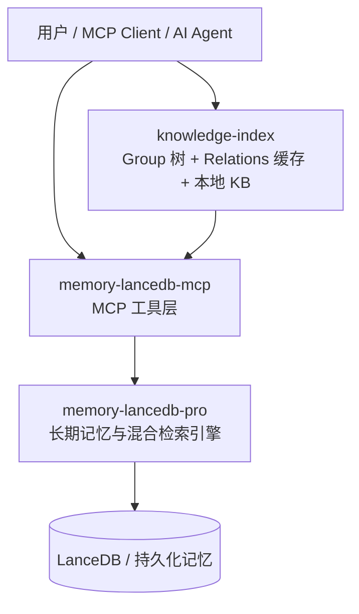
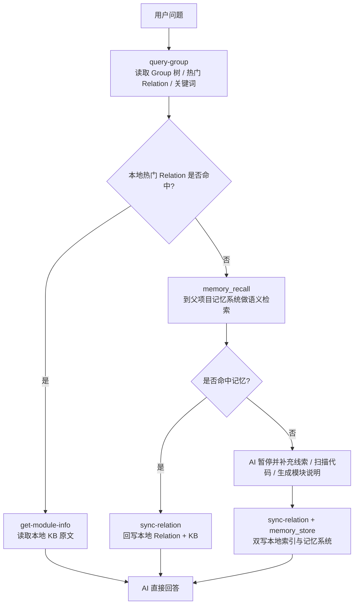
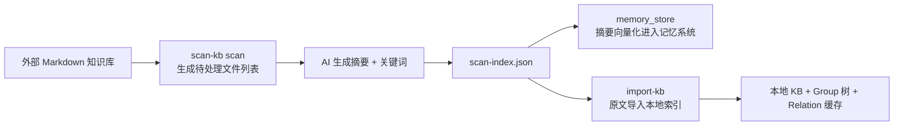

# 知识索引 (Knowledge Index)

> 在父项目记忆系统之上增加一层**可读、可导航、可快速命中**的本地知识索引，为 AI Agent 提供“先本地命中、再语义召回、最后补写回流”的项目知识访问能力。

## 这是什么

`knowledge-index` 不是一个独立的向量数据库，也不是用来替代父项目记忆系统的另一套存储。

它解决的是一个更贴近 Agent 使用体验的问题：

- **父项目记忆系统**擅长语义召回、长期持久化、跨会话记忆治理
- **知识索引**擅长把项目知识组织成 AI 更容易浏览和落地使用的结构化视图

两者组合后，形成一个完整系统：

- **发现层**：父项目记忆系统负责语义检索、长期存储、冷热治理
- **交付层**：`knowledge-index` 负责 Group 导航、热门 Relation 缓存、原文交付

换句话说，父项目更像“**长期记忆引擎**”，而 `knowledge-index` 更像“**面向 Agent 的知识目录与本地交付层**”。

## 它在整个系统中的位置

父项目 [README.md](/root/memory-lancedb-pro/mcp-wrapper/README.md) 中已经定义了记忆系统的核心能力：

- 通过 MCP 暴露 `memory_store`、`memory_recall` 等记忆工具
- 通过 `--scope` 做项目级隔离
- 通过底层 `memory-lancedb-pro` 提供混合检索、向量存储和长期治理

`knowledge-index` 位于这个记忆系统的上层，不直接替换它，而是围绕它补充三件事：

- **结构化导航**：把项目知识整理成 Group 树
- **快速访问**：把高频 Relation 做成本地缓存，优先本地命中
- **原文交付**：把模块说明以 Markdown 原文形式保存在本地 KB，便于 AI 直接回答

## 整体架构图



### 分层说明

- **AI Agent / MCP Client**：真正发起问题、生成摘要、选择查询路径的执行者
- **knowledge-index**：本地知识目录层，负责树形索引、热点缓存、原文落地
- **memory-lancedb-mcp**：父项目提供的 MCP 封装层，向上暴露 `memory_store`、`memory_recall` 等工具
- **memory-lancedb-pro**：底层长期记忆引擎，负责混合检索、向量存储、衰减和治理

## knowledge-index 内部架构

`knowledge-index` 自身是一个三层文件系统：

```mermaid
flowchart LR
    GI[group-index.json<br/>Group 树索引]
    RC[relations-cache.json<br/>Relation 热点缓存 / 关键词 / 分区]
    KB[kb/{scope}/{Group}/index.json<br/>本地 KB 原文]

    GI --> RC
    RC --> KB
```

### 三层分别负责什么

- **`group-index.json`**
  - 保存项目知识的树形结构
  - 决定有哪些 Group，以及 Group 之间的父子关系
  - 主要服务于“导航”和“缩小检索范围”

- **`relations-cache.json`**
  - 保存每个 Group 下的热门 Relation、关键词、访问评分、冷热分区
  - 主要服务于“快速路径”
  - 让 AI 在很多问题上不用先走语义检索

- **`kb/{scope}/{Group}/index.json`**
  - 保存某个 Group 下可直接交付给 AI 的 Markdown 原文
  - 主要服务于“最终回答内容交付”
  - 语义检索命中后，也可以把内容回写到这里，变成本地下次可复用的知识

## 它是如何工作的

### 运行时主链路



### 1. 快速路径：本地直接命中

这是 `knowledge-index` 的核心价值。

当 AI 已经知道问题大致落在哪个 Group 时，会优先执行：

1. 调用 `query-group.ts` 查看 Group 树、热门 Relation 和关键词词云
2. 如果目标 Relation 已经在本地缓存中
3. 直接调用 `get-module-info.ts` 读取本地 Markdown 原文
4. 用原文内容回答用户

这个路径完全绕过语义检索，通常是**最快**、**最稳定**、**最容易控制回答质量**的路径。

### 2. 检索路径：本地未命中，回退到记忆系统

如果本地没有命中合适的 Relation，AI 会退回到父项目记忆系统：

1. 从 `query-group.ts` 返回的关键词词云中挑选自然语言关键词
2. 组装查询语句
3. 调用父项目暴露的 `memory_recall`
4. 如果命中结果可用，再调用 `sync-relation.ts` 把结果整理并回写到本地索引

这样做的效果是：

- 第一次问题可能走语义检索
- 第二次类似问题就可能直接走本地快速路径

也就是说，`knowledge-index` 在这里承担的是**把检索结果沉淀为可导航本地知识**的角色。

### 3. 知识缺失路径：本地和记忆系统都没有

如果本地 KB 和父项目记忆系统都没有命中：

1. AI 需要暂停并向用户索取线索，或根据线索扫描代码
2. AI 生成结构化的模块说明 Markdown
3. 如有必要，先用 `manage-index.ts` 创建对应 Group
4. 再通过 `sync-relation.ts` 写入本地 KB 与 Relation 缓存
5. 同时通过 `memory_store` 写入父项目记忆系统

这里是一个**双写闭环**：

- **本地索引**保证后续可导航、可快速命中、可直接交付原文
- **记忆系统**保证长期持久化、语义召回和跨会话复用

### 4. 外部知识库导入路径

对于已有的 Markdown 文档目录，推荐使用“先扫描摘要，再导入原文”的两阶段模式：



这样形成两层能力：

- **摘要进入记忆系统**：便于语义召回与长尾发现
- **原文进入本地 KB**：便于直接展示和高质量回答

这也是 `knowledge-index` 与父项目记忆系统配合最典型的场景。

## 它如何与父项目记忆系统配合

### 角色分工

| 组件 | 主要职责 | 为什么不能只有它一个 |
|------|------|------|
| `knowledge-index` | Group 导航、热门缓存、本地原文交付 | 不擅长语义检索，也不负责长期治理 |
| `memory-lancedb-mcp` | 暴露 `memory_store` / `memory_recall` 等 MCP 工具 | 负责协议桥接，不负责本地知识目录结构 |
| `memory-lancedb-pro` | 向量存储、混合检索、衰减、长期记忆治理 | 结果更适合“检索”，不直接提供项目级目录视图 |

### 两者如何协作

#### 协作 1：本地快取 + 远端召回

- 热门知识优先走本地 JSON
- 长尾知识走 `memory_recall`
- 命中后回写本地，逐步把长尾知识转化为热点知识

#### 协作 2：原文与摘要分层存储

- 本地 KB 更适合存**完整 Markdown 原文**
- 记忆系统更适合存**摘要、标签、关键词、长期记忆条目**

这相当于：

- `knowledge-index` 负责“**把内容原样交付出来**”
- 父项目记忆系统负责“**先把内容找到**”

#### 协作 3：共同组成知识闭环

- 查询时：本地命中优先，记忆检索兜底
- 写入时：新知识双写到本地索引与记忆系统
- 演化时：热点沉淀在本地，长尾保留在记忆系统

## 核心概念

| 概念 | 含义 |
|------|------|
| `scope` | 项目隔离标识，不同 scope 物理隔离 |
| `Group` | 知识分组路径，例如 `项目/API`、`项目/前端/状态管理` |
| `Relation` | 某个 Group 下可被检索和命中的知识条目 |
| `module-info` | Relation 对应的 Markdown 原文说明 |
| 热门 Relation | 被频繁访问、优先展示的本地知识 |
| 关键词词云 | 为 AI 组装检索语句提供的自然语言提示 |

## 快速开始

所有脚本使用 `npx jiti` 执行，位于 `knowledge-index/scripts/` 目录下。

```bash
# 1. 初始化索引（创建根节点）
npx jiti knowledge-index/scripts/manage-index.ts \
  --scope my-project \
  --action create-root \
  --root-name "我的项目"

# 2. 创建分组
npx jiti knowledge-index/scripts/manage-index.ts \
  --scope my-project \
  --action create \
  --parent "我的项目" \
  --name "API"

# 3. 写入一条知识
npx jiti knowledge-index/scripts/sync-relation.ts \
  --scope my-project \
  --group "我的项目/API" \
  --relation "用户登录接口" \
  --module-info "## 登录流程\n用户输入账号密码后进入认证流程，服务端校验成功后返回 token。" \
  --keywords "登录,认证,token"

# 4. 查询 Group 视图
npx jiti knowledge-index/scripts/query-group.ts \
  --scope my-project \
  --groups "我的项目/API"

# 5. 读取模块原文
npx jiti knowledge-index/scripts/get-module-info.ts \
  --scope my-project \
  --group "我的项目/API" \
  --relation "用户登录接口"
```

## CLI 命令

### 1. manage-index — 索引管理

管理 Group 树索引节点的创建与删除。

| 参数 | 类型 | 必填 | 默认值 | 说明 |
|------|------|------|--------|------|
| `--scope` | string | 是 | - | 项目隔离标识（字母、数字、连字符、下划线） |
| `--action` | string | 否 | `create` | 操作：`create` / `delete` / `create-root` |
| `--parent` | string | 条件 | - | 父节点路径（create/delete 时必填） |
| `--name` | string | 条件 | - | 节点名称（create 时必填） |
| `--root-name` | string | 条件 | - | 根节点名称（create-root 时必填） |
| `--force` | boolean | 否 | `false` | 强制删除非空节点 |

```bash
# 创建根节点
npx jiti knowledge-index/scripts/manage-index.ts \
  --scope <scope> --action create-root --root-name <name>

# 创建子节点
npx jiti knowledge-index/scripts/manage-index.ts \
  --scope <scope> --action create --parent <path> --name <name>

# 删除节点（非空需 --force）
npx jiti knowledge-index/scripts/manage-index.ts \
  --scope <scope> --action delete --parent <path> --name <name> [--force]
```

输出：`{ "ok": true, "path": "..." }` 或 `{ "ok": false, "error": "..." }`

### 2. query-group — 查询 Group

查询 Group 树索引、热门 Relations 列表、关键词词云。它通常是 AI 进入知识索引系统的**第一个入口**。

| 参数 | 类型 | 必填 | 默认值 | 说明 |
|------|------|------|--------|------|
| `--scope` | string | 是 | - | 项目隔离标识 |
| `--groups` | string | 否 | - | 逗号分隔的 Group 路径列表 |
| `--mode` | string | 否 | `full` | 展示模式：`full` / `hot` / `compact` / `help` |
| `--partition` | string | 否 | `all` | 分区过滤：`hot` / `warm` / `cold` / `emerging` / `all` |
| `--hot-count` | number | 否 | `5` | 热门知识展示个数 |
| `--depth` | number | 否 | `4` | 索引层级深度（上限 10） |

```bash
# 完整索引树 + 热门索引
npx jiti knowledge-index/scripts/query-group.ts --scope <scope>

# 查询指定 Group 的 Relations + 词云
npx jiti knowledge-index/scripts/query-group.ts --scope <scope> --groups "项目/API,项目/数据"

# 仅热门索引
npx jiti knowledge-index/scripts/query-group.ts --scope <scope> --mode hot

# 紧凑树视图
npx jiti knowledge-index/scripts/query-group.ts --scope <scope> --mode compact

# 按分区过滤
npx jiti knowledge-index/scripts/query-group.ts --scope <scope> --partition hot
```

### 3. get-module-info — 模块检索

按 Group 路径 + Relation 名称检索本地 KB 中的详细 Markdown 内容。

| 参数 | 类型 | 必填 | 说明 |
|------|------|------|------|
| `--scope` | string | 是 | 项目隔离标识 |
| `--group` | string | 是 | Group 路径（如 `项目/API`） |
| `--relation` | string | 是 | Relation ID（如 `rel_001`）或名称文本 |

```bash
npx jiti knowledge-index/scripts/get-module-info.ts \
  --scope <scope> --group <group> --relation <relation>
```

输出：Markdown 文本（stdout）。错误时输出 `{ "ok": false, "error": "...", "hint": "..." }`。

### 4. sync-relation — 关系回写

将 Relation + 模块信息写入 Relations 缓存和本地 KB。支持单条和批量两种模式。

它是本地知识沉淀的核心入口，也是与父项目记忆系统形成“双写闭环”时最常配合使用的脚本。

| 参数 | 类型 | 必填 | 说明 |
|------|------|------|------|
| `--scope` | string | 是 | 项目隔离标识 |
| `--group` | string | 单条必填 | Group 路径 |
| `--relation` | string | 单条必填 | Relation 描述文本 |
| `--module-info` | string | 单条必填 | Markdown 格式模块信息 |
| `--keywords` | string | 单条必填 | 逗号分隔关键词列表；每个关键词必须真实出现在 `module-info` 描述中，避免随意指定关键词 |
| `--input` | string | 批量必填 | JSON 批量输入文件路径 |

> 关键词约束：`sync-relation` 会校验每个关键词是否真实出现在 `module-info` 原文中。未出现在原文中的关键词会被判为无效，用于避免脱离正文内容随意指定关键词，污染检索和词云质量。

```bash
# 单条模式
npx jiti knowledge-index/scripts/sync-relation.ts \
  --scope <scope> --group <group> \
  --relation <text> --module-info <markdown> --keywords <k1,k2>

# 批量模式（JSON 文件格式见下方）
npx jiti knowledge-index/scripts/sync-relation.ts \
  --scope <scope> --input <jsonFile>
```

**批量输入格式** (`--input` 文件)：
```json
{
  "items": [
    {
      "group": "项目/API",
      "relation": "用户登录",
      "module_info": "## 登录流程\n用户输入账号密码后进入认证流程，服务端校验成功后返回 token。",
      "keywords": ["登录", "认证", "token"]
    }
  ]
}
```

### 5. import-kb — 外部知识库导入

将外部 Markdown 知识库文件导入三层索引。支持约定模式（目录→Group，文件名→Relation）和配置模式（JSON mapping 显式控制）。

| 参数 | 类型 | 必填 | 说明 |
|------|------|------|------|
| `--scope` | string | 是 | 项目隔离标识 |
| `--source` | string | 是 | 外部知识库根目录路径 |
| `--root-name` | string | 是 | 导入根节点名称（已存在则幂等覆盖更新，会发出警告） |
| `--mapping` | string | 否 | JSON 映射配置文件（提供则进入配置模式） |
| `--scan-index` | string | 否 | scan-index.json 路径，用于复用摘要关键词 |

```bash
# 约定模式：直接按目录结构导入
npx jiti knowledge-index/scripts/import-kb.ts \
  --scope <scope> --source <dir> --root-name <name>

# 配置模式：按 JSON mapping 显式控制
npx jiti knowledge-index/scripts/import-kb.ts \
  --scope <scope> --source <dir> \
  --mapping <jsonFile> --root-name <name>

# 配合预扫描关键词
npx jiti knowledge-index/scripts/import-kb.ts \
  --scope <scope> --source <dir> \
  --root-name <name> --scan-index <scan-index.json>
```

**Mapping 文件格式**：
```json
{
  "root_name": "可选，提供后会覆盖 --root-name",
  "groups": [
    {
      "path": "API",
      "sources": [
        {
          "file": "docs/api.md",
          "relation": "API 文档",
          "code_refs": ["src/api.ts"]
        }
      ]
    }
  ]
}
```

> 说明：`groups[].path` 是相对 `root_name` 的路径（不包含根名）；若首段与 `root_name` 重名，导入时会发出警告并自动去重，避免双层嵌套。一个 `path` 下可配多个 `sources`，每个对应一个 Relation。

### 6. scan-kb — 预扫描与增量扫描

分为 `scan` 和 `vectorize` 两个子命令。

#### scan 子命令

| 参数 | 类型 | 必填 | 说明 |
|------|------|------|------|
| `--scope` | string | 是 | 项目隔离标识 |
| `--source` | string | 是 | 外部知识库根目录路径 |
| `--root-name` | string | 是 | 导入根节点名称 |
| `--output` | string | 否 | scan-index.json 输出路径（覆盖默认） |
| `--results` | string | 否 | AI 返回结果 JSON，提供则进入合并模式 |

```bash
# 第一步：扫描目录，生成待处理文件列表
npx jiti knowledge-index/scripts/scan-kb.ts scan \
  --scope <scope> --source <dir> --root-name <name>

# 第二步：AI 处理文件后，合并结果到索引
npx jiti knowledge-index/scripts/scan-kb.ts scan \
  --scope <scope> --source <dir> --root-name <name> \
  --results <ai-results.json>
```

**AI 结果文件格式** (`--results`)：
```json
{
  "entries": [
    {
      "path": "docs/api.md",
      "summary": "API 文档摘要",
      "keywords": ["API", "接口", "认证"],
      "enriched": false
    }
  ]
}
```

#### vectorize 子命令

| 参数 | 类型 | 必填 | 说明 |
|------|------|------|------|
| `--scope` | string | 是 | 项目隔离标识 |
| `--scan-index` | string | 否 | scan-index.json 路径（覆盖默认） |
| `--complete` | string | 否 | 向量化完成结果文件 |

```bash
# 列出所有待向量化条目
npx jiti knowledge-index/scripts/scan-kb.ts vectorize --scope <scope>

# 标记向量化完成
npx jiti knowledge-index/scripts/scan-kb.ts vectorize \
  --scope <scope> --complete <vectorize-results.json>
```

## 工作流

### 快速路径

热门 Relation 直接从本地 JSON 读取（通常 <10ms）：

1. AI 调用 `query-group.ts --groups <group>` 获取热门 Relation + 关键词词云
2. AI 选择匹配的 Relation
3. AI 调用 `get-module-info.ts` 获取 Markdown 原文
4. AI 直接基于原文回答用户问题

### 检索路径

冷门 Relation 退化为关键词词云 + 语义检索：

1. AI 调用 `query-group.ts` 获取关键词词云
2. AI 组装自然语言关键词，调用父项目的 `memory_recall`
3. AI 将命中结果整理为模块说明
4. AI 调用 `sync-relation.ts` 回写新 Relation（提升后续访问速度）

### 知识缺失路径

本地 KB 与父项目记忆系统均未命中：

1. AI **暂停**，请求用户提供线索
2. AI 根据用户提示扫描代码，总结为 Relation 和 `module-info`
3. AI 调用 `manage-index.ts` 创建 Group（如需要）
4. AI 调用 `sync-relation.ts` + `memory_store` 双写

### 外部导入路径

批量导入外部知识库 Markdown 文件：

1. `scan-kb.ts scan` — 扫描目录，生成文件列表（支持 Git 增量扫描）
2. AI 读取文件列表，为每个文件生成摘要 + 关键词，写入结果 JSON
3. `scan-kb.ts scan --results` — 合并 AI 结果到 `scan-index.json`
4. `scan-kb.ts vectorize` — 列出待向量化条目
5. AI 调用父项目的 `memory_store` 向量化摘要
6. `scan-kb.ts vectorize --complete` — 标记向量化完成
7. `import-kb.ts` — 将原文导入三层索引

## 数据目录

```text
knowledge-index/
├── kb/{scope}/                    # 运行时数据（自动创建）
│   ├── group-index.json           # Group 树索引
│   ├── relations-cache.json       # Relations 缓存 + 评分/分区
│   ├── scan-index.json            # 预扫描索引
│   ├── scan-pending.json          # 待处理文件列表
│   ├── {Group}/
│   │   └── index.json             # 本地 KB 模块信息原文
│   ├── archive/                   # 归档数据
│   └── backup/                    # 增量备份
├── _template/                     # 新 scope 初始化模板
├── scripts/                       # CLI 脚本
│   ├── manage-index.ts
│   ├── query-group.ts
│   ├── get-module-info.ts
│   ├── sync-relation.ts
│   ├── import-kb.ts
│   ├── scan-kb.ts
│   └── lib/                       # 内部库
│       ├── constants.ts
│       ├── scope.ts
│       ├── scoring.ts
│       ├── store.ts
│       └── wal.ts
├── test/                          # 测试文件
└── skills/                        # SKILL 定义
```

## 测试

```bash
# 全量测试
npm run test:ki

# 按模块测试
npm run test:ki:manage-index     # 索引管理
npm run test:ki:query-group      # 查询 Group
npm run test:ki:get-module-info  # 模块检索
npm run test:ki:sync-relation    # 关系回写
npm run test:ki:import-kb        # 外部导入
npm run test:ki:scan-kb          # 预扫描
npm run test:ki:lib              # 内部库
npm run test:ki:integration      # 端到端集成
npm run test:ki:error-handling   # 异常处理与边界
npm run test:ki:scope-isolation  # Scope 隔离
npm run test:ki:batch4           # Batch 4 完整测试套件
```

## 约束与边界

- **Scope 隔离**：仅允许字母、数字、连字符、下划线；禁止路径遍历 `../`；不同 scope 物理隔离
- **关键词规则**：仅自然语言词汇，禁止代码符号（类名、方法名、路径等）；关键词必须真实出现在 `module-info` 原文中，避免随意指定关键词
- **数据版本**：所有 JSON 文件包含 `version` 字段，当前版本 1
- **WAL 写入**：所有 JSON 写入采用临时文件 → 原子 rename
- **默认根节点**：`项目根` 不可删除
- **幂等安全**：重复操作不产生副作用（重复导入覆盖更新）
- **快速失败**：输入校验失败立即退出，不静默降级
- **异常恢复**：运行时数据损坏自动从 `_template/` 恢复

## 一句话总结

`knowledge-index` 和父项目记忆系统不是二选一关系，而是上下分层关系：

- **父项目记忆系统**负责“记得住、搜得到、管得住”
- **knowledge-index** 负责“看得见、找得快、交付原文”

两者配合后，AI 才同时具备：

- **长期记忆能力**
- **项目结构化导航能力**
- **本地快速命中能力**
- **可直接回答的原文交付能力**
