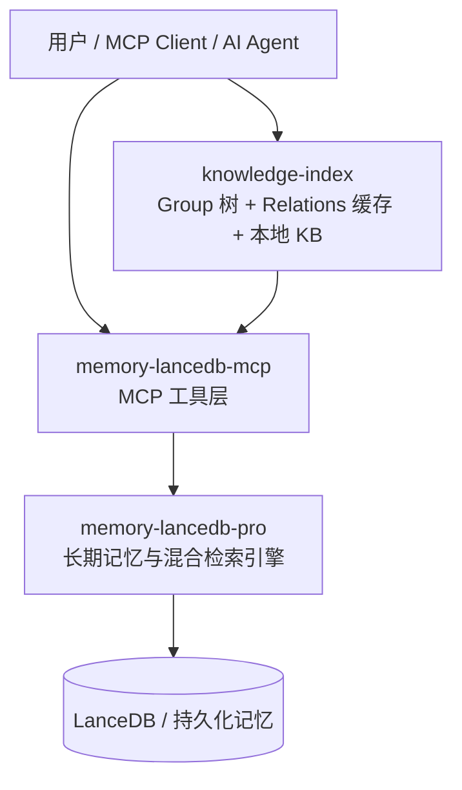
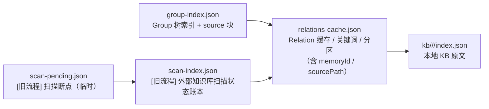
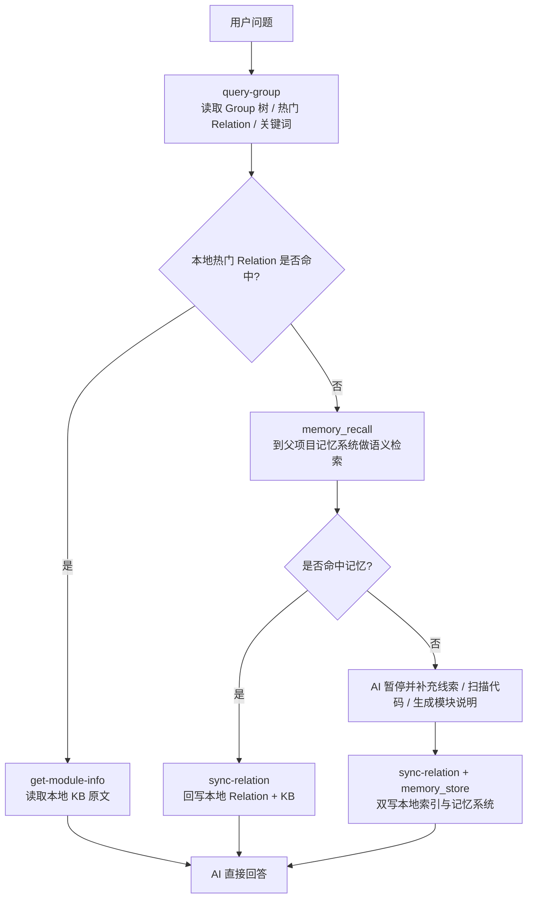
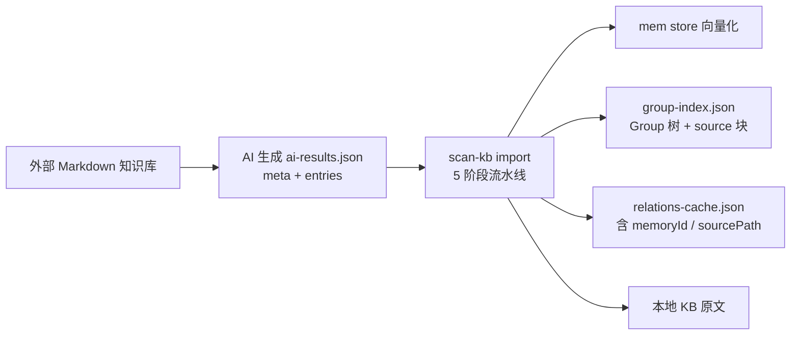
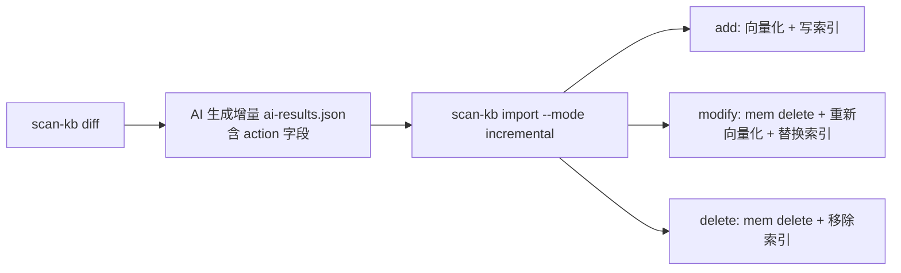

## 架构说明

`knowledge-index` 是父项目记忆系统之上的一层**本地知识目录与交付层**。

它不替代 `memory-lancedb-mcp` / `memory-lancedb-pro`，而是补齐 AI Agent 在项目知识访问过程中的两个关键能力：

- **结构化导航**：把知识整理成 Group 树，便于 Agent 先缩小范围
- **原文交付**：把模块说明保存在本地 KB 中，便于 Agent 直接读取 Markdown 原文回答问题

## 整体架构



## 分层职责

| 组件 | 主要职责 |
|------|------|
| `knowledge-index` | Group 导航、热门 Relation 缓存、本地 Markdown 原文交付 |
| `memory-lancedb-mcp` | 对外暴露 `memory_store`、`memory_recall` 等 MCP 能力 |
| `memory-lancedb-pro` | 负责混合检索、向量存储、长期记忆治理 |

## knowledge-index 内部结构



### 核心文件

| 文件 | 角色 | 读写方 | 生命周期 |
|------|------|--------|---------|
| `group-index.json` | Group 树结构索引 + `source` 块（`dir`/`rootName`/`commit`） | 所有脚本读写 | 永久，随 Group 增删改 |
| `relations-cache.json` | Relation 缓存（评分/淘汰/词云），含 `memoryId`/`sourcePath` | 所有脚本读写 | 永久，随 Relation 使用动态更新 |
| `kb/{scope}/{group}/index.json` | 本地 KB 原文 | get-module-info 读，sync-relation/import 写 | 永久，随知识沉淀积累 |
| `scan-index.json` | [旧流程] 外部知识库扫描状态账本 | scan-kb / import-kb 读写 | 永久，增量扫描依赖 `lastScannedCommit` |
| `scan-pending.json` | [旧流程] 扫描断点 | scan-kb 写，AI 读 | 临时，merge 后可删除 |

### `group-index.json` 的 `source` 块

S-01 新增字段，记录外部知识库来源信息，用于增量 diff：

```json
{
  "version": 1,
  "scope": "qoder-wiki",
  "roots": { "QoderWiki": { ... } },
  "source": {
    "dir": "/abs/path/to/source",
    "rootName": "QoderWiki",
    "commit": "b945303942b62176ace2bd58f294f5c78e5c2438"
  },
  "updatedAt": "2026-05-28T05:17:22.360Z"
}
```

- `dir`：外部知识库目录绝对路径
- `rootName`：导入根节点名称（与 `meta.rootName` 一致）
- `commit`：导入时的 git HEAD commit，`scan-kb diff` 以此为基准检测变更

### `relations-cache.json` 的 `memoryId` / `sourcePath`

S-04 新增的关联字段，写入 `hot_relations` 每条 relation 中：

```json
{
  "id": "rel_003",
  "text": "Scope 隔离机制",
  "score": 0,
  "useCount": 0,
  "lastUsedTime": null,
  "isImported": true,
  "memoryId": "dbc6f2a0-d62b-47cb-835a-371942fdc08a",
  "sourcePath": "核心概念/Scope 隔离机制.md"
}
```

- `memoryId`：向量数据库中对应记录的 ID，用于 `modify`（delete+create）和 `delete` 操作
- `sourcePath`：相对 `source.dir` 的 posix 路径，用于 `scan-kb diff` 关联变更文件

### `index.json` 的 key 因写入来源不同而异

| 写入脚本 | key 来源 | 示例 |
|---------|---------|------|
| `import-kb.ts` / `scan-kb import` | 文件名去 `.md` 扩展名 | `"多项目隔离"` |
| `sync-relation.ts` | `--relation` 参数原文 | `"标签系统"` |

## 运行时主链路



## 外部知识库导入链路（S-04 统一流程）



### 增量更新链路（S-05 + S-06）



## 与父项目记忆系统的配合

### 协作 1：本地快取 + 远端召回

- 热门知识优先走本地 JSON
- 长尾知识走 `memory_recall`
- 命中后回写本地，逐步把长尾知识沉淀为可导航的热点知识

### 协作 2：原文与摘要分层存储

- 本地 KB 更适合保存**完整 Markdown 原文**
- 记忆系统更适合保存**摘要、标签、关键词、长期记忆条目**

### 协作 3：共同形成闭环

- **查询时**：本地命中优先，记忆检索兜底
- **写入时**：新知识双写到本地索引与记忆系统
- **演化时**：热点沉淀在本地，长尾保留在记忆系统
