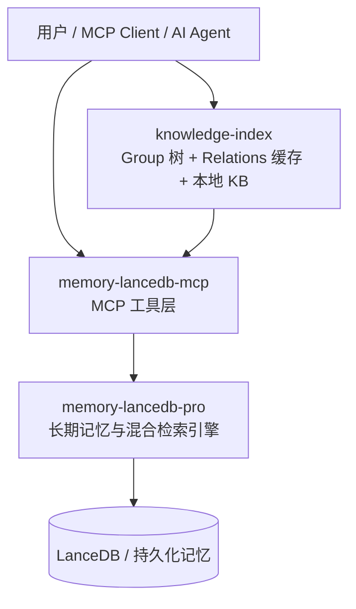
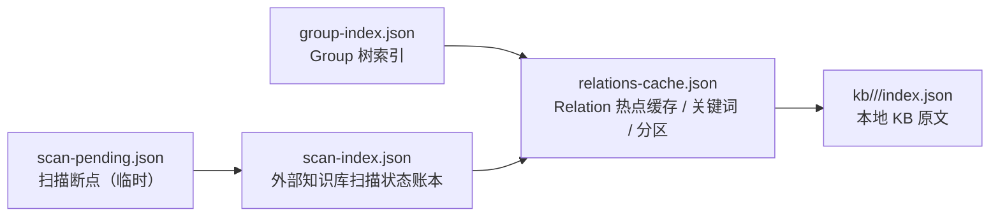
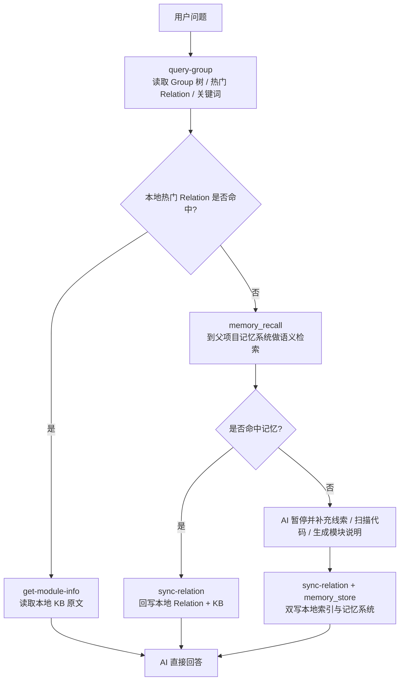
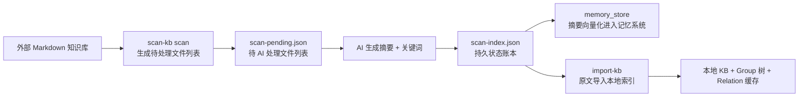

## 架构说明

`knowledge-index` 是父项目记忆系统之上的一层**本地知识目录与交付层**。

它不替代 `memory-lancedb-mcp` / `memory-lancedb-pro`，而是补齐 AI Agent 在项目知识访问过程中的两个关键能力：

- **结构化导航**：把知识整理成 Group 树，便于 Agent 先缩小范围
- **原文交付**：把模块说明保存在本地 KB 中，便于 Agent 直接读取 Markdown 原文回答问题

## 整体架构

## 分层职责

| 组件 | 主要职责 |
|------|------|
| `knowledge-index` | Group 导航、热门 Relation 缓存、本地 Markdown 原文交付 |
| `memory-lancedb-mcp` | 对外暴露 `memory_store`、`memory_recall` 等 MCP 能力 |
| `memory-lancedb-pro` | 负责混合检索、向量存储、长期记忆治理 |

## knowledge-index 内部结构

### 五个核心文件

| 文件 | 角色 | 读写方 | 生命周期 |
|------|------|--------|---------|
| `group-index.json` | Group 树结构索引，负责树形导航 | 所有脚本读写 | 永久，随 Group 增删改 |
| `relations-cache.json` | Relation 缓存（评分/淘汰/词云），负责本地快速路径 | 所有脚本读写 | 永久，随 Relation 使用动态更新 |
| `kb/{scope}/{group}/index.json` | 本地 KB 原文，负责最终交付 | get-module-info 读，sync-relation/import-kb 写 | 永久，随知识沉淀积累 |
| `scan-index.json` | 外部知识库扫描状态账本 | scan-kb / import-kb 读写 | 永久，增量扫描依赖 `lastScannedCommit` |
| `scan-pending.json` | 扫描断点（待处理文件列表） | scan-kb 写，AI 读 | 临时，merge 后可删除 |

### 三层作用

- **`group-index.json`**：负责树形导航，描述有哪些 Group，以及 Group 的父子关系
- **`relations-cache.json`**：负责本地快速路径，缓存热门 Relation、关键词和冷热分区
- **`kb/{scope}/{group}/index.json`**：负责最终交付，保存可直接供 AI 使用的 Markdown 原文

### `index.json` 的 key 因写入来源不同而异

> **重要**：本地 KB 的 `index.json` 是一个 `{ [key: string]: markdown }` 结构，key 的值取决于谁写入的：

| 写入脚本 | key 来源 | 示例 |
|---------|---------|------|
| `import-kb.ts` | 文件名去 `.md` 扩展名 | `"多项目隔离"` |
| `sync-relation.ts` | `--relation` 参数原文 | `"标签系统"` |

这意味着：**导入外部知识库时，`relations-cache.json` 中的 `Relation.text` 与 `index.json` 的 key 一致，都是文件名风格**（如 `"多项目隔离"`），而不是语义描述（如 `"多项目隔离机制文档，详细阐述Scope概念与ACL隔离原理..."`）。

### `scan-index.json` 与 `scan-pending.json` 的关系

两者通过 `path` 字段关联，但角色截然不同：

- **`scan-pending.json`**：中间产物，记录"待处理"状态。AI 根据 `files[]` 列表生成摘要+关键词后，通过 `scan --results` 合并到 `scan-index.json`
- **`scan-index.json`**：持久状态账本，记录"已处理"结果。包含 `vectorized`/`memoryId` 状态，是增量扫描和向量化流程的核心依据

删除 `scan-index.json` 会导致：退化为全量扫描、已向量化摘要无法清理（缺少 memoryId）、重复向量化。删除 `scan-pending.json` 仅需重新执行 `scan` 即可恢复。

## 运行时主链路

## 与父项目记忆系统的配合

### 协作 1：本地快取 + 远端召回

- 热门知识优先走本地 JSON
- 长尾知识走 `memory_recall`
- 命中后回写本地，逐步把长尾知识沉淀为可导航的热点知识

### 协作 2：原文与摘要分层存储

- 本地 KB 更适合保存**完整 Markdown 原文**
- 记忆系统更适合保存**摘要、标签、关键词、长期记忆条目**

### 协作 3：共同形成闭环

- **查询时**：本地命中优先，记忆检索兜底
- **写入时**：新知识双写到本地索引与记忆系统
- **演化时**：热点沉淀在本地，长尾保留在记忆系统

## 外部知识库导入链路

这个链路体现了两层协作：

- **摘要进入记忆系统**：便于语义召回与长尾发现
- **原文进入本地 KB**：便于直接展示和高质量回答
