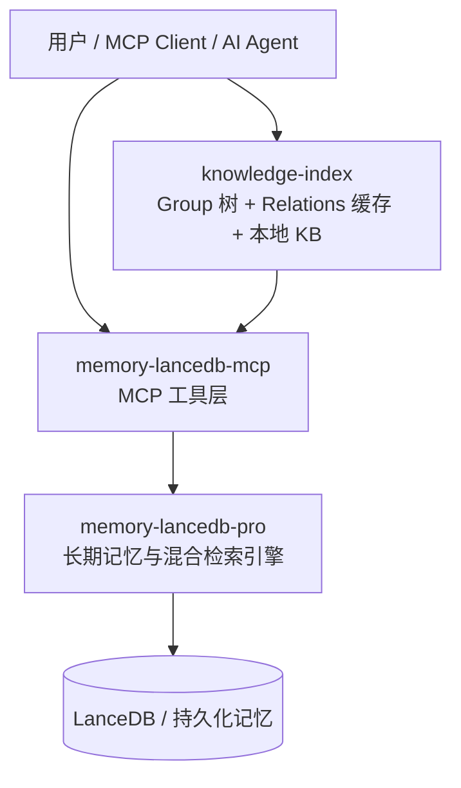
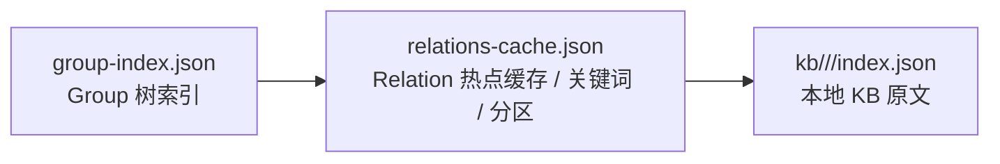
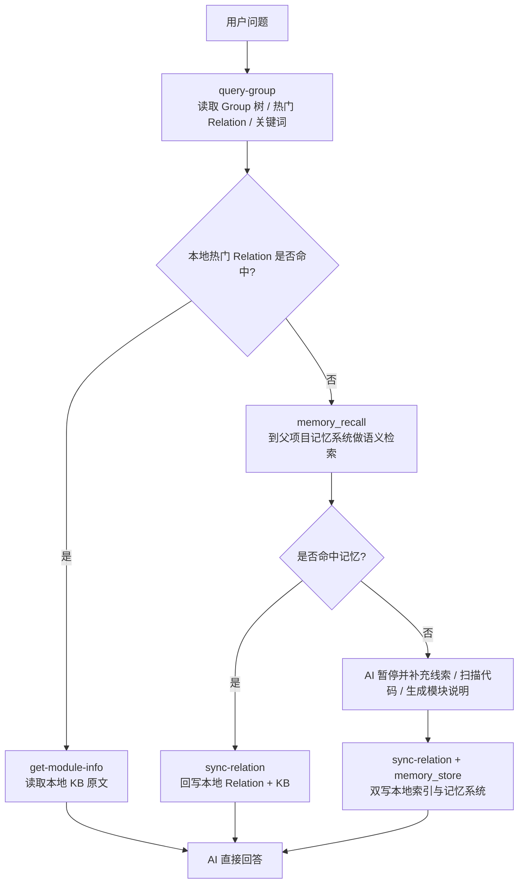
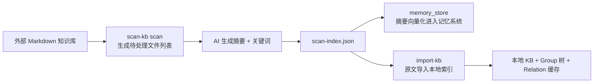

## 架构说明

`knowledge-index` 是父项目记忆系统之上的一层**本地知识目录与交付层**。

它不替代 `memory-lancedb-mcp` / `memory-lancedb-pro`，而是补齐 AI Agent 在项目知识访问过程中的两个关键能力：

- **结构化导航**：把知识整理成 Group 树，便于 Agent 先缩小范围
- **原文交付**：把模块说明保存在本地 KB 中，便于 Agent 直接读取 Markdown 原文回答问题

## 整体架构

## 分层职责

| 组件 | 主要职责 |
|------|------|
| `knowledge-index` | Group 导航、热门 Relation 缓存、本地 Markdown 原文交付 |
| `memory-lancedb-mcp` | 对外暴露 `memory_store`、`memory_recall` 等 MCP 能力 |
| `memory-lancedb-pro` | 负责混合检索、向量存储、长期记忆治理 |

## knowledge-index 内部结构

### 三层作用

- **`group-index.json`**：负责树形导航，描述有哪些 Group，以及 Group 的父子关系
- **`relations-cache.json`**：负责本地快速路径，缓存热门 Relation、关键词和冷热分区
- **`kb/{scope}/{group}/index.json`**：负责最终交付，保存可直接供 AI 使用的 Markdown 原文

## 运行时主链路

## 与父项目记忆系统的配合

### 协作 1：本地快取 + 远端召回

- 热门知识优先走本地 JSON
- 长尾知识走 `memory_recall`
- 命中后回写本地，逐步把长尾知识沉淀为可导航的热点知识

### 协作 2：原文与摘要分层存储

- 本地 KB 更适合保存**完整 Markdown 原文**
- 记忆系统更适合保存**摘要、标签、关键词、长期记忆条目**

### 协作 3：共同形成闭环

- **查询时**：本地命中优先，记忆检索兜底
- **写入时**：新知识双写到本地索引与记忆系统
- **演化时**：热点沉淀在本地，长尾保留在记忆系统

## 外部知识库导入链路

这个链路体现了两层协作：

- **摘要进入记忆系统**：便于语义召回与长尾发现
- **原文进入本地 KB**：便于直接展示和高质量回答
