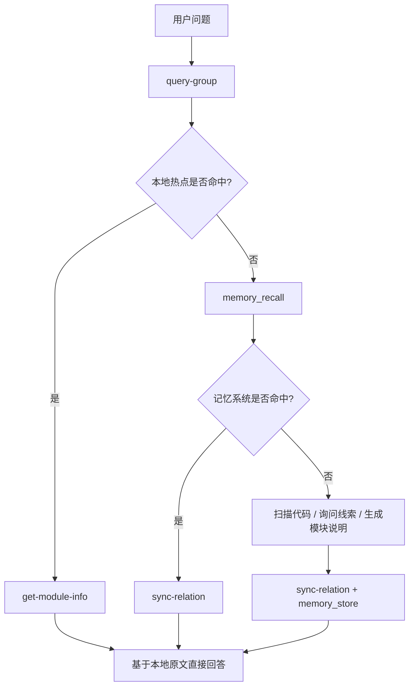

## 典型工作流

本文档把 `knowledge-index` 当前最常见的使用方式整理成可直接执行的流程。

重点覆盖 3 类场景：

- **本地知识沉淀**：人工或 AI 主动写入项目知识
- **运行时查询闭环**：优先本地命中，不足时回流到记忆系统
- **外部知识库导入**：把已有 Markdown 知识库批量导入系统

## 工作流一：手工沉淀一条项目知识

适合场景：

- 已经明确知道某个模块要怎么描述
- 希望把它直接写进本地索引
- 希望以后能被快速命中和读取

### 步骤 1：创建根节点

```bash
npx jiti knowledge-index/scripts/manage-index.ts \
  --scope my-project \
  --action create-root \
  --root-name "我的项目"
```

### 步骤 2：创建 Group

```bash
npx jiti knowledge-index/scripts/manage-index.ts \
  --scope my-project \
  --action create \
  --parent "我的项目" \
  --name "API"
```

### 步骤 3：写入 Relation 和模块说明

```bash
npx jiti knowledge-index/scripts/sync-relation.ts \
  --scope my-project \
  --group "我的项目/API" \
  --relation "用户登录接口" \
  --module-info "## 登录流程\n用户输入账号密码后进入认证流程，服务端校验成功后返回 token。" \
  --keywords "登录,认证,token"
```

### 步骤 4：查看写入效果

```bash
npx jiti knowledge-index/scripts/query-group.ts \
  --scope my-project \
  --groups "我的项目/API"
```

### 步骤 5：读取原文

```bash
npx jiti knowledge-index/scripts/get-module-info.ts \
  --scope my-project \
  --group "我的项目/API" \
  --relation "用户登录接口"
```

### 这个流程的价值

- 新知识能立刻进入本地索引
- 以后优先走本地命中，不必每次都重新检索
- `get-module-info.ts` 读取时会顺便更新访问热度

## 工作流二：运行时查询闭环

这是 AI Agent 在回答用户问题时更典型的运行路径。



### 路径解释

- **本地命中**：最快，直接从本地 KB 读取 Markdown 原文
- **记忆系统命中**：通过语义检索找到长尾知识，再回写到本地索引
- **都未命中**：说明知识尚未沉淀，需要补充线索或重新生成说明

### 为什么要回写 `sync-relation.ts`

因为语义召回虽然能找到知识，但如果不回写，本地下次仍然找不到。

回写之后：

- 本地热点会逐渐形成
- 词云会变得更贴近真实项目术语
- 后续回答会越来越快

## 工作流三：批量导入外部知识库

适合场景：

- 已经有一套 Markdown 文档
- 想一次性接入 `knowledge-index`
- 同时保留本地原文交付能力与父项目语义检索能力

### 完整链路

```text
scan
  ↓
AI 生成摘要与关键词
  ↓
scan --results
  ↓
vectorize
  ↓
memory_store
  ↓
vectorize --complete
  ↓
import-kb
```

### 步骤 1：扫描外部目录

```bash
npx jiti knowledge-index/scripts/scan-kb.ts scan \
  --scope mcp-test \
  --source ./external-kb \
  --root-name wiki
```

### 步骤 2：AI 读取 `scan-pending.json`

AI 根据 `scan-pending.json` 中的待处理文件，为每个 Markdown 文件生成：

- `summary`
- `keywords`
- 可选的 `enriched`

### 步骤 3：合并 AI 结果

```bash
npx jiti knowledge-index/scripts/scan-kb.ts scan \
  --scope mcp-test \
  --source ./external-kb \
  --root-name wiki \
  --results ./ai-results.json
```

### 步骤 4：列出待向量化摘要

```bash
npx jiti knowledge-index/scripts/scan-kb.ts vectorize --scope mcp-test
```

### 步骤 5：调用父项目 `memory_store`

把上一步输出的 `entries[].content` 送入父项目记忆系统，完成摘要向量化。

### 步骤 6：回写 `memoryId`

```bash
npx jiti knowledge-index/scripts/scan-kb.ts vectorize \
  --scope mcp-test \
  --complete ./vectorize-results.json
```

### 步骤 7：导入原文到本地知识索引

```bash
npx jiti knowledge-index/scripts/import-kb.ts \
  --scope mcp-test \
  --source ./external-kb \
  --root-name wiki \
  --scan-index ./knowledge-index/kb/mcp-test/scan-index.json
```

### 这个流程最终得到什么

- **父项目记忆系统**：保存摘要向量，适合语义召回
- **`knowledge-index` 本地索引**：保存 Group 树、Relation 热点和 Markdown 原文

## 工作流四：用 `mapping.json` 精确导入

适合场景：

- 外部目录结构本身不适合作为最终 Group
- 文件名不适合作为最终 Relation 名称
- 希望顺手附上代码定位信息

### 示例命令

```bash
npx jiti knowledge-index/scripts/import-kb.ts \
  --scope mcp-test \
  --source ./external-kb \
  --mapping ./mapping.json \
  --root-name wiki
```

### 示例 `mapping.json`

```json
{
  "root_name": "项目知识库",
  "groups": [
    {
      "path": "API/认证",
      "sources": [
        {
          "file": "docs/api/login.md",
          "relation": "用户登录接口",
          "code_refs": [
            "src/api/auth.ts",
            "src/services/login-service.ts"
          ]
        }
      ]
    }
  ]
}
```

## 工作流五：增量更新外部知识库

适合场景：

- 外部 Markdown 知识库已经导入过
- 现在只希望处理新增、修改、删除的部分

### 推荐做法

1. 保持 `--source` 目录在 Git 仓库内
2. 重新执行 `scan-kb.ts scan`
3. 让 AI 只处理 `scan-pending.json` 中列出的变更文件
4. 重新执行 `scan --results`
5. 再执行 `vectorize` / `vectorize --complete`
6. 最后重新执行 `import-kb.ts`

### 增量更新的收益

- 不必每次全量重扫所有 Markdown
- 已有 `memoryId` 尽量保留
- 被删除文件可以在上层流程中继续配合记忆清理

## 工作流六：排障时怎么判断自己卡在哪一步

如果你在外部导入链路中报错，可以用这个快速判断：

- **只有 `scan-pending.json`**：说明你刚完成“扫描准备”
- **已有 `scan-index.json`**：说明你已经完成“摘要合并”
- **`scan-index.json` 里 `vectorized=false`**：说明还没完成摘要向量化
- **本地 Group 树已有数据，但 `get-module-info.ts` 失败**：说明本地 KB 原文层可能缺失

## 最推荐的落地策略

如果你是第一次接入，建议用下面这套顺序：

1. 先用 `scan-kb.ts` 跑通扫描与摘要链路
2. 再用 `import-kb.ts` 导入本地原文
3. 之后新知识统一走 `sync-relation.ts` 持续沉淀
4. 查询时始终遵循“本地优先，记忆兜底，命中后回写”的闭环

## 相关文档

- `scan-kb` 详细说明：[`scan-kb.md`](./scan-kb.md)
- 外部导入说明：[`import-kb.md`](./import-kb.md)
- 异常与恢复：[`error-handling.md`](./error-handling.md)
