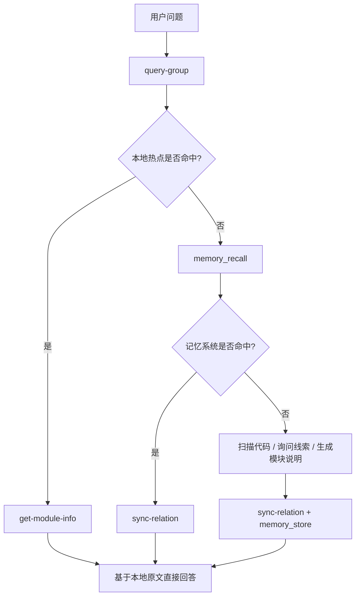

## 典型工作流

本文档把 `knowledge-index` 当前最常见的使用方式整理成可直接执行的流程。

重点覆盖 4 类场景：

- **本地知识沉淀**：人工或 AI 主动写入项目知识
- **运行时查询闭环**：优先本地命中，不足时回流到记忆系统
- **外部知识库导入（新流程）**：2 步首次导入 / 3 步增量更新
- **外部知识库导入（旧流程）**：7 步旧流程，仍可用

---

## 工作流一：手工沉淀一条项目知识

适合场景：

- 已经明确知道某个模块要怎么描述
- 希望把它直接写进本地索引
- 希望以后能被快速命中和读取

### 步骤 1：创建根节点

```bash
npx jiti knowledge-index/scripts/manage-index.ts \
  --scope my-project \
  --action create-root \
  --root-name "我的项目"
```

### 步骤 2：创建 Group

```bash
npx jiti knowledge-index/scripts/manage-index.ts \
  --scope my-project \
  --action create \
  --parent "我的项目" \
  --name "API"
```

### 步骤 3：写入 Relation 和模块说明

```bash
npx jiti knowledge-index/scripts/sync-relation.ts \
  --scope my-project \
  --group "我的项目/API" \
  --relation "用户登录接口" \
  --module-info "## 登录流程\n用户输入账号密码后进入认证流程，服务端校验成功后返回 token。" \
  --keywords "登录,认证,token"
```

### 步骤 4：查看写入效果

```bash
npx jiti knowledge-index/scripts/query-group.ts \
  --scope my-project \
  --groups "我的项目/API"
```

### 步骤 5：读取原文

```bash
npx jiti knowledge-index/scripts/get-module-info.ts \
  --scope my-project \
  --group "我的项目/API" \
  --relation "用户登录接口"
```

---

## 工作流二：运行时查询闭环

AI Agent 在回答用户问题时的典型路径：



---

## 工作流三：外部知识库导入（推荐：S-04 统一流程）

> 前置条件：**首次使用某个 `scope` 前**，需在 `~/.config/memory-mcp/config.yaml` 注册该 scope，否则 `mem store` 会提示 `Access denied to scope: <scope>`。

### 首次导入（2 步）

**第 1 步**：AI 生成 `ai-results.json`

AI 读取外部 Markdown 文件，为每个文件生成摘要、关键词，输出为：

```json
{
  "meta": { "sourceDir": ".qoder/repowiki/zh/content", "rootName": "QoderWiki" },
  "entries": [
    {
      "path": "核心概念/Scope 隔离机制.md",
      "groupPath": "QoderWiki/核心概念",
      "relation": "Scope 隔离机制",
      "summary": "Scope 隔离通过服务端 scope 注入、agentId 绕过与 wrapper 层 ACL 检查三段式实现。",
      "keywords": ["Scope", "隔离", "访问控制", "ACL", "agentId"],
      "action": "add"
    }
  ]
}
```

**第 2 步**：一条命令完成

```bash
npx jiti knowledge-index/scripts/scan-kb.ts import \
  --scope my-project \
  --results ai-results.json
```

内部完成：格式校验 → 批量 `mem store` 向量化 → Group 树创建 → `relations-cache` 写入（含 `memoryId`/`sourcePath`）→ `group-index.source` 块记录（含 git HEAD commit）。

### 增量更新（3 步）

**第 1 步**：检测变更

```bash
npx jiti knowledge-index/scripts/scan-kb.ts diff --scope my-project
```

输出 `{ added, modified, deleted }` 列表，`modified`/`deleted` 条目携带 `memoryId`。

**第 2 步**：AI 根据 diff 生成增量 `ai-results.json`

每条带 `action` 字段：

- `add`：新增文件
- `modify`：修改文件（需携带旧 `memoryId`）
- `delete`：删除文件（需携带旧 `memoryId`）

**第 3 步**：执行增量导入

```bash
npx jiti knowledge-index/scripts/scan-kb.ts import \
  --scope my-project \
  --mode incremental \
  --results ai-results-incremental.json
```

增量语义：

- `add`：新增 → 向量化 + 写入索引
- `modify`：`mem delete <oldId>` + 重新向量化（拿新 id）+ 替换索引
- `delete`：`mem delete <oldId>` + 移除索引

---

## 工作流四：用 `mapping.json` 精确导入

适合场景：外部目录结构不适合作为 Group，文件名不适合作为 Relation。

```bash
npx jiti knowledge-index/scripts/scan-kb.ts import \
  --scope my-project \
  --results ai-results.json \
  --mapping mapping.json
```

`mapping.json` 格式见：[`import-kb.md`](./import-kb.md)

---

## 工作流五：外部知识库导入（旧 7 步流程，仍可用）

> 旧流程保留兼容，建议迁移到 `scan-kb import`。

```text
scan
  ↓
AI 生成摘要与关键词
  ↓
scan --results
  ↓
vectorize
  ↓
memory_store
  ↓
vectorize --complete
  ↓
import-kb
```

详细步骤见旧版文档。

---

## 工作流六：排障时怎么判断自己卡在哪一步

- **`scan-kb diff` 返回 `status: 'first_import'`**：说明尚未首次导入
- **`scan-kb import` 报 `Access denied to scope`**：scope 未在 `config.yaml` 注册
- **`scan-kb import` 报 `entries[].path 必填且为字符串`**：`ai-results.json` 格式有误
- **`scan-kb import` 报 `action=delete 必须携带 memoryId`**：增量删除缺少旧 id
- **增量 diff 返回 0 变更**：文件可能未 git commit，或 `source.commit` 已是最新

---

## 最推荐的落地策略

1. 先用 `scan-kb import` 跑通首次导入
2. 之后变更走 `diff` → AI → `import --mode incremental`
3. 查询时遵循"本地优先，记忆兜底，命中后回写"的闭环

## 相关文档

- `scan-kb` 详细说明：[`scan-kb.md`](./scan-kb.md)
- 外部导入说明：[`import-kb.md`](./import-kb.md)
- 异常与恢复：[`error-handling.md`](./error-handling.md)
- 架构与数据文件关系：[`architecture.md`](./architecture.md)
