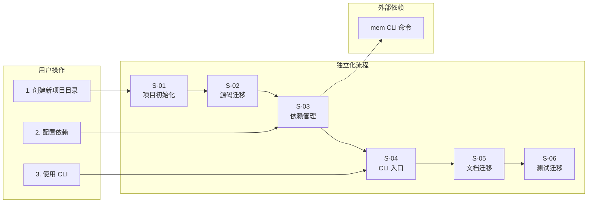
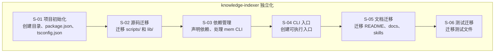
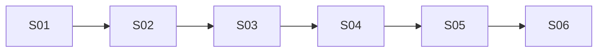

# knowledge-indexer 设计文档

> 状态：草案
> 创建时间：2026-06-03

## 1. 需求背景 & 目标

### 背景

`knowledge-index` 模块当前位于 `mcp-wrapper/knowledge-index/`，是父项目记忆系统之上的本地知识目录与交付层。模块与父项目源码零耦合（不 import 父项目任何代码），唯一运行时依赖是 `mem` CLI 命令（通过子进程调用）。

### 目标

将 `knowledge-index` 模块改造为独立项目 `knowledge-indexer`：
- 保持 TypeScript + jiti 执行方式（方案 A）
- 在 `/root/memory-lancedb-pro/mcp-wrapper/` 根目录下创建新目录
- 保持所有核心功能不变
- 提供独立的 CLI 入口

### 不在范围内

- 不改变核心业务逻辑
- 不引入编译步骤（保持 jiti 直接执行）
- 不改变 CLI 参数格式
- 不引入新依赖

## 2. 关键环节一览图

## 3. 总体方案设计

### 子需求节点图

### 共享术语速查

| 术语 | 定义 | 所属子需求 |
|------|------|-----------|
| `mem` | 父项目提供的 CLI 命令，封装向量存储能力 | S-03 |
| `jiti` | TypeScript 运行时工具，无需编译直接执行 .ts 文件 | S-01 |
| `commander` | CLI 参数解析库 | S-03 |
| `kb/` | 运行时数据目录，按 scope 隔离 | S-01 |
| `scope` | 项目隔离标识，不同 scope 物理隔离 | S-01 |

## 4. 全局风险 & 跨子需求依赖

### 风险

| 风险 | 影响 | 缓解措施 |
|------|------|----------|
| 路径引用错误 | CLI 无法找到脚本文件 | 仔细检查所有相对路径 |
| 依赖缺失 | npm install 失败 | 测试安装流程 |
| mem 命令不可用 | 向量化功能失效 | 文档中明确前置条件 |

### 跨子需求依赖

**依赖说明**：
- S-02 依赖 S-01：需要先创建项目结构才能迁移源码
- S-03 依赖 S-02：需要先有源码才能声明依赖
- S-04 依赖 S-03：需要依赖安装完成后才能测试 CLI
- S-05 依赖 S-04：文档中的 CLI 路径需要基于最终的入口方式
- S-06 依赖 S-05：测试需要基于最终的项目结构

### 共享术语速查

| 术语 | 定义 | 首次出现 |
|------|------|----------|
| `knowledge-indexer` | 独立化后的项目名称 | 全局 |
| `mem` | 父项目 CLI 命令 | S-03 |
| `jiti` | TypeScript 运行时 | S-01 |
| `commander` | CLI 解析库 | S-03 |
| `kb/` | 运行时数据目录 | S-01 |
| `scope` | 项目隔离标识 | S-01 |